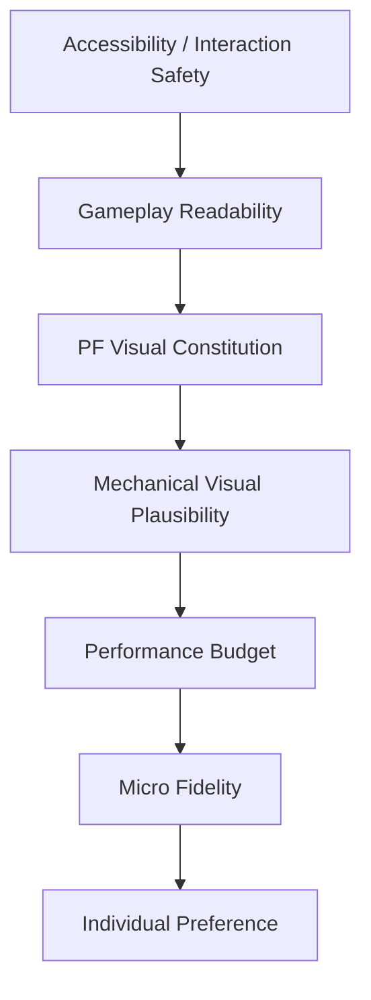
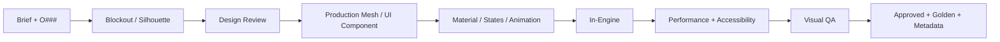
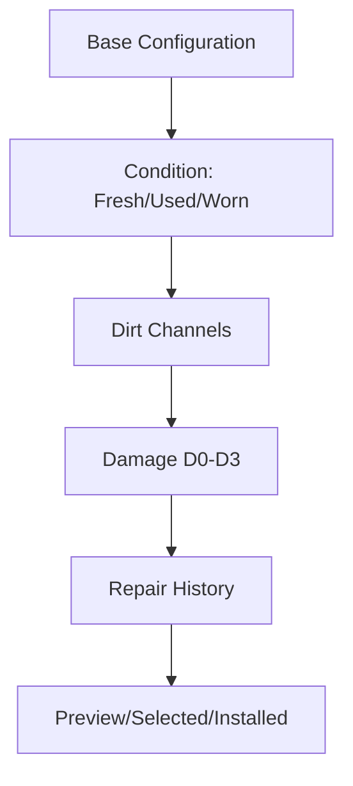
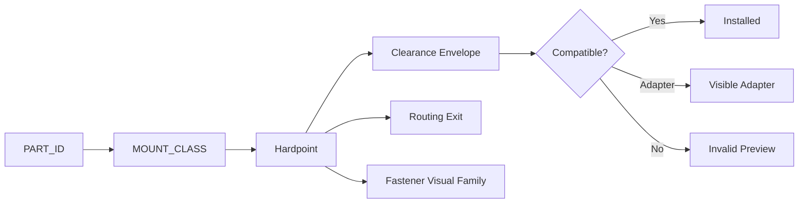
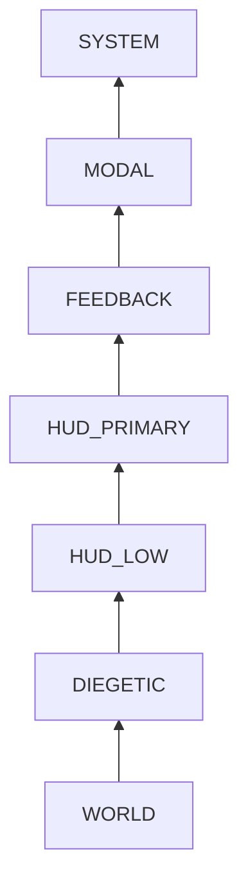

# PROYECT FLIGHT
## MASTER VISUAL PRODUCTION BIBLE + IMPLEMENTATION SPEC — v5.0

**Documento canónico:** dirección de arte + diseño gráfico + UI/UX visual + asset bible + technical-art specification + production governance.  
**Marca canónica:** **PROYECT FLIGHT**. Mantener esta grafía exacta salvo decisión documentada de rebranding.  
**Estado:** MASTER / Production Constitution.  
**Fecha de consolidación:** 2026-09-16.  
**Unidad base 3D:** 1 unidad = 1 metro.  
**Orientación técnica:** utilizar la convención del engine elegida por el proyecto, pero documentarla una vez y no mezclar ejes entre DCC, exportadores y runtime.  
**Objetivo:** que cualquier artista, diseñador, technical artist, VFX artist, UI designer, animator, outsourcing vendor o agente automatizado pueda producir un elemento visible de PROYECT FLIGHT sin inventar reglas fundamentales por su cuenta.

---

# 0. CÓMO UTILIZAR ESTE DOCUMENTO

Esta bible no es un moodboard ni una lista de ideas. Es una **especificación contractual de producción visual**.

Cada regla se clasifica implícitamente en uno de cuatro niveles:

- **MUST:** requisito obligatorio. Un asset que no lo cumple no entra a producción.
- **SHOULD:** regla por defecto. Puede romperse si existe una razón visual, técnica o de accesibilidad documentada.
- **MAY:** opción aprobada dentro del lenguaje visual.
- **MUST NOT:** patrón explícitamente prohibido.

Cuando una sección defina valores numéricos, éstos son valores iniciales de producción. Pueden modificarse después de profiling o playtesting, pero el cambio debe entrar al **Visual Decision Log**.

## 0.1 Jerarquía de autoridad

En caso de conflicto:

1. accesibilidad, legibilidad y seguridad de interacción;
2. gameplay readability;
3. identidad visual de PROYECT FLIGHT;
4. plausibilidad mecánica visual;
5. presupuesto de rendimiento;
6. fidelidad microvisual;
7. preferencia individual del artista.

Un detalle realista que perjudica la lectura se simplifica. Un efecto hermoso que rompe rendimiento se reduce. Una optimización que destruye la identidad del juego necesita rediseño, no aprobación automática.

## 0.2 Unidad operativa de cada sistema

Todo sistema visual debe quedar definido mediante:

1. **propósito**;
2. **scope**;
3. **inputs**;
4. **outputs**;
5. **reglas obligatorias**;
6. **variables controlables**;
7. **estados**;
8. **tareas de implementación**;
9. **dependencias**;
10. **criterios de aceptación**;
11. **anti-patrones**;
12. **owner recomendado**;
13. **pruebas de QA**;
14. **definition of done**.

## 0.3 Master execution prompt

Cuando este documento se use con un agente o colaborador, el prompt base será:

> Trabaja sobre PROYECT FLIGHT utilizando esta Master Visual Production Bible como fuente de verdad. Antes de crear o modificar un asset, identifica el sistema visual al que pertenece, sus reglas, dependencias, estados y criterios de aceptación. No inventes un lenguaje gráfico nuevo si existe uno definido. Prioriza legibilidad, coherencia mecánica, identidad DIY aeronáutica, accesibilidad y rendimiento. Toda excepción debe declararse. Entrega el resultado junto con su Asset ID, estado, materiales, variantes, LOD requeridos, dependencias, capturas de validación y checklist de Definition of Done. Si una regla no está suficientemente especificada, extiéndela de manera consistente con la Visual Constitution y registra la nueva decisión para incorporarla a la siguiente versión de la bible.

## 0.4 Replanteamiento maestro del problema

La pregunta ya no es “¿cómo se ve PROYECT FLIGHT?”. La pregunta de producción es:

> ¿Qué conjunto de reglas hace posible que miles de elementos creados en momentos distintos, por personas distintas y para plataformas distintas parezcan pertenecer inequívocamente al mismo mundo?

Por eso esta v5.0 organiza el proyecto en cuatro capas:

- **Constitución:** qué identidad no puede perderse.
- **Sistemas:** cómo se expresa esa identidad en forma, color, UI, aeronaves, mundo, cámara y movimiento.
- **Producción:** cómo se modela, texturiza, ilumina, anima y optimiza.
- **Gobernanza:** cómo se revisa, mide, aprueba, versiona y mantiene.

---

# 1. ARQUITECTURA MAESTRA

La bible queda consolidada en 20 macrocapítulos:

1. Visual Constitution & Research.
2. Brand, Graphic Design, Color, Type & Iconography.
3. UI/UX, Screens, Motion, Responsive, Accessibility & Controls.
4. Aircraft Shape Grammar, Generations, Modularity & Hardpoints.
5. Aircraft Subsystem Design.
6. Aircraft Materials, Livery, Decals & Customization.
7. Wear, Dirt, Damage, Repair, Flex & Aircraft Animation.
8. Pilot, NPCs & Human Visual Language.
9. World, Biomes, Workshop, Architecture, Props, Vehicles & Environmental Storytelling.
10. Sky, Weather, Wind, Lighting, LookDev, Color Management & Post.
11. Camera, Composition, Photo Mode & Replay.
12. VFX & Ground Interaction.
13. Technical Illustration, Map, Tutorial & Diegetic Graphics.
14. 3D, Materials, Shaders, Textures, UV, LOD & Performance.
15. Asset Taxonomy, Naming, Metadata, Registers & State Matrices.
16. Production, Outsourcing, Review, QA, Versioning & Definition of Done.
17. Marketing, Key Art, Screenshots, App Icon & Trailer Language.
18. Scalability, Procedural Systems, Generative Guardrails, Originality & Future Content.
19. Visual Narrative, Rewards, Persistence & World Chronology.
20. Final Visual Constitution, Decision Log, Glossary & Appendices.

Los 136 bloques propuestos previamente están absorbidos dentro de estos macrocapítulos; ningún bloque se elimina, sólo se evita duplicarlo en distintos lugares.

---

# 2. VISUAL CONSTITUTION & RESEARCH

## 2.1 Visual North Star

### Propósito
Definir la condición que debe sobrevivir a cualquier cambio de plataforma, presupuesto o contenido.

### Declaración canónica
PROYECT FLIGHT es un juego sobre **construir, probar, fallar, reparar y refinar una aeronave hecha por una persona en un taller**. La aeronave comienza como una solución mecánica ingenua pero posible y termina como una máquina experimental refinada sin borrar su procedencia artesanal.

### Fórmula estilística
- 65% grounded mechanical truth.
- 25% readable stylization.
- 10% playful graphic energy.

### MUST
- Cada gran upgrade debe alterar silueta, material, instrumentación, animación o detalle visible.
- La estructura debe permanecer legible durante una parte sustancial de la progresión.
- El desgaste debe tener causa.
- El late game debe conservar rastros del early game.
- La máquina debe verse construida y mantenida, no generada de una sola pieza.
- El mundo debe tener aire, viento, polvo, uso y escala humana.

### MUST NOT
- militarizar la identidad;
- convertir el late game en jet futurista;
- usar sci-fi holographic UI;
- hacer todo glossy;
- convertir DIY en basura posapocalíptica;
- copiar 1:1 un ultraligero, fabricante, livery o cockpit real;
- usar complejidad falsa para “parecer simulador”.

### Tareas
1. Crear tres keyframes de control: early, mid, late.
2. Convertir cada keyframe a silueta negra.
3. Crear versión grayscale.
4. Revisar si la progresión sigue entendible sin decals.
5. Revisar si el mundo continúa pareciendo PROYECT FLIGHT sin logo.
6. Registrar cualquier desviación en `VIS_DECISION_LOG`.

### Acceptance
Un revisor no familiarizado con el proyecto debe poder describir el juego como “aviación casera / taller / progresión mecánica / vuelo” viendo sólo cinco capturas sin texto.

## 2.2 Emociones visuales objetivo

Orden de prioridad:
1. curiosidad mecánica;
2. satisfacción de construcción;
3. optimismo;
4. fragilidad controlada;
5. dominio progresivo;
6. libertad de vuelo;
7. orgullo por la máquina personal.

La estética no debe comunicar lujo, autoridad militar, decadencia extrema ni fantasía tecnológica.

## 2.3 Reference Atlas

El atlas de referencia se divide obligatoriamente en:
- tube-and-fabric ultralights;
- homebuilt aircraft;
- RC transmitters;
- engine bays;
- analog instruments;
- grassroots airfields;
- workshops;
- rural architecture;
- aircraft fabric;
- aluminum/steel/composite material references;
- repair patches;
- dirt causality;
- technical illustration;
- field notebooks;
- safety labels;
- controller UI;
- mobile game ergonomics;
- cinematic aircraft photography.

Cada imagen de referencia recibe:
- `REF_ID`;
- fuente;
- fecha de captura;
- categoría;
- `TAKE`;
- `TRANSFORM`;
- `AVOID`;
- riesgo IP;
- assets afectados.

### Regla TAKE / TRANSFORM / AVOID
**TAKE** describe el principio: por ejemplo “lectura clara de tubos y cables”.  
**TRANSFORM** explica cómo volverlo original: “cambiar proporciones, puntos de unión, color blocking, cockpit y empenaje”.  
**AVOID** identifica lo que no se replica: “geometría de fuselaje, marca, livery, emblema”.

## 2.4 Research validation

Un dato externo sólo entra como regla si cumple una de estas funciones:
- valida plausibilidad física;
- valida convención de interacción;
- valida accesibilidad;
- valida estándar de render/pipeline;
- evita un error evidente.

Las fuentes de referencia técnica se listan en el Apéndice de Fuentes y no deben convertirse en obligación de ingeniería aeronáutica real.

## 2.5 Originality gate

Antes de aprobar un aircraft concept:
- ocultar logotipos y comparar silueta contra referencias;
- comprobar que ninguna referencia única domina el diseño;
- cambiar al menos estructura, proporción, cockpit, empenaje y surface treatment respecto a cualquier aeronave inspiradora;
- comprobar que livery y decals son originales;
- documentar influencias.

---

# 3. BRAND, GRAPHIC DESIGN, COLOR, TYPE & ICONOGRAPHY

## 3.1 Arquitectura de marca

### Marca primaria
`PROYECT FLIGHT`

### Required lockups
- horizontal;
- stacked;
- monochrome;
- reversed;
- small-size;
- symbol-only;
- diegetic stencil;
- marketing lockup.

### Reglas
- No añadir alas genéricas al wordmark.
- No usar gradiente cromado.
- No aplicar extrusión 3D.
- No deformar horizontal o verticalmente.
- Mantener safe area equivalente al alto de la “P” alrededor del lockup principal.
- El symbol-only debe funcionar a 32 px.

### Tareas
- producir SVG maestro;
- producir vector outline;
- definir minimum size;
- testear sobre 12 fondos;
- testear 32/48/64/128/512/1024 px;
- producir accessibility alt label para entornos que lo necesiten.

## 3.2 Graphic design language

El sistema combina:
- etiqueta industrial;
- plano técnico;
- libreta de taller;
- señalización de campo;
- interfaz moderna limpia.

### Gramática
- grid de 8 unidades;
- divisores finos;
- etiquetas rectangulares;
- radios contenidos;
- líneas técnicas 1–2 unidades;
- flechas utilitarias;
- handwriting sólo como accent;
- masking-tape motif sólo en elementos de historia/DIY;
- no convertir todo en papel o skeuomorphism.

### Densidad
Una pantalla puede contener mucha información, pero sólo un foco dominante.  
Se prohíbe usar ruido gráfico como sustituto de jerarquía.

## 3.3 Color system

### Tokens principales
| Token | HEX | Uso |
|---|---|---|
| `INK-950` | `#17191A` | dark UI, text, near-black material |
| `INK-800` | `#2A2E30` | secondary dark |
| `STEEL-600` | `#687176` | neutral mid |
| `ALU-300` | `#B8C0C3` | aluminum cue |
| `PAPER-100` | `#F2ECDD` | technical paper |
| `CHALK-050` | `#FAF8F2` | light text |
| `FLIGHT-ORANGE` | `#F06A2A` | primary action/selection |
| `SKY-CYAN` | `#58C7E8` | air/navigation/height |
| `FIELD-GREEN` | `#6D9F57` | success/complete |
| `WARNING-AMBER` | `#F3B33D` | warning |
| `DANGER-RED` | `#D94A3A` | critical/damage |
| `WORKSHOP-BLUE` | `#347DA0` | technical/workshop |

### Operational rules
- Máximo dos accent colors activos dentro del mismo componente.
- `DANGER-RED` no se usa para navegación normal.
- Color nunca es el único portador de significado.
- Los backgrounds gameplay deben evitar saturación que compita con HUD.
- Aircraft liveries pueden exceder paleta, pero su valor y saturación deben mantener lectura contra sky/terrain.

## 3.4 Typography

### Familias propuestas
- display: Barlow Condensed;
- body: Inter;
- technical: IBM Plex Mono.

La selección final debe confirmar licencia y cobertura lingüística.

### Scale @ 1920×1080 reference
| Token | px | Función |
|---|---:|---|
| DISPLAY-XL | 96 | key marketing / hero |
| H1 | 64 | screen title |
| H2 | 42 | group title |
| H3 | 30 | panel |
| BODY-L | 22 | instruction |
| BODY-M | 18 | normal UI |
| BODY-S | 15 | metadata |
| MONO-L | 28 | telemetry |
| MONO-M | 18 | part specs |
| MONO-S | 13 | serial/metadata |

### Reglas
- Datos que cambian rápidamente: tabular numerals.
- Telemetry: mono.
- Body copy: no all caps.
- Warning breve: uppercase permitido.
- Texto esencial nunca se hornea dentro de una textura si debe localizarse.
- Large-text mode debe reflow, no escalar fuera del panel.

## 3.5 Iconography

### Grid
Diseñar master en 24×24 y 32×32; escalar vectorialmente.

### Style
- stroke visual 2–2.5 px equivalente a 1080p;
- máximo dos niveles internos;
- filled para selected/critical;
- silhouette real de la pieza para categories.

### QA
Un icono de categoría debe identificarse a 24 px y distinguirse en grayscale.

## 3.6 Graphic motifs

Aprobados:
- inspection circles;
- torque witness marks;
- serials;
- blueprint arrows;
- tape tabs;
- test stamps;
- sparse wind lines.

Prohibidos como decoración indiscriminada:
- grunge overlays;
- fake barcodes por todas partes;
- pseudo-code;
- números sin significado;
- microcopy imposible de leer.

---

# 4. UI/UX, SCREENS, MOTION, RESPONSIVE, ACCESSIBILITY & CONTROLS

## 4.1 UI architecture

### Layers
1. WORLD
2. DIEGETIC
3. HUD_LOW
4. HUD_PRIMARY
5. FEEDBACK
6. MODAL
7. SYSTEM

### Reference frame
1920×1080 landscape; layouts responden a aspect ratio, no se estiran.

### Grid
- 12 columnas;
- 64 px outer margin de referencia;
- 24 px gutter;
- baseline 8 px;
- card padding 24–32 px;
- compact padding 16 px.

## 4.2 Design tokens

Todo componente debe consumir tokens y no valores arbitrarios:
- spacing;
- radius;
- stroke;
- opacity;
- type;
- color;
- shadow;
- animation duration;
- focus outline.

### Radius
- `R1=4`
- `R2=8`
- `R3=12`
- `R4=16`
Las pills completas se reservan para tags/chips, no para toda la UI.

## 4.3 Button specification

### Primary
- 64 px reference height;
- `R2`;
- FLIGHT-ORANGE;
- dark label;
- 28 px horizontal padding minimum;
- press offset 2 px;
- selected/focus state independent.

### Secondary
- neutral fill/transparent;
- 1 px border;
- same metrics.

### Compact
- 44–48 px visible;
- interaction region may be larger.

### Icon
- square;
- state plate appears on hover/press/focus;
- no tiny isolated glyph hitbox.

### Danger
Only destructive actions.

## 4.4 Focus & pointer accessibility

Targets táctiles frecuentes en iOS/iPadOS se diseñan a 44×44 pt mínimo como target preferred; controles secundarios nunca deben caer por debajo del estándar de plataforma. Para keyboard/controller, focus debe ser inequívoco y nunca quedar totalmente oculto.

PF internal target:
- touch primary: >=44 pt equivalent;
- touch secondary: >=28 pt equivalent sólo si no es frecuente y existe separación;
- pointer/keyboard visual target: nunca inferior a la legibilidad especificada;
- focus ring: 2 px equivalent minimum, con contraste suficiente contra ambos fondos.

## 4.5 Responsive rules

### Breakpoints conceptuales
- compact landscape phone;
- standard landscape phone;
- tablet 4:3;
- desktop 16:9;
- wide desktop/20:9+.

### MUST
- world puede full bleed;
- UI crítica respeta safe area;
- no estirar paneles;
- cards reflow;
- HUD anchors relativos;
- menus no deben cubrir aeronave hero;
- touch controls poseen offset independiente.

## 4.6 Motion system

### Durations
- micro press: 70–120 ms;
- hover/focus: 90–160 ms;
- panel enter: 180–260 ms;
- screen transition: 240–380 ms;
- achievement: 450–800 ms.

### Character
Movimiento de UI = preciso, mecánico, rápido.  
No gelatinous bounce. Overshoot máximo y controlado en stamps/achievements.

### Reduced motion
- translation larga → fade;
- camera parallax → off;
- scale pulse → opacity;
- no information loss.

## 4.7 Screen system

Las pantallas canónicas son:
`BOOT`, `TITLE`, `PROFILE`, `HUB`, `WORLD_MAP`, `ZONE_DETAIL`, `AIRCRAFT_SELECT`, `BUILD`, `PART_DETAIL`, `SHOP`, `COMPARE`, `PAINT`, `LIVERY`, `REPAIR`, `LOGBOOK`, `BRIEFING`, `LOADING`, `FLIGHT_HUD`, `PAUSE`, `CRASH`, `RESULTS`, `ACHIEVEMENTS`, `SETTINGS`, `ACCESSIBILITY`, `CREDITS`, `ERROR`, `SAVE_CONFLICT`, `FIRST_RUN`.

Cada pantalla debe documentar:
- visual objective;
- primary action;
- secondary actions;
- hero content;
- grid;
- empty state;
- loading;
- error;
- input methods;
- responsive behavior;
- high-contrast;
- large-text;
- screenshot de referencia.

## 4.8 Title

Hero:
- aircraft 3/4;
- workshop;
- sky negative space;
- windsock;
- no character posing to camera.

UI:
- logo;
- FLY/CONTINUE primary;
- settings/profile secondary;
- build number small.

Acceptance:
el CTA se identifica en <2 s y el avión no queda oculto por navegación.

## 4.9 Hub

- live 3D workshop;
- current craft focal;
- navigation rail;
- current craft identity;
- last run / condition;
- resources.

Prohibido transformar el hub en dashboard de 30 tarjetas.

## 4.10 Build

Target split:
- 60–70% aircraft viewport;
- 30–40% part UI.

Required:
- orbit;
- zoom;
- selected outline;
- ghost mount;
- exploded preview;
- category tabs;
- compare;
- incompatible state;
- stat delta;
- cost/equip.

Visual change tiene prioridad sobre barras numéricas.

## 4.11 Flight HUD

Persistent minimum:
- speed;
- altitude;
- fuel/energy;
- RPM cuando importe;
- objective;
- pause;
- touch gimbals on touch devices.

HUD no debe cubrir centro de vuelo salvo warning crítico temporal.

## 4.12 RC Mode 2

Canonical mapping:
- left vertical = throttle;
- left horizontal = rudder;
- right vertical = elevator;
- right horizontal = aileron.

### Gimbal states
`IDLE`, `TOUCH_DOWN`, `ACTIVE`, `DEFLECTED`, `RELEASE`, `DISABLED`, `TUTORIAL`.

### Touch rules
- visible ring can be translucent;
- hit region larger;
- frequent controls near thumbs;
- avoid system features/safe-area conflicts;
- control opacity, scale and offset configurable;
- right gimbal centered visually on release;
- throttle behavior reflects chosen control model.

## 4.13 Tutorial visual language

One concept at a time:
1. throttle;
2. rudder;
3. elevator;
4. aileron;
5. bank/pitch combination;
6. landing.

For each:
- highlight gimbal axis;
- highlight aircraft surface;
- animate direction;
- detect correct input;
- convert cue to success;
- remove.

No paragraph tutorial over flight.

## 4.14 Accessibility matrix

Required:
- UI scale;
- text scale;
- high contrast HUD;
- reduced motion;
- camera shake;
- motion blur;
- color-independent warnings;
- touch control scale;
- touch control opacity;
- left/right offset;
- subtitle/caption style if audiovisual narrative exists;
- focus indication;
- remappable physical controls where supported.

Internal contrast goal:
- body text normal: >=4.5:1 where practical;
- large text: >=3:1;
- critical non-text state boundaries: >=3:1;
- do not rely solely on hue.

---

# 5. AIRCRAFT SHAPE GRAMMAR, GENERATIONS, MODULARITY & HARDPOINTS

## 5.1 Aircraft design philosophy

Aircraft design must read in this order:
1. silhouette;
2. structure;
3. propulsion;
4. pilot relationship;
5. materials;
6. controls/mechanisms;
7. wear/history;
8. decals.

Microdetails never compensate for weak silhouette.

## 5.2 Shape Grammar

Every aircraft family is generated using controlled variables:

### Primary ratios
- wingspan / fuselage length;
- chord / wingspan;
- fuselage height / pilot seated height;
- wheel track / fuselage width;
- wheel diameter / pilot head height;
- tail height / fuselage length;
- prop diameter / fuselage height.

No exact real-aircraft ratio is prescribed. Concept artists define range sheets per generation.

### Controlled shape families
- triangular open truss;
- rectangular lower frame;
- partially faired truss;
- hybrid composite shell;
- refined integrated shell.

### Tube readability
Tubes that define silhouette must survive gameplay distance. Micro tubes may collapse into baked detail at LOD.

## 5.3 Silhouette gate

For each generation produce:
- side;
- front;
- top;
- 3/4;
- black silhouette at 256 px;
- black silhouette at 128 px.

Acceptance:
A0, A2, A4, A6 y A7 deben distinguirse sin color ni texture.

## 5.4 Aircraft generations

### A0 YARDBIRD
Open, fragile, improvised, explicit structure.

### A1 MOSQUITO
First coherent ultralight identity.

### A2 FIELD KIT
Competent kit, clearer cockpit, wider gear.

### A3 SKY FRAME
Sport ultralight, partial fairing.

### A4 WORKSHOP GT
Advanced homebuilt, hybrid panel.

### A5 COMPOSITE RAT
Experimental composite adoption.

### A6 AIRSHED SPECIAL
Performance-oriented test machine.

### A7 PROYECT ONE
Refined culmination preserving provenance.

Each transition MUST alter:
- one large silhouette mass;
- primary material cue;
- cockpit solution;
- gear language;
- wing treatment;
- instrumentation class.

## 5.5 Modularity

Part families:
`FRAME`, `WING`, `TAIL`, `ENGINE`, `PROP`, `GEAR`, `COCKPIT`, `INSTRUMENT`, `FUEL`, `CONTROL`, `FAIRING`, `FINISH`.

Every modular part carries:
- `PART_ID`;
- `MOUNT_CLASS`;
- bounding envelope;
- mass-class visual tag;
- pivot;
- sockets;
- compatible frame generations;
- required adapters;
- color zones;
- material slots;
- condition states;
- damage capability;
- thumbnail;
- silhouette icon.

## 5.6 Hardpoint standard

Naming:
`HP_[SYSTEM]_[SIDE]_[INDEX]`

Examples:
`HP_ENG_C_01`, `HP_WING_L_01`, `HP_GEAR_R_01`.

Every hardpoint defines:
- position;
- orientation;
- mounting plane;
- clearance envelope;
- maximum visible part intersection = 0 unless designed overlap;
- fastener family;
- cable/hose route;
- required transition geometry.

### Visual compatibility
A compatible part must look physically attached. “Snap” cannot leave:
- floating bracket;
- tube through panel;
- impossible cable path;
- prop intersecting tail;
- wheel inside structure;
- pilot clipping.

## 5.7 Adapter system

When cross-generation combinations require transition:
- use explicit adapter plate, spacer, bracket or fairing;
- adapter is visible;
- adapter inherits wear independent from donor part;
- excessive adapter stacking is prohibited.

## 5.8 Hybrid configuration test

For every new modular part test at least:
- oldest compatible frame;
- newest compatible frame;
- one visually awkward mid generation.

Capture 3 screenshots and mark collisions.

---

# 6. AIRCRAFT SUBSYSTEM DESIGN

## 6.1 Structural frame

Must communicate load path visually:
- longerons;
- uprights;
- diagonal bracing;
- engine mount;
- gear mounts;
- seat support;
- wing attachments.

Avoid decorative tubes that appear structural but terminate nowhere.

## 6.2 Fastener Bible

Families:
- hex bolts;
- washers;
- nyloc;
- castellated nut;
- cotter pin;
- clevis;
- rivet;
- quarter-turn;
- U-bolt;
- clamp;
- turnbuckle;
- thimble;
- swage;
- safety wire.

Rules:
- hero fasteners geometry;
- distant/micro fasteners normal/decal;
- finish variation meaningful;
- replacement fasteners may differ subtly;
- no random screw-head soup.

## 6.3 Wing

Required visual layers:
- spars;
- ribs;
- leading edge;
- trailing edge;
- covering/skin;
- tip;
- struts;
- control surface;
- hinges/control horn;
- inspection detail.

Fabric variants need:
- rib pockets;
- edge tape;
- reinforced corners;
- stitch/lacing logic;
- plausible wrinkles.

## 6.4 Tail

Must clearly separate:
- fixed stabilizer;
- moving surface;
- hinge line;
- control attachment.

Late generation tighter gaps; early generation larger mechanical gaps.

## 6.5 Engine

Readable component families:
- case/block;
- cylinder(s);
- intake;
- filter;
- ignition;
- fuel;
- cooling;
- exhaust;
- gearbox;
- mount;
- wiring.

Old engines:
more exposed, noisy visually, rougher mounting.

Late engines:
cleaner routing, more coherent cowl, not sterile.

## 6.6 Propeller

Required states:
- static;
- low RPM;
- high RPM;
- damaged;
- stopped after strike.

High RPM uses dedicated blur representation; avoid opaque gray disc.

## 6.7 Landing gear

Read:
- attachment;
- leg;
- hub;
- tire;
- brake when present;
- suspension/flex.

Ground interaction must show compression under load.

## 6.8 Cockpit

The cockpit progresses from seat-on-frame to a coherent pilot environment.

Required systems:
- seat;
- harness;
- stick;
- throttle;
- pedals;
- trim if present;
- instruments;
- switches;
- labels;
- windscreen/canopy;
- pilot clearance.

## 6.9 Instrument panel

Define panel grid before placing instruments.

Classes:
- `I0`: single tach.
- `I1`: tach + speed.
- `I2`: 3 gauges.
- `I3`: multi-gauge.
- `I4`: hybrid digital.

Every instrument needs:
- face;
- bezel;
- glass;
- needle/digital region;
- label;
- unit;
- readable animation;
- failure state if gameplay uses it.

## 6.10 Aircraft controls

Expose cause-and-effect:
stick → linkage → surface.

Early builds should visibly communicate cables/pulleys. Late builds may conceal routing but include inspection/access points.

## 6.11 Fuel

Required:
- tank;
- cap;
- mount;
- line;
- filter/pump where relevant;
- sight/readout;
- stain/leak hooks.

Translucent tanks may expose animated level with conservative motion.

## 6.12 Fairings/bodywork

Fairings are progression rewards:
- no fairing;
- local nose pod;
- lower body;
- engine side panels;
- integrated late body.

Every removable panel requires seam and fastening logic.

---

# 7. AIRCRAFT MATERIALS, LIVERY, DECALS & CUSTOMIZATION

## 7.1 Material library

Canonical families:
- raw aluminum;
- anodized aluminum;
- powder-coated steel;
- zinc/stainless hardware;
- aircraft polyester fabric;
- canvas repair fabric;
- rubber tire;
- hose rubber;
- ABS;
- polycarbonate;
- plywood;
- fiberglass;
- carbon composite;
- vinyl/leatherette;
- webbing;
- instrument glass;
- paper;
- masking tape;
- duct tape;
- enamel paint;
- fuel/oil/grease.

Each material master defines:
- base response;
- roughness range;
- metallic behavior;
- normal frequency;
- dirt affinity;
- wear response;
- damage response;
- LOD fallback.

## 7.2 PBR truth rules

- Metalness is binary-ish by base material, not slider decoration.
- Painted metal behaves as dielectric at intact paint.
- Exposed chip reveals metal response.
- Roughness communicates surface condition.
- Normal map scale must match physical detail frequency.
- Base color contains no baked specular highlight.

## 7.3 Livery zones

Required paint masks:
1. upper wing;
2. lower wing;
3. leading stripe;
4. wing tips;
5. vertical tail;
6. horizontal tail;
7. nose/fairing;
8. side body;
9. hubs;
10. frame accents.

## 7.4 Customization limits

The player may personalize without destroying silhouette readability:
- primary color;
- secondary color;
- accent;
- stripes;
- number;
- registration-like ID;
- nickname;
- stickers;
- selected frame accents.

Not user-editable by default:
- safety-critical warning color;
- instrument face conventions;
- damage visualization;
- selection state.

## 7.5 Decals

Families:
- brand;
- safety;
- serial;
- inspection;
- torque;
- handwritten;
- event;
- workshop;
- achievement;
- repair;
- test.

Every decal:
- has scale range;
- surface restrictions;
- age variants;
- overlap priority.

## 7.6 Sticker accumulation

Sticker density:
- early: 0–3;
- mid: 2–8;
- late: 4–12, depending player history.

Never fill every surface.

---

# 8. WEAR, DIRT, DAMAGE, REPAIR, FLEX & AIRCRAFT ANIMATION

## 8.1 Wear causality

Wear originates only from:
- friction;
- UV;
- impact;
- heat;
- oil/fuel;
- dust/mud;
- insects/airborne debris;
- maintenance;
- repair.

Procedural masks must know surface category and exposure zone.

## 8.2 Condition states

`C0_FRESH`, `C1_USED`, `C2_WORN`, `C3_BEATEN`.

Do not author four complete texture sets unless necessary. Blend masks and decals.

## 8.3 Dirt state machine

Variables:
- `dust`;
- `mud`;
- `oil`;
- `grass`;
- `bugs`;
- `water_residue`.

Each 0–1 normalized for authoring logic.

Accumulation:
- wheel zones accumulate ground dirt fastest;
- lower frame receives dust/grass;
- leading edges receive bug/impact speck;
- engine bay receives oil/heat;
- cockpit receives touch polish/dust.

## 8.4 Damage taxonomy

Severity:
- D0 cosmetic;
- D1 minor functional cue;
- D2 major visible deformation;
- D3 terminal/mission-ending visual state.

Damage types:
- scrape;
- dent;
- tear;
- crack;
- bend;
- puncture;
- detached small component;
- collapsed gear;
- prop strike;
- engine leak/smoke.

## 8.5 Repair persistence

Repair should not “heal” history.

Persist:
- patch;
- replacement finish;
- repair label/date;
- different fastener;
- local paint mismatch;
- polish/clean area;
- component serial lineage.

## 8.6 Structural flex

Visual flex is bounded and readable:
- wing: subtle elastic deflection;
- gear: visible compression/flex;
- tire: contact flattening;
- engine mount: vibration;
- cables: tension;
- fabric: low-amplitude flutter.

No rubber-airplane deformation.

## 8.7 Aircraft animation language

Required animation hooks:
- start;
- idle;
- RPM rise;
- shutdown;
- prop;
- control surfaces;
- stick/pedals;
- cables;
- gear compression;
- wheels;
- canopy;
- harness;
- engine vibration;
- fabric flutter;
- damage flutter;
- crash settle.

Animation curves become progressively tighter/cleaner from A0 to A7.

---

# 9. PILOT, NPCs & HUMAN VISUAL LANGUAGE

## 9.1 Pilot

Default silhouette:
- practical clothing;
- compact profile;
- no military flight suit;
- no luxury pilot cliché.

Progression:
early workshop clothes → practical aviation gear → refined experimental pilot gear.

## 9.2 Hands

If hands appear near controls, they are hero-quality:
- correct grip;
- IK;
- no clipping;
- glove/no-glove variants;
- contact deformation when practical.

## 9.3 NPC families

- builder/mechanic;
- pilot;
- spectator;
- field worker;
- event staff;
- shop/supplier;
- test-field technician.

NPCs should support world scale, not become crowd-sim focus.

## 9.4 Clothing language

Materials:
- cotton;
- workwear canvas;
- denim;
- nylon jacket;
- safety vest where functional;
- caps;
- passive headset;
- simple helmet.

Avoid uniform militarization.

---

# 10. WORLD, BIOMES, WORKSHOP, ARCHITECTURE, PROPS, VEHICLES & STORYTELLING

## 10.1 World philosophy

World = plausible place to test homebuilt aircraft + composition optimized for gameplay.

Priority:
- clear horizon;
- readable takeoff/landing area;
- sparse but meaningful clutter;
- landmark memory;
- wind cues;
- atmospheric depth.

## 10.2 Canonical zones

1. Backyard Hill.
2. Farm Strip.
3. Dry Lake.
4. Coastal Field.
5. Mountain Valley.
6. Industrial Edge.
7. Proving Ground.

Each biome sheet contains:
- palette;
- terrain;
- vegetation;
- architecture;
- landmarks;
- props;
- sky;
- weather;
- lighting;
- flight hazards;
- environmental storytelling;
- LOD plan.

## 10.3 Terrain

Surface categories:
grass, packed dirt, loose dirt, gravel, mud, asphalt, concrete, rock.

Each defines:
- albedo macro variation;
- roughness;
- micro normal;
- tire interaction;
- dust/mud output;
- prop-wash response;
- skid marks;
- wet state if applicable.

## 10.4 Vegetation

Vegetation has:
- species family;
- height range;
- density;
- color variance;
- wind response;
- LOD strategy;
- collision relevance;
- ground-contact response.

Wind movement must not be perfectly synchronized.

## 10.5 Architecture

Modular kits:
- workshop;
- garage;
- rural hangar;
- barn;
- shed;
- industrial hangar;
- test facility;
- utility modules.

Every kit defines:
- structural module dimensions;
- wall material;
- roof;
- trim;
- doors;
- windows;
- signage sockets;
- aging masks;
- interior/exterior transition.

## 10.6 Workshop progression

### W0 Borrowed Corner
Minimal equipment; improvised organization.

### W1 Functional Shop
Pegboard, storage, better lights.

### W2 Serious Build Space
Jigs, stands, structured part storage.

### W3 Experimental Lab
Telemetry, composite corner, clean measurement area.

### W4 Master Workshop
Controlled presentation, history wall, first-build relics.

Progression = organization + capability, not merely more clutter.

## 10.7 Props

Prop taxonomy:
- tools;
- storage;
- consumables;
- papers/manuals;
- airfield;
- fuel;
- furniture;
- safety;
- weather;
- testing;
- event.

Small prop reuse is allowed through material/label variants.

## 10.8 Vehicles

Fictional:
- old pickup;
- utility trailer;
- tractor;
- telemetry van;
- fuel cart.

Need original grille/lamp/body cues; no badge removal from recognizable licensed vehicle mesh.

## 10.9 Environmental aircraft

Use simplified original designs:
- ultralight;
- trike;
- taildragger;
- motorglider;
- incomplete kit;
- stored frame.

They build culture but never outshine current player craft.

## 10.10 Fictional manufacturers

Create 8–12 brands máximo al inicio:
- engines;
- props;
- instruments;
- tires;
- tools;
- composites;
- aviation parts;
- local workshops.

Every brand receives:
logo, type, colors, era, packaging, decal style, reputation cue.

## 10.11 Packaging

Visible packaging:
- corrugated boxes;
- sealed bags;
- foam;
- manuals;
- inspection card;
- serial labels;
- fictitious barcode/QR-like marks;
- warranty card;
- stickers.

Packaging creates worldbuilding during acquisition/installation.

## 10.12 Environmental storytelling

Examples:
- bent old prop on wall;
- failed bracket prototypes;
- first-flight photo;
- patched wing hanging;
- handwritten weight sheet;
- old test cone;
- repaired toolbox;
- event flyers;
- discarded fairing prototype.

Rule: every storytelling cluster must answer “qué pasó aquí” sin un texto largo.

---

# 11. SKY, WEATHER, WIND, LIGHTING, LOOKDEV, COLOR MANAGEMENT & POST

## 11.1 Sky system

Presets:
- clear AM;
- clear noon;
- golden PM;
- thin overcast;
- post-rain clarity;
- dry haze;
- coastal haze.

Sky must preserve horizon orientation and wing readability.

## 11.2 Clouds

Families:
- cumulus;
- cirrus;
- overcast layer.

Controls:
coverage, altitude, density, softness, shadow strength.

No storm spectacle unless gameplay actually supports it.

## 11.3 Wind visualization

Wind is read through:
- windsock;
- streamer;
- grass;
- tree canopy;
- dust;
- fabric;
- smoke;
- propwash;
- optional HUD.

Create visual states for calm/light/moderate/strong without claiming precise real-world aviation calibration unless simulation specifies it.

## 11.4 Lighting Bible

Every zone has:
- canonical sun azimuth/elevation;
- color temperature intent;
- exposure reference;
- sky fill;
- fog/haze;
- shadow softness;
- reflection strategy;
- screenshot benchmark.

Lighting must preserve:
- cylindrical tube highlights;
- fabric translucency cue;
- cockpit readability;
- terrain separation.

## 11.5 LookDev scene

One canonical scene contains:
- gray card;
- color chart approximation;
- metal sphere;
- dielectric sphere;
- aluminum tubes;
- painted steel;
- fabric wing sample;
- rubber;
- polycarbonate;
- carbon;
- wood;
- decals.

Render under:
- noon;
- overcast;
- backlight;
- workshop interior.

All materials pass here before hero asset use.

## 11.6 Color management

Document:
- engine color space;
- linear rendering policy;
- texture import color-space;
- HDR/SDR behavior;
- tone mapper;
- LUT ownership;
- capture pipeline.

No artist may bake a private grade into a texture.

## 11.7 Post

Default:
- bloom minimal;
- vignette subtle;
- motion blur conservative/off option;
- chromatic aberration off;
- grain near zero;
- sharpen low;
- filmic highlight rolloff.

---

# 12. CAMERA, COMPOSITION, PHOTO MODE & REPLAY

## 12.1 Gameplay camera

Aircraft occupies roughly 18–28% vertical frame depending phase.

Rules:
- horizon readable;
- partial bank follow;
- subtle speed FOV;
- no fisheye;
- collision avoidance;
- camera shake separated from flight motion.

## 12.2 Camera states

- taxi/ground;
- takeoff;
- climb;
- cruise;
- maneuver;
- approach;
- landing;
- stall;
- crash;
- recovery.

Transitions must be continuous unless gameplay requires cut.

## 12.3 Garage camera

Favor whole-machine readability:
- 35–55 mm equivalent visual language;
- restrained DOF;
- no extreme close lens distortion.

## 12.4 Build camera

- constrained orbit;
- part focus;
- auto-frame;
- explode;
- consistent up;
- collision-safe;
- no camera angle that hides mount interface when evaluating compatibility.

## 12.5 Composition Bible

Every promotional/gameplay shot should manage:
- focal hierarchy;
- negative space;
- horizon;
- leading line;
- foreground;
- depth;
- landmark;
- UI exclusion zone.

## 12.6 Photo Mode

Controls:
- free camera;
- FOV/focal length;
- roll;
- exposure;
- DOF;
- focus distance;
- prop visual state;
- time-of-day if allowed;
- UI hide;
- grid;
- watermark optional.

Photo Mode cannot modify gameplay state.

## 12.7 Replay

Replay shot families:
- chase;
- wing-side;
- ground fly-by;
- runway low;
- cockpit;
- crash overview.

No automatic cut may obscure the reason for a crash in diagnostic replay.

---

# 13. VFX & GROUND INTERACTION

## 13.1 VFX philosophy

VFX communicate energy, contact and air; they do not turn realistic-ish flight into arcade fireworks.

## 13.2 Propeller

- low RPM discrete blade;
- high RPM transparent arc/disc;
- motion tied to RPM;
- damaged state;
- no opaque disc.

## 13.3 Engine/exhaust

- start puff;
- heat haze;
- light smoke for poor state;
- leak cues;
- no constant black smoke in normal operation.

## 13.4 Dust/ground

Events:
- wheel roll;
- hard landing;
- skid;
- propwash;
- crash slide.

Intensity depends on surface and speed.

## 13.5 Ground contact

Ground contact contract:
- tire deformation;
- suspension;
- wheel rotation;
- contact shadow;
- track/decal;
- particle response;
- grass flatten;
- audio event hook.

## 13.6 Damage VFX

- tiny spark;
- fabric fiber;
- dust;
- chipped debris;
- no excessive debris count;
- no gore.

## 13.7 Diagnostic airflow

Allowed only in tutorial/tuning:
- vector arrows;
- wing flow ribbon;
- control-surface direction;
- vortex cue;
- stall buffet cue.

---

# 14. TECHNICAL ILLUSTRATION, MAP, TUTORIAL & DIEGETIC GRAPHICS

## 14.1 Technical illustration

Style:
- line hierarchy 1/2/3;
- orthographic/isometric;
- part IDs;
- leader lines;
- dimensions only when useful;
- revision marks;
- handwritten annotation layer.

Used in:
- loading;
- build;
- tutorial;
- logbook;
- marketing secondary graphics.

## 14.2 Map

Visual metaphor:
topographic planning sheet + digital interaction.

Layers:
- terrain;
- contour;
- road;
- airfield;
- landmarks;
- route;
- wind;
- location pins;
- progress.

## 14.3 Diegetic graphics

Include:
- aircraft placards;
- workshop signs;
- manufacturer labels;
- packaging;
- serial plates;
- manuals;
- test notes;
- event posters.

Diegetic text that matters to gameplay needs localization strategy; decorative microtext may be fictional but must not imitate real certifications.

## 14.4 Tutorial overlays

Overlay rules:
- dim only enough to focus;
- highlight one region;
- use animation;
- text <2 short lines where possible;
- dismiss after detected success;
- replayable in settings/help.

---

# 15. 3D, MATERIALS, SHADERS, TEXTURES, UV, LOD & PERFORMANCE

## 15.1 Modeling standard

Required:
- correct units;
- transforms frozen according to DCC/export policy;
- documented forward/up;
- pivot at meaningful mount/rotation;
- manifold where required;
- sensible topology;
- no invisible internal detail unless visible through damage/access;
- real geometry for silhouette/motion;
- normal/decal for subpixel detail.

## 15.2 Bevel & normals

Hero hard surface cannot use infinitely sharp edges.

Bevel width is determined by:
- physical plausibility;
- pixel visibility;
- distance.

Weighted normals/smoothing may support broad machined surfaces.

## 15.3 UV

Reference texel density:
- aircraft exterior 512 px/m;
- cockpit focal 768–1024 px/m;
- engine focal ~768 px/m;
- environment hero 512 px/m;
- common architecture 256–384 px/m;
- distant 128–256 px/m.

Tolerance ±15% unless documented.

## 15.4 Texture sets

Standard:
- BaseColor;
- Normal;
- ORM or separate AO/Roughness/Metallic;
- Emissive;
- optional masks.

Import:
- BaseColor/Emissive as color;
- data maps as linear;
- normal as normal texture.

## 15.5 Shader set

Required masters:
- PBR opaque;
- cutout;
- aircraft fabric;
- polycarbonate;
- gauge glass;
- decal;
- terrain;
- foliage;
- prop blur;
- translucent fuel;
- damage blend;
- UI SDF;
- selection/ghost.

## 15.6 LOD

Aircraft initial budgets:
- LOD0 90–160k tris;
- LOD1 45–80k;
- LOD2 18–35k;
- LOD3 5–12k.

Final thresholds determined by screen size and profiling, not distance alone.

## 15.7 Performance budgets

Track per scene:
- triangles;
- draw calls;
- materials;
- texture memory;
- mesh memory;
- transparent pixels;
- particle count;
- shadow casters;
- lights;
- reflection probes;
- decals.

Every visual feature has quality tiers:
`LOW`, `MEDIUM`, `HIGH`, optional `ULTRA`.

## 15.8 Mobile visual profile

Prioritize:
1. aircraft silhouette;
2. controls;
3. terrain;
4. readability;
5. stable frame time.

Reduce first:
- foliage density;
- cloud quality;
- shadow distance;
- micro props;
- reflection complexity;
- particle density.

Do not reduce touch readability.

---

# 16. ASSET TAXONOMY, NAMING, METADATA, REGISTERS & STATE MATRICES

## 16.1 Naming

3D:
`PF_[DOMAIN]_[FAMILY]_[NAME]_[VARIANT]_LOD#`

Material:
`M_PF_[SURFACE]_[VARIANT]`

Texture:
`T_PF_[ASSET]_[MAP]_[RES]`

UI:
`UI_PF_[SCREEN]_[COMPONENT]_[STATE]`

VFX:
`VFX_PF_[SYSTEM]_[STATE]`

Animation:
`AN_PF_[RIG]_[ACTION]_[VARIANT]`

## 16.2 Asset metadata

Every production asset records:
- Asset ID;
- human name;
- category;
- owner;
- status;
- revision;
- source path;
- runtime path;
- scale;
- tris;
- materials;
- textures;
- LODs;
- collision;
- hardpoints;
- damage states;
- platforms;
- dependencies;
- approval status;
- notes.

## 16.3 State matrix

Applicable states:
`NEW`, `USED`, `WORN`, `DAMAGED`, `REPAIRED`, `DIRTY`, `CLEAN`, `WET`, `DUSTY`, `STORED`, `UNDER_CONSTRUCTION`, `INSTALLED`, `REMOVED`, `SELECTED`, `LOCKED`, `PREVIEW`, `BROKEN`.

Each asset defines sólo states que aportan valor.

## 16.4 Folder structure

```text
/Art
  /Brand
  /UI
  /Aircraft
  /Characters
  /Environment
  /Materials
  /Shaders
  /VFX
  /Lighting
  /Animation
  /TechnicalIllustration
  /Concept
  /Reference
  /Marketing
  /Outsource
  /Tests
```

Inside domains:
`/Source`, `/Runtime`, `/Deprecated` as needed.

---

# 17. PRODUCTION, OUTSOURCING, REVIEW, QA, VERSIONING & DEFINITION OF DONE

## 17.1 Production stages

### P0 Visual Lock
Logo, type, palette, A0/A4/A7, one world, one UI keyframe, one material benchmark.

### P1 Vertical Slice
A0, pilot, Zone 01, W0 workshop, title/hub/build/HUD/results, core VFX.

### P2 Systemization
Material library, hardpoints, decals, UI tokens, damage framework.

### P3 Expansion
A1–A4, zones 2–3, W1–W2, shop/logbook.

### P4 Advanced
A5–A7, remaining zones, W3–W4, advanced damage/VFX.

### P5 Polish
Accessibility, LOD, perf, localization, capture, marketing.

## 17.2 Asset review gates

1. brief;
2. silhouette/blockout;
3. design;
4. high/production mesh;
5. UV/material;
6. in-engine;
7. animation/state;
8. performance;
9. visual QA;
10. final approval.

Skipping gates requires explicit approval.

## 17.3 Concept deliverables

Aircraft concept:
- ortho side/front/top;
- 3/4;
- silhouette;
- pilot scale;
- materials;
- colorways;
- subsystem callouts;
- damage;
- wear;
- repair;
- mount points.

Environment concept:
- aerial;
- horizon;
- runway/takeoff;
- landing view;
- prop/vegetation/architecture sheets;
- lighting states.

## 17.4 Outsourcing brief

Every vendor package includes:
- objective;
- reference;
- TAKE/TRANSFORM/AVOID;
- dimensions;
- asset ID;
- topology target;
- texture spec;
- material spec;
- pivots;
- LOD;
- collisions;
- state variants;
- deliverable format;
- screenshots;
- acceptance checklist.

## 17.5 Visual scorecard

Score each dimension `PASS / REVISE`, not subjective 1–10:
- PF identity;
- silhouette;
- mechanical plausibility;
- functional clarity;
- DIY character;
- material truth;
- readability;
- wear logic;
- motion;
- performance;
- accessibility;
- originality;
- cohesion.

Any `REVISE` blocks final status.

## 17.6 Visual QA

Test matrix:
- 720p;
- 1080p;
- high DPI phone;
- 4:3;
- 20:9;
- HDR/SDR where supported;
- noon;
- overcast;
- backlight;
- workshop;
- low graphics;
- high graphics;
- color vision simulation;
- reduced motion;
- large text;
- controller focus;
- touch safe area.

## 17.7 Visual regression

Maintain canonical screenshots with:
- fixed camera;
- fixed weather;
- fixed aircraft;
- fixed configuration;
- fixed exposure.

After shader/lighting/material changes, compare against golden set.

## 17.8 Tech debt

Temporary assets are tagged:
`TEMP`, `PLACEHOLDER`, `DEPRECATED`.

No placeholder may ship hidden merely because “se ve suficiente”.

## 17.9 Versioning

Document:
- major = visual constitution/system break;
- minor = new system or substantial expansion;
- patch = clarification/non-breaking values.

Every master release has changelog.

---

# 18. MARKETING, KEY ART, SCREENSHOTS, APP ICON & TRAILER

## 18.1 Marketing identity

Marketing must sell the same fantasy:
build → fail → improve → fly.

Do not market as generic flight simulator.

## 18.2 Key art

Required canonical key art:
- main;
- workshop;
- flight;
- progression;
- crash/rebuild.

Primary:
aircraft plus environment; logo occupies negative space.

## 18.3 App icon

Must:
- work without text;
- read at 32 px;
- preserve PF silhouette/motif;
- avoid tiny plane-on-sky cliché if indistinguishable.

Produce:
- master;
- monochrome;
- platform masks;
- dark/light previews.

## 18.4 Store screenshots

Sequence should explain:
1. build;
2. fly;
3. upgrade;
4. repair/history;
5. world/progression.

No screenshot may contain debug UI or temporary assets.

## 18.5 Trailer grammar

Recommended visual beat:
- workshop close detail;
- first contraption reveal;
- takeoff;
- failure;
- wrench/part montage;
- upgraded aircraft;
- broader world;
- refined flight;
- logo/end card.

---

# 19. SCALABILITY, PROCEDURAL SYSTEMS, GENERATIVE GUARDRAILS, ORIGINALITY & FUTURE CONTENT

## 19.1 Content scalability

Any new aircraft/zone/brand must plug into:
- taxonomy;
- material library;
- hardpoint standard;
- state system;
- UI cards;
- thumbnail standard;
- QA;
- naming;
- metadata.

No “special-case” architecture unless justified.

## 19.2 Procedural systems

Approved procedural candidates:
- dirt;
- wear;
- decal placement;
- vegetation scatter;
- prop scatter;
- terrain breakup;
- minor material variation.

Must remain art-directable with deterministic seeds for reproducibility.

## 19.3 Generative guardrails

Generative systems may assist:
- ideation;
- texture variation;
- sticker ideation;
- background concept exploration;
- prop variants.

They may not bypass:
- originality review;
- IP review;
- material truth;
- topology standards;
- art direction approval.

Generated output is source material until reviewed.

## 19.4 IP protection

Never ship:
- identifiable copied airframe;
- real brand mark;
- copied instrument face/logo;
- copied game UI;
- copied livery;
- scraped copyrighted texture used directly without rights.

## 19.5 Future-content test

A proposed expansion passes if:
- still reads as PF;
- does not destroy homebuilt aviation focus;
- introduces a new visual problem;
- reuses systems intelligently;
- does not require visual constitution rewrite unless intended.

---

# 20. VISUAL NARRATIVE, REWARDS, PERSISTENCE & WORLD CHRONOLOGY

## 20.1 Visual progression

Progress is shown simultaneously through:
- aircraft;
- workshop;
- pilot;
- tools;
- instrumentation;
- environmental recognition;
- trophies/logbook;
- repair history.

## 20.2 Visual rewards

Reward hierarchy:
- major: new generation/location/workshop stage;
- medium: subsystem/major livery;
- small: sticker/tool/trophy/paint.

Every reward has physical or UI manifestation.

## 20.3 Persistence

Persist where technically feasible:
- aircraft config;
- paint/livery;
- stickers;
- damage history;
- repairs;
- dirt level;
- workshop stage;
- trophies;
- logbook aircraft thumbnail.

## 20.4 World chronology

The world subtly records progress:
- more organized shop;
- new jigs;
- retired parts;
- old prototype on wall;
- photos;
- event stickers;
- test equipment.

No magic reset between sessions.

## 20.5 Visual humor

Humor appears through:
- dry handwritten notes;
- mildly absurd part names;
- failed prototype relics;
- workshop stickers.

Avoid memes tied to a short-lived internet trend.

---

# 21. FINAL VISUAL CONSTITUTION

The following principles are immutable until a major-version decision:

1. PROYECT FLIGHT is about **homebuilt flight**, not generic aviation.
2. Progress must be physically visible.
3. Structure and mechanism matter visually.
4. DIY means ingenuity, not garbage.
5. Late game preserves provenance.
6. Silhouette outranks microdetail.
7. Wear has cause.
8. Repair leaves history.
9. UI supports the aircraft instead of dominating it.
10. Touch controls respect real ergonomics and Mode 2 logic.
11. Color carries function but never alone.
12. Materials obey a coherent PBR truth model.
13. The workshop evolves as a character.
14. The world shows wind and use.
15. Camera maintains spatial comprehension.
16. VFX communicate physics, not spectacle for spectacle’s sake.
17. Every asset has a state, owner and acceptance rule.
18. Accessibility is part of design, not post-production.
19. Originality is verified, not assumed.
20. A screenshot without logo should still look like PROYECT FLIGHT.

---

# 22. OPERATIONAL SUBSYSTEM TEMPLATE

Every subsystem added after v3.0 must copy this exact template:

```md
## [SYSTEM NAME]

### Intent
What visual/gameplay problem does this solve?

### Scope
What belongs here?

### Out of scope
What explicitly does not belong here?

### Inputs
Assets, data, gameplay states, platform data.

### Outputs
Meshes, UI, shaders, VFX, animation, metadata.

### States
List all visible states.

### Mandatory rules
MUST / MUST NOT.

### Tunable parameters
Named values and acceptable ranges.

### Production tasks
Ordered tasks.

### Dependencies
Systems that must exist first.

### Deliverables
Exact files/prefabs/screenshots.

### QA
How to test.

### Acceptance
Binary pass/fail criteria.

### Owner
Role responsible.

### Change control
What requires Visual Decision Log.
```

---

# 23. MASTER TASK MATRIX

| System | Primary owner | Dependencies | Required artifact | Gate |
|---|---|---|---|---|
| Visual Constitution | Art Director | none | keyframes + rules | Visual Lock |
| Brand | Graphic Design | Constitution | vector system | Brand Lock |
| UI | UI/UX | Brand | design system | UX Lock |
| Aircraft Grammar | Concept/Art Dir | Constitution | shape sheets | Aircraft Lock |
| Hardpoints | Tech Art/3D | Aircraft Grammar | mount spec | Modular Lock |
| Materials | LookDev/Tech Art | PBR pipeline | material library | LookDev Lock |
| World | Environment Art | Constitution | biome bible | World Lock |
| Lighting | Lighting | World/Materials | benchmark scenes | LookDev Lock |
| VFX | VFX | physics hooks | effect library | Slice Gate |
| Damage | Tech Art/3D | aircraft states | damage framework | Slice Gate |
| Pilot | Character | cockpit | rig + states | Slice Gate |
| Marketing | Brand/Art | all hero systems | key art/store set | Release Gate |
| QA | Art QA | all | regression set | Release Gate |

---

# 24. MASTER ASSET REGISTER — CORE AIRCRAFT

## 24.1 Frames
- `PF_AIR_FRAME_YARDBIRD_A`
- `PF_AIR_FRAME_MOSQUITO_A`
- `PF_AIR_FRAME_FIELDKIT_A`
- `PF_AIR_FRAME_SKYFRAME_A`
- `PF_AIR_FRAME_WORKSHOPGT_A`
- `PF_AIR_FRAME_COMPOSITERAT_A`
- `PF_AIR_FRAME_AIRSHEDSPECIAL_A`
- `PF_AIR_FRAME_PROYECTONE_A`

## 24.2 Wings
- basic cloth;
- reinforced cloth;
- sport fabric;
- hybrid tips;
- experimental refined.

## 24.3 Engines
- small exposed;
- twin exposed;
- water-cooled mid;
- sport;
- late high-end experimental.

## 24.4 Gear
- narrow improvised;
- pneumatic;
- sport wide;
- streamlined;
- late composite.

## 24.5 Cockpit
- bare;
- sling;
- bucket;
- sport shell;
- late tub.

## 24.6 Instrument classes
- I0 tach;
- I1 tach+speed;
- I2 three gauge;
- I3 multi gauge;
- I4 hybrid digital.

---

# 25. MICRO-ASSET REGISTER — AIRCRAFT

- `AIR_MIC_001` — straight tube small

- `AIR_MIC_002` — straight tube medium

- `AIR_MIC_003` — straight tube large

- `AIR_MIC_004` — curved tube

- `AIR_MIC_005` — tube sleeve

- `AIR_MIC_006` — small gusset

- `AIR_MIC_007` — large gusset

- `AIR_MIC_008` — saddle clamp

- `AIR_MIC_009` — U-clamp

- `AIR_MIC_010` — engine plate

- `AIR_MIC_011` — rubber isolator

- `AIR_MIC_012` — seat rail

- `AIR_MIC_013` — early seat

- `AIR_MIC_014` — late seat

- `AIR_MIC_015` — harness buckle

- `AIR_MIC_016` — harness strap

- `AIR_MIC_017` — left rudder pedal

- `AIR_MIC_018` — right rudder pedal

- `AIR_MIC_019` — control stick

- `AIR_MIC_020` — foam grip

- `AIR_MIC_021` — throttle lever

- `AIR_MIC_022` — trim lever

- `AIR_MIC_023` — small pulley

- `AIR_MIC_024` — large pulley

- `AIR_MIC_025` — control horn

- `AIR_MIC_026` — pushrod

- `AIR_MIC_027` — rod end

- `AIR_MIC_028` — control cable

- `AIR_MIC_029` — thimble

- `AIR_MIC_030` — turnbuckle

- `AIR_MIC_031` — swage sleeve

- `AIR_MIC_032` — narrow wheel

- `AIR_MIC_033` — small pneumatic wheel

- `AIR_MIC_034` — large pneumatic wheel

- `AIR_MIC_035` — sport wheel

- `AIR_MIC_036` — left wheel pant

- `AIR_MIC_037` — right wheel pant

- `AIR_MIC_038` — disc brake

- `AIR_MIC_039` — caliper

- `AIR_MIC_040` — clear fuel tank small

- `AIR_MIC_041` — clear fuel tank large

- `AIR_MIC_042` — fuel cap

- `AIR_MIC_043` — fuel hose

- `AIR_MIC_044` — filter

- `AIR_MIC_045` — fuel clamp

- `AIR_MIC_046` — sight gauge

- `AIR_MIC_047` — tach gauge

- `AIR_MIC_048` — airspeed gauge

- `AIR_MIC_049` — altimeter gauge

- `AIR_MIC_050` — temperature gauge

- `AIR_MIC_051` — fuel gauge

- `AIR_MIC_052` — VSI-like gauge

- `AIR_MIC_053` — toggle switch

- `AIR_MIC_054` — guarded switch

- `AIR_MIC_055` — warning lamp

- `AIR_MIC_056` — fictional radio

- `AIR_MIC_057` — fictional digital display

- `AIR_MIC_058` — compass-like instrument

- `AIR_MIC_059` — blank panel

- `AIR_MIC_060` — small engine block

- `AIR_MIC_061` — twin engine

- `AIR_MIC_062` — water-cooled engine

- `AIR_MIC_063` — late engine

- `AIR_MIC_064` — intake

- `AIR_MIC_065` — air filter

- `AIR_MIC_066` — exhaust header

- `AIR_MIC_067` — muffler

- `AIR_MIC_068` — radiator

- `AIR_MIC_069` — coolant hose

- `AIR_MIC_070` — expansion bottle

- `AIR_MIC_071` — battery

- `AIR_MIC_072` — battery strap

- `AIR_MIC_073` — wire loom

- `AIR_MIC_074` — spark lead

- `AIR_MIC_075` — starter cable

- `AIR_MIC_076` — gearbox

- `AIR_MIC_077` — prop hub

- `AIR_MIC_078` — small spinner

- `AIR_MIC_079` — wood 2-blade

- `AIR_MIC_080` — composite 2-blade

- `AIR_MIC_081` — composite 3-blade

- `AIR_MIC_082` — carbon 3-blade

- `AIR_MIC_083` — wing rib

- `AIR_MIC_084` — visible spar

- `AIR_MIC_085` — leading tube

- `AIR_MIC_086` — trailing tube

- `AIR_MIC_087` — tip bow

- `AIR_MIC_088` — wing strut

- `AIR_MIC_089` — jury strut

- `AIR_MIC_090` — fabric panel

- `AIR_MIC_091` — reinforcement patch

- `AIR_MIC_092` — inspection zipper

- `AIR_MIC_093` — left aileron

- `AIR_MIC_094` — right aileron

- `AIR_MIC_095` — left elevator

- `AIR_MIC_096` — right elevator

- `AIR_MIC_097` — rudder

- `AIR_MIC_098` — horizontal stabilizer

- `AIR_MIC_099` — early windscreen

- `AIR_MIC_100` — mid windscreen

- `AIR_MIC_101` — late canopy

- `AIR_MIC_102` — early nose pod

- `AIR_MIC_103` — lower fairing

- `AIR_MIC_104` — left engine cowl

- `AIR_MIC_105` — right engine cowl

- `AIR_MIC_106` — inspection panel

- `AIR_MIC_107` — quarter-turn fastener

- `AIR_MIC_108` — pitot-like tube

- `AIR_MIC_109` — fictional antenna

- `AIR_MIC_110` — nav-light style fixture

# 26. MICRO-ASSET REGISTER — ENVIRONMENT

- `ENV_MIC_001` — short grass A

- `ENV_MIC_002` — short grass B

- `ENV_MIC_003` — tall grass

- `ENV_MIC_004` — weed A

- `ENV_MIC_005` — weed B

- `ENV_MIC_006` — wildflower scatter

- `ENV_MIC_007` — young deciduous

- `ENV_MIC_008` — mature deciduous

- `ENV_MIC_009` — broad deciduous

- `ENV_MIC_010` — small conifer

- `ENV_MIC_011` — tall conifer

- `ENV_MIC_012` — dead branch cluster

- `ENV_MIC_013` — green shrub A

- `ENV_MIC_014` — green shrub B

- `ENV_MIC_015` — dry shrub

- `ENV_MIC_016` — pebble cluster

- `ENV_MIC_017` — medium rock A

- `ENV_MIC_018` — medium rock B

- `ENV_MIC_019` — boulder

- `ENV_MIC_020` — wood fence post

- `ENV_MIC_021` — fence rail

- `ENV_MIC_022` — wire fence

- `ENV_MIC_023` — chainlink panel

- `ENV_MIC_024` — chainlink gate

- `ENV_MIC_025` — farm gate

- `ENV_MIC_026` — wood utility pole

- `ENV_MIC_027` — crossarm

- `ENV_MIC_028` — transformer prop

- `ENV_MIC_029` — power-line spline

- `ENV_MIC_030` — blank road sign

- `ENV_MIC_031` — mailbox

- `ENV_MIC_032` — runway cone

- `ENV_MIC_033` — faded runway cone

- `ENV_MIC_034` — runway board

- `ENV_MIC_035` — windsock pole

- `ENV_MIC_036` — windsock

- `ENV_MIC_037` — streamer tape

- `ENV_MIC_038` — wheel chock

- `ENV_MIC_039` — tie-down stake

- `ENV_MIC_040` — rope coil

- `ENV_MIC_041` — fuel drum

- `ENV_MIC_042` — fuel can

- `ENV_MIC_043` — fire extinguisher

- `ENV_MIC_044` — folding chair

- `ENV_MIC_045` — folding table

- `ENV_MIC_046` — cooler

- `ENV_MIC_047` — water bottle cluster

- `ENV_MIC_048` — clipboard

- `ENV_MIC_049` — flight sheet

- `ENV_MIC_050` — pen

- `ENV_MIC_051` — plan roll

- `ENV_MIC_052` — small cardboard box

- `ENV_MIC_053` — large cardboard box

- `ENV_MIC_054` — plastic bin A

- `ENV_MIC_055` — plastic bin B

- `ENV_MIC_056` — parts tray

- `ENV_MIC_057` — pegboard hook

- `ENV_MIC_058` — drawer cabinet

- `ENV_MIC_059` — tool chest

- `ENV_MIC_060` — rolling cart

- `ENV_MIC_061` — shop stool

- `ENV_MIC_062` — shop rag

- `ENV_MIC_063` — broom

- `ENV_MIC_064` — dustpan

- `ENV_MIC_065` — extension cord

- `ENV_MIC_066` — cord reel

- `ENV_MIC_067` — work lamp

- `ENV_MIC_068` — fluorescent fixture

- `ENV_MIC_069` — fan

- `ENV_MIC_070` — wrench set

- `ENV_MIC_071` — socket set

- `ENV_MIC_072` — ratchet

- `ENV_MIC_073` — screwdriver

- `ENV_MIC_074` — pliers

- `ENV_MIC_075` — drill

- `ENV_MIC_076` — rivet tool

- `ENV_MIC_077` — mallet

- `ENV_MIC_078` — tape measure

- `ENV_MIC_079` — vise

- `ENV_MIC_080` — compressor

- `ENV_MIC_081` — duct tape

- `ENV_MIC_082` — masking tape

- `ENV_MIC_083` — zip-tie bundle

- `ENV_MIC_084` — wire spool

- `ENV_MIC_085` — fictional oil bottle

- `ENV_MIC_086` — fictional cleaner

- `ENV_MIC_087` — hay bale

- `ENV_MIC_088` — crop-row end

- `ENV_MIC_089` — small silo

- `ENV_MIC_090` — water tank

- `ENV_MIC_091` — barn door

- `ENV_MIC_092` — hangar door

- `ENV_MIC_093` — clean corrugated panel

- `ENV_MIC_094` — aged corrugated panel

- `ENV_MIC_095` — neutral container

- `ENV_MIC_096` — portable barrier

- `ENV_MIC_097` — survey flag

- `ENV_MIC_098` — camera tripod

- `ENV_MIC_099` — weather mast

- `ENV_MIC_100` — telemetry antenna

- `ENV_MIC_101` — fictional pickup

- `ENV_MIC_102` — utility trailer

- `ENV_MIC_103` — fictional tractor

- `ENV_MIC_104` — fictional van

- `ENV_MIC_105` — fuel cart

# 27. VFX REGISTER

- `VFX_001` — prop low blur

- `VFX_002` — prop high blur

- `VFX_003` — engine heat haze

- `VFX_004` — engine start puff

- `VFX_005` — poor-tune smoke

- `VFX_006` — wheel dust short

- `VFX_007` — wheel dust long

- `VFX_008` — propwash dust

- `VFX_009` — landing dust

- `VFX_010` — crash dust

- `VFX_011` — dry grass debris

- `VFX_012` — tiny metal spark

- `VFX_013` — impact spark

- `VFX_014` — fabric fiber burst

- `VFX_015` — dirt chunk

- `VFX_016` — wind grass ripple

- `VFX_017` — windsock motion

- `VFX_018` — fabric flutter

- `VFX_019` — cloud shadow

- `VFX_020` — stall warning pulse

- `VFX_021` — damage warning pulse

- `VFX_022` — fuel warning pulse

- `VFX_023` — PB stamp

- `VFX_024` — part snap

- `VFX_025` — selection pulse

- `VFX_026` — achievement sticker slap

- `VFX_027` — airflow ribbon

- `VFX_028` — wingtip vortex diagnostic

- `VFX_029` — control-surface arrow

- `VFX_030` — wind-vector diagnostic

# 28. UI SCREEN REGISTER

1. `SCR_BOOT`
2. `SCR_TITLE`
3. `SCR_PROFILE_SELECT`
4. `SCR_PROFILE_CREATE`
5. `SCR_HUB`
6. `SCR_WORLD_MAP`
7. `SCR_ZONE_DETAIL`
8. `SCR_AIRCRAFT_SELECT`
9. `SCR_BUILD`
10. `SCR_PART_DETAIL`
11. `SCR_SHOP`
12. `SCR_COMPARE`
13. `SCR_PAINT`
14. `SCR_LIVERY`
15. `SCR_REPAIR`
16. `SCR_LOGBOOK`
17. `SCR_FLIGHT_BRIEFING`
18. `SCR_FLIGHT_LOADING`
19. `SCR_FLIGHT_HUD`
20. `SCR_TUTORIAL_RC`
21. `SCR_PAUSE`
22. `SCR_CRASH`
23. `SCR_RESULTS`
24. `SCR_ACHIEVEMENT`
25. `SCR_SETTINGS_GRAPHICS`
26. `SCR_SETTINGS_CONTROLS`
27. `SCR_SETTINGS_TOUCH`
28. `SCR_SETTINGS_CAMERA`
29. `SCR_SETTINGS_ACCESSIBILITY`
30. `SCR_SETTINGS_AUDIO`
31. `SCR_SETTINGS_LANGUAGE`
32. `SCR_CREDITS`
33. `SCR_CONFIRM_DESTRUCTIVE`
34. `SCR_ERROR_GENERIC`
35. `SCR_SAVE_SYNC_CONFLICT`
36. `SCR_CONTROLLER_CONNECTED`
37. `SCR_FIRST_RUN_SAFE_AREA`
38. `SCR_FIRST_RUN_UI_SCALE`

Every screen must ship with:
- normal;
- loading where relevant;
- empty;
- error where relevant;
- controller focus;
- touch;
- high contrast;
- large-text;
- target aspect-ratio captures.

---

# 29. ACCEPTANCE CHECKLISTS

## 29.1 Aircraft asset

- [ ] silhouette approved;
- [ ] scale approved;
- [ ] hardpoints valid;
- [ ] pilot clearance;
- [ ] moving-part clearance;
- [ ] LODs;
- [ ] collision;
- [ ] materials use masters;
- [ ] wear masks;
- [ ] required damage;
- [ ] thumbnail;
- [ ] icon;
- [ ] metadata;
- [ ] low/high profile;
- [ ] benchmark-lighting captures;
- [ ] no identifiable copied design.

## 29.2 UI component

- [ ] tokens only;
- [ ] default;
- [ ] hover if applicable;
- [ ] focus;
- [ ] pressed;
- [ ] selected;
- [ ] disabled;
- [ ] error/success when needed;
- [ ] touch size;
- [ ] controller navigation;
- [ ] large text;
- [ ] high contrast;
- [ ] localization expansion;
- [ ] reduced motion.

## 29.3 Environment asset

- [ ] biome fit;
- [ ] scale;
- [ ] material;
- [ ] aging;
- [ ] LOD;
- [ ] collision relevance;
- [ ] wind if foliage;
- [ ] low-profile version;
- [ ] atlas/trim policy;
- [ ] metadata.

---

# 30. SOURCE & STANDARD NOTES

Estas fuentes no dictan el estilo; justifican convenciones técnicas concretas utilizadas por la bible.

## 30.1 PBR
Khronos glTF PBR define Base Color, Metallic, Roughness y Normal como propiedades centrales del modelo metallic-roughness, y extensiones para propiedades como anisotropy/clearcoat. PROYECT FLIGHT adopta la lógica metallic-roughness como lenguaje de material incluso si el runtime final no usa glTF directamente.

Fuente: `https://www.khronos.org/gltf/pbr`

## 30.2 Tube-and-fabric reference
Quicksilver describe sus kits como “tube and fabric” y documenta aluminio 6061-T6, componentes de acero 4130, tela de poliéster y cables estructurales/control, útil como referencia física de la materialidad visual del proyecto. No se replica ninguna aeronave 1:1.

Fuente: `https://www.quicksilveraircraft.com/faq.php`

## 30.3 RC Mode 2
RealFlight y Spektrum describen Mode 2 con throttle/rudder en el stick izquierdo y elevator/ailerons en el derecho. Ésta es la convención visual de PF para su interfaz RC.

Fuentes:
- Horizon Hobby / RealFlight manual.
- Spektrum Mode 2 transmitter documentation.

## 30.4 Touch and safe areas
Apple HIG recomienda colocar controles virtuales en áreas cómodas, respetar safe areas y evitar Home indicator/Dynamic Island; también establece targets frecuentes de 44×44 pt en iOS/iPadOS.

Fuente: `https://developer.apple.com/design/human-interface-guidelines/game-controls`

## 30.5 Responsive game UI
Apple HIG recomienda interfaces de juego adaptables a múltiples aspect ratios y safe areas. Unity documenta modos de scaling basados en resolución de referencia y tamaño de pantalla. PF utiliza esos principios, sin depender de un engine concreto.

Fuentes:
- `https://developer.apple.com/design/human-interface-guidelines/designing-for-games`
- Unity UI Toolkit / Panel Settings documentation.

## 30.6 Accessibility
WCAG 2.2 aporta referencias útiles de contraste, focus visible, focus not obscured y tamaño mínimo de targets. Aunque PF es un juego nativo y no un sitio web, se usan como benchmark complementario de accesibilidad visual.

Fuente: `https://www.w3.org/TR/WCAG22/`

---

# 31. VISUAL DECISION LOG — TEMPLATE

```text
DECISION_ID:
DATE:
OWNER:
SYSTEM:
PROBLEM:
DECISION:
RATIONALE:
ALTERNATIVES:
AFFECTED_ASSETS:
MIGRATION:
EXCEPTION:
APPROVED_BY:
STATUS:
```

---

# 32. GLOSSARY

**Hero asset:** activo suficientemente cercano/importante para exigir mayor fidelidad.  
**Diegetic UI:** información que existe físicamente dentro del mundo.  
**Non-diegetic UI:** HUD/menu separado del mundo.  
**Shape grammar:** conjunto de reglas de proporción y silueta que genera una familia coherente.  
**Hardpoint:** interfaz de montaje normalizada entre módulos.  
**Provenance:** rastros visuales de la historia de construcción/reparación.  
**LookDev:** calibración de materiales/lighting antes de producción masiva.  
**Golden reference:** captura canónica contra la cual se compara una regresión visual.  
**Visual debt:** solución temporal que viola total o parcialmente la bible.  
**Visual state:** variante visible dependiente de uso, condición o gameplay.  
**Material truth:** respuesta PBR coherente con la naturaleza de la superficie.  
**Gameplay readability:** capacidad de identificar estado/objeto/acción con rapidez durante juego real.

---

# 33. FINAL DEFINITION OF DONE — VISUAL PRODUCT

La capa visual de PROYECT FLIGHT sólo puede considerarse release-ready cuando:

- [ ] una captura sin logo es reconocible como PF;
- [ ] A0–A7 tienen siluetas separables;
- [ ] todos los upgrades críticos cambian algo visible;
- [ ] todos los hardpoints críticos han pasado compatibility test;
- [ ] materials han pasado LookDev benchmark;
- [ ] UI funciona en phone/tablet/desktop targets;
- [ ] touch respeta safe areas y control sizing;
- [ ] controller/keyboard focus es visible;
- [ ] high-contrast y reduced-motion son funcionales;
- [ ] damage/repair conservan historia;
- [ ] workshop muestra progresión;
- [ ] zonas tienen identidad propia;
- [ ] wind/weather poseen cues coherentes;
- [ ] hero assets tienen LOD;
- [ ] low/high quality passes no rompen identidad;
- [ ] no existen placeholder visibles en shipping build;
- [ ] marketing usa assets finales;
- [ ] visual regression golden set está aprobado;
- [ ] naming/metadata/register están actualizados;
- [ ] ningún asset hero depende de IP no autorizada;
- [ ] Visual Decision Log contiene todas las excepciones activas.

---

# 34. CIERRE

La v5.0 convierte PROYECT FLIGHT de una colección de ideas visuales en un **sistema gobernable**.

La regla más importante de toda la bible es:

> El jugador debe poder mirar su aeronave y entender, visualmente, cómo fue construida, qué ha sufrido, qué ha mejorado y por qué vuela mejor que antes.

Si una decisión visual no fortalece esa lectura, debe justificarse antes de incorporarse.


# 35. V4.0 — PARTICULARIZACIÓN EJECUTABLE DE LOS 136 SISTEMAS

## 35.1 Propósito de esta capa

La v3.0 estableció la arquitectura y un primer contrato operativo. La v5.0 añade una segunda capa mucho más estricta: **cada sistema tiene ahora una especificación específica**, con parámetros propios, estados, tareas, entregables, pruebas, referencias y ejemplos GOOD/BAD. Esta sección es la que debe citarse desde tickets de producción.

## 35.2 Prompt maestro de ejecución profesional

> Actúa como lead de la disciplina visual correspondiente a PROYECT FLIGHT y ejecuta la tarea utilizando esta bible como contrato. Identifica primero los códigos O### afectados y sus dependencias upstream. Trabaja de macro a micro: intención y silueta antes de materiales; material y estado antes de microdetalle; legibilidad y accesibilidad antes de ornamentación. No copies una referencia única; documenta TAKE / TRANSFORM / AVOID. Usa parámetros canónicos como defaults, pero no inventes falsa precisión donde el valor final dependa de engine, gameplay o hardware: en esos casos crea una hipótesis, un test reproducible y un criterio PASS/REVISE. Toda entrega debe incluir Asset ID, versión, estado, owners, archivos fuente/runtime, screenshots canónicos, edge cases, rendimiento cuando aplique y checklist DoD. Si la tarea contradice la Visual Constitution, detén esa decisión de diseño, registra el conflicto y propone una alternativa compatible o una enmienda explícita.

## 35.3 Convención de evidencia

Cada sistema debe acumular cuatro tipos de evidencia:

- `SPEC`: regla textual o numérica.
- `DIAGRAM`: schema, hierarchy, state machine o annotated viewport.
- `GOLDEN`: captura aprobada que muestra la intención final.
- `MEASURED`: dato obtenido de runtime o test de usuario/hardware.

Los valores marcados como **baseline** son defaults de diseño. Los valores de performance, latencia efectiva, memoria y frame-time sólo se vuelven canónicos cuando existe evidencia `MEASURED`.

## 35.4 Schemas maestros

### Autoridad visual


### Pipeline de un asset


### Estado visual de una aeronave


### Relación de modularidad


### Stack de UI


## 35.5 Reference-board protocol

No se incrustan imágenes de terceros como material final de la bible salvo que el proyecto tenga derechos. Cada `Reference Board Brief` indica **qué buscar y qué extraer**, y el equipo debe construir el board interno con imágenes autorizadas o de referencia acompañadas de fuente, fecha y anotaciones TAKE/TRANSFORM/AVOID. Las fuentes técnicas públicas se citan en el Appendix de Standards.


## O001. Visual North Star

### Intent
Convertir la fantasía de “construir algo improbable y dominarlo mediante iteración” en un filtro binario para todas las decisiones visuales.

### Parámetros y reglas específicas
- 65/25/10 como balance de verdad mecánica/estilización/energía gráfica; no como porcentaje de píxeles
- tres keyframes canónicos: A0+W0, A4+W2, A7+W4
- cada screenshot hero debe mostrar al menos dos de: construcción, vuelo, reparación, historia de uso

### State contract
- `EARLY_SCRAPPY`
- `MID_COMPETENT`
- `LATE_REFINED`
- `FAILURE_RECOVERY`

Los estados anteriores deben resolverse mediante datos o variantes declarativas; no se permiten copias manuales del asset base para simular un estado si el mismo resultado puede resolverse con material instance, state component, animation state o variante registrada.

### Production recipe
1. producir 3 keyframes y sus siluetas
2. producir versión grayscale y blur-test a 64 px
3. hacer revisión ciega con 5 capturas sin logo
4. registrar 20 principios inmutables

### QA / pruebas obligatorias
- reconocimiento temático sin texto
- diferenciación early/mid/late
- ausencia de sci-fi/military/luxury drift

### Reference Board Brief
Buscar y anotar referencias de: ultralight tube-and-fabric, homebuilt workshops, grass-strip aviation, mechanical notebooks. El board debe mostrar al menos un ejemplo **útil por principio**, no diez imágenes equivalentes. Para cada referencia hero, escribir una línea TAKE, una TRANSFORM y una AVOID.

### Dependencias upstream
- Ninguna dependencia obligatoria aparte de la Visual Constitution.

### GOOD / BAD
| GOOD | BAD |
|---|---|
| Una captura donde el avión, taller y UI comparten la misma mezcla de honestidad mecánica y optimismo. | Una captura genérica de simulador con HUD militar o aeronave de fábrica impecable. |

### Acceptance Gate
`PASS` cuando todas las pruebas anteriores son reproducibles y existe una captura o evidencia de implementación en contexto. `REVISE` si una sola regla crítica falla. No se usa promedio numérico para compensar un fallo de identidad, accesibilidad, originalidad, clipping crítico o performance de release.

### Owner
**Art Director**. El owner puede delegar producción, no responsabilidad de coherencia.


## O002. Visual Reference System

### Intent
Transformar referencias externas en decisiones originales y trazables, evitando moodboards sin criterio.

### Parámetros y reglas específicas
- cada REF_ID contiene SOURCE, TAKE, TRANSFORM, AVOID, IP_RISK
- máximo una referencia dominante por subproblema; combinar al menos 2 familias cuando se derive una forma hero
- boards separados: aircraft, materials, UI, environment, lighting, motion

### State contract
- `CANDIDATE`
- `APPROVED`
- `REJECTED`
- `ARCHIVED`

Los estados anteriores deben resolverse mediante datos o variantes declarativas; no se permiten copias manuales del asset base para simular un estado si el mismo resultado puede resolverse con material instance, state component, animation state o variante registrada.

### Production recipe
1. capturar fuentes y fecha
2. anotar TAKE/TRANSFORM/AVOID
3. clasificar por influencia
4. comparar conceptos contra referencias antes de aprobación

### QA / pruebas obligatorias
- ningún asset hero tiene referencia sin metadata
- ningún concepto replica silueta+livery+detalle de una única fuente

### Reference Board Brief
Buscar y anotar referencias de: Quicksilver materiality, RC transmitter ergonomics, field workshops, technical illustration. El board debe mostrar al menos un ejemplo **útil por principio**, no diez imágenes equivalentes. Para cada referencia hero, escribir una línea TAKE, una TRANSFORM y una AVOID.

### Dependencias upstream
- `O001`

### GOOD / BAD
| GOOD | BAD |
|---|---|
| Board con anotaciones concretas: “tomar lectura de cables; transformar proporciones; evitar empenaje”. | Collage de Pinterest sin explicación que luego se copia literalmente. |

### Acceptance Gate
`PASS` cuando todas las pruebas anteriores son reproducibles y existe una captura o evidencia de implementación en contexto. `REVISE` si una sola regla crítica falla. No se usa promedio numérico para compensar un fallo de identidad, accesibilidad, originalidad, clipping crítico o performance de release.

### Owner
**Art Director / Research**. El owner puede delegar producción, no responsabilidad de coherencia.


## O003. Brand Architecture

### Intent
Definir cómo vive PROYECT FLIGHT como wordmark, símbolo, marca diegética y marca de producto.

### Parámetros y reglas específicas
- safe area del lockup >= 1× cap-height de P
- symbol-only legible a 32 px
- masters: horizontal, stacked, mono, reversed, stencil, small-size
- no más de una marca PF prominente por composición

### State contract
- `PRIMARY`
- `STACKED`
- `SYMBOL`
- `MONO`
- `DIEGETIC_STENCIL`
- `SMALL`

Los estados anteriores deben resolverse mediante datos o variantes declarativas; no se permiten copias manuales del asset base para simular un estado si el mismo resultado puede resolverse con material instance, state component, animation state o variante registrada.

### Production recipe
1. diseñar masters vectoriales
2. test 32/48/64/128/512/1024
3. test en fondos claros/oscuros/fotográficos
4. crear misuse sheet

### QA / pruebas obligatorias
- no pérdida de contraformas a 32 px
- sin deformación por crop
- funciona sin outline/blend effects

### Reference Board Brief
Buscar y anotar referencias de: industrial labels, workshop stencils, technical tags. El board debe mostrar al menos un ejemplo **útil por principio**, no diez imágenes equivalentes. Para cada referencia hero, escribir una línea TAKE, una TRANSFORM y una AVOID.

### Dependencias upstream
- `O001`
- `O002`

### GOOD / BAD
| GOOD | BAD |
|---|---|
| Wordmark compacto que puede existir en pantalla y en una placa de taller sin cambiar de personalidad. | Logo de aerolínea con alas, swoosh y gradiente metálico. |

### Acceptance Gate
`PASS` cuando todas las pruebas anteriores son reproducibles y existe una captura o evidencia de implementación en contexto. `REVISE` si una sola regla crítica falla. No se usa promedio numérico para compensar un fallo de identidad, accesibilidad, originalidad, clipping crítico o performance de release.

### Owner
**Brand Designer**. El owner puede delegar producción, no responsabilidad de coherencia.


## O004. Graphic Design System

### Intent
Establecer la gramática 2D que une UI, planos, labels, logbook y señalética.

### Parámetros y reglas específicas
- grid base 8 px
- strokes funcionales 1/2/3 px @1080 reference
- radios 4/8/12/16; pills sólo tags
- máximo 3 niveles simultáneos de jerarquía por panel

### State contract
- `UTILITY`
- `TECHNICAL`
- `HISTORY`
- `PROMOTIONAL`

Los estados anteriores deben resolverse mediante datos o variantes declarativas; no se permiten copias manuales del asset base para simular un estado si el mismo resultado puede resolverse con material instance, state component, animation state o variante registrada.

### Production recipe
1. crear token sheet
2. producir 12 componentes good/bad
3. probar densidad low/normal/high
4. definir optical alignment examples

### QA / pruebas obligatorias
- alineación a grid salvo corrección óptica documentada
- no ruido ornamental sin función
- componentes sobreviven grayscale

### Reference Board Brief
Buscar y anotar referencias de: aircraft maintenance forms, field notebooks, modern industrial UI. El board debe mostrar al menos un ejemplo **útil por principio**, no diez imágenes equivalentes. Para cada referencia hero, escribir una línea TAKE, una TRANSFORM y una AVOID.

### Dependencias upstream
- `O003`

### GOOD / BAD
| GOOD | BAD |
|---|---|
| Panel limpio con tag técnico, una anotación manual y jerarquía evidente. | Cada borde con tape, grunge, stamps y microtexto decorativo. |

### Acceptance Gate
`PASS` cuando todas las pruebas anteriores son reproducibles y existe una captura o evidencia de implementación en contexto. `REVISE` si una sola regla crítica falla. No se usa promedio numérico para compensar un fallo de identidad, accesibilidad, originalidad, clipping crítico o performance de release.

### Owner
**Graphic Design Lead**. El owner puede delegar producción, no responsabilidad de coherencia.


## O005. Color System

### Intent
Controlar identidad, función y accesibilidad mediante tokens semánticos y palettes por contexto.

### Parámetros y reglas específicas
- tokens canónicos INK/PAPER/ORANGE/CYAN/GREEN/AMBER/RED/BLUE
- texto normal objetivo >=4.5:1; texto grande >=3:1 como baseline
- máximo 2 accents por componente
- warnings combinan color+icono+forma/texto

### State contract
- `BRAND`
- `FUNCTIONAL`
- `WORLD`
- `LIVERY`
- `ACCESSIBLE_HIGH_CONTRAST`

Los estados anteriores deben resolverse mediante datos o variantes declarativas; no se permiten copias manuales del asset base para simular un estado si el mismo resultado puede resolverse con material instance, state component, animation state o variante registrada.

### Production recipe
1. crear palette master en sRGB/linear equivalents
2. test 12 combinaciones
3. simular grayscale y CVD
4. definir biome LUT-independent palettes

### QA / pruebas obligatorias
- nunca usar DANGER_RED como Back normal
- todos los estados comprensibles sin color
- accent no compite con aircraft hero

### Reference Board Brief
Buscar y anotar referencias de: Apple accessibility contrast guidance, WCAG 2.2 as benchmark, sun-faded workshop palettes. El board debe mostrar al menos un ejemplo **útil por principio**, no diez imágenes equivalentes. Para cada referencia hero, escribir una línea TAKE, una TRANSFORM y una AVOID.

### Dependencias upstream
- `O003`
- `O004`

### GOOD / BAD
| GOOD | BAD |
|---|---|
| Orange = acción/selección, cyan = aire/navegación, amber/red = riesgo con iconografía. | Cinco accents saturados compitiendo en el mismo card. |

### Acceptance Gate
`PASS` cuando todas las pruebas anteriores son reproducibles y existe una captura o evidencia de implementación en contexto. `REVISE` si una sola regla crítica falla. No se usa promedio numérico para compensar un fallo de identidad, accesibilidad, originalidad, clipping crítico o performance de release.

### Owner
**Brand / UI Lead**. El owner puede delegar producción, no responsabilidad de coherencia.


## O006. Typography System

### Intent
Crear una jerarquía tipográfica legible, técnica y escalable entre gameplay, taller y marketing.

### Parámetros y reglas específicas
- familias: condensed display, neutral UI, mono telemetry
- reference sizes 96/64/42/30/22/18/15/28mono/18mono/13mono
- tabular numerals para telemetry
- texto localizado no horneado en texturas salvo decorativo

### State contract
- `DISPLAY`
- `BODY`
- `TECHNICAL`
- `DIEGETIC`
- `LARGE_TEXT`

Los estados anteriores deben resolverse mediante datos o variantes declarativas; no se permiten copias manuales del asset base para simular un estado si el mismo resultado puede resolverse con material instance, state component, animation state o variante registrada.

### Production recipe
1. confirmar licencias/cobertura
2. crear specimen con numerales/unidades
3. test 200% text scale
4. test strings +40% longitud y CJK fallback

### QA / pruebas obligatorias
- sin truncación de instrucciones críticas
- lectura HUD en gameplay speed
- font fallback sin alterar jerarquía

### Reference Board Brief
Buscar y anotar referencias de: Apple game text-size guidance, aviation instrument numerals, industrial grotesks. El board debe mostrar al menos un ejemplo **útil por principio**, no diez imágenes equivalentes. Para cada referencia hero, escribir una línea TAKE, una TRANSFORM y una AVOID.

### Dependencias upstream
- `O005`

### GOOD / BAD
| GOOD | BAD |
|---|---|
| Telemetry monoespaciada estable y copy de menú neutral; headings condensados sólo donde aportan carácter. | Todo en condensed caps, incluyendo párrafos y settings. |

### Acceptance Gate
`PASS` cuando todas las pruebas anteriores son reproducibles y existe una captura o evidencia de implementación en contexto. `REVISE` si una sola regla crítica falla. No se usa promedio numérico para compensar un fallo de identidad, accesibilidad, originalidad, clipping crítico o performance de release.

### Owner
**UI / Brand**. El owner puede delegar producción, no responsabilidad de coherencia.


## O007. Iconography System

### Intent
Representar navegación, piezas, estados y warnings con una familia reconocible a tamaños pequeños.

### Parámetros y reglas específicas
- masters 24×24 y 32×32
- stroke 2–2.5 px @1080 equivalent
- máximo 2 niveles internos
- filled sólo selected/critical

### State contract
- `OUTLINE`
- `FILLED_SELECTED`
- `WARNING`
- `PART_SILHOUETTE`
- `PLATFORM_GLYPH`

Los estados anteriores deben resolverse mediante datos o variantes declarativas; no se permiten copias manuales del asset base para simular un estado si el mismo resultado puede resolverse con material instance, state component, animation state o variante registrada.

### Production recipe
1. dibujar grid y keylines
2. crear 20 iconos seed
3. blur-test a 16/24/32
4. crear CVD/grayscale sheet

### QA / pruebas obligatorias
- cada category icon distinguible a 24 px
- ningún warning depende de color
- siluetas de piezas corresponden al módulo real

### Reference Board Brief
Buscar y anotar referencias de: technical line icons, aircraft part silhouettes. El board debe mostrar al menos un ejemplo **útil por principio**, no diez imágenes equivalentes. Para cada referencia hero, escribir una línea TAKE, una TRANSFORM y una AVOID.

### Dependencias upstream
- `O003`
- `O005`

### GOOD / BAD
| GOOD | BAD |
|---|---|
| Icono de motor basado en masa real del módulo del juego, simplificado a dos niveles. | Icono genérico de engrane para cualquier cosa mecánica. |

### Acceptance Gate
`PASS` cuando todas las pruebas anteriores son reproducibles y existe una captura o evidencia de implementación en contexto. `REVISE` si una sola regla crítica falla. No se usa promedio numérico para compensar un fallo de identidad, accesibilidad, originalidad, clipping crítico o performance de release.

### Owner
**Graphic / UI**. El owner puede delegar producción, no responsabilidad de coherencia.


## O008. UI Design System

### Intent
Centralizar tokens y componentes para que todas las pantallas se construyan, no se ilustren manualmente.

### Parámetros y reglas específicas
- 12-col grid @1920×1080; margin 64; gutter 24
- baseline 8
- card padding 24–32; compact 16
- reference radius 4/8/12/16
- layer stack WORLD→SYSTEM

### State contract
- `DEFAULT`
- `HOVER`
- `FOCUS`
- `PRESSED`
- `SELECTED`
- `DISABLED`
- `ERROR`
- `SUCCESS`

Los estados anteriores deben resolverse mediante datos o variantes declarativas; no se permiten copias manuales del asset base para simular un estado si el mismo resultado puede resolverse con material instance, state component, animation state o variante registrada.

### Production recipe
1. crear token package
2. construir component library
3. documentar anatomy y states
4. probar theme high-contrast

### QA / pruebas obligatorias
- 0 componentes críticos con valores ad-hoc
- focus visible
- componentes reflow con large text

### Reference Board Brief
Buscar y anotar referencias de: Apple HIG game controls, responsive game HUDs, technical tags. El board debe mostrar al menos un ejemplo **útil por principio**, no diez imágenes equivalentes. Para cada referencia hero, escribir una línea TAKE, una TRANSFORM y una AVOID.

### Dependencias upstream
- `O003`
- `O005`
- `O006`

### GOOD / BAD
| GOOD | BAD |
|---|---|
| Pantallas ensambladas con los mismos botones/cards/tokens y variaciones declarativas. | Botones ligeramente distintos dibujados de nuevo en cada screen. |

### Acceptance Gate
`PASS` cuando todas las pruebas anteriores son reproducibles y existe una captura o evidencia de implementación en contexto. `REVISE` si una sola regla crítica falla. No se usa promedio numérico para compensar un fallo de identidad, accesibilidad, originalidad, clipping crítico o performance de release.

### Owner
**UI/UX Lead**. El owner puede delegar producción, no responsabilidad de coherencia.


## O009. UI Motion System

### Intent
Dar sensación mecánica y respuesta sin introducir rebote decorativo o motion sickness.

### Parámetros y reglas específicas
- press 70–120 ms
- hover/focus 90–160 ms
- panel enter 180–260 ms
- screen transition 240–380 ms
- achievement 450–800 ms

### State contract
- `NORMAL`
- `REDUCED_MOTION`
- `INTERRUPTED`
- `REVERSED`

Los estados anteriores deben resolverse mediante datos o variantes declarativas; no se permiten copias manuales del asset base para simular un estado si el mismo resultado puede resolverse con material instance, state component, animation state o variante registrada.

### Production recipe
1. definir easing library
2. prototipar 8 transitions
3. crear reduced-motion equivalents
4. test interruption mid-animation

### QA / pruebas obligatorias
- input no bloqueado por animación ornamental
- estado final determinista
- reduced motion conserva información

### Reference Board Brief
Buscar y anotar referencias de: Apple Motion HIG, mechanical snap behavior. El board debe mostrar al menos un ejemplo **útil por principio**, no diez imágenes equivalentes. Para cada referencia hero, escribir una línea TAKE, una TRANSFORM y una AVOID.

### Dependencias upstream
- `O008`
- `O013`

### GOOD / BAD
| GOOD | BAD |
|---|---|
| Part card entra 220 ms, selección responde <120 ms, reduced motion usa fade/highlight. | Panels flotando con springs largos y blur animado constante. |

### Acceptance Gate
`PASS` cuando todas las pruebas anteriores son reproducibles y existe una captura o evidencia de implementación en contexto. `REVISE` si una sola regla crítica falla. No se usa promedio numérico para compensar un fallo de identidad, accesibilidad, originalidad, clipping crítico o performance de release.

### Owner
**UI Motion Designer**. El owner puede delegar producción, no responsabilidad de coherencia.


## O010. Microinteraction System

### Intent
Especificar feedback de cada gesto: tocar, arrastrar, equipar, comprar, reparar y comparar.

### Parámetros y reglas específicas
- feedback visual inicial <=100 ms tras input local
- drag ofrece ghost + valid/invalid target
- acciones destructivas requieren confirmación
- drag no debe ser única vía cuando exista alternativa razonable

### State contract
- `IDLE`
- `ENGAGED`
- `VALID`
- `INVALID`
- `COMMIT`
- `ROLLBACK`

Los estados anteriores deben resolverse mediante datos o variantes declarativas; no se permiten copias manuales del asset base para simular un estado si el mismo resultado puede resolverse con material instance, state component, animation state o variante registrada.

### Production recipe
1. inventariar verbos de interacción
2. crear state diagrams
3. probar touch/controller/pointer
4. definir cancel/rollback

### QA / pruebas obligatorias
- ninguna acción parece congelada
- invalid explica causa sin modal innecesario
- equivalent control para drag donde aplique

### Reference Board Brief
Buscar y anotar referencias de: WCAG dragging movement concept, game inventory interactions. El board debe mostrar al menos un ejemplo **útil por principio**, no diez imágenes equivalentes. Para cada referencia hero, escribir una línea TAKE, una TRANSFORM y una AVOID.

### Dependencias upstream
- `O008`
- `O009`

### GOOD / BAD
| GOOD | BAD |
|---|---|
| Arrastrar una pieza muestra mount ghost; botón Equip ofrece la misma acción. | El jugador debe acertar un drag pequeño sin alternativa. |

### Acceptance Gate
`PASS` cuando todas las pruebas anteriores son reproducibles y existe una captura o evidencia de implementación en contexto. `REVISE` si una sola regla crítica falla. No se usa promedio numérico para compensar un fallo de identidad, accesibilidad, originalidad, clipping crítico o performance de release.

### Owner
**UX / UI**. El owner puede delegar producción, no responsabilidad de coherencia.


## O011. Screen Architecture

### Intent
Definir todas las superficies de producto y su jerarquía para evitar screens redundantes.

### Parámetros y reglas específicas
- 38 screens canónicos registrados
- cada screen tiene primary action única
- máximo 2 niveles de modal anidado
- world remains visible in hub/build/results when beneficial

### State contract
- `NORMAL`
- `LOADING`
- `EMPTY`
- `ERROR`
- `OFFLINE/CONFLICT where relevant`

Los estados anteriores deben resolverse mediante datos o variantes declarativas; no se permiten copias manuales del asset base para simular un estado si el mismo resultado puede resolverse con material instance, state component, animation state o variante registrada.

### Production recipe
1. mapear user flows
2. eliminar pantallas redundantes
3. crear wireframes
4. documentar back behavior y entry/exit

### QA / pruebas obligatorias
- sin dead ends
- Back consistente
- primary action visible sin scroll en critical screens

### Reference Board Brief
Buscar y anotar referencias de: game hub flows, workshop catalog UX. El board debe mostrar al menos un ejemplo **útil por principio**, no diez imágenes equivalentes. Para cada referencia hero, escribir una línea TAKE, una TRANSFORM y una AVOID.

### Dependencias upstream
- `O008`
- `O010`

### GOOD / BAD
| GOOD | BAD |
|---|---|
| Build→Part Detail→Compare conserva contexto del avión y vuelve al mismo selection state. | Cada acción abre una pantalla fullscreen distinta sin contexto. |

### Acceptance Gate
`PASS` cuando todas las pruebas anteriores son reproducibles y existe una captura o evidencia de implementación en contexto. `REVISE` si una sola regla crítica falla. No se usa promedio numérico para compensar un fallo de identidad, accesibilidad, originalidad, clipping crítico o performance de release.

### Owner
**UX Lead**. El owner puede delegar producción, no responsabilidad de coherencia.


## O012. Responsive Design System

### Intent
Mantener tamaño físico, jerarquía y safe areas desde phone 20:9 hasta tablet/desktop.

### Parámetros y reglas específicas
- targets: compact phone, standard phone, 4:3 tablet, 16:9 desktop, ultrawide
- no non-uniform stretch
- touch UI inside safe areas
- world full bleed allowed

### State contract
- `COMPACT`
- `STANDARD`
- `TABLET`
- `DESKTOP`
- `ULTRAWIDE`

Los estados anteriores deben resolverse mediante datos o variantes declarativas; no se permiten copias manuales del asset base para simular un estado si el mismo resultado puede resolverse con material instance, state component, animation state o variante registrada.

### Production recipe
1. definir breakpoints por espacio útil
2. crear anchor rules
3. test long strings
4. test notch/Dynamic Island/home indicator

### QA / pruebas obligatorias
- sin critical clipping
- aircraft viewport >=50% build screen
- touch controls no pisan system gestures

### Reference Board Brief
Buscar y anotar referencias de: Apple game controls safe areas, Unity/engine reference-resolution scaling concepts. El board debe mostrar al menos un ejemplo **útil por principio**, no diez imágenes equivalentes. Para cada referencia hero, escribir una línea TAKE, una TRANSFORM y una AVOID.

### Dependencias upstream
- `O008`
- `O011`

### GOOD / BAD
| GOOD | BAD |
|---|---|
| Panel lateral se compacta y cards reflow; aircraft mantiene espacio dominante. | Escalar screenshot 1920×1080 hasta que botones queden microscópicos. |

### Acceptance Gate
`PASS` cuando todas las pruebas anteriores son reproducibles y existe una captura o evidencia de implementación en contexto. `REVISE` si una sola regla crítica falla. No se usa promedio numérico para compensar un fallo de identidad, accesibilidad, originalidad, clipping crítico o performance de release.

### Owner
**UI/UX**. El owner puede delegar producción, no responsabilidad de coherencia.


## O013. Accessibility Visual System

### Intent
Incorporar legibilidad, contraste, focus, reduced motion y personalización desde el sistema base.

### Parámetros y reglas específicas
- frequent iOS/iPad touch target 44×44 pt preferred; secondary 28×28 pt Apple baseline
- contrast benchmark 4.5:1 normal /3:1 large
- text scale target hasta 200% donde sea viable
- critical states use shape/icon/text plus color

### State contract
- `DEFAULT`
- `HIGH_CONTRAST`
- `LARGE_TEXT`
- `REDUCED_MOTION`
- `REDUCED_TRANSPARENCY`
- `DIFFERENTIATE_WITHOUT_COLOR`

Los estados anteriores deben resolverse mediante datos o variantes declarativas; no se permiten copias manuales del asset base para simular un estado si el mismo resultado puede resolverse con material instance, state component, animation state o variante registrada.

### Production recipe
1. crear accessibility matrix por screen
2. test grayscale/CVD
3. test 200% text
4. test focus not obscured
5. test reduced motion

### QA / pruebas obligatorias
- cero loss of function en modes
- warning distinguishable grayscale
- focus no oculto por panels

### Reference Board Brief
Buscar y anotar referencias de: Apple Accessibility HIG, WCAG 2.2. El board debe mostrar al menos un ejemplo **útil por principio**, no diez imágenes equivalentes. Para cada referencia hero, escribir una línea TAKE, una TRANSFORM y una AVOID.

### Dependencias upstream
- `O005`
- `O008`
- `O012`

### GOOD / BAD
| GOOD | BAD |
|---|---|
| High contrast eleva plate opacity y mantiene layout; reduced motion reemplaza travel por fade. | Simple toggle que cambia todos los colores pero rompe jerarquía. |

### Acceptance Gate
`PASS` cuando todas las pruebas anteriores son reproducibles y existe una captura o evidencia de implementación en contexto. `REVISE` si una sola regla crítica falla. No se usa promedio numérico para compensar un fallo de identidad, accesibilidad, originalidad, clipping crítico o performance de release.

### Owner
**Accessibility / UI**. El owner puede delegar producción, no responsabilidad de coherencia.


## O014. Aircraft Visual Design Philosophy

### Intent
Definir el orden de lectura visual del vehículo y conservar la fantasía de máquina construida.

### Parámetros y reglas específicas
- lectura: silhouette→structure→propulsion→pilot→materials→history
- mecánica expuesta en >=60% de progresión visual conceptual
- late game conserva 2–4 provenance cues
- detalle hero sólo donde sobreviva gameplay camera

### State contract
- `CONCEPT`
- `BLOCKOUT`
- `PRODUCTION`
- `HERO_CAPTURE`

Los estados anteriores deben resolverse mediante datos o variantes declarativas; no se permiten copias manuales del asset base para simular un estado si el mismo resultado puede resolverse con material instance, state component, animation state o variante registrada.

### Production recipe
1. crear shape language sheet
2. hacer black-silhouette review
3. hacer gameplay-distance review
4. marcar provenance cues por generation

### QA / pruebas obligatorias
- se entiende thrust/gear/wing/cockpit relationship
- no ornamental structure without function

### Reference Board Brief
Buscar y anotar referencias de: tube-and-fabric aircraft, homebuilt experimental aircraft. El board debe mostrar al menos un ejemplo **útil por principio**, no diez imágenes equivalentes. Para cada referencia hero, escribir una línea TAKE, una TRANSFORM y una AVOID.

### Dependencias upstream
- `O001`
- `O002`

### GOOD / BAD
| GOOD | BAD |
|---|---|
| Una máquina cuyas uniones, motor y controles cuentan cómo funciona sin ser blueprint real. | Un cuerpo aerodinámico liso con detalles pegados como decoración. |

### Acceptance Gate
`PASS` cuando todas las pruebas anteriores son reproducibles y existe una captura o evidencia de implementación en contexto. `REVISE` si una sola regla crítica falla. No se usa promedio numérico para compensar un fallo de identidad, accesibilidad, originalidad, clipping crítico o performance de release.

### Owner
**Vehicle Art Director**. El owner puede delegar producción, no responsabilidad de coherencia.


## O015. Aircraft Shape Grammar

### Intent
Definir familias de proporción y forma para generar variedad sin perder ADN PF.

### Parámetros y reglas específicas
- usar ratios normalizados visuales, no dimensiones de construcción
- cada generation fija ranges de wing mass, fuselage openness, gear width y tail visual volume
- silhouette tests 256/128/64 px
- evitar 1:1 ratios de una referencia única

### State contract
- `OPEN_TRUSS`
- `COHERENT_TRUSS`
- `HALF_FAIR`
- `HYBRID`
- `REFINED`

Los estados anteriores deben resolverse mediante datos o variantes declarativas; no se permiten copias manuales del asset base para simular un estado si el mismo resultado puede resolverse con material instance, state component, animation state o variante registrada.

### Production recipe
1. crear orthographic grammar sheet
2. definir slider ranges conceptuales
3. generar 20 silhouette thumbnails
4. seleccionar familias que sigan leyendo PF

### QA / pruebas obligatorias
- A0/A2/A4/A6/A7 distinguibles grayscale
- pilot scale coherente
- prop/gear no parecen pegados

### Reference Board Brief
Buscar y anotar referencias de: ultralight silhouettes, DIY carts/frames, sport homebuilts. El board debe mostrar al menos un ejemplo **útil por principio**, no diez imágenes equivalentes. Para cada referencia hero, escribir una línea TAKE, una TRANSFORM y una AVOID.

### Dependencias upstream
- `O014`

### GOOD / BAD
| GOOD | BAD |
|---|---|
| Variantes distintas comparten triangular load-path visual y cockpit estrecho. | Cambiar sólo color sobre la misma silueta. |

### Acceptance Gate
`PASS` cuando todas las pruebas anteriores son reproducibles y existe una captura o evidencia de implementación en contexto. `REVISE` si una sola regla crítica falla. No se usa promedio numérico para compensar un fallo de identidad, accesibilidad, originalidad, clipping crítico o performance de release.

### Owner
**Concept / Vehicle Art**. El owner puede delegar producción, no responsabilidad de coherencia.


## O016. Aircraft Generation System

### Intent
Convertir progreso gameplay en ocho hitos visuales coherentes A0–A7.

### Parámetros y reglas específicas
- cada salto cambia ≥1 large mass, material cue, cockpit, gear, wing treatment, instrument class
- A0 más abierto/irregular; A7 más integrado sin volverse factory jet
- provenance survives

### State contract
- `A0`
- `A1`
- `A2`
- `A3`
- `A4`
- `A5`
- `A6`
- `A7`

Los estados anteriores deben resolverse mediante datos o variantes declarativas; no se permiten copias manuales del asset base para simular un estado si el mismo resultado puede resolverse con material instance, state component, animation state o variante registrada.

### Production recipe
1. producir lineup side-by-side
2. hacer 3/4 canonical render por generation
3. documentar deltas exactos
4. verificar upgrades intermedios

### QA / pruebas obligatorias
- progresión entendible sin labels
- ningún salto rompe PF shape grammar
- late no borra history

### Reference Board Brief
Buscar y anotar referencias de: Potty-Racers-like visible progression principle, homebuilt maturation. El board debe mostrar al menos un ejemplo **útil por principio**, no diez imágenes equivalentes. Para cada referencia hero, escribir una línea TAKE, una TRANSFORM y una AVOID.

### Dependencias upstream
- `O015`

### GOOD / BAD
| GOOD | BAD |
|---|---|
| Lineup donde cada avión cuenta una etapa de competencia y tooling. | A0 oxidado caricaturesco y A7 jet militar sin relación. |

### Acceptance Gate
`PASS` cuando todas las pruebas anteriores son reproducibles y existe una captura o evidencia de implementación en contexto. `REVISE` si una sola regla crítica falla. No se usa promedio numérico para compensar un fallo de identidad, accesibilidad, originalidad, clipping crítico o performance de release.

### Owner
**Vehicle Art Director**. El owner puede delegar producción, no responsabilidad de coherencia.


## O017. Aircraft Modularity System

### Intent
Permitir combinaciones de partes que se vean construidas intencionalmente y no como kitbash accidental.

### Parámetros y reglas específicas
- families FRAME/WING/TAIL/ENGINE/PROP/GEAR/COCKPIT/INSTRUMENT/FUEL/CONTROL/FAIRING/FINISH
- cada part contiene PART_ID, MOUNT_CLASS, envelope, pivot, sockets, material slots, states
- adapter visible cuando generaciones difieren

### State contract
- `COMPATIBLE`
- `ADAPTER_REQUIRED`
- `VISUALLY_AWKWARD`
- `INCOMPATIBLE`
- `PREVIEW`

Los estados anteriores deben resolverse mediante datos o variantes declarativas; no se permiten copias manuales del asset base para simular un estado si el mismo resultado puede resolverse con material instance, state component, animation state o variante registrada.

### Production recipe
1. crear compatibility matrix
2. test oldest/newest/mid frame
3. crear adapters
4. capturar hybrid stress cases

### QA / pruebas obligatorias
- 0 interpenetraciones críticas
- routing plausible visual
- part removal leaves coherent interface

### Reference Board Brief
Buscar y anotar referencias de: modular vehicle systems, model-kit logic. El board debe mostrar al menos un ejemplo **útil por principio**, no diez imágenes equivalentes. Para cada referencia hero, escribir una línea TAKE, una TRANSFORM y una AVOID.

### Dependencias upstream
- `O015`
- `O018`

### GOOD / BAD
| GOOD | BAD |
|---|---|
| Motor nuevo sobre frame viejo usa adapter plate y routing específico. | Motor flota 2 cm o atraviesa panel porque socket coincide matemáticamente. |

### Acceptance Gate
`PASS` cuando todas las pruebas anteriores son reproducibles y existe una captura o evidencia de implementación en contexto. `REVISE` si una sola regla crítica falla. No se usa promedio numérico para compensar un fallo de identidad, accesibilidad, originalidad, clipping crítico o performance de release.

### Owner
**Vehicle Art / Tech Art**. El owner puede delegar producción, no responsabilidad de coherencia.


## O018. Aircraft Hardpoint Standard

### Intent
Normalizar interfaces visuales de montaje para que módulos intercambiables mantengan clearance y lógica.

### Parámetros y reglas específicas
- naming HP_SYSTEM_SIDE_INDEX
- definir local transform, mount plane, clearance envelope, socket class, visual fastener family
- no cargas/torque reales; visual-only
- debug gizmos never ship

### State contract
- `FREE`
- `OCCUPIED`
- `BLOCKED`
- `ADAPTER`
- `INVALID`

Los estados anteriores deben resolverse mediante datos o variantes declarativas; no se permiten copias manuales del asset base para simular un estado si el mismo resultado puede resolverse con material instance, state component, animation state o variante registrada.

### Production recipe
1. crear hardpoint prefab/schema
2. instrumentar collision/clearance validator
3. test moving parts
4. documentar cable/hose exits

### QA / pruebas obligatorias
- no clipping pilot/prop/control surface
- mount plane visually flush
- adapter count controlled

### Reference Board Brief
Buscar y anotar referencias de: mechanical mounting interfaces abstracted for games. El board debe mostrar al menos un ejemplo **útil por principio**, no diez imágenes equivalentes. Para cada referencia hero, escribir una línea TAKE, una TRANSFORM y una AVOID.

### Dependencias upstream
- `O017`

### GOOD / BAD
| GOOD | BAD |
|---|---|
| Hardpoint de engine incluye volumen de prop clearance y ruta de hose visual. | Socket único en origin sin información de envelope. |

### Acceptance Gate
`PASS` cuando todas las pruebas anteriores son reproducibles y existe una captura o evidencia de implementación en contexto. `REVISE` si una sola regla crítica falla. No se usa promedio numérico para compensar un fallo de identidad, accesibilidad, originalidad, clipping crítico o performance de release.

### Owner
**Technical Art**. El owner puede delegar producción, no responsabilidad de coherencia.


## O019. Aircraft Structural System

### Intent
Diseñar estructura visible para comunicar soporte y modularidad sin pretender ser cálculo real.

### Parámetros y reglas específicas
- families: longeron/upright/diagonal/gusset/plate/strut/spar/rib/cable
- tubos decorativos que terminan en vacío = prohibidos
- hero junctions geometry; distant junctions simplified

### State contract
- `EARLY_IMPROVISED`
- `STANDARDIZED`
- `REINFORCED`
- `PARTIALLY_SKINNED`
- `INTEGRATED`

Los estados anteriores deben resolverse mediante datos o variantes declarativas; no se permiten copias manuales del asset base para simular un estado si el mismo resultado puede resolverse con material instance, state component, animation state o variante registrada.

### Production recipe
1. crear structural kit
2. definir junction grammar
3. hacer exploded structure render
4. test silhouette with skins off/on

### QA / pruebas obligatorias
- load-path visual comprehensible
- no impossible floating panels
- junction scale consistent

### Reference Board Brief
Buscar y anotar referencias de: tube-and-fabric assemblies. El board debe mostrar al menos un ejemplo **útil por principio**, no diez imágenes equivalentes. Para cada referencia hero, escribir una línea TAKE, una TRANSFORM y una AVOID.

### Dependencias upstream
- `O015`
- `O018`

### GOOD / BAD
| GOOD | BAD |
|---|---|
| Diagonals conectan nodos y el engine mount se entiende visualmente. | Tubos extra añadidos sólo para “verse complejo”. |

### Acceptance Gate
`PASS` cuando todas las pruebas anteriores son reproducibles y existe una captura o evidencia de implementación en contexto. `REVISE` si una sola regla crítica falla. No se usa promedio numérico para compensar un fallo de identidad, accesibilidad, originalidad, clipping crítico o performance de release.

### Owner
**Vehicle Art**. El owner puede delegar producción, no responsabilidad de coherencia.


## O020. Fastener Bible

### Intent
Crear una biblioteca controlada de herrajes visuales con jerarquía de detalle y estados de uso.

### Parámetros y reglas específicas
- families bolt/nut/washer/rivet/clevis/cotter/quarter-turn/U-bolt/clamp/turnbuckle/thimble/swage/safety-wire
- LOD0 geometry sólo si afecta lectura
- acabados raw/zinc/black; replacement mismatch sutil
- sin valores reales de torque

### State contract
- `NEW`
- `USED`
- `REPLACED`
- `CORRODED_LIGHT`
- `PAINT_MARKED`

Los estados anteriores deben resolverse mediante datos o variantes declarativas; no se permiten copias manuales del asset base para simular un estado si el mismo resultado puede resolverse con material instance, state component, animation state o variante registrada.

### Production recipe
1. modelar kit modular
2. crear normal/decal fallback
3. definir scale classes S/M/L
4. crear repair mismatch variants

### QA / pruebas obligatorias
- sin floating washers
- cabezas legibles sin sobredimensionar grotesco
- LOD transition no hace popping notable

### Reference Board Brief
Buscar y anotar referencias de: aircraft hardware visual references. El board debe mostrar al menos un ejemplo **útil por principio**, no diez imágenes equivalentes. Para cada referencia hero, escribir una línea TAKE, una TRANSFORM y una AVOID.

### Dependencias upstream
- `O019`

### GOOD / BAD
| GOOD | BAD |
|---|---|
| Un clevis+clip se distingue en close-up y colapsa a normal a distancia. | Cada tornillo es 20k tris y de un acabado diferente al azar. |

### Acceptance Gate
`PASS` cuando todas las pruebas anteriores son reproducibles y existe una captura o evidencia de implementación en contexto. `REVISE` si una sola regla crítica falla. No se usa promedio numérico para compensar un fallo de identidad, accesibilidad, originalidad, clipping crítico o performance de release.

### Owner
**Vehicle Art / Tech Art**. El owner puede delegar producción, no responsabilidad de coherencia.


## O021. Aircraft Wing Bible

### Intent
Definir la lectura visual del ala, su construcción, coverings, control surfaces, flex y daño.

### Parámetros y reglas específicas
- layers: spar/rib/leading/trailing/cover/tip/strut/control surface/hinge
- fabric shows rib pockets + edge reinforcement
- gap language tighter with progression
- no structural dimensions for real build

### State contract
- `BARE_FRAME`
- `COVERED`
- `PAINTED`
- `WORN`
- `DAMAGED`
- `REPAIRED`

Los estados anteriores deben resolverse mediante datos o variantes declarativas; no se permiten copias manuales del asset base para simular un estado si el mismo resultado puede resolverse con material instance, state component, animation state o variante registrada.

### Production recipe
1. crear wing anatomy sheet
2. model bare+covered states
3. author flex mask
4. author tear/patch variants
5. test backlight shader

### QA / pruebas obligatorias
- aileron hinge readable
- fabric not plastic
- damage locates impact without random shred

### Reference Board Brief
Buscar y anotar referencias de: tube-and-fabric wing coverings, composite tips. El board debe mostrar al menos un ejemplo **útil por principio**, no diez imágenes equivalentes. Para cada referencia hero, escribir una línea TAKE, una TRANSFORM y una AVOID.

### Dependencias upstream
- `O019`
- `O020`

### GOOD / BAD
| GOOD | BAD |
|---|---|
| Backlight revela weave y ribs suavemente; patch sigue dirección de tela. | Normal noise fuerte que hace el ala parecer lona gruesa. |

### Acceptance Gate
`PASS` cuando todas las pruebas anteriores son reproducibles y existe una captura o evidencia de implementación en contexto. `REVISE` si una sola regla crítica falla. No se usa promedio numérico para compensar un fallo de identidad, accesibilidad, originalidad, clipping crítico o performance de release.

### Owner
**Vehicle Art / LookDev**. El owner puede delegar producción, no responsabilidad de coherencia.


## O022. Tail System Bible

### Intent
Normalizar empenajes y superficies móviles para comunicar control y evolución.

### Parámetros y reglas específicas
- separar fixed/moving surfaces por hinge line y material/gap
- early bracing visible; late cleaner
- counterbalance only where silhouette benefits
- damage follows strike/bend logic

### State contract
- `EARLY_CABLE_BRACED`
- `SPORT`
- `REFINED`
- `DAMAGED`

Los estados anteriores deben resolverse mediante datos o variantes declarativas; no se permiten copias manuales del asset base para simular un estado si el mismo resultado puede resolverse con material instance, state component, animation state o variante registrada.

### Production recipe
1. crear tail families
2. animate full deflection visually
3. test silhouette at rear 3/4
4. create hinge/gap LODs

### QA / pruebas obligatorias
- rudder/elevator distinguishable
- no z-fighting gaps
- control horn/cable logic visible early

### Reference Board Brief
Buscar y anotar referencias de: ultralight tail arrangements. El board debe mostrar al menos un ejemplo **útil por principio**, no diez imágenes equivalentes. Para cada referencia hero, escribir una línea TAKE, una TRANSFORM y una AVOID.

### Dependencias upstream
- `O015`
- `O019`

### GOOD / BAD
| GOOD | BAD |
|---|---|
| Tail A1 expone cables y horns; A6 limpia gaps pero conserva inspection cue. | Cola genérica idéntica en todas las generaciones. |

### Acceptance Gate
`PASS` cuando todas las pruebas anteriores son reproducibles y existe una captura o evidencia de implementación en contexto. `REVISE` si una sola regla crítica falla. No se usa promedio numérico para compensar un fallo de identidad, accesibilidad, originalidad, clipping crítico o performance de release.

### Owner
**Vehicle Art**. El owner puede delegar producción, no responsabilidad de coherencia.


## O023. Engine Visual Bible

### Intent
Convertir propulsion en un foco mecánico legible con evolución, routing y estados de condición.

### Parámetros y reglas específicas
- component hierarchy case/cylinders/intake/filter/cooling/exhaust/gearbox/mount/wiring/fuel
- early exposed; late partially cowled
- heat/oil wear causal
- no real maintenance/assembly instructions

### State contract
- `OFF`
- `STARTING`
- `IDLE`
- `LOAD`
- `HOT`
- `FAULT`
- `DAMAGED`

Los estados anteriores deben resolverse mediante datos o variantes declarativas; no se permiten copias manuales del asset base para simular un estado si el mismo resultado puede resolverse con material instance, state component, animation state o variante registrada.

### Production recipe
1. crear engine hero kit
2. map routing splines
3. author vibration hooks
4. build heat/oil masks
5. test cowl access views

### QA / pruebas obligatorias
- propulsion mass readable
- no hose ending nowhere
- fault state distinct without black-smoke cliché

### Reference Board Brief
Buscar y anotar referencias de: small aircraft engine bays, air-cooled/liquid-cooled visual archetypes. El board debe mostrar al menos un ejemplo **útil por principio**, no diez imágenes equivalentes. Para cada referencia hero, escribir una línea TAKE, una TRANSFORM y una AVOID.

### Dependencias upstream
- `O017`
- `O019`

### GOOD / BAD
| GOOD | BAD |
|---|---|
| Mangueras y wiring agrupan rutas y clips; exhaust muestra heat gradient localizado. | Cables spaghetti aleatorios usados como “detalle”. |

### Acceptance Gate
`PASS` cuando todas las pruebas anteriores son reproducibles y existe una captura o evidencia de implementación en contexto. `REVISE` si una sola regla crítica falla. No se usa promedio numérico para compensar un fallo de identidad, accesibilidad, originalidad, clipping crítico o performance de release.

### Owner
**Vehicle Art / Tech Art**. El owner puede delegar producción, no responsabilidad de coherencia.


## O024. Propeller Bible

### Intent
Definir geometría visual, materiales, motion representations y damage states de propelas ficticias.

### Parámetros y reglas específicas
- 2/3 blade families wood/composite/carbon
- static mesh, low-rpm blade representation, high-rpm blur material
- spinner optional by generation
- no pitch/RPM engineering values

### State contract
- `STOPPED`
- `STARTING`
- `LOW_RPM`
- `HIGH_RPM`
- `STRIKE_DAMAGED`

Los estados anteriores deben resolverse mediante datos o variantes declarativas; no se permiten copias manuales del asset base para simular un estado si el mismo resultado puede resolverse con material instance, state component, animation state o variante registrada.

### Production recipe
1. model material families
2. author blur shader
3. synchronize visibility with RPM normalized signal
4. create chip/strike state

### QA / pruebas obligatorias
- no opaque gray disc
- hub transition clean
- damaged prop state stops/changes appropriately

### Reference Board Brief
Buscar y anotar referencias de: RC/ultralight prop visual references. El board debe mostrar al menos un ejemplo **útil por principio**, no diez imágenes equivalentes. Para cada referencia hero, escribir una línea TAKE, una TRANSFORM y una AVOID.

### Dependencias upstream
- `O023`
- `O082`

### GOOD / BAD
| GOOD | BAD |
|---|---|
| High RPM se percibe como arcos transparentes con núcleo casi invisible. | Textura circular gris siempre visible incluso apagado. |

### Acceptance Gate
`PASS` cuando todas las pruebas anteriores son reproducibles y existe una captura o evidencia de implementación en contexto. `REVISE` si una sola regla crítica falla. No se usa promedio numérico para compensar un fallo de identidad, accesibilidad, originalidad, clipping crítico o performance de release.

### Owner
**Vehicle Art / VFX**. El owner puede delegar producción, no responsabilidad de coherencia.


## O025. Landing Gear Bible

### Intent
Comunicar peso, contacto y progresión mediante gear, wheels, brakes y flex.

### Parámetros y reglas específicas
- families narrow improvised/pneumatic/sport/streamlined/composite
- tire contact deformation subtle
- brake detail only where camera justifies
- gear attachment readable

### State contract
- `UNLOADED`
- `LOADED`
- `ROLLING`
- `BRAKING`
- `HARD_LANDING`
- `BENT`
- `FLAT`

Los estados anteriores deben resolverse mediante datos o variantes declarativas; no se permiten copias manuales del asset base para simular un estado si el mismo resultado puede resolverse con material instance, state component, animation state o variante registrada.

### Production recipe
1. create gear families
2. rig suspension/flex
3. author dirt zones
4. test ground contact on each terrain

### QA / pruebas obligatorias
- wheels touch ground without hovering
- compression visible but not rubbery
- damaged camber readable

### Reference Board Brief
Buscar y anotar referencias de: ultralight landing gear, small pneumatic wheels. El board debe mostrar al menos un ejemplo **útil por principio**, no diez imágenes equivalentes. Para cada referencia hero, escribir una línea TAKE, una TRANSFORM y una AVOID.

### Dependencias upstream
- `O019`
- `O066`

### GOOD / BAD
| GOOD | BAD |
|---|---|
| Hard landing comprime tire/leg y emite dust según surface. | Ruedas giran dentro del suelo o no reciben carga visual. |

### Acceptance Gate
`PASS` cuando todas las pruebas anteriores son reproducibles y existe una captura o evidencia de implementación en contexto. `REVISE` si una sola regla crítica falla. No se usa promedio numérico para compensar un fallo de identidad, accesibilidad, originalidad, clipping crítico o performance de release.

### Owner
**Vehicle Art / Animation**. El owner puede delegar producción, no responsabilidad de coherencia.


## O026. Cockpit Bible

### Intent
Diseñar una cabina escalable desde asiento desnudo hasta cockpit experimental coherente.

### Parámetros y reglas específicas
- define seated pilot envelope + eye point + hand/pedal reach in-game
- zones: seat/harness/stick/throttle/pedals/panel/switches/windscreen
- instrument density increases by generation
- all controls clear of pilot mesh

### State contract
- `BARE`
- `BASIC`
- `SPORT`
- `ADVANCED`
- `LATE_TUB`

Los estados anteriores deben resolverse mediante datos o variantes declarativas; no se permiten copias manuales del asset base para simular un estado si el mismo resultado puede resolverse con material instance, state component, animation state o variante registrada.

### Production recipe
1. create cockpit grid
2. fit pilot rig
3. place control envelopes
4. author wear maps on contact zones
5. capture cockpit camera readability

### QA / pruebas obligatorias
- hands reach controls without stretch artifacts
- instrument labels readable at intended camera
- no clipping through harness/panel

### Reference Board Brief
Buscar y anotar referencias de: homebuilt cockpit photos, RC-influenced control simplicity. El board debe mostrar al menos un ejemplo **útil por principio**, no diez imágenes equivalentes. Para cada referencia hero, escribir una línea TAKE, una TRANSFORM y una AVOID.

### Dependencias upstream
- `O015`
- `O019`
- `O040`

### GOOD / BAD
| GOOD | BAD |
|---|---|
| Panel crece en capacidad pero deja ver que fue integrado por etapas. | Dashboard de avión comercial pegado en ultraligero temprano. |

### Acceptance Gate
`PASS` cuando todas las pruebas anteriores son reproducibles y existe una captura o evidencia de implementación en contexto. `REVISE` si una sola regla crítica falla. No se usa promedio numérico para compensar un fallo de identidad, accesibilidad, originalidad, clipping crítico o performance de release.

### Owner
**Vehicle / Character Art**. El owner puede delegar producción, no responsabilidad de coherencia.


## O027. Instrumentation Bible

### Intent
Crear instrumentos ficticios legibles y consistentes, con comportamiento visual ligado a datos reales del juego.

### Parámetros y reglas específicas
- classes I0-I4
- round gauge master sizes normalized to panel grid
- needles use exact pivots and damped display signal
- tabular numerals; units explicit
- digital panel uses monochrome/low-color technical language

### State contract
- `OFF`
- `BOOT`
- `NORMAL`
- `WARNING`
- `FAULT`
- `BACKLIT`

Los estados anteriores deben resolverse mediante datos o variantes declarativas; no se permiten copias manuales del asset base para simular un estado si el mismo resultado puede resolverse con material instance, state component, animation state o variante registrada.

### Production recipe
1. design face system
2. build gauge prefab
3. bind display values
4. test glare/reflection
5. create failure/warning variants

### QA / pruebas obligatorias
- no fake random readings
- needle never clips bezel
- labels legible at cockpit target size

### Reference Board Brief
Buscar y anotar referencias de: analog aviation instruments as functional reference, not copy. El board debe mostrar al menos un ejemplo **útil por principio**, no diez imágenes equivalentes. Para cada referencia hero, escribir una línea TAKE, una TRANSFORM y una AVOID.

### Dependencias upstream
- `O026`
- `O005`

### GOOD / BAD
| GOOD | BAD |
|---|---|
| Tach, airspeed y altitude comparten bezel family pero escalas propias. | Seis gauges con agujas decorativas desconectadas del juego. |

### Acceptance Gate
`PASS` cuando todas las pruebas anteriores son reproducibles y existe una captura o evidencia de implementación en contexto. `REVISE` si una sola regla crítica falla. No se usa promedio numérico para compensar un fallo de identidad, accesibilidad, originalidad, clipping crítico o performance de release.

### Owner
**UI / Vehicle Art / Tech Art**. El owner puede delegar producción, no responsabilidad de coherencia.


## O028. Aircraft Controls Bible

### Intent
Hacer visibles las relaciones entre input, mecanismos y superficies de control.

### Parámetros y reglas específicas
- early: cables/pulleys exposed; mid: organized; late: partial concealment
- stick/pedal motion drives linkage visually
- routing avoids clipping
- tutorial can highlight complete chain

### State contract
- `NEUTRAL`
- `POSITIVE`
- `NEGATIVE`
- `LIMIT`
- `DAMAGED_PLAY`

Los estados anteriores deben resolverse mediante datos o variantes declarativas; no se permiten copias manuales del asset base para simular un estado si el mismo resultado puede resolverse con material instance, state component, animation state o variante registrada.

### Production recipe
1. rig stick/pedals
2. rig cables/pushrods
3. bind to normalized control axes
4. author tutorial highlight material

### QA / pruebas obligatorias
- surface direction matches input convention
- no cable stretch artifacts
- damaged play visually bounded

### Reference Board Brief
Buscar y anotar referencias de: control linkage references. El board debe mostrar al menos un ejemplo **útil por principio**, no diez imágenes equivalentes. Para cada referencia hero, escribir una línea TAKE, una TRANSFORM y una AVOID.

### Dependencias upstream
- `O018`
- `O021`
- `O022`
- `O067`

### GOOD / BAD
| GOOD | BAD |
|---|---|
| Mover rudder muestra pedal, cable/horn y surface en una cadena coherente. | Stick se mueve pero mecanismos visibles permanecen congelados. |

### Acceptance Gate
`PASS` cuando todas las pruebas anteriores son reproducibles y existe una captura o evidencia de implementación en contexto. `REVISE` si una sola regla crítica falla. No se usa promedio numérico para compensar un fallo de identidad, accesibilidad, originalidad, clipping crítico o performance de release.

### Owner
**Animation / Tech Art**. El owner puede delegar producción, no responsabilidad de coherencia.


## O029. Fuel System Visuals

### Intent
Representar almacenamiento, nivel, routing y condición del combustible sin convertir la bible en manual mecánico.

### Parámetros y reglas específicas
- tank/cap/mount/line/filter/readout required when visible
- translucent tank level optional
- leak/stain only when gameplay state says so
- fuel UI and diegetic level must agree

### State contract
- `EMPTY`
- `LOW`
- `NORMAL`
- `FULL`
- `LEAK`
- `DIRTY`

Los estados anteriores deben resolverse mediante datos o variantes declarativas; no se permiten copias manuales del asset base para simular un estado si el mismo resultado puede resolverse con material instance, state component, animation state o variante registrada.

### Production recipe
1. model tank families
2. author level mask/mesh
3. route lines
4. create stain/leak decals
5. bind gauge

### QA / pruebas obligatorias
- no contradictory fuel level
- lines terminate plausibly
- translucency stable on low quality

### Reference Board Brief
Buscar y anotar referencias de: small aircraft translucent tanks. El board debe mostrar al menos un ejemplo **útil por principio**, no diez imágenes equivalentes. Para cada referencia hero, escribir una línea TAKE, una TRANSFORM y una AVOID.

### Dependencias upstream
- `O023`
- `O027`

### GOOD / BAD
| GOOD | BAD |
|---|---|
| Tanque translúcido deja ver nivel y marcas simples; HUD refleja el mismo state. | Fuel sloshing exagerado tipo botella en cada giro. |

### Acceptance Gate
`PASS` cuando todas las pruebas anteriores son reproducibles y existe una captura o evidencia de implementación en contexto. `REVISE` si una sola regla crítica falla. No se usa promedio numérico para compensar un fallo de identidad, accesibilidad, originalidad, clipping crítico o performance de release.

### Owner
**Vehicle Art / Tech Art**. El owner puede delegar producción, no responsabilidad de coherencia.


## O030. Fairing and Bodywork Bible

### Intent
Controlar cómo la aeronave gana refinamiento aerodinámico sin perder estructura/provenance.

### Parámetros y reglas específicas
- progression NONE→LOCAL_POD→LOWER_BODY→ENGINE_PANELS→INTEGRATED
- every removable panel has seam/fastener logic
- late panels reveal inspection/access cues
- surface gaps consistent by generation

### State contract
- `OFF`
- `INSTALLED`
- `OPEN/REMOVED`
- `SCRATCHED`
- `CRACKED`
- `REPAIRED`

Los estados anteriores deben resolverse mediante datos o variantes declarativas; no se permiten copias manuales del asset base para simular un estado si el mismo resultado puede resolverse con material instance, state component, animation state o variante registrada.

### Production recipe
1. concept fairing families
2. model panel seams
3. define mounting interfaces
4. create damage/repair masks

### QA / pruebas obligatorias
- no floating shell
- mechanical access still believable visually
- late game not factory-perfect

### Reference Board Brief
Buscar y anotar referencias de: fiberglass/composite homebuilt fairings. El board debe mostrar al menos un ejemplo **útil por principio**, no diez imágenes equivalentes. Para cada referencia hero, escribir una línea TAKE, una TRANSFORM y una AVOID.

### Dependencias upstream
- `O017`
- `O019`

### GOOD / BAD
| GOOD | BAD |
|---|---|
| A6 cowl limpia silueta pero deja fasteners, seam e inspection panel. | Carrocería monocoque sin relación visible con frame modular. |

### Acceptance Gate
`PASS` cuando todas las pruebas anteriores son reproducibles y existe una captura o evidencia de implementación en contexto. `REVISE` si una sola regla crítica falla. No se usa promedio numérico para compensar un fallo de identidad, accesibilidad, originalidad, clipping crítico o performance de release.

### Owner
**Vehicle Art**. El owner puede delegar producción, no responsabilidad de coherencia.


## O031. Aircraft Material Bible

### Intent
Fijar respuesta PBR y envejecimiento de todas las superficies aeronáuticas del juego.

### Parámetros y reglas específicas
- masters: aluminum/anodized/steel/zinc/fabric/canvas/rubber/ABS/polycarbonate/wood/fiberglass/carbon/vinyl/webbing/glass/tapes/paint/fluids
- metalness follows material, not style
- roughness ranges calibrated in LookDev
- detail normal scale physically plausible

### State contract
- `FRESH`
- `USED`
- `WORN`
- `WET`
- `DIRTY`
- `HEAT_AFFECTED`

Los estados anteriores deben resolverse mediante datos o variantes declarativas; no se permiten copias manuales del asset base para simular un estado si el mismo resultado puede resolverse con material instance, state component, animation state o variante registrada.

### Production recipe
1. build master materials
2. calibrate under 4 lighting rigs
3. create material instance limits
4. author low-quality fallbacks

### QA / pruebas obligatorias
- surface recognizable without label
- painted metal dielectric until chip
- fabric backlight survives

### Reference Board Brief
Buscar y anotar referencias de: Khronos PBR, Quicksilver material list. El board debe mostrar al menos un ejemplo **útil por principio**, no diez imágenes equivalentes. Para cada referencia hero, escribir una línea TAKE, una TRANSFORM y una AVOID.

### Dependencias upstream
- `O060`
- `O081`
- `O082`

### GOOD / BAD
| GOOD | BAD |
|---|---|
| Aluminio crudo y anodizado se distinguen principalmente por roughness/tint, no por fake chrome. | Metalness 0.4 usado en todo para “verse metálico”. |

### Acceptance Gate
`PASS` cuando todas las pruebas anteriores son reproducibles y existe una captura o evidencia de implementación en contexto. `REVISE` si una sola regla crítica falla. No se usa promedio numérico para compensar un fallo de identidad, accesibilidad, originalidad, clipping crítico o performance de release.

### Owner
**LookDev / Tech Art**. El owner puede delegar producción, no responsabilidad de coherencia.


## O032. Aircraft Livery System

### Intent
Permitir identidad personal mediante color blocking y markings sin comprometer forma o warnings.

### Parámetros y reglas específicas
- 10 paint zones canónicas
- primary/secondary/accent; safety markings locked where needed
- stripe masks authored per generation
- preview under sky/ground backgrounds

### State contract
- `FACTORY_DEFAULT`
- `CUSTOM`
- `WORN`
- `REPAIRED_PANEL`

Los estados anteriores deben resolverse mediante datos o variantes declarativas; no se permiten copias manuales del asset base para simular un estado si el mismo resultado puede resolverse con material instance, state component, animation state o variante registrada.

### Production recipe
1. author paint masks
2. create palette presets
3. build color picker constraints
4. test CVD/readability

### QA / pruebas obligatorias
- aircraft remains readable against zone skies
- no livery hides critical damage cue
- custom color does not recolor instruments

### Reference Board Brief
Buscar y anotar referencias de: homebuilt paint schemes, RC aircraft color blocking. El board debe mostrar al menos un ejemplo **útil por principio**, no diez imágenes equivalentes. Para cada referencia hero, escribir una línea TAKE, una TRANSFORM y una AVOID.

### Dependencias upstream
- `O005`
- `O031`

### GOOD / BAD
| GOOD | BAD |
|---|---|
| Wing tips y tail accents ayudan orientación sin convertir el avión en racing livery genérico. | Camouflage low-contrast que borra silueta contra terrain. |

### Acceptance Gate
`PASS` cuando todas las pruebas anteriores son reproducibles y existe una captura o evidencia de implementación en contexto. `REVISE` si una sola regla crítica falla. No se usa promedio numérico para compensar un fallo de identidad, accesibilidad, originalidad, clipping crítico o performance de release.

### Owner
**Vehicle / UI**. El owner puede delegar producción, no responsabilidad de coherencia.


## O033. Decal System

### Intent
Crear una capa de identidad, seguridad e historia mediante decals controlados y escalables.

### Parámetros y reglas específicas
- families brand/safety/serial/inspection/torque/handwritten/event/achievement/repair/test
- atlas tiers hero/common
- surface whitelist
- age/peel variants only where visible

### State contract
- `NEW`
- `FADED`
- `SCRATCHED`
- `PEELING_LIGHT`
- `OVERPAINTED`

Los estados anteriores deben resolverse mediante datos o variantes declarativas; no se permiten copias manuales del asset base para simular un estado si el mismo resultado puede resolverse con material instance, state component, animation state o variante registrada.

### Production recipe
1. design decal families
2. define placement sockets/masks
3. pack atlas
4. author aging
5. test mip readability

### QA / pruebas obligatorias
- critical decal remains legible at intended distance
- no z-fighting
- sticker density within generation/history rules

### Reference Board Brief
Buscar y anotar referencias de: workshop labels, aircraft inspection markings. El board debe mostrar al menos un ejemplo **útil por principio**, no diez imágenes equivalentes. Para cada referencia hero, escribir una línea TAKE, una TRANSFORM y una AVOID.

### Dependencias upstream
- `O003`
- `O032`

### GOOD / BAD
| GOOD | BAD |
|---|---|
| Pequeños serials, repair tags y test marks cuentan historia de uso. | Random warning stickers usados como texture noise. |

### Acceptance Gate
`PASS` cuando todas las pruebas anteriores son reproducibles y existe una captura o evidencia de implementación en contexto. `REVISE` si una sola regla crítica falla. No se usa promedio numérico para compensar un fallo de identidad, accesibilidad, originalidad, clipping crítico o performance de release.

### Owner
**Graphic / Vehicle Art**. El owner puede delegar producción, no responsabilidad de coherencia.


## O034. Aircraft Wear System

### Intent
Describir envejecimiento por causa y exposición para evitar grunge aleatorio.

### Parámetros y reglas específicas
- sources friction/UV/impact/heat/oil/dust/bugs/maintenance
- wear maps use semantic zones
- UV affects exposed upper fabric more than hidden parts
- contact polish on grips/pedals/seat edges

### State contract
- `FRESH`
- `USED`
- `WORN`
- `HEAVY_USE`

Los estados anteriores deben resolverse mediante datos o variantes declarativas; no se permiten copias manuales del asset base para simular un estado si el mismo resultado puede resolverse con material instance, state component, animation state o variante registrada.

### Production recipe
1. paint wear masks
2. author exposure maps
3. drive accumulation from gameplay time/events
4. create clean operation

### QA / pruebas obligatorias
- wear direction matches cause
- no uniform edge wear
- different materials age differently

### Reference Board Brief
Buscar y anotar referencias de: real surface aging macro references. El board debe mostrar al menos un ejemplo **útil por principio**, no diez imágenes equivalentes. Para cada referencia hero, escribir una línea TAKE, una TRANSFORM y una AVOID.

### Dependencias upstream
- `O031`
- `O037`

### GOOD / BAD
| GOOD | BAD |
|---|---|
| Leading edge recibe bug specks; pedal grip se pule; upper fabric fades. | Same grunge mask multiplied over every asset. |

### Acceptance Gate
`PASS` cuando todas las pruebas anteriores son reproducibles y existe una captura o evidencia de implementación en contexto. `REVISE` si una sola regla crítica falla. No se usa promedio numérico para compensar un fallo de identidad, accesibilidad, originalidad, clipping crítico o performance de release.

### Owner
**LookDev / Tech Art**. El owner puede delegar producción, no responsabilidad de coherencia.


## O035. Damage System

### Intent
Representar impactos y fallas de forma modular, legible y no grotesca.

### Parámetros y reglas específicas
- severity D0 cosmetic/D1 minor cue/D2 major deformation/D3 terminal
- types scrape/dent/tear/crack/bend/puncture/detach/collapse/prop-strike/leak
- damage mask tied to impacted subsystem
- no gore

### State contract
- `D0`
- `D1`
- `D2`
- `D3`
- `RECOVERED`

Los estados anteriores deben resolverse mediante datos o variantes declarativas; no se permiten copias manuales del asset base para simular un estado si el mismo resultado puede resolverse con material instance, state component, animation state o variante registrada.

### Production recipe
1. author subsystem damage library
2. map collision events to variants
3. create silhouette damage states
4. test results-screen readability

### QA / pruebas obligatorias
- player identifies damaged zone quickly
- damage does not look randomly exploded
- terminal state remains spatially understandable

### Reference Board Brief
Buscar y anotar referencias de: light aircraft mishap visual references; stylized safely. El board debe mostrar al menos un ejemplo **útil por principio**, no diez imágenes equivalentes. Para cada referencia hero, escribir una línea TAKE, una TRANSFORM y una AVOID.

### Dependencias upstream
- `O034`
- `O066`

### GOOD / BAD
| GOOD | BAD |
|---|---|
| Bent gear, torn fabric and stopped prop tell what happened. | Every crash produces same fireball and blackened wreck. |

### Acceptance Gate
`PASS` cuando todas las pruebas anteriores son reproducibles y existe una captura o evidencia de implementación en contexto. `REVISE` si una sola regla crítica falla. No se usa promedio numérico para compensar un fallo de identidad, accesibilidad, originalidad, clipping crítico o performance de release.

### Owner
**Vehicle / VFX / Tech Art**. El owner puede delegar producción, no responsabilidad de coherencia.


## O036. Repair Visual System

### Intent
Mantener una biografía visible de arreglos y reemplazos en vez de resetear la aeronave.

### Parámetros y reglas específicas
- repair event stores zone/type/variant/event_index/replacement asset where relevant
- fresh replacement can differ ±small value/roughness from surrounding
- patches align material logic
- history capped/merged for performance

### State contract
- `PATCHED`
- `REPLACED`
- `TOUCH_UP`
- `REFASTENED`
- `CLEANED`

Los estados anteriores deben resolverse mediante datos o variantes declarativas; no se permiten copias manuales del asset base para simular un estado si el mismo resultado puede resolverse con material instance, state component, animation state o variante registrada.

### Production recipe
1. define repair recipes per damage type
2. persist event metadata
3. author replacement/patch visuals
4. test save migration

### QA / pruebas obligatorias
- repair remains identifiable but not visually noisy
- no impossible patch over moving hinge
- save/reload preserves state

### Reference Board Brief
Buscar y anotar referencias de: maintenance patching/history. El board debe mostrar al menos un ejemplo **útil por principio**, no diez imágenes equivalentes. Para cada referencia hero, escribir una línea TAKE, una TRANSFORM y una AVOID.

### Dependencias upstream
- `O035`
- `O113`

### GOOD / BAD
| GOOD | BAD |
|---|---|
| Wing tear becomes stitched/patch region with date label; replaced tube looks newer. | Repair button instantly restores factory texture. |

### Acceptance Gate
`PASS` cuando todas las pruebas anteriores son reproducibles y existe una captura o evidencia de implementación en contexto. `REVISE` si una sola regla crítica falla. No se usa promedio numérico para compensar un fallo de identidad, accesibilidad, originalidad, clipping crítico o performance de release.

### Owner
**Tech Art / Vehicle Art**. El owner puede delegar producción, no responsabilidad de coherencia.


## O037. Dirt / Cleanliness State Machine

### Intent
Separar suciedad temporal de desgaste permanente y hacerla dependiente de superficie/biome.

### Parámetros y reglas específicas
- normalized channels dust/mud/oil/grass/bugs/water-residue
- accumulation rate driven by event/zone
- cleaning reduces removable channels, not wear
- surface affinity masks

### State contract
- `CLEAN`
- `DUSTY`
- `MUDDY`
- `OILY`
- `MIXED`
- `CLEANED_PARTIAL`

Los estados anteriores deben resolverse mediante datos o variantes declarativas; no se permiten copias manuales del asset base para simular un estado si el mismo resultado puede resolverse con material instance, state component, animation state o variante registrada.

### Production recipe
1. author affinity masks
2. define accumulation events
3. implement blend priority
4. create cleaning preview

### QA / pruebas obligatorias
- dirt appears where event implies
- clean action leaves wear
- channel stacking avoids black mush

### Reference Board Brief
Buscar y anotar referencias de: vehicle dirt systems, aircraft leading-edge dirt. El board debe mostrar al menos un ejemplo **útil por principio**, no diez imágenes equivalentes. Para cada referencia hero, escribir una línea TAKE, una TRANSFORM y una AVOID.

### Dependencias upstream
- `O034`
- `O044`

### GOOD / BAD
| GOOD | BAD |
|---|---|
| Dry lake adds dust to lower frame/wheels; bugs affect leading edges after flight. | Mud appears on top of canopy after dry flight. |

### Acceptance Gate
`PASS` cuando todas las pruebas anteriores son reproducibles y existe una captura o evidencia de implementación en contexto. `REVISE` si una sola regla crítica falla. No se usa promedio numérico para compensar un fallo de identidad, accesibilidad, originalidad, clipping crítico o performance de release.

### Owner
**Tech Art / LookDev**. El owner puede delegar producción, no responsabilidad de coherencia.


## O038. Structural Flex & Deformation

### Intent
Añadir vida y sensación de carga mediante deformación visual acotada y estable.

### Parámetros y reglas específicas
- visual-only flex parameters normalized 0–1
- wing/gear/tire/cable/engine-mount/fabric each uses separate response
- no permanent bend unless damage state
- low-quality may reduce secondary flex

### State contract
- `REST`
- `LOADED`
- `TRANSIENT`
- `DAMAGED_PERMANENT`

Los estados anteriores deben resolverse mediante datos o variantes declarativas; no se permiten copias manuales del asset base para simular un estado si el mismo resultado puede resolverse con material instance, state component, animation state o variante registrada.

### Production recipe
1. author bend bones/morphs
2. bind to physics signals
3. clamp amplitudes
4. test camera readability and stability

### QA / pruebas obligatorias
- no rubber-airplane look
- no mesh inversion
- flex direction matches event

### Reference Board Brief
Buscar y anotar referencias de: light flexible structures as motion reference. El board debe mostrar al menos un ejemplo **útil por principio**, no diez imágenes equivalentes. Para cada referencia hero, escribir una línea TAKE, una TRANSFORM y una AVOID.

### Dependencias upstream
- `O021`
- `O025`
- `O126`

### GOOD / BAD
| GOOD | BAD |
|---|---|
| Wing tip subtly loads in maneuver while gear visibly works on touchdown. | Whole fuselage waves like rubber under turbulence. |

### Acceptance Gate
`PASS` cuando todas las pruebas anteriores son reproducibles y existe una captura o evidencia de implementación en contexto. `REVISE` si una sola regla crítica falla. No se usa promedio numérico para compensar un fallo de identidad, accesibilidad, originalidad, clipping crítico o performance de release.

### Owner
**Animation / Tech Art**. El owner puede delegar producción, no responsabilidad de coherencia.


## O039. Aircraft Animation Language

### Intent
Normalizar timing, amplitude y progression de movimiento mecánico entre A0 y A7.

### Parámetros y reglas específicas
- early motion looser/higher idle vibration; late tighter
- mechanical motion deterministic from state signals
- fabric flutter secondary
- crash settle short and physically readable

### State contract
- `START`
- `IDLE`
- `LOAD`
- `CONTROL`
- `GROUND_CONTACT`
- `FAULT`
- `CRASH_SETTLE`

Los estados anteriores deben resolverse mediante datos o variantes declarativas; no se permiten copias manuales del asset base para simular un estado si el mismo resultado puede resolverse con material instance, state component, animation state o variante registrada.

### Production recipe
1. create animation curves library
2. bind engine/control/gear signals
3. author per-generation multipliers
4. test slow-motion and 60fps

### QA / pruebas obligatorias
- no disconnected mechanisms
- no jitter at idle due physics noise
- late remains alive but precise

### Reference Board Brief
Buscar y anotar referencias de: mechanical linkage motion, small-engine vibration. El board debe mostrar al menos un ejemplo **útil por principio**, no diez imágenes equivalentes. Para cada referencia hero, escribir una línea TAKE, una TRANSFORM y una AVOID.

### Dependencias upstream
- `O038`
- `O124`

### GOOD / BAD
| GOOD | BAD |
|---|---|
| A0 vibra ligeramente en idle; A7 transmite menos movimiento al frame. | Loops aleatorios de vibración que no cambian con RPM/state. |

### Acceptance Gate
`PASS` cuando todas las pruebas anteriores son reproducibles y existe una captura o evidencia de implementación en contexto. `REVISE` si una sola regla crítica falla. No se usa promedio numérico para compensar un fallo de identidad, accesibilidad, originalidad, clipping crítico o performance de release.

### Owner
**Animation Lead**. El owner puede delegar producción, no responsabilidad de coherencia.


## O040. Pilot Character Bible

### Intent
Definir al builder/pilot como extensión funcional del taller y escala del vehículo.

### Parámetros y reglas específicas
- realistic-simplified proportions
- workwear→aviation gear progression
- hero hands if cockpit-visible
- skin/clothing detail subordinate to aircraft

### State contract
- `WORKSHOP`
- `FLIGHT_EARLY`
- `FLIGHT_MID`
- `FLIGHT_LATE`
- `DIRTY/WORN`

Los estados anteriores deben resolverse mediante datos o variantes declarativas; no se permiten copias manuales del asset base para simular un estado si el mismo resultado puede resolverse con material instance, state component, animation state o variante registrada.

### Production recipe
1. build body scale rig
2. fit cockpit envelopes
3. author clothing sets
4. test hands/feet/harness IK
5. create LODs

### QA / pruebas obligatorias
- no clipping in seat/control extremes
- recognizable silhouette at chase distance
- gear progression visible without costume fantasy

### Reference Board Brief
Buscar y anotar referencias de: grassroots aviation pilots, workshop clothing. El board debe mostrar al menos un ejemplo **útil por principio**, no diez imágenes equivalentes. Para cada referencia hero, escribir una línea TAKE, una TRANSFORM y una AVOID.

### Dependencias upstream
- `O026`
- `O122`

### GOOD / BAD
| GOOD | BAD |
|---|---|
| Work pants, headset y compact helmet evolve con capability. | Military pressure suit o fashion outfit que contradice setting. |

### Acceptance Gate
`PASS` cuando todas las pruebas anteriores son reproducibles y existe una captura o evidencia de implementación en contexto. `REVISE` si una sola regla crítica falla. No se usa promedio numérico para compensar un fallo de identidad, accesibilidad, originalidad, clipping crítico o performance de release.

### Owner
**Character Art Lead**. El owner puede delegar producción, no responsabilidad de coherencia.


## O041. NPC Visual Bible

### Intent
Poblar aeródromos/talleres con actividad humana legible y barata en performance.

### Parámetros y reglas específicas
- families mechanic/pilot/spectator/field-worker/event/shop/test-tech
- silhouette variation > microface detail
- palette muted so player aircraft remains focal
- crowd density by zone

### State contract
- `IDLE`
- `WORKING`
- `WATCHING`
- `WALKING`
- `EVENT`

Los estados anteriores deben resolverse mediante datos o variantes declarativas; no se permiten copias manuales del asset base para simular un estado si el mismo resultado puede resolverse con material instance, state component, animation state o variante registrada.

### Production recipe
1. build modular NPC kit
2. define outfit palettes
3. author ambient loops
4. LOD/impostor plan

### QA / pruebas obligatorias
- no duplicated clone clusters near camera
- NPC motion not synchronized
- CPU/GPU budget maintained

### Reference Board Brief
Buscar y anotar referencias de: small airfield activity, workshop crews. El board debe mostrar al menos un ejemplo **útil por principio**, no diez imágenes equivalentes. Para cada referencia hero, escribir una línea TAKE, una TRANSFORM y una AVOID.

### Dependencias upstream
- `O040`
- `O042`

### GOOD / BAD
| GOOD | BAD |
|---|---|
| Tres mechanics comparten base rig pero diferentes silhouettes/props/poses. | Veinte NPC idénticos alineados mirando al jugador. |

### Acceptance Gate
`PASS` cuando todas las pruebas anteriores son reproducibles y existe una captura o evidencia de implementación en contexto. `REVISE` si una sola regla crítica falla. No se usa promedio numérico para compensar un fallo de identidad, accesibilidad, originalidad, clipping crítico o performance de release.

### Owner
**Character / Environment**. El owner puede delegar producción, no responsabilidad de coherencia.


## O042. World Visual Philosophy

### Intent
Definir el mundo como espacio de vuelo legible con cultura homebuilt tangible.

### Parámetros y reglas específicas
- horizon clarity prioritized
- clutter clustered near human activity
- landmarks readable from air and ground
- open space intentionally sparse

### State contract
- `GROUND`
- `LOW_ALTITUDE`
- `AIRBORNE`
- `APPROACH`

Los estados anteriores deben resolverse mediante datos o variantes declarativas; no se permiten copias manuales del asset base para simular un estado si el mismo resultado puede resolverse con material instance, state component, animation state o variante registrada.

### Production recipe
1. blockout zones from flight paths
2. place landmarks before props
3. validate runway contrast
4. author atmospheric depth layers

### QA / pruebas obligatorias
- orientation possible without HUD at landmarks
- no clutter wall at horizon
- runway/launch direction readable

### Reference Board Brief
Buscar y anotar referencias de: grass strips, rural test fields, small workshops. El board debe mostrar al menos un ejemplo **útil por principio**, no diez imágenes equivalentes. Para cada referencia hero, escribir una línea TAKE, una TRANSFORM y una AVOID.

### Dependencias upstream
- `O001`

### GOOD / BAD
| GOOD | BAD |
|---|---|
| Un silo, hangar y tree line orientan al jugador desde lejos. | Paisaje procedural uniforme sin landmarks ni breathing room. |

### Acceptance Gate
`PASS` cuando todas las pruebas anteriores son reproducibles y existe una captura o evidencia de implementación en contexto. `REVISE` si una sola regla crítica falla. No se usa promedio numérico para compensar un fallo de identidad, accesibilidad, originalidad, clipping crítico o performance de release.

### Owner
**Environment Art Director**. El owner puede delegar producción, no responsabilidad de coherencia.


## O043. Biome Bible

### Intent
Dar a cada zona una identidad material, cromática, botánica y atmosférica propia.

### Parámetros y reglas específicas
- 7 canonical zones
- each has palette/terrain/vegetation/architecture/props/sky/weather/lighting/landmarks
- reuse kit only with biome-specific treatment
- at least 1 unique landmark per zone

### State contract
- `BACKYARD`
- `FARM`
- `DRY_LAKE`
- `COAST`
- `MOUNTAIN`
- `INDUSTRIAL`
- `PROVING_GROUND`

Los estados anteriores deben resolverse mediante datos o variantes declarativas; no se permiten copias manuales del asset base para simular un estado si el mismo resultado puede resolverse con material instance, state component, animation state o variante registrada.

### Production recipe
1. create biome board
2. create material/vegetation sheet
3. block aerial silhouette
4. capture takeoff/landing/hero views

### QA / pruebas obligatorias
- zones identifiable grayscale+landmark
- no material mismatch
- wind cues appropriate

### Reference Board Brief
Buscar y anotar referencias de: rural North American/general grassroots aviation without exact locale lock unless later decided. El board debe mostrar al menos un ejemplo **útil por principio**, no diez imágenes equivalentes. Para cada referencia hero, escribir una línea TAKE, una TRANSFORM y una AVOID.

### Dependencias upstream
- `O042`

### GOOD / BAD
| GOOD | BAD |
|---|---|
| Dry Lake se reconoce por horizon, dust, scrub, test gear y warm earth values. | Mismo grass/trees/hangar recoloreados en todas las zonas. |

### Acceptance Gate
`PASS` cuando todas las pruebas anteriores son reproducibles y existe una captura o evidencia de implementación en contexto. `REVISE` si una sola regla crítica falla. No se usa promedio numérico para compensar un fallo de identidad, accesibilidad, originalidad, clipping crítico o performance de release.

### Owner
**Environment Art**. El owner puede delegar producción, no responsabilidad de coherencia.


## O044. Terrain System

### Intent
Construir superficies de suelo coherentes con movimiento, partículas y lectura de pista.

### Parámetros y reglas específicas
- surface IDs grass/packed-dirt/loose-dirt/gravel/mud/asphalt/concrete/rock
- macro variation scale distinct from micro normal
- blend edges irregular but controlled
- runway value contrast maintained

### State contract
- `DRY`
- `DAMP`
- `WET if supported`
- `TRACKED`
- `DISTURBED`

Los estados anteriores deben resolverse mediante datos o variantes declarativas; no se permiten copias manuales del asset base para simular un estado si el mismo resultado puede resolverse con material instance, state component, animation state o variante registrada.

### Production recipe
1. author material layers
2. paint splat/biome masks
3. define contact outputs
4. test mip/anisotropy at grazing angles

### QA / pruebas obligatorias
- no visible tiling at flight altitude
- surface type readable near ground
- terrain shader within budget

### Reference Board Brief
Buscar y anotar referencias de: airfield surfaces, rural ground. El board debe mostrar al menos un ejemplo **útil por principio**, no diez imágenes equivalentes. Para cada referencia hero, escribir una línea TAKE, una TRANSFORM y una AVOID.

### Dependencias upstream
- `O043`
- `O066`

### GOOD / BAD
| GOOD | BAD |
|---|---|
| Packed strip se diferencia de loose dirt por roughness, compaction y tire traces. | Noise texture de alta frecuencia usada a todas las escalas. |

### Acceptance Gate
`PASS` cuando todas las pruebas anteriores son reproducibles y existe una captura o evidencia de implementación en contexto. `REVISE` si una sola regla crítica falla. No se usa promedio numérico para compensar un fallo de identidad, accesibilidad, originalidad, clipping crítico o performance de release.

### Owner
**Environment / Tech Art**. El owner puede delegar producción, no responsabilidad de coherencia.


## O045. Vegetation Bible

### Intent
Controlar especies, escala, densidad, wind y LOD para que naturaleza apoye vuelo.

### Parámetros y reglas específicas
- families short/tall grass,weeds,flowers,shrubs,deciduous,conifer,crops,dry
- random phase wind
- density masks by biome
- near-contact vegetation supports flatten/propwash where affordable

### State contract
- `CALM`
- `WIND_LIGHT`
- `WIND_MODERATE`
- `WIND_STRONG`
- `FLATTENED`

Los estados anteriores deben resolverse mediante datos o variantes declarativas; no se permiten copias manuales del asset base para simular un estado si el mismo resultado puede resolverse con material instance, state component, animation state o variante registrada.

### Production recipe
1. build species kits
2. author LOD/impostors
3. define scatter rules
4. bind wind field
5. profile overdraw

### QA / pruebas obligatorias
- no synchronized tree dance
- silhouette stable at distance
- alpha overdraw under target

### Reference Board Brief
Buscar y anotar referencias de: field vegetation, aerial readability. El board debe mostrar al menos un ejemplo **útil por principio**, no diez imágenes equivalentes. Para cada referencia hero, escribir una línea TAKE, una TRANSFORM y una AVOID.

### Dependencias upstream
- `O043`
- `O058`
- `O087`

### GOOD / BAD
| GOOD | BAD |
|---|---|
| Grass mass bends coherently with gust while individual phases vary. | Every blade animated identically with high-frequency sine. |

### Acceptance Gate
`PASS` cuando todas las pruebas anteriores son reproducibles y existe una captura o evidencia de implementación en contexto. `REVISE` si una sola regla crítica falla. No se usa promedio numérico para compensar un fallo de identidad, accesibilidad, originalidad, clipping crítico o performance de release.

### Owner
**Environment / Tech Art**. El owner puede delegar producción, no responsabilidad de coherencia.


## O046. Architecture Bible

### Intent
Crear kits modulares de edificios rurales/industriales coherentes en escala y envejecimiento.

### Parámetros y reglas específicas
- kits workshop/garage/rural-hangar/barn/shed/industrial/test-facility/utility
- modules align to project grid
- doors/windows sized to human/vehicle scale
- material trims shared within biome

### State contract
- `CLEAN`
- `USED`
- `AGED`
- `REPAIRED`

Los estados anteriores deben resolverse mediante datos o variantes declarativas; no se permiten copias manuales del asset base para simular un estado si el mismo resultado puede resolverse con material instance, state component, animation state o variante registrada.

### Production recipe
1. design modular dimensions
2. build kit pieces
3. author trim sheets
4. create aging masks
5. validate interiors/exteriors

### QA / pruebas obligatorias
- no visible gaps/light leaks
- modularity not obvious in hero views
- door/vehicle scale credible

### Reference Board Brief
Buscar y anotar referencias de: rural sheds/hangars, light industrial. El board debe mostrar al menos un ejemplo **útil por principio**, no diez imágenes equivalentes. Para cada referencia hero, escribir una línea TAKE, una TRANSFORM y una AVOID.

### Dependencias upstream
- `O043`
- `O122`

### GOOD / BAD
| GOOD | BAD |
|---|---|
| Hangar usa pocos módulos bien combinados con unique sign/door wear. | Cada edificio es una caja distinta sin sistema y con escalas inconsistentes. |

### Acceptance Gate
`PASS` cuando todas las pruebas anteriores son reproducibles y existe una captura o evidencia de implementación en contexto. `REVISE` si una sola regla crítica falla. No se usa promedio numérico para compensar un fallo de identidad, accesibilidad, originalidad, clipping crítico o performance de release.

### Owner
**Environment Art**. El owner puede delegar producción, no responsabilidad de coherencia.


## O047. Workshop Bible

### Intent
Convertir el garage en hub narrativo cuya organización refleja progreso.

### Parámetros y reglas específicas
- W0–W4
- progress = organization+tooling+lighting+history, not object count
- aircraft remains focal
- camera-safe prop zones

### State contract
- `W0_BORROWED`
- `W1_FUNCTIONAL`
- `W2_SERIOUS`
- `W3_EXPERIMENTAL`
- `W4_MASTER`

Los estados anteriores deben resolverse mediante datos o variantes declarativas; no se permiten copias manuales del asset base para simular un estado si el mismo resultado puede resolverse con material instance, state component, animation state o variante registrada.

### Production recipe
1. block each stage
2. define persistent anchors
3. create prop spawn sockets
4. author history wall
5. lighting pass per stage

### QA / pruebas obligatorias
- stage recognizable in 2 sec
- navigation never hidden by clutter
- aircraft silhouette unobstructed from hub camera

### Reference Board Brief
Buscar y anotar referencias de: maker garages, small aviation workshops. El board debe mostrar al menos un ejemplo **útil por principio**, no diez imágenes equivalentes. Para cada referencia hero, escribir una línea TAKE, una TRANSFORM y una AVOID.

### Dependencias upstream
- `O046`
- `O053`
- `O109`

### GOOD / BAD
| GOOD | BAD |
|---|---|
| W4 conserva banco viejo y primer prop en pared aunque esté organizado. | W4 sustituye todo por laboratorio blanco futurista. |

### Acceptance Gate
`PASS` cuando todas las pruebas anteriores son reproducibles y existe una captura o evidencia de implementación en contexto. `REVISE` si una sola regla crítica falla. No se usa promedio numérico para compensar un fallo de identidad, accesibilidad, originalidad, clipping crítico o performance de release.

### Owner
**Environment Art Director**. El owner puede delegar producción, no responsabilidad de coherencia.


## O048. Prop Bible

### Intent
Gestionar cientos de objetos pequeños mediante familias, atlases y prioridades de lectura.

### Parámetros y reglas específicas
- families tools/storage/consumables/paper/airfield/fuel/furniture/safety/weather/test/event
- hero/medium/background classes
- variant reuse through labels/materials
- tiny props merge/disable by quality tier

### State contract
- `NEW`
- `USED`
- `DIRTY`
- `STORED`
- `ACTIVE`

Los estados anteriores deben resolverse mediante datos o variantes declarativas; no se permiten copias manuales del asset base para simular un estado si el mismo resultado puede resolverse con material instance, state component, animation state o variante registrada.

### Production recipe
1. create prop list
2. assign hero tiers
3. atlas common props
4. place storytelling clusters
5. profile clutter

### QA / pruebas obligatorias
- no random scatter intersections
- no props floating
- hero tools readable in close views

### Reference Board Brief
Buscar y anotar referencias de: workshop tools, airfield support equipment. El board debe mostrar al menos un ejemplo **útil por principio**, no diez imágenes equivalentes. Para cada referencia hero, escribir una línea TAKE, una TRANSFORM y una AVOID.

### Dependencias upstream
- `O047`
- `O091`

### GOOD / BAD
| GOOD | BAD |
|---|---|
| Tool cart tiene curated arrangement y reuse de common atlas. | 100 props randomizados encima del mismo banco. |

### Acceptance Gate
`PASS` cuando todas las pruebas anteriores son reproducibles y existe una captura o evidencia de implementación en contexto. `REVISE` si una sola regla crítica falla. No se usa promedio numérico para compensar un fallo de identidad, accesibilidad, originalidad, clipping crítico o performance de release.

### Owner
**Environment Art**. El owner puede delegar producción, no responsabilidad de coherencia.


## O049. Vehicle Bible

### Intent
Definir vehículos terrestres ficticios que refuercen escala/uso sin robar identidad.

### Parámetros y reglas específicas
- pickup/trailer/tractor/telemetry-van/fuel-cart
- original front/rear signatures
- background LOD aggressive
- paint/wear matched biome/use

### State contract
- `PARKED`
- `ACTIVE`
- `DIRTY`
- `LOADED`

Los estados anteriores deben resolverse mediante datos o variantes declarativas; no se permiten copias manuales del asset base para simular un estado si el mismo resultado puede resolverse con material instance, state component, animation state o variante registrada.

### Production recipe
1. concept fictional silhouettes
2. model LODs
3. author dirt masks
4. create trailer/hitch states

### QA / pruebas obligatorias
- not recognizably rebadged real model
- vehicle scale correct
- no unnecessary interior hero detail

### Reference Board Brief
Buscar y anotar referencias de: rural utility vehicles. El board debe mostrar al menos un ejemplo **útil por principio**, no diez imágenes equivalentes. Para cada referencia hero, escribir una línea TAKE, una TRANSFORM y una AVOID.

### Dependencias upstream
- `O042`
- `O130`

### GOOD / BAD
| GOOD | BAD |
|---|---|
| Pickup genérica original con utility rack y PF-world stickers. | Mesh claramente Tacoma/F-150 con logo borrado. |

### Acceptance Gate
`PASS` cuando todas las pruebas anteriores son reproducibles y existe una captura o evidencia de implementación en contexto. `REVISE` si una sola regla crítica falla. No se usa promedio numérico para compensar un fallo de identidad, accesibilidad, originalidad, clipping crítico o performance de release.

### Owner
**Environment / Vehicle Art**. El owner puede delegar producción, no responsabilidad de coherencia.


## O050. Environmental Aircraft Bible

### Intent
Crear tráfico y cultura aérea secundaria mediante aeronaves originales simplificadas.

### Parámetros y reglas específicas
- families ultralight/trike/taildragger/motorglider/incomplete/stored/event
- silhouette distinct but lower detail than player craft
- no real manufacturer copy
- flight behavior visuals generic

### State contract
- `PARKED`
- `TIED_DOWN`
- `UNDER_BUILD`
- `BACKGROUND_FLIGHT`

Los estados anteriores deben resolverse mediante datos o variantes declarativas; no se permiten copias manuales del asset base para simular un estado si el mismo resultado puede resolverse con material instance, state component, animation state o variante registrada.

### Production recipe
1. concept 6 archetypes
2. build simplified LODs
3. create ground props/tie-down
4. author distant flight variants

### QA / pruebas obligatorias
- never visually more complex than player hero
- no copyright-identifiable replica
- readable at background distance

### Reference Board Brief
Buscar y anotar referencias de: grassroots aviation variety. El board debe mostrar al menos un ejemplo **útil por principio**, no diez imágenes equivalentes. Para cada referencia hero, escribir una línea TAKE, una TRANSFORM y una AVOID.

### Dependencias upstream
- `O014`
- `O130`

### GOOD / BAD
| GOOD | BAD |
|---|---|
| Background motorglider sugiere otra comunidad de builders sin parecer marca real. | Cessna/Piper replica exacta utilizada de ambient prop. |

### Acceptance Gate
`PASS` cuando todas las pruebas anteriores son reproducibles y existe una captura o evidencia de implementación en contexto. `REVISE` si una sola regla crítica falla. No se usa promedio numérico para compensar un fallo de identidad, accesibilidad, originalidad, clipping crítico o performance de release.

### Owner
**Vehicle / Environment**. El owner puede delegar producción, no responsabilidad de coherencia.


## O051. Fictional Manufacturer System

### Intent
Construir un ecosistema industrial ficticio para piezas, packaging y decals.

### Parámetros y reglas específicas
- initial 8–12 brands max
- each has sector/era/personality/logo/colors/label grammar
- avoid parody of real brand trade dress
- cross-system brand tokens

### State contract
- `ENGINE`
- `PROP`
- `INSTRUMENT`
- `TIRE`
- `TOOLS`
- `COMPOSITE`
- `PARTS`
- `WORKSHOP`

Los estados anteriores deben resolverse mediante datos o variantes declarativas; no se permiten copias manuales del asset base para simular un estado si el mismo resultado puede resolverse con material instance, state component, animation state o variante registrada.

### Production recipe
1. write brand matrix
2. design logos
3. create packaging/decals
4. assign product families
5. test world placements

### QA / pruebas obligatorias
- brands distinguishable monochrome
- no accidental real-brand similarity
- PF remains parent product identity

### Reference Board Brief
Buscar y anotar referencias de: industrial supplier branding. El board debe mostrar al menos un ejemplo **útil por principio**, no diez imágenes equivalentes. Para cada referencia hero, escribir una línea TAKE, una TRANSFORM y una AVOID.

### Dependencias upstream
- `O003`
- `O052`
- `O116`

### GOOD / BAD
| GOOD | BAD |
|---|---|
| Engine brand usa compact black/orange technical labels while instrument brand is sober blue/cream. | Doce logos idénticos con nombres que imitan marcas conocidas. |

### Acceptance Gate
`PASS` cuando todas las pruebas anteriores son reproducibles y existe una captura o evidencia de implementación en contexto. `REVISE` si una sola regla crítica falla. No se usa promedio numérico para compensar un fallo de identidad, accesibilidad, originalidad, clipping crítico o performance de release.

### Owner
**Brand / Worldbuilding**. El owner puede delegar producción, no responsabilidad de coherencia.


## O052. Packaging System

### Intent
Hacer tangible la adquisición de piezas con packaging coherente y económico en assets.

### Parámetros y reglas específicas
- box/bag/foam/manual/inspection-card/serial-label/warranty/sticker
- common structural packaging + brand skins
- damage only mild shipping wear
- barcodes/QR-like marks fictitious

### State contract
- `SEALED`
- `OPENED`
- `STORED`
- `DISCARDED`

Los estados anteriores deben resolverse mediante datos o variantes declarativas; no se permiten copias manuales del asset base para simular un estado si el mismo resultado puede resolverse con material instance, state component, animation state o variante registrada.

### Production recipe
1. create packaging kit
2. author brand label templates
3. define opening presentation assets
4. place leftovers in workshop

### QA / pruebas obligatorias
- scale matches part
- labels do not claim real certification
- reuse does not look duplicated in same shot

### Reference Board Brief
Buscar y anotar referencias de: industrial parts packaging. El board debe mostrar al menos un ejemplo **útil por principio**, no diez imágenes equivalentes. Para cada referencia hero, escribir una línea TAKE, una TRANSFORM y una AVOID.

### Dependencias upstream
- `O051`
- `O048`

### GOOD / BAD
| GOOD | BAD |
|---|---|
| Nueva prop llega en foam/box con manual ficticio y sticker que luego aparece en shop. | Loot chest brillante que rompe la fantasía de taller. |

### Acceptance Gate
`PASS` cuando todas las pruebas anteriores son reproducibles y existe una captura o evidencia de implementación en contexto. `REVISE` si una sola regla crítica falla. No se usa promedio numérico para compensar un fallo de identidad, accesibilidad, originalidad, clipping crítico o performance de release.

### Owner
**Brand / Environment**. El owner puede delegar producción, no responsabilidad de coherencia.


## O053. Environmental Storytelling

### Intent
Narrar progreso y fallos mediante clusters de objetos sin texto expositivo.

### Parámetros y reglas específicas
- each cluster has event+time+owner/meaning
- max 1 primary story per small cluster
- use wear/placement/repair as evidence
- avoid collectible clutter masquerading as story

### State contract
- `PAST_FAILURE`
- `MILESTONE`
- `MAINTENANCE`
- `EVENT`
- `PERSONAL`

Los estados anteriores deben resolverse mediante datos o variantes declarativas; no se permiten copias manuales del asset base para simular un estado si el mismo resultado puede resolverse con material instance, state component, animation state o variante registrada.

### Production recipe
1. write story beats
2. assign physical props
3. stage composition
4. review from hub/gameplay camera

### QA / pruebas obligatorias
- viewer can infer basic event
- cluster does not block interaction
- no contradictory chronology

### Reference Board Brief
Buscar y anotar referencias de: workshop archaeology, maintenance traces. El board debe mostrar al menos un ejemplo **útil por principio**, no diez imágenes equivalentes. Para cada referencia hero, escribir una línea TAKE, una TRANSFORM y una AVOID.

### Dependencias upstream
- `O047`
- `O048`
- `O109`

### GOOD / BAD
| GOOD | BAD |
|---|---|
| Bent first prop + photo + hand note imply a failed early flight. | Random posters and trash with no relationship to player history. |

### Acceptance Gate
`PASS` cuando todas las pruebas anteriores son reproducibles y existe una captura o evidencia de implementación en contexto. `REVISE` si una sola regla crítica falla. No se usa promedio numérico para compensar un fallo de identidad, accesibilidad, originalidad, clipping crítico o performance de release.

### Owner
**Environment / Narrative Art**. El owner puede delegar producción, no responsabilidad de coherencia.


## O054. Signage System

### Intent
Unificar orientación, seguridad y world branding en señales físicas legibles.

### Parámetros y reglas específicas
- classes runway/workshop/warning/directional/facility/fuel/test-field/handmade
- font family by context
- reflective treatment only when appropriate
- placement sockets prevent floating signs

### State contract
- `CLEAN`
- `FADED`
- `HANDMADE`
- `REFLECTIVE`

Los estados anteriores deben resolverse mediante datos o variantes declarativas; no se permiten copias manuales del asset base para simular un estado si el mismo resultado puede resolverse con material instance, state component, animation state o variante registrada.

### Production recipe
1. create sign templates
2. author icon/type rules
3. build modular sign meshes
4. place by functional logic

### QA / pruebas obligatorias
- readability at intended distance
- no real regulatory marks copied unless generic/publicly appropriate
- orientation consistent

### Reference Board Brief
Buscar y anotar referencias de: airfield signage, industrial workshop signage. El board debe mostrar al menos un ejemplo **útil por principio**, no diez imágenes equivalentes. Para cada referencia hero, escribir una línea TAKE, una TRANSFORM y una AVOID.

### Dependencias upstream
- `O006`
- `O046`
- `O116`

### GOOD / BAD
| GOOD | BAD |
|---|---|
| Hand-painted early field signs contrast with clean Proving Ground stencil system. | Tiny decorative warnings covering every wall. |

### Acceptance Gate
`PASS` cuando todas las pruebas anteriores son reproducibles y existe una captura o evidencia de implementación en contexto. `REVISE` si una sola regla crítica falla. No se usa promedio numérico para compensar un fallo de identidad, accesibilidad, originalidad, clipping crítico o performance de release.

### Owner
**Graphic / Environment**. El owner puede delegar producción, no responsabilidad de coherencia.


## O055. Sky Bible

### Intent
Definir cielo, horizonte, sol y atmósfera como parte de la orientación del vuelo.

### Parámetros y reglas específicas
- presets clear-AM/noon/golden/thin-overcast/post-rain/dry-haze/coastal-haze
- horizon gradient tuned for aircraft contrast
- sun disc/glare restrained
- night out of scope unless gameplay later adds it

### State contract
- `AM`
- `NOON`
- `PM_GOLDEN`
- `OVERCAST`
- `HAZE`

Los estados anteriores deben resolverse mediante datos o variantes declarativas; no se permiten copias manuales del asset base para simular un estado si el mismo resultado puede resolverse con material instance, state component, animation state o variante registrada.

### Production recipe
1. create sky presets
2. capture horizon references
3. test aircraft liveries against each
4. profile cloud/haze tiers

### QA / pruebas obligatorias
- no banding
- horizon readable
- aircraft not lost in same-value sky

### Reference Board Brief
Buscar y anotar referencias de: natural skies, aviation photography. El board debe mostrar al menos un ejemplo **útil por principio**, no diez imágenes equivalentes. Para cada referencia hero, escribir una línea TAKE, una TRANSFORM y una AVOID.

### Dependencias upstream
- `O043`
- `O059`

### GOOD / BAD
| GOOD | BAD |
|---|---|
| Golden PM conserva cyan higher sky y warm low sun sin blockbuster orange wash. | Skybox oversaturated con clouds gigantescas decorativas. |

### Acceptance Gate
`PASS` cuando todas las pruebas anteriores son reproducibles y existe una captura o evidencia de implementación en contexto. `REVISE` si una sola regla crítica falla. No se usa promedio numérico para compensar un fallo de identidad, accesibilidad, originalidad, clipping crítico o performance de release.

### Owner
**Lighting / Environment**. El owner puede delegar producción, no responsabilidad de coherencia.


## O056. Cloud System

### Intent
Controlar formas, cobertura, sombras y performance de nubes sin distraer del pilotaje.

### Parámetros y reglas específicas
- families cumulus/cirrus/overcast
- controls coverage/altitude/density/edge-softness/shadow
- no storm cumulonimbus unless mechanic exists
- low tier may use layered cards

### State contract
- `CLEAR`
- `SCATTERED`
- `BROKEN`
- `OVERCAST`

Los estados anteriores deben resolverse mediante datos o variantes declarativas; no se permiten copias manuales del asset base para simular un estado si el mismo resultado puede resolverse con material instance, state component, animation state o variante registrada.

### Production recipe
1. author cloud families
2. define quality tiers
3. bind shadow strength
4. test temporal stability

### QA / pruebas obligatorias
- no popping at camera motion
- no moiré/repetition
- shadow movement subtle

### Reference Board Brief
Buscar y anotar referencias de: cumulus field references, volumetric cloud art. El board debe mostrar al menos un ejemplo **útil por principio**, no diez imágenes equivalentes. Para cada referencia hero, escribir una línea TAKE, una TRANSFORM y una AVOID.

### Dependencias upstream
- `O055`
- `O087`

### GOOD / BAD
| GOOD | BAD |
|---|---|
| Cumulus sparse refuerza profundidad sin tapar horizonte. | Nubes dramáticas negras usadas sólo porque “se ven épicas”. |

### Acceptance Gate
`PASS` cuando todas las pruebas anteriores son reproducibles y existe una captura o evidencia de implementación en contexto. `REVISE` si una sola regla crítica falla. No se usa promedio numérico para compensar un fallo de identidad, accesibilidad, originalidad, clipping crítico o performance de release.

### Owner
**Lighting / VFX**. El owner puede delegar producción, no responsabilidad de coherencia.


## O057. Weather Visual System

### Intent
Coordinar atmósfera y superficies para presets meteorológicos coherentes con gameplay.

### Parámetros y reglas específicas
- presets clear/haze/cloudy/overcast/post-rain/dry-wind/coastal/mountain
- weather changes sky+fog+wind+surface response jointly
- surface wetness only if prior precipitation/state supports it

### State contract
- `DRY`
- `WINDY`
- `HAZY`
- `OVERCAST`
- `POST_RAIN`

Los estados anteriores deben resolverse mediante datos o variantes declarativas; no se permiten copias manuales del asset base para simular un estado si el mismo resultado puede resolverse con material instance, state component, animation state o variante registrada.

### Production recipe
1. author weather profiles
2. bind vegetation/windsock/dust
3. define transition times
4. test visibility range

### QA / pruebas obligatorias
- all subsystems agree on weather
- no sudden LUT-only “weather”
- visibility remains playable

### Reference Board Brief
Buscar y anotar referencias de: field weather photography. El board debe mostrar al menos un ejemplo **útil por principio**, no diez imágenes equivalentes. Para cada referencia hero, escribir una línea TAKE, una TRANSFORM y una AVOID.

### Dependencias upstream
- `O055`
- `O056`
- `O058`

### GOOD / BAD
| GOOD | BAD |
|---|---|
| Post-rain reduces dust, adds local wetness, clearer air and darker soil. | Blue filter llamado “rain” sin surface or sky changes. |

### Acceptance Gate
`PASS` cuando todas las pruebas anteriores son reproducibles y existe una captura o evidencia de implementación en contexto. `REVISE` si una sola regla crítica falla. No se usa promedio numérico para compensar un fallo de identidad, accesibilidad, originalidad, clipping crítico o performance de release.

### Owner
**Lighting / Tech Art**. El owner puede delegar producción, no responsabilidad de coherencia.


## O058. Wind Visualization System

### Intent
Permitir leer viento de forma natural antes de recurrir al HUD.

### Parámetros y reglas específicas
- shared normalized wind vector drives windsock/streamer/grass/trees/dust/fabric/smoke
- strength bands CALM/LIGHT/MODERATE/STRONG visual only
- gust phase offsets by asset
- diagnostic overlay optional

### State contract
- `CALM`
- `LIGHT`
- `MODERATE`
- `STRONG`
- `GUST`

Los estados anteriores deben resolverse mediante datos o variantes declarativas; no se permiten copias manuales del asset base para simular un estado si el mismo resultado puede resolverse con material instance, state component, animation state o variante registrada.

### Production recipe
1. create wind manager interface
2. bind shader/rig responses
3. calibrate cues
4. test from ground and air

### QA / pruebas obligatorias
- all cues agree direction
- no synchronous vegetation
- windsock does not contradict HUD

### Reference Board Brief
Buscar y anotar referencias de: windsocks, grass/tree wind response. El board debe mostrar al menos un ejemplo **útil por principio**, no diez imágenes equivalentes. Para cada referencia hero, escribir una línea TAKE, una TRANSFORM y una AVOID.

### Dependencias upstream
- `O045`
- `O057`
- `O067`

### GOOD / BAD
| GOOD | BAD |
|---|---|
| Antes de despegar se puede inferir viento viendo windsock, grass y streamer. | Cada asset usa su propia sine wave y direcciones conflictivas. |

### Acceptance Gate
`PASS` cuando todas las pruebas anteriores son reproducibles y existe una captura o evidencia de implementación en contexto. `REVISE` si una sola regla crítica falla. No se usa promedio numérico para compensar un fallo de identidad, accesibilidad, originalidad, clipping crítico o performance de release.

### Owner
**Tech Art / VFX**. El owner puede delegar producción, no responsabilidad de coherencia.


## O059. Lighting Bible

### Intent
Fijar iluminación canónica por zona y reglas de exposición para asegurar material truth y lectura.

### Parámetros y reglas específicas
- each zone: canonical sun angle intent, sky fill, haze, exposure, shadow softness
- 4 benchmark states noon/overcast/backlight/workshop
- tube specular must describe cylinder
- fabric gets subtle backlight cue

### State contract
- `CANONICAL`
- `NOON`
- `OVERCAST`
- `BACKLIT`
- `INTERIOR`

Los estados anteriores deben resolverse mediante datos o variantes declarativas; no se permiten copias manuales del asset base para simular un estado si el mismo resultado puede resolverse con material instance, state component, animation state o variante registrada.

### Production recipe
1. build lighting presets
2. lock benchmark cameras
3. calibrate exposure
4. render material suite
5. regression after global changes

### QA / pruebas obligatorias
- no crushed cockpit blacks
- no blown aluminum
- aircraft separated from background

### Reference Board Brief
Buscar y anotar referencias de: natural aviation photography, LookDev references. El board debe mostrar al menos un ejemplo **útil por principio**, no diez imágenes equivalentes. Para cada referencia hero, escribir una línea TAKE, una TRANSFORM y una AVOID.

### Dependencias upstream
- `O055`
- `O060`
- `O061`

### GOOD / BAD
| GOOD | BAD |
|---|---|
| Raw aluminum reads via controlled highlight and roughness under multiple skies. | Grade compensates por mal light y destruye materiales. |

### Acceptance Gate
`PASS` cuando todas las pruebas anteriores son reproducibles y existe una captura o evidencia de implementación en contexto. `REVISE` si una sola regla crítica falla. No se usa promedio numérico para compensar un fallo de identidad, accesibilidad, originalidad, clipping crítico o performance de release.

### Owner
**Lighting Lead**. El owner puede delegar producción, no responsabilidad de coherencia.


## O060. Look Development Bible

### Intent
Crear escenas de calibración que funcionen como verdad visual antes de escalar producción.

### Parámetros y reglas específicas
- calibration scene includes neutral cards, metal/dielectric spheres, tube, fabric, rubber, polycarbonate, carbon, wood, decals
- fixed cameras/exposure
- same assets rendered under 4 rigs

### State contract
- `BASELINE`
- `MATERIAL_REVIEW`
- `LIGHT_REVIEW`
- `REGRESSION`

Los estados anteriores deben resolverse mediante datos o variantes declarativas; no se permiten copias manuales del asset base para simular un estado si el mismo resultado puede resolverse con material instance, state component, animation state o variante registrada.

### Production recipe
1. build scene
2. capture golden images
3. document master material values
4. review new material against suite

### QA / pruebas obligatorias
- repeatable captures
- material differences remain under all rigs
- no per-asset LUT

### Reference Board Brief
Buscar y anotar referencias de: PBR calibration scenes. El board debe mostrar al menos un ejemplo **útil por principio**, no diez imágenes equivalentes. Para cada referencia hero, escribir una línea TAKE, una TRANSFORM y una AVOID.

### Dependencias upstream
- `O059`
- `O081`

### GOOD / BAD
| GOOD | BAD |
|---|---|
| Nuevo carbon se compara lado a lado con approved aluminum/rubber bajo same light. | Material aprobado viendo sólo una esfera bajo HDRI favorecedor. |

### Acceptance Gate
`PASS` cuando todas las pruebas anteriores son reproducibles y existe una captura o evidencia de implementación en contexto. `REVISE` si una sola regla crítica falla. No se usa promedio numérico para compensar un fallo de identidad, accesibilidad, originalidad, clipping crítico o performance de release.

### Owner
**LookDev Lead**. El owner puede delegar producción, no responsabilidad de coherencia.


## O061. Color Management & Tonemapping

### Intent
Mantener consistencia de color desde authoring hasta pantalla y capturas.

### Parámetros y reglas específicas
- document working/render color space
- BaseColor/Emissive color textures vs linear data maps
- single project tonemapper path
- HDR/SDR transforms documented
- LUTs global/zone, never baked into asset

### State contract
- `SDR`
- `HDR if supported`
- `CAPTURE`

Los estados anteriores deben resolverse mediante datos o variantes declarativas; no se permiten copias manuales del asset base para simular un estado si el mismo resultado puede resolverse con material instance, state component, animation state o variante registrada.

### Production recipe
1. write import rules
2. calibrate reference monitor assumptions
3. create gray/color checks
4. test screenshot pipeline

### QA / pruebas obligatorias
- same asset not double-gamma
- no clipped highlights due capture
- UI colors remain semantic after tone mapping

### Reference Board Brief
Buscar y anotar referencias de: engine color management docs, Khronos PBR. El board debe mostrar al menos un ejemplo **útil por principio**, no diez imágenes equivalentes. Para cada referencia hero, escribir una línea TAKE, una TRANSFORM y una AVOID.

### Dependencias upstream
- `O005`
- `O060`

### GOOD / BAD
| GOOD | BAD |
|---|---|
| Color tokens transform predictably while world grade changes atmosphere. | Artist exports albedo already graded con crushed blacks. |

### Acceptance Gate
`PASS` cuando todas las pruebas anteriores son reproducibles y existe una captura o evidencia de implementación en contexto. `REVISE` si una sola regla crítica falla. No se usa promedio numérico para compensar un fallo de identidad, accesibilidad, originalidad, clipping crítico o performance de release.

### Owner
**Tech Art / Lighting**. El owner puede delegar producción, no responsabilidad de coherencia.


## O062. Post-Processing Bible

### Intent
Limitar efectos de cámara para conservar claridad y reducir motion discomfort.

### Parámetros y reglas específicas
- bloom minimal
- vignette 0–8% intent
- chromatic aberration off default
- grain 0–4% optional
- motion blur conservative/off option
- DOF only noncritical/cinematic

### State contract
- `GAMEPLAY`
- `GARAGE`
- `RESULTS`
- `PHOTO`
- `REDUCED_MOTION`

Los estados anteriores deben resolverse mediante datos o variantes declarativas; no se permiten copias manuales del asset base para simular un estado si el mismo resultado puede resolverse con material instance, state component, animation state o variante registrada.

### Production recipe
1. create post profiles
2. test readability and accessibility
3. profile cost
4. compare on/off captures

### QA / pruebas obligatorias
- no gameplay info hidden by DOF/bloom
- reduced motion removes problematic effects
- post not used to fake lighting

### Reference Board Brief
Buscar y anotar referencias de: Apple reduced-motion guidance, cinematic aviation grade references. El board debe mostrar al menos un ejemplo **útil por principio**, no diez imágenes equivalentes. Para cada referencia hero, escribir una línea TAKE, una TRANSFORM y una AVOID.

### Dependencias upstream
- `O061`
- `O013`

### GOOD / BAD
| GOOD | BAD |
|---|---|
| Gameplay casi limpio; photo mode permite controlled DOF. | Heavy blur/vignette/CA permanent para “cinematic look”. |

### Acceptance Gate
`PASS` cuando todas las pruebas anteriores son reproducibles y existe una captura o evidencia de implementación en contexto. `REVISE` si una sola regla crítica falla. No se usa promedio numérico para compensar un fallo de identidad, accesibilidad, originalidad, clipping crítico o performance de release.

### Owner
**Lighting / Tech Art**. El owner puede delegar producción, no responsabilidad de coherencia.


## O063. Camera Bible

### Intent
Definir cámaras funcionales que comuniquen actitud, escala y espacio sin marear.

### Parámetros y reglas específicas
- chase aircraft ~18–28% vertical frame target
- horizon 45–60% usual range
- partial roll-follow
- speed FOV subtle
- garage ~35–55mm visual language

### State contract
- `GROUND`
- `TAKEOFF`
- `AIRBORNE`
- `APPROACH`
- `LANDING`
- `STALL`
- `CRASH`
- `GARAGE`
- `BUILD`

Los estados anteriores deben resolverse mediante datos o variantes declarativas; no se permiten copias manuales del asset base para simular un estado si el mismo resultado puede resolverse con material instance, state component, animation state o variante registrada.

### Production recipe
1. prototype camera rig
2. tune damping by state
3. add collision avoidance
4. test accessibility shake slider

### QA / pruebas obligatorias
- attitude readable
- no horizon loss from over-follow
- no camera clipping

### Reference Board Brief
Buscar y anotar referencias de: RC/flight game cameras, aircraft photography. El board debe mostrar al menos un ejemplo **útil por principio**, no diez imágenes equivalentes. Para cada referencia hero, escribir una línea TAKE, una TRANSFORM y una AVOID.

### Dependencias upstream
- `O001`
- `O126`

### GOOD / BAD
| GOOD | BAD |
|---|---|
| Chase follows bank parcialmente para sentir giro y conservar horizonte. | Camera rolls 1:1 y provoca desorientación permanente. |

### Acceptance Gate
`PASS` cuando todas las pruebas anteriores son reproducibles y existe una captura o evidencia de implementación en contexto. `REVISE` si una sola regla crítica falla. No se usa promedio numérico para compensar un fallo de identidad, accesibilidad, originalidad, clipping crítico o performance de release.

### Owner
**Camera / Game Design**. El owner puede delegar producción, no responsabilidad de coherencia.


## O064. Composition Bible

### Intent
Codificar jerarquía de frame para gameplay, hub, screenshots y marketing.

### Parámetros y reglas específicas
- one dominant focal point
- reserve negative space for UI/copy
- foreground/mid/background layers when scene supports
- hero angle never hides defining silhouette feature

### State contract
- `GAMEPLAY`
- `UI_HERO`
- `KEY_ART`
- `THUMBNAIL`
- `RESULTS`

Los estados anteriores deben resolverse mediante datos o variantes declarativas; no se permiten copias manuales del asset base para simular un estado si el mismo resultado puede resolverse con material instance, state component, animation state o variante registrada.

### Production recipe
1. create composition grids
2. collect canonical crops
3. define forbidden occlusion zones
4. test 16:9/20:9/4:3

### QA / pruebas obligatorias
- focal order survives grayscale
- UI does not cover engine/wing-root focal regions
- crop safe

### Reference Board Brief
Buscar y anotar referencias de: aviation editorial photography, industrial product photography. El board debe mostrar al menos un ejemplo **útil por principio**, no diez imágenes equivalentes. Para cada referencia hero, escribir una línea TAKE, una TRANSFORM y una AVOID.

### Dependencias upstream
- `O063`
- `O003`

### GOOD / BAD
| GOOD | BAD |
|---|---|
| Aircraft 3/4 against simple sky with workshop balancing opposite third. | Center everything y llenar negative space con decorations. |

### Acceptance Gate
`PASS` cuando todas las pruebas anteriores son reproducibles y existe una captura o evidencia de implementación en contexto. `REVISE` si una sola regla crítica falla. No se usa promedio numérico para compensar un fallo de identidad, accesibilidad, originalidad, clipping crítico o performance de release.

### Owner
**Art Director / Camera**. El owner puede delegar producción, no responsabilidad de coherencia.


## O065. VFX Bible

### Intent
Unificar partículas y efectos como lectura de energía/contacto, no espectáculo arcade.

### Parámetros y reglas específicas
- families prop/exhaust/heat/dust/grass/sparks/fibers/debris/airflow/UI
- effect intensity tied to normalized gameplay event
- quality tiers reduce density first
- no default fireball crash

### State contract
- `IDLE`
- `LOW`
- `MEDIUM`
- `HIGH`
- `DIAGNOSTIC`

Los estados anteriores deben resolverse mediante datos o variantes declarativas; no se permiten copias manuales del asset base para simular un estado si el mismo resultado puede resolverse con material instance, state component, animation state o variante registrada.

### Production recipe
1. author VFX library
2. bind events
3. profile particles/overdraw
4. create reduced-effects profile

### QA / pruebas obligatorias
- effect origin correct
- lifetime does not obscure aircraft
- performance within budget

### Reference Board Brief
Buscar y anotar referencias de: dust/propwash/heat references. El board debe mostrar al menos un ejemplo **útil por principio**, no diez imágenes equivalentes. Para cada referencia hero, escribir una línea TAKE, una TRANSFORM y una AVOID.

### Dependencias upstream
- `O066`
- `O087`

### GOOD / BAD
| GOOD | BAD |
|---|---|
| Dust plume expands downwind after hard landing and decays quickly. | Spark shower constante por cualquier roce mínimo. |

### Acceptance Gate
`PASS` cuando todas las pruebas anteriores son reproducibles y existe una captura o evidencia de implementación en contexto. `REVISE` si una sola regla crítica falla. No se usa promedio numérico para compensar un fallo de identidad, accesibilidad, originalidad, clipping crítico o performance de release.

### Owner
**VFX Lead**. El owner puede delegar producción, no responsabilidad de coherencia.


## O066. Ground Contact System

### Intent
Sincronizar ruedas, suspensión, marcas, polvo y sombra en el punto exacto de contacto.

### Parámetros y reglas específicas
- contract includes contact point, normal, surface ID, load proxy, slip proxy
- outputs tire deformation/gear flex/wheel spin/track/particle/audio hook
- effects surface-specific

### State contract
- `ROLL`
- `BRAKE`
- `SKID`
- `HARD_LANDING`
- `CRASH_SLIDE`

Los estados anteriores deben resolverse mediante datos o variantes declarativas; no se permiten copias manuales del asset base para simular un estado si el mismo resultado puede resolverse con material instance, state component, animation state o variante registrada.

### Production recipe
1. instrument contact data
2. bind wheel animation
3. spawn track/particles
4. test terrain seams

### QA / pruebas obligatorias
- no floating wheels
- tracks align wheel path
- dust only on emitting surfaces

### Reference Board Brief
Buscar y anotar referencias de: vehicle ground-contact systems. El board debe mostrar al menos un ejemplo **útil por principio**, no diez imágenes equivalentes. Para cada referencia hero, escribir una línea TAKE, una TRANSFORM y una AVOID.

### Dependencias upstream
- `O025`
- `O044`
- `O065`

### GOOD / BAD
| GOOD | BAD |
|---|---|
| Packed dirt produce light dust+track; grass compresses and releases. | Same particle emitter sobre concrete, mud y grass. |

### Acceptance Gate
`PASS` cuando todas las pruebas anteriores son reproducibles y existe una captura o evidencia de implementación en contexto. `REVISE` si una sola regla crítica falla. No se usa promedio numérico para compensar un fallo de identidad, accesibilidad, originalidad, clipping crítico o performance de release.

### Owner
**Tech Art / VFX**. El owner puede delegar producción, no responsabilidad de coherencia.


## O067. RC Control Visual System

### Intent
Convertir Mode 2 en controles táctiles legibles, cómodos y coherentes con un transmisor RC.

### Parámetros y reglas específicas
- left vertical throttle; left horizontal rudder; right vertical elevator; right horizontal aileron
- frequent touch target >=44×44 pt Apple baseline
- visible ring may be smaller than hit zone
- size/opacity/offset adjustable

### State contract
- `IDLE`
- `TOUCH_DOWN`
- `ACTIVE`
- `DEFLECTED`
- `RELEASE`
- `DISABLED`
- `TUTORIAL`

Los estados anteriores deben resolverse mediante datos o variantes declarativas; no se permiten copias manuales del asset base para simular un estado si el mismo resultado puede resolverse con material instance, state component, animation state o variante registrada.

### Production recipe
1. prototype gimbals
2. bind normalized axes
3. implement safe-area offsets
4. add input visualization
5. test left/right-handed ergonomics options if later desired

### QA / pruebas obligatorias
- <100ms visual response
- no overlap home indicator/Dynamic Island
- axis direction matches surfaces

### Reference Board Brief
Buscar y anotar referencias de: Apple game controls HIG, Mode 2 RC transmitter manuals. El board debe mostrar al menos un ejemplo **útil por principio**, no diez imágenes equivalentes. Para cada referencia hero, escribir una línea TAKE, una TRANSFORM y una AVOID.

### Dependencias upstream
- `O013`
- `O028`
- `O068`

### GOOD / BAD
| GOOD | BAD |
|---|---|
| Right gimbal returns visually to center; throttle reflects its chosen non-centering behavior. | Dos shooter joysticks identical sin labels/axis semantics. |

### Acceptance Gate
`PASS` cuando todas las pruebas anteriores son reproducibles y existe una captura o evidencia de implementación en contexto. `REVISE` si una sola regla crítica falla. No se usa promedio numérico para compensar un fallo de identidad, accesibilidad, originalidad, clipping crítico o performance de release.

### Owner
**UX / Controls**. El owner puede delegar producción, no responsabilidad de coherencia.


## O068. HUD Bible

### Intent
Mostrar sólo información necesaria para volar y entender estado sin cubrir el mundo.

### Parámetros y reglas específicas
- persistent: speed/altitude/fuel/objective/pause; RPM if meaningful
- center flight corridor kept mostly clear
- mono digits; units subordinate
- warnings temporary and multimodal visually

### State contract
- `MINIMAL`
- `STANDARD`
- `TUTORIAL`
- `DIAGNOSTIC`
- `HIGH_CONTRAST`

Los estados anteriores deben resolverse mediante datos o variantes declarativas; no se permiten copias manuales del asset base para simular un estado si el mismo resultado puede resolverse con material instance, state component, animation state o variante registrada.

### Production recipe
1. wireframe zones
2. build telemetry components
3. bind live values
4. test over all biomes/skies
5. author high-contrast plates

### QA / pruebas obligatorias
- readable in bright sky/dark ground
- no stale fake values
- warnings not color-only

### Reference Board Brief
Buscar y anotar referencias de: flight-game HUDs, technical telemetry displays. El board debe mostrar al menos un ejemplo **útil por principio**, no diez imágenes equivalentes. Para cada referencia hero, escribir una línea TAKE, una TRANSFORM y una AVOID.

### Dependencias upstream
- `O008`
- `O013`
- `O067`

### GOOD / BAD
| GOOD | BAD |
|---|---|
| Speed/altitude live at upper safe zones; center remains free. | Cockpit-style giant gauges flotando alrededor de la aeronave. |

### Acceptance Gate
`PASS` cuando todas las pruebas anteriores son reproducibles y existe una captura o evidencia de implementación en contexto. `REVISE` si una sola regla crítica falla. No se usa promedio numérico para compensar un fallo de identidad, accesibilidad, originalidad, clipping crítico o performance de release.

### Owner
**UI / Game Design**. El owner puede delegar producción, no responsabilidad de coherencia.


## O069. Technical Illustration System

### Intent
Crear un lenguaje de planos/exploded views que haga comprensible la máquina y refuerce identidad.

### Parámetros y reglas específicas
- line hierarchy 1/2/3 units
- orthographic/isometric templates
- leader lines never cross labels when avoidable
- part IDs use technical mono
- handwritten layer distinct from machine drawing

### State contract
- `ORTHO`
- `EXPLODED`
- `SECTION`
- `ANNOTATED`
- `REVISION`

Los estados anteriores deben resolverse mediante datos o variantes declarativas; no se permiten copias manuales del asset base para simular un estado si el mismo resultado puede resolverse con material instance, state component, animation state o variante registrada.

### Production recipe
1. build templates
2. create 3 aircraft examples
3. define arrow/dimension rules
4. export vector/raster variants

### QA / pruebas obligatorias
- readable at intended screen size
- no decorative dimensions with false engineering meaning
- consistent part IDs

### Reference Board Brief
Buscar y anotar referencias de: technical manuals, maker sketches. El board debe mostrar al menos un ejemplo **útil por principio**, no diez imágenes equivalentes. Para cada referencia hero, escribir una línea TAKE, una TRANSFORM y una AVOID.

### Dependencias upstream
- `O003`
- `O006`

### GOOD / BAD
| GOOD | BAD |
|---|---|
| Exploded engine mounting view explica piezas del juego sin dar cargas/torques reales. | Plano falso lleno de números arbitrarios para parecer complejo. |

### Acceptance Gate
`PASS` cuando todas las pruebas anteriores son reproducibles y existe una captura o evidencia de implementación en contexto. `REVISE` si una sola regla crítica falla. No se usa promedio numérico para compensar un fallo de identidad, accesibilidad, originalidad, clipping crítico o performance de release.

### Owner
**Graphic / Technical Illustration**. El owner puede delegar producción, no responsabilidad de coherencia.


## O070. Map Visual System

### Intent
Representar mundo y progreso mediante topografía simplificada y planificación de vuelo.

### Parámetros y reglas específicas
- layers terrain/contour/road/airfield/landmark/route/wind/progress
- active route orange; wind cyan
- pins readable at zoom range
- locked state uses material/label, not giant fantasy glow

### State contract
- `OVERVIEW`
- `REGION`
- `LOCATION`
- `ROUTE_ACTIVE`
- `LOCKED`

Los estados anteriores deben resolverse mediante datos o variantes declarativas; no se permiten copias manuales del asset base para simular un estado si el mismo resultado puede resolverse con material instance, state component, animation state o variante registrada.

### Production recipe
1. design map projection/style
2. author tiles/vector layers
3. build zoom states
4. test labels/localization

### QA / pruebas obligatorias
- no label collisions critical
- selected location clear
- map remains readable grayscale

### Reference Board Brief
Buscar y anotar referencias de: topographic maps, field planning boards. El board debe mostrar al menos un ejemplo **útil por principio**, no diez imágenes equivalentes. Para cada referencia hero, escribir una línea TAKE, una TRANSFORM y una AVOID.

### Dependencias upstream
- `O003`
- `O043`

### GOOD / BAD
| GOOD | BAD |
|---|---|
| Map feels like planning sheet upgraded by digital interaction. | Open-world neon nodes over satellite-like texture. |

### Acceptance Gate
`PASS` cuando todas las pruebas anteriores son reproducibles y existe una captura o evidencia de implementación en contexto. `REVISE` si una sola regla crítica falla. No se usa promedio numérico para compensar un fallo de identidad, accesibilidad, originalidad, clipping crítico o performance de release.

### Owner
**UI / Graphic Design**. El owner puede delegar producción, no responsabilidad de coherencia.


## O071. Tutorial Visual Language

### Intent
Enseñar acciones por demostración contextual y confirmación inmediata.

### Parámetros y reglas específicas
- one mechanic per step
- text <=2 short lines when possible
- highlight input and affected object
- success cue auto-dismiss
- tutorial replayable

### State contract
- `INTRO`
- `WAIT_INPUT`
- `SUCCESS`
- `SKIPPED`
- `REPLAY`

Los estados anteriores deben resolverse mediante datos o variantes declarativas; no se permiten copias manuales del asset base para simular un estado si el mismo resultado puede resolverse con material instance, state component, animation state o variante registrada.

### Production recipe
1. storyboard each tutorial
2. build highlight system
3. bind success conditions
4. test interruption/restart

### QA / pruebas obligatorias
- player can infer requested input without paragraph
- no input occluded
- skip never blocks progression

### Reference Board Brief
Buscar y anotar referencias de: Apple game onboarding principles, RC control diagrams. El board debe mostrar al menos un ejemplo **útil por principio**, no diez imágenes equivalentes. Para cada referencia hero, escribir una línea TAKE, una TRANSFORM y una AVOID.

### Dependencias upstream
- `O010`
- `O067`
- `O069`

### GOOD / BAD
| GOOD | BAD |
|---|---|
| Rudder lesson anima left-horizontal y colorea rudder/control linkage. | Modal de 300 palabras antes del primer vuelo. |

### Acceptance Gate
`PASS` cuando todas las pruebas anteriores son reproducibles y existe una captura o evidencia de implementación en contexto. `REVISE` si una sola regla crítica falla. No se usa promedio numérico para compensar un fallo de identidad, accesibilidad, originalidad, clipping crítico o performance de release.

### Owner
**UX / Tutorial Design**. El owner puede delegar producción, no responsabilidad de coherencia.


## O072. Photo Mode

### Intent
Permitir capturas de calidad sin alterar gameplay ni romper branding.

### Parámetros y reglas específicas
- free camera/FOV/roll/exposure/DOF/focus/UI hide/grid
- prop visual state option tied to replay snapshot
- optional watermark
- limits avoid clipping through world if desired

### State contract
- `LIVE_PAUSED`
- `REPLAY_FRAME`
- `UI_ON`
- `UI_OFF`

Los estados anteriores deben resolverse mediante datos o variantes declarativas; no se permiten copias manuales del asset base para simular un estado si el mismo resultado puede resolverse con material instance, state component, animation state o variante registrada.

### Production recipe
1. build camera controls
2. add presets
3. test high-res capture
4. define safe watermark

### QA / pruebas obligatorias
- capture resolution correct
- no gameplay mutation
- no debug artefacts

### Reference Board Brief
Buscar y anotar referencias de: photo modes in vehicle games, aviation photography. El board debe mostrar al menos un ejemplo **útil por principio**, no diez imágenes equivalentes. Para cada referencia hero, escribir una línea TAKE, una TRANSFORM y una AVOID.

### Dependencias upstream
- `O063`
- `O064`

### GOOD / BAD
| GOOD | BAD |
|---|---|
| User can frame wing/backlight shot with subtle DOF and no HUD. | Photo mode aplica filtros destructivos que no existen en PF visual language. |

### Acceptance Gate
`PASS` cuando todas las pruebas anteriores son reproducibles y existe una captura o evidencia de implementación en contexto. `REVISE` si una sola regla crítica falla. No se usa promedio numérico para compensar un fallo de identidad, accesibilidad, originalidad, clipping crítico o performance de release.

### Owner
**Camera / UI**. El owner puede delegar producción, no responsabilidad de coherencia.


## O073. Replay Visual System

### Intent
Reproducir vuelos con cámaras que preserven causalidad y ofrezcan lectura cinematográfica.

### Parámetros y reglas específicas
- shot families chase/ground-flyby/runway-low/cockpit/overview
- crash replay prioritizes cause over spectacle
- slow-motion optional
- telemetry overlay optional

### State contract
- `PLAY`
- `PAUSE`
- `SCRUB`
- `SLOW`
- `CAMERA_SWITCH`

Los estados anteriores deben resolverse mediante datos o variantes declarativas; no se permiten copias manuales del asset base para simular un estado si el mismo resultado puede resolverse con material instance, state component, animation state o variante registrada.

### Production recipe
1. record required transforms/states
2. build camera selectors
3. test determinism
4. author crash-view rules

### QA / pruebas obligatorias
- replay matches actual event
- no detached state desync
- camera never hides cause at key frame

### Reference Board Brief
Buscar y anotar referencias de: sports/flight replays. El board debe mostrar al menos un ejemplo **útil por principio**, no diez imágenes equivalentes. Para cada referencia hero, escribir una línea TAKE, una TRANSFORM y una AVOID.

### Dependencias upstream
- `O063`
- `O035`

### GOOD / BAD
| GOOD | BAD |
|---|---|
| Crash replay muestra gear strike antes de settle. | Random cinematic cut pierde el momento que el jugador quería entender. |

### Acceptance Gate
`PASS` cuando todas las pruebas anteriores son reproducibles y existe una captura o evidencia de implementación en contexto. `REVISE` si una sola regla crítica falla. No se usa promedio numérico para compensar un fallo de identidad, accesibilidad, originalidad, clipping crítico o performance de release.

### Owner
**Camera / Engineering**. El owner puede delegar producción, no responsabilidad de coherencia.


## O074. Marketing Visual Bible

### Intent
Extender identidad del juego a stores, web y social sin crear una marca paralela.

### Parámetros y reglas específicas
- core narrative build→fail→improve→fly
- use final/faithful assets
- negative space for platform copy
- no false feature depiction

### State contract
- `ANNOUNCE`
- `FEATURE`
- `UPDATE`
- `STORE`
- `SOCIAL`

Los estados anteriores deben resolverse mediante datos o variantes declarativas; no se permiten copias manuales del asset base para simular un estado si el mismo resultado puede resolverse con material instance, state component, animation state o variante registrada.

### Production recipe
1. create template matrix
2. define key claims visually
3. prepare crop families
4. review against current build

### QA / pruebas obligatorias
- recognizable PF without logo
- assets match game
- copy-safe areas maintained

### Reference Board Brief
Buscar y anotar referencias de: editorial aviation, technical workshop product photography. El board debe mostrar al menos un ejemplo **útil por principio**, no diez imágenes equivalentes. Para cada referencia hero, escribir una línea TAKE, una TRANSFORM y una AVOID.

### Dependencias upstream
- `O003`
- `O106`

### GOOD / BAD
| GOOD | BAD |
|---|---|
| Hero art muestra homemade craft y workshop context. | Jet dramático que no existe en el juego porque vende “mejor”. |

### Acceptance Gate
`PASS` cuando todas las pruebas anteriores son reproducibles y existe una captura o evidencia de implementación en contexto. `REVISE` si una sola regla crítica falla. No se usa promedio numérico para compensar un fallo de identidad, accesibilidad, originalidad, clipping crítico o performance de release.

### Owner
**Marketing Art Director**. El owner puede delegar producción, no responsabilidad de coherencia.


## O075. App Icon System

### Intent
Reducir PF a un símbolo inequívoco y legible en tamaños extremos.

### Parámetros y reglas específicas
- no text required
- test 32/48/64/128/512/1024
- respect platform masks
- symbol avoids generic tiny plane-on-blue-sky cliché

### State contract
- `MASTER`
- `SMALL`
- `MONO`
- `DARK`
- `LIGHT`

Los estados anteriores deben resolverse mediante datos o variantes declarativas; no se permiten copias manuales del asset base para simular un estado si el mismo resultado puede resolverse con material instance, state component, animation state o variante registrada.

### Production recipe
1. explore 20 thumbnails
2. select 3 directions
3. test device mockups
4. create master vector/raster

### QA / pruebas obligatorias
- readable silhouette 32 px
- not confused with airline/weather app
- survives grayscale

### Reference Board Brief
Buscar y anotar referencias de: platform app-icon guidance, PF brand motifs. El board debe mostrar al menos un ejemplo **útil por principio**, no diez imágenes equivalentes. Para cada referencia hero, escribir una línea TAKE, una TRANSFORM y una AVOID.

### Dependencias upstream
- `O003`
- `O074`

### GOOD / BAD
| GOOD | BAD |
|---|---|
| Monogram/structural symbol con strong negative space. | Pequeño avión fotográfico imposible de distinguir en Home Screen. |

### Acceptance Gate
`PASS` cuando todas las pruebas anteriores son reproducibles y existe una captura o evidencia de implementación en contexto. `REVISE` si una sola regla crítica falla. No se usa promedio numérico para compensar un fallo de identidad, accesibilidad, originalidad, clipping crítico o performance de release.

### Owner
**Brand Designer**. El owner puede delegar producción, no responsabilidad de coherencia.


## O076. Loading Screen System

### Intent
Usar tiempos de carga para reforzar worldbuilding sin repetir una misma ilustración.

### Parámetros y reglas específicas
- content families blueprint/part closeup/workshop-photo/test-note/tip
- loading indicator independent of tip
- anti-repeat history
- low-memory fallback static

### State contract
- `BLUEPRINT`
- `PHOTO`
- `NOTE`
- `TIP`
- `FALLBACK`

Los estados anteriores deben resolverse mediante datos o variantes declarativas; no se permiten copias manuales del asset base para simular un estado si el mismo resultado puede resolverse con material instance, state component, animation state o variante registrada.

### Production recipe
1. create content pool
2. build random/rotation logic
3. localize tips
4. test aspect ratios

### QA / pruebas obligatorias
- progress remains visible
- tip readable before transition where practical
- no fake progress percentage

### Reference Board Brief
Buscar y anotar referencias de: technical manuals, field notebooks. El board debe mostrar al menos un ejemplo **útil por principio**, no diez imágenes equivalentes. Para cada referencia hero, escribir una línea TAKE, una TRANSFORM y una AVOID.

### Dependencias upstream
- `O069`
- `O133`

### GOOD / BAD
| GOOD | BAD |
|---|---|
| Exploded wing drawing con concise tip y progress indicator. | Full-screen ad-like art que se repite cada load. |

### Acceptance Gate
`PASS` cuando todas las pruebas anteriores son reproducibles y existe una captura o evidencia de implementación en contexto. `REVISE` si una sola regla crítica falla. No se usa promedio numérico para compensar un fallo de identidad, accesibilidad, originalidad, clipping crítico o performance de release.

### Owner
**UI / Graphic**. El owner puede delegar producción, no responsabilidad de coherencia.


## O077. Achievement / Milestone Visuals

### Intent
Convertir hitos en objetos gráficos y, cuando proceda, recuerdos persistentes en el taller.

### Parámetros y reglas específicas
- families badge/stamp/sticker/trophy/logbook mark
- major milestone gets persistent physical manifestation
- minor does not spam modal
- no loot rarity colors

### State contract
- `LOCKED`
- `EARNED`
- `NEW`
- `DISPLAYED`

Los estados anteriores deben resolverse mediante datos o variantes declarativas; no se permiten copias manuales del asset base para simular un estado si el mismo resultado puede resolverse con material instance, state component, animation state o variante registrada.

### Production recipe
1. design achievement grammar
2. map to workshop display
3. create reveal motion
4. test reduced motion

### QA / pruebas obligatorias
- achievement category readable
- reveal not blocking gameplay
- persistent item matches chronology

### Reference Board Brief
Buscar y anotar referencias de: club badges, field-event stickers. El board debe mostrar al menos un ejemplo **útil por principio**, no diez imágenes equivalentes. Para cada referencia hero, escribir una línea TAKE, una TRANSFORM y una AVOID.

### Dependencias upstream
- `O003`
- `O047`
- `O110`

### GOOD / BAD
| GOOD | BAD |
|---|---|
| First Flight deja stamp en logbook y pequeño wall photo. | Legendary purple explosion y chest animation. |

### Acceptance Gate
`PASS` cuando todas las pruebas anteriores son reproducibles y existe una captura o evidencia de implementación en contexto. `REVISE` si una sola regla crítica falla. No se usa promedio numérico para compensar un fallo de identidad, accesibilidad, originalidad, clipping crítico o performance de release.

### Owner
**Graphic / UI**. El owner puede delegar producción, no responsabilidad de coherencia.


## O078. Economy Visual Language

### Intent
Mostrar precio, propiedad, reparación y recompensa con claridad sin estética de casino.

### Parámetros y reglas específicas
- states affordable/unaffordable/owned/equipped/discount/repair-cost/reward
- currency icon restrained
- price hierarchy subordinate to physical part
- no gems/chests/fake urgency

### State contract
- `AVAILABLE`
- `UNAFFORDABLE`
- `OWNED`
- `EQUIPPED`
- `REWARD`

Los estados anteriores deben resolverse mediante datos o variantes declarativas; no se permiten copias manuales del asset base para simular un estado si el mismo resultado puede resolverse con material instance, state component, animation state o variante registrada.

### Production recipe
1. design price component
2. create comparison deltas
3. test insufficient state
4. audit manipulative patterns

### QA / pruebas obligatorias
- player distinguishes price vs stat
- no color-only affordability
- transactions clearly confirmed

### Reference Board Brief
Buscar y anotar referencias de: industrial catalogs, tool stores. El board debe mostrar al menos un ejemplo **útil por principio**, no diez imágenes equivalentes. Para cada referencia hero, escribir una línea TAKE, una TRANSFORM y una AVOID.

### Dependencias upstream
- `O008`
- `O010`

### GOOD / BAD
| GOOD | BAD |
|---|---|
| Part card reads like workshop catalog with price and physical thumbnail. | Sparkling premium gem meter dominating top bar. |

### Acceptance Gate
`PASS` cuando todas las pruebas anteriores son reproducibles y existe una captura o evidencia de implementación en contexto. `REVISE` si una sola regla crítica falla. No se usa promedio numérico para compensar un fallo de identidad, accesibilidad, originalidad, clipping crítico o performance de release.

### Owner
**UI / Product Design**. El owner puede delegar producción, no responsabilidad de coherencia.


## O079. Localization Visual Standard

### Intent
Asegurar que layouts y diegetic graphics soporten expansión lingüística sin roturas.

### Parámetros y reglas específicas
- test +40% Latin expansion
- CJK fallback
- RTL mirroring plan
- dates/units/currency locale-aware
- essential text not rasterized

### State contract
- `LTR`
- `RTL`
- `CJK`
- `LARGE_TEXT`

Los estados anteriores deben resolverse mediante datos o variantes declarativas; no se permiten copias manuales del asset base para simular un estado si el mismo resultado puede resolverse con material instance, state component, animation state o variante registrada.

### Production recipe
1. pseudo-localize
2. stress test buttons/cards
3. audit truncation
4. define mirrored icons exceptions

### QA / pruebas obligatorias
- no clipped CTA
- numbers/units remain unambiguous
- layout preserves hierarchy

### Reference Board Brief
Buscar y anotar referencias de: internationalization best practices. El board debe mostrar al menos un ejemplo **útil por principio**, no diez imágenes equivalentes. Para cada referencia hero, escribir una línea TAKE, una TRANSFORM y una AVOID.

### Dependencias upstream
- `O005`
- `O012`

### GOOD / BAD
| GOOD | BAD |
|---|---|
| Button grows/wraps while icon alignment remains intact. | Reduce font a 9px para que traducción quepa. |

### Acceptance Gate
`PASS` cuando todas las pruebas anteriores son reproducibles y existe una captura o evidencia de implementación en contexto. `REVISE` si una sola regla crítica falla. No se usa promedio numérico para compensar un fallo de identidad, accesibilidad, originalidad, clipping crítico o performance de release.

### Owner
**Localization / UI**. El owner puede delegar producción, no responsabilidad de coherencia.


## O080. Platform Visual Standard

### Intent
Traducir la misma identidad a touch, mouse/keyboard, controller y distintas densities.

### Parámetros y reglas específicas
- profiles iOS/Android/PC/console/handheld as applicable
- platform glyphs native/approved style
- safe-area and DPI handled per platform
- graphics quality tiers separate from UI scale

### State contract
- `TOUCH`
- `POINTER`
- `GAMEPAD`
- `HANDHELD`

Los estados anteriores deben resolverse mediante datos o variantes declarativas; no se permiten copias manuales del asset base para simular un estado si el mismo resultado puede resolverse con material instance, state component, animation state o variante registrada.

### Production recipe
1. define platform matrix
2. map glyphs
3. test resolutions/DPI
4. document unsupported features

### QA / pruebas obligatorias
- same information hierarchy
- no wrong button glyph
- touch targets preserved

### Reference Board Brief
Buscar y anotar referencias de: Apple HIG, platform SDK conventions. El board debe mostrar al menos un ejemplo **útil por principio**, no diez imágenes equivalentes. Para cada referencia hero, escribir una línea TAKE, una TRANSFORM y una AVOID.

### Dependencias upstream
- `O012`
- `O079`

### GOOD / BAD
| GOOD | BAD |
|---|---|
| Mismo Build screen cambia affordances de drag/tabs pero conserva hierarchy. | Port directo de mouse UI a phone con tiny click targets. |

### Acceptance Gate
`PASS` cuando todas las pruebas anteriores son reproducibles y existe una captura o evidencia de implementación en contexto. `REVISE` si una sola regla crítica falla. No se usa promedio numérico para compensar un fallo de identidad, accesibilidad, originalidad, clipping crítico o performance de release.

### Owner
**UI / Platform Engineering**. El owner puede delegar producción, no responsabilidad de coherencia.


## O081. PBR Material Pipeline

### Intent
Estandarizar authoring metallic-roughness para que todos los materiales reaccionen de forma consistente a la iluminación.

### Parámetros y reglas específicas
- core channels BaseColor/Metallic/Roughness/Normal/AO; Emissive/Transmission/Clearcoat/Anisotropy sólo cuando aporten
- painted metal = dielectric coating until exposed metal
- data maps imported linear
- channel packing documented per engine

### State contract
- `MASTER`
- `INSTANCE`
- `DAMAGED`
- `LOW_QUALITY`

Los estados anteriores deben resolverse mediante datos o variantes declarativas; no se permiten copias manuales del asset base para simular un estado si el mismo resultado puede resolverse con material instance, state component, animation state o variante registrada.

### Production recipe
1. create master shader inputs
2. build calibration assets
3. define channel packing
4. write import presets
5. validate under LookDev rigs

### QA / pruebas obligatorias
- no baked lighting in BaseColor
- metallic logic consistent
- roughness carries condition without clipping

### Reference Board Brief
Buscar y anotar referencias de: Khronos glTF PBR. El board debe mostrar al menos un ejemplo **útil por principio**, no diez imágenes equivalentes. Para cada referencia hero, escribir una línea TAKE, una TRANSFORM y una AVOID.

### Dependencias upstream
- `O060`
- `O061`

### GOOD / BAD
| GOOD | BAD |
|---|---|
| Paint chip changes dielectric paint to exposed metallic substrate using mask. | Metallic slider tweaked “a ojo” per asset hasta que brilla bonito. |

### Acceptance Gate
`PASS` cuando todas las pruebas anteriores son reproducibles y existe una captura o evidencia de implementación en contexto. `REVISE` si una sola regla crítica falla. No se usa promedio numérico para compensar un fallo de identidad, accesibilidad, originalidad, clipping crítico o performance de release.

### Owner
**Technical Art / LookDev**. El owner puede delegar producción, no responsabilidad de coherencia.


## O082. Shader Bible

### Intent
Limitar shader families y variantes para controlar calidad y compilation/runtime cost.

### Parámetros y reglas específicas
- masters opaque/cutout/fabric/polycarbonate/gauge-glass/decal/terrain/foliage/prop-blur/fuel/damage/UI-SDF/ghost-selection
- features toggled by documented keywords/instances
- quality tiers remove features in controlled order
- no unique shader per prop

### State contract
- `HIGH`
- `MEDIUM`
- `LOW`
- `DEBUG`

Los estados anteriores deben resolverse mediante datos o variantes declarativas; no se permiten copias manuales del asset base para simular un estado si el mismo resultado puede resolverse con material instance, state component, animation state o variante registrada.

### Production recipe
1. implement masters
2. document exposed params/ranges
3. create shader test scene
4. audit variants
5. profile representative materials

### QA / pruebas obligatorias
- shader count controlled
- no unsupported feature on low profile
- debug views available

### Reference Board Brief
Buscar y anotar referencias de: engine shader docs, PBR references. El board debe mostrar al menos un ejemplo **útil por principio**, no diez imágenes equivalentes. Para cada referencia hero, escribir una línea TAKE, una TRANSFORM y una AVOID.

### Dependencias upstream
- `O081`
- `O087`

### GOOD / BAD
| GOOD | BAD |
|---|---|
| Fabric master exposes weave scale, backlight, dirt and damage masks within approved ranges. | Copy-pasted shader graph por cada tela con pequeñas diferencias. |

### Acceptance Gate
`PASS` cuando todas las pruebas anteriores son reproducibles y existe una captura o evidencia de implementación en contexto. `REVISE` si una sola regla crítica falla. No se usa promedio numérico para compensar un fallo de identidad, accesibilidad, originalidad, clipping crítico o performance de release.

### Owner
**Technical Art Lead**. El owner puede delegar producción, no responsabilidad de coherencia.


## O083. Texture Pipeline

### Intent
Definir formatos, resoluciones, mips, streaming y compresión por clase de asset.

### Parámetros y reglas específicas
- source/runtime resolution separated
- hero 4K source allowed; runtime decided by measured screen need
- mips mandatory except UI/exception
- normal/data/color compression appropriate
- streaming priority documented

### State contract
- `SOURCE`
- `RUNTIME_HIGH`
- `RUNTIME_LOW`
- `STREAMED`
- `NEVER_STREAM_EXCEPTION`

Los estados anteriores deben resolverse mediante datos o variantes declarativas; no se permiten copias manuales del asset base para simular un estado si el mismo resultado puede resolverse con material instance, state component, animation state o variante registrada.

### Production recipe
1. create import presets
2. assign texture groups
3. audit memory
4. test mip transitions
5. document exceptions

### QA / pruebas obligatorias
- no accidental sRGB data maps
- no texture pool overflow in representative scene
- mips do not destroy critical labels

### Reference Board Brief
Buscar y anotar referencias de: Unreal texture streaming principles, engine texture docs. El board debe mostrar al menos un ejemplo **útil por principio**, no diez imágenes equivalentes. Para cada referencia hero, escribir una línea TAKE, una TRANSFORM y una AVOID.

### Dependencias upstream
- `O081`
- `O087`

### GOOD / BAD
| GOOD | BAD |
|---|---|
| Cockpit labels use dedicated atlas/high-priority mip while broad fuselage texture can stream down. | 4K texture fijada NeverStream en cada pequeño prop. |

### Acceptance Gate
`PASS` cuando todas las pruebas anteriores son reproducibles y existe una captura o evidencia de implementación en contexto. `REVISE` si una sola regla crítica falla. No se usa promedio numérico para compensar un fallo de identidad, accesibilidad, originalidad, clipping crítico o performance de release.

### Owner
**Technical Art**. El owner puede delegar producción, no responsabilidad de coherencia.


## O084. UV Standard

### Intent
Mantener densidad, padding y orientación previsibles entre assets y soportar decals/lightmaps.

### Parámetros y reglas específicas
- reference density aircraft 512 px/m; cockpit 768–1024; engine ~768; env hero 512; architecture 256–384; distant 128–256
- tolerance ±15% unless approved
- mirroring prohibited where unique decals/damage require asymmetry
- lightmap UV separate if baked lighting

### State contract
- `HERO`
- `COMMON`
- `DISTANT`
- `TRIM/TILE`
- `LIGHTMAP`

Los estados anteriores deben resolverse mediante datos o variantes declarativas; no se permiten copias manuales del asset base para simular un estado si el mismo resultado puede resolverse con material instance, state component, animation state o variante registrada.

### Production recipe
1. create checker materials
2. document density presets
3. audit overlaps/padding
4. test mips and seams

### QA / pruebas obligatorias
- no unintended overlap
- consistent checker scale
- seams hidden/controlled

### Reference Board Brief
Buscar y anotar referencias de: game UV production standards. El board debe mostrar al menos un ejemplo **útil por principio**, no diez imágenes equivalentes. Para cada referencia hero, escribir una línea TAKE, una TRANSFORM y una AVOID.

### Dependencias upstream
- `O083`

### GOOD / BAD
| GOOD | BAD |
|---|---|
| Long tubes use tile/trim efficiently; unique side panel reserves UV for serial/damage. | Entire aircraft unique unwrap wastes resolution on hidden surfaces. |

### Acceptance Gate
`PASS` cuando todas las pruebas anteriores son reproducibles y existe una captura o evidencia de implementación en contexto. `REVISE` si una sola regla crítica falla. No se usa promedio numérico para compensar un fallo de identidad, accesibilidad, originalidad, clipping crítico o performance de release.

### Owner
**3D / Technical Art**. El owner puede delegar producción, no responsabilidad de coherencia.


## O085. Modeling Standard

### Intent
Fijar escala, pivots, normals, bevels, topology y export para assets previsibles.

### Parámetros y reglas específicas
- 1 unit = 1 m project convention
- axis convention locked once engine chosen
- pivot at physical mount/rotation
- geometry for silhouette/motion; normal/decal for subpixel detail
- hero edges have perceptible bevel

### State contract
- `BLOCKOUT`
- `GAME_MESH`
- `LOD`
- `COLLISION`
- `SOURCE`

Los estados anteriores deben resolverse mediante datos o variantes declarativas; no se permiten copias manuales del asset base para simular un estado si el mismo resultado puede resolverse con material instance, state component, animation state o variante registrada.

### Production recipe
1. create DCC scene template
2. freeze/validate transforms
3. run topology/normals checks
4. export through standard preset

### QA / pruebas obligatorias
- scale matches reference rig
- pivots correct
- no non-manifold where unsupported
- no hidden excess geometry

### Reference Board Brief
Buscar y anotar referencias de: engine/DCC best practices. El board debe mostrar al menos un ejemplo **útil por principio**, no diez imágenes equivalentes. Para cada referencia hero, escribir una línea TAKE, una TRANSFORM y una AVOID.

### Dependencias upstream
- `O084`
- `O089`

### GOOD / BAD
| GOOD | BAD |
|---|---|
| Propeller pivot exactamente en hub; control surface pivot en hinge line del juego. | Pivot en world origin y transforms arbitrary por asset. |

### Acceptance Gate
`PASS` cuando todas las pruebas anteriores son reproducibles y existe una captura o evidencia de implementación en contexto. `REVISE` si una sola regla crítica falla. No se usa promedio numérico para compensar un fallo de identidad, accesibilidad, originalidad, clipping crítico o performance de release.

### Owner
**3D Lead**. El owner puede delegar producción, no responsabilidad de coherencia.


## O086. LOD System

### Intent
Reducir coste por tamaño en pantalla preservando silueta, motion y material identity.

### Parámetros y reglas específicas
- hero aircraft initial LOD0 90–160k tris, LOD1 45–80k, LOD2 18–35k, LOD3 5–12k as profiling targets
- transition by screen size/function
- moving silhouettes retained longer
- microfasteners collapse early

### State contract
- `LOD0`
- `LOD1`
- `LOD2`
- `LOD3`
- `IMPOSTOR where relevant`

Los estados anteriores deben resolverse mediante datos o variantes declarativas; no se permiten copias manuales del asset base para simular un estado si el mismo resultado puede resolverse con material instance, state component, animation state o variante registrada.

### Production recipe
1. generate/manual LODs
2. set screen thresholds
3. test silhouette difference
4. test animation compatibility
5. capture popping video

### QA / pruebas obligatorias
- no major silhouette jump
- material slots may simplify intentionally
- bounds/pivots stable

### Reference Board Brief
Buscar y anotar referencias de: Unreal screen-size LOD concepts, engine LOD docs. El board debe mostrar al menos un ejemplo **útil por principio**, no diez imágenes equivalentes. Para cada referencia hero, escribir una línea TAKE, una TRANSFORM y una AVOID.

### Dependencias upstream
- `O085`
- `O087`

### GOOD / BAD
| GOOD | BAD |
|---|---|
| At LOD2 engine internals collapse but prop, gear and overall mass remain. | Auto-decimation destroys wingtip/control-surface silhouette. |

### Acceptance Gate
`PASS` cuando todas las pruebas anteriores son reproducibles y existe una captura o evidencia de implementación en contexto. `REVISE` si una sola regla crítica falla. No se usa promedio numérico para compensar un fallo de identidad, accesibilidad, originalidad, clipping crítico o performance de release.

### Owner
**Technical Art / 3D**. El owner puede delegar producción, no responsabilidad de coherencia.


## O087. Polygon Budget System

### Intent
Asignar geometría según importancia visual y hardware, no por hábito del artista.

### Parámetros y reglas específicas
- budgets tracked by class not fixed universally
- hero aircraft/engine/pilot/building/vehicle/prop categories
- exceptions require screenshot+profile evidence
- animation deformation may justify topology

### State contract
- `TARGET`
- `WARNING`
- `OVER_BUDGET_APPROVED`
- `OVER_BUDGET_REJECTED`

Los estados anteriores deben resolverse mediante datos o variantes declarativas; no se permiten copias manuales del asset base para simular un estado si el mismo resultado puede resolverse con material instance, state component, animation state o variante registrada.

### Production recipe
1. define class budgets
2. report tris/verts
3. profile scene totals
4. review exceptions

### QA / pruebas obligatorias
- representative scene meets frame budget
- no invisible geometry dominating count
- hero allocations intentional

### Reference Board Brief
Buscar y anotar referencias de: runtime profiling. El board debe mostrar al menos un ejemplo **útil por principio**, no diez imágenes equivalentes. Para cada referencia hero, escribir una línea TAKE, una TRANSFORM y una AVOID.

### Dependencias upstream
- `O086`
- `O088`

### GOOD / BAD
| GOOD | BAD |
|---|---|
| More tris preserved on wheel/wing silhouette; internal unseen bolt threads removed. | Todos los assets reciben mismo 50k budget sin considerar uso. |

### Acceptance Gate
`PASS` cuando todas las pruebas anteriores son reproducibles y existe una captura o evidencia de implementación en contexto. `REVISE` si una sola regla crítica falla. No se usa promedio numérico para compensar un fallo de identidad, accesibilidad, originalidad, clipping crítico o performance de release.

### Owner
**Technical Art Lead**. El owner puede delegar producción, no responsabilidad de coherencia.


## O088. Visual Performance Budget

### Intent
Convertir frame-time y memory constraints en decisiones visuales priorizadas.

### Parámetros y reglas específicas
- track draw calls/materials/texture pool/mesh memory/transparency/particles/shadow casters/lights/decals
- profiles LOW/MEDIUM/HIGH/(ULTRA optional)
- UI readability never reduced for performance
- measure on target hardware

### State contract
- `GREEN`
- `YELLOW`
- `RED`
- `EXCEPTION`

Los estados anteriores deben resolverse mediante datos o variantes declarativas; no se permiten copias manuales del asset base para simular un estado si el mismo resultado puede resolverse con material instance, state component, animation state o variante registrada.

### Production recipe
1. define representative scenes
2. capture GPU/CPU/memory metrics
3. identify top offenders
4. apply tier reductions
5. regression profile each milestone

### QA / pruebas obligatorias
- stable target frame budget defined by project
- no streaming thrash
- quality tier change preserves PF identity

### Reference Board Brief
Buscar y anotar referencias de: Unreal streaming pools, engine profilers. El board debe mostrar al menos un ejemplo **útil por principio**, no diez imágenes equivalentes. Para cada referencia hero, escribir una línea TAKE, una TRANSFORM y una AVOID.

### Dependencias upstream
- `O082`
- `O083`
- `O086`

### GOOD / BAD
| GOOD | BAD |
|---|---|
| Low reduce foliage/cloud/shadow distance antes que aircraft silhouette/HUD. | Performance mode simply halves whole render resolution until UI becomes unreadable. |

### Acceptance Gate
`PASS` cuando todas las pruebas anteriores son reproducibles y existe una captura o evidencia de implementación en contexto. `REVISE` si una sola regla crítica falla. No se usa promedio numérico para compensar un fallo de identidad, accesibilidad, originalidad, clipping crítico o performance de release.

### Owner
**Technical Art / Rendering**. El owner puede delegar producción, no responsabilidad de coherencia.


## O089. Asset Naming Standard

### Intent
Hacer assets localizables, automatizables y legibles sin depender de carpetas o memoria humana.

### Parámetros y reglas específicas
- PF_DOMAIN_FAMILY_NAME_VARIANT_LOD#
- materials M_PF_SURFACE_VARIANT
- textures T_PF_ASSET_MAP_RES
- UI/VFX/AN prefixes
- names ASCII/stable/no spaces

### State contract
- `ACTIVE`
- `DEPRECATED`
- `TEMP`

Los estados anteriores deben resolverse mediante datos o variantes declarativas; no se permiten copias manuales del asset base para simular un estado si el mismo resultado puede resolverse con material instance, state component, animation state o variante registrada.

### Production recipe
1. publish naming regex
2. create examples
3. add validator
4. migrate legacy assets

### QA / pruebas obligatorias
- unique names
- prefix matches type
- no Final_Final2 naming

### Reference Board Brief
Buscar y anotar referencias de: studio naming conventions. El board debe mostrar al menos un ejemplo **útil por principio**, no diez imágenes equivalentes. Para cada referencia hero, escribir una línea TAKE, una TRANSFORM y una AVOID.

### Dependencias upstream
- `O090`

### GOOD / BAD
| GOOD | BAD |
|---|---|
| PF_AIR_GEAR_WHEELSPORT_A_LOD1 y metadata explican exactamente qué es. | newWheelFinal_v7_REAL.fbx. |

### Acceptance Gate
`PASS` cuando todas las pruebas anteriores son reproducibles y existe una captura o evidencia de implementación en contexto. `REVISE` si una sola regla crítica falla. No se usa promedio numérico para compensar un fallo de identidad, accesibilidad, originalidad, clipping crítico o performance de release.

### Owner
**Art Production / Tech Art**. El owner puede delegar producción, no responsabilidad de coherencia.


## O090. Project Folder Standard

### Intent
Separar source, runtime, tests y deprecated sin duplicar autoridad.

### Parámetros y reglas específicas
- top domains Brand/UI/Aircraft/Characters/Environment/Materials/Shaders/VFX/Lighting/Animation/TechnicalIllustration/Concept/Reference/Marketing/Outsource/Tests
- source vs runtime explicit
- deprecated never silently reused

### State contract
- `SOURCE`
- `RUNTIME`
- `TEST`
- `DEPRECATED`

Los estados anteriores deben resolverse mediante datos o variantes declarativas; no se permiten copias manuales del asset base para simular un estado si el mismo resultado puede resolverse con material instance, state component, animation state o variante registrada.

### Production recipe
1. create folder template
2. document ownership
3. migrate existing files
4. lock write areas if pipeline permits

### QA / pruebas obligatorias
- single authoritative runtime asset
- no orphan textures
- references resolve after move

### Reference Board Brief
Buscar y anotar referencias de: production repository structures. El board debe mostrar al menos un ejemplo **útil por principio**, no diez imágenes equivalentes. Para cada referencia hero, escribir una línea TAKE, una TRANSFORM y una AVOID.

### Dependencias upstream
- `O089`

### GOOD / BAD
| GOOD | BAD |
|---|---|
| Aircraft source DCC lives separately from exported runtime prefab and test captures. | Copies del mismo texture en cinco carpetas “por conveniencia”. |

### Acceptance Gate
`PASS` cuando todas las pruebas anteriores son reproducibles y existe una captura o evidencia de implementación en contexto. `REVISE` si una sola regla crítica falla. No se usa promedio numérico para compensar un fallo de identidad, accesibilidad, originalidad, clipping crítico o performance de release.

### Owner
**Art Production**. El owner puede delegar producción, no responsabilidad de coherencia.


## O091. Asset Metadata Standard

### Intent
Asociar contexto de producción a cada asset para automatizar QA, ownership y mantenimiento.

### Parámetros y reglas específicas
- fields ID/name/category/owner/status/revision/source/runtime/scale/tris/materials/textures/LODs/collision/hardpoints/states/platforms/dependencies/approval
- metadata machine-readable where possible
- revision links decision log

### State contract
- `WIP`
- `REVIEW`
- `APPROVED`
- `DEPRECATED`

Los estados anteriores deben resolverse mediante datos o variantes declarativas; no se permiten copias manuales del asset base para simular un estado si el mismo resultado puede resolverse con material instance, state component, animation state o variante registrada.

### Production recipe
1. define schema
2. populate hero assets first
3. build missing-field report
4. integrate review status

### QA / pruebas obligatorias
- 100% hero assets complete metadata
- no approved asset without owner/source
- dependencies valid

### Reference Board Brief
Buscar y anotar referencias de: asset management systems. El board debe mostrar al menos un ejemplo **útil por principio**, no diez imágenes equivalentes. Para cada referencia hero, escribir una línea TAKE, una TRANSFORM y una AVOID.

### Dependencias upstream
- `O089`
- `O090`

### GOOD / BAD
| GOOD | BAD |
|---|---|
| Asset card muestra LODs, states y approvals sin abrir DCC. | Spreadsheet separado que nadie actualiza y contradice filenames. |

### Acceptance Gate
`PASS` cuando todas las pruebas anteriores son reproducibles y existe una captura o evidencia de implementación en contexto. `REVISE` si una sola regla crítica falla. No se usa promedio numérico para compensar un fallo de identidad, accesibilidad, originalidad, clipping crítico o performance de release.

### Owner
**Art Production / Tools**. El owner puede delegar producción, no responsabilidad de coherencia.


## O092. Master Asset Register

### Intent
Mantener inventario único de todo objeto visible y su cobertura de estados/plataformas.

### Parámetros y reglas específicas
- categories aircraft/micro/human/terrain/vegetation/architecture/workshop/props/vehicles/materials/shaders/decals/VFX/UI/icons/screens/marketing/animation/lighting/sky
- stable Asset IDs
- status/dashboard generated from metadata

### State contract
- `PLANNED`
- `IN_PROGRESS`
- `REVIEW`
- `APPROVED`
- `CUT`
- `DEPRECATED`

Los estados anteriores deben resolverse mediante datos o variantes declarativas; no se permiten copias manuales del asset base para simular un estado si el mismo resultado puede resolverse con material instance, state component, animation state o variante registrada.

### Production recipe
1. seed register from bible
2. assign owners
3. link runtime paths
4. generate milestone views

### QA / pruebas obligatorias
- no duplicate IDs
- coverage report complete
- cut assets intentionally marked

### Reference Board Brief
Buscar y anotar referencias de: production asset databases. El board debe mostrar al menos un ejemplo **útil por principio**, no diez imágenes equivalentes. Para cada referencia hero, escribir una línea TAKE, una TRANSFORM y una AVOID.

### Dependencias upstream
- `O091`

### GOOD / BAD
| GOOD | BAD |
|---|---|
| One row/record per canonical asset with links to variants rather than duplicate shadow lists. | Tres spreadsheets con different counts y naming. |

### Acceptance Gate
`PASS` cuando todas las pruebas anteriores son reproducibles y existe una captura o evidencia de implementación en contexto. `REVISE` si una sola regla crítica falla. No se usa promedio numérico para compensar un fallo de identidad, accesibilidad, originalidad, clipping crítico o performance de release.

### Owner
**Art Production**. El owner puede delegar producción, no responsabilidad de coherencia.


## O093. Asset State Matrix

### Intent
Definir qué estados visuales existen por asset y evitar combinaciones imposibles.

### Parámetros y reglas específicas
- candidate states NEW/USED/WORN/DAMAGED/REPAIRED/DIRTY/CLEAN/WET/DUSTY/STORED/UNDER_CONSTRUCTION/INSTALLED/REMOVED/SELECTED/LOCKED/PREVIEW/BROKEN
- only meaningful states enabled
- orthogonal channels separated from exclusive states

### State contract
- `BASE`
- `CONDITION`
- `INTERACTION`
- `LOCATION`
- `FAILURE`

Los estados anteriores deben resolverse mediante datos o variantes declarativas; no se permiten copias manuales del asset base para simular un estado si el mismo resultado puede resolverse con material instance, state component, animation state o variante registrada.

### Production recipe
1. map state axes
2. define legal combinations
3. implement state resolver
4. test save/load

### QA / pruebas obligatorias
- no contradictory CLEAN+MUDDY unless layered intentionally
- interaction state does not overwrite condition history
- fallback state defined

### Reference Board Brief
Buscar y anotar referencias de: state-machine design. El board debe mostrar al menos un ejemplo **útil por principio**, no diez imágenes equivalentes. Para cada referencia hero, escribir una línea TAKE, una TRANSFORM y una AVOID.

### Dependencias upstream
- `O092`
- `O113`

### GOOD / BAD
| GOOD | BAD |
|---|---|
| Part can be WORN + DIRTY + SELECTED because condition/dirt/interaction are orthogonal. | Single enum requires duplicating WORN_SELECTED_DIRTY variants manually. |

### Acceptance Gate
`PASS` cuando todas las pruebas anteriores son reproducibles y existe una captura o evidencia de implementación en contexto. `REVISE` si una sola regla crítica falla. No se usa promedio numérico para compensar un fallo de identidad, accesibilidad, originalidad, clipping crítico o performance de release.

### Owner
**Tech Art / Engineering**. El owner puede delegar producción, no responsabilidad de coherencia.


## O094. Outsourcing Bible

### Intent
Hacer entregas externas compatibles con PF sin depender de interpretación verbal.

### Parámetros y reglas específicas
- brief includes Asset ID, system codes, TAKE/TRANSFORM/AVOID, scale, budget, UV, materials, pivots, LOD, states, file format, review screenshots
- vendors receive only relevant bible extracts
- source ownership/IP declared

### State contract
- `BRIEFED`
- `BLOCKOUT_REVIEW`
- `ART_REVIEW`
- `TECH_REVIEW`
- `ACCEPTED`

Los estados anteriores deben resolverse mediante datos o variantes declarativas; no se permiten copias manuales del asset base para simular un estado si el mismo resultado puede resolverse con material instance, state component, animation state o variante registrada.

### Production recipe
1. build brief template
2. create sample package
3. define feedback format
4. run pilot asset
5. record recurring vendor errors

### QA / pruebas obligatorias
- vendor output imports without repair work beyond agreed scope
- source files included
- IP provenance documented

### Reference Board Brief
Buscar y anotar referencias de: outsourcing production practices. El board debe mostrar al menos un ejemplo **útil por principio**, no diez imágenes equivalentes. Para cada referencia hero, escribir una línea TAKE, una TRANSFORM y una AVOID.

### Dependencias upstream
- `O089`
- `O091`
- `O130`

### GOOD / BAD
| GOOD | BAD |
|---|---|
| Vendor receives exact cockpit asset brief with reference capture and pass/fail checklist. | “Make a cool ultralight cockpit” plus Pinterest link. |

### Acceptance Gate
`PASS` cuando todas las pruebas anteriores son reproducibles y existe una captura o evidencia de implementación en contexto. `REVISE` si una sola regla crítica falla. No se usa promedio numérico para compensar un fallo de identidad, accesibilidad, originalidad, clipping crítico o performance de release.

### Owner
**Art Production / Art Director**. El owner puede delegar producción, no responsabilidad de coherencia.


## O095. Concept Art Standard

### Intent
Convertir ideas en documentación suficiente para modelar sin inventar diseño crítico en 3D.

### Parámetros y reglas específicas
- aircraft requires side/front/top/3-4/materials/scale/damage/part breakdown
- environment requires aerial/horizon/takeoff/landing/landmark/material/lighting
- UI concept distinguishes layout from skin

### State contract
- `EXPLORATION`
- `SELECTED`
- `PRODUCTION_SHEET`
- `REVISION`

Los estados anteriores deben resolverse mediante datos o variantes declarativas; no se permiten copias manuales del asset base para simular un estado si el mismo resultado puede resolverse con material instance, state component, animation state o variante registrada.

### Production recipe
1. thumbnail exploration
2. select silhouette
3. resolve orthos
4. add callouts/materials
5. review with production disciplines

### QA / pruebas obligatorias
- no unresolved hidden side on hero model
- scale reference present
- callouts answer assembly visual questions

### Reference Board Brief
Buscar y anotar referencias de: industrial design concept sheets. El board debe mostrar al menos un ejemplo **útil por principio**, no diez imágenes equivalentes. Para cada referencia hero, escribir una línea TAKE, una TRANSFORM y una AVOID.

### Dependencias upstream
- `O002`
- `O095`

### GOOD / BAD
| GOOD | BAD |
|---|---|
| Concept muestra front/back y mount interfaces antes de 3D. | Single beautiful 3/4 painting obliga modeler a inventar 60% del asset. |

### Acceptance Gate
`PASS` cuando todas las pruebas anteriores son reproducibles y existe una captura o evidencia de implementación en contexto. `REVISE` si una sola regla crítica falla. No se usa promedio numérico para compensar un fallo de identidad, accesibilidad, originalidad, clipping crítico o performance de release.

### Owner
**Concept Art Lead**. El owner puede delegar producción, no responsabilidad de coherencia.


## O096. Art Review Pipeline

### Intent
Definir gates, responsables y evidencia para que “final” tenga significado uniforme.

### Parámetros y reglas específicas
- gates brief/blockout/design/model/UV-material/in-engine/animation-state/performance/QA/final
- review comments linked to asset/revision
- gate skipping explicit exception

### State contract
- `PASS`
- `REVISE`
- `BLOCKED`
- `EXCEPTION`

Los estados anteriores deben resolverse mediante datos o variantes declarativas; no se permiten copias manuales del asset base para simular un estado si el mismo resultado puede resolverse con material instance, state component, animation state o variante registrada.

### Production recipe
1. schedule reviews
2. capture standardized views
3. record feedback
4. verify fixes
5. sign off

### QA / pruebas obligatorias
- no unresolved blocker at next gate
- review evidence retained
- owner/approver clear

### Reference Board Brief
Buscar y anotar referencias de: studio art review workflows. El board debe mostrar al menos un ejemplo **útil por principio**, no diez imágenes equivalentes. Para cada referencia hero, escribir una línea TAKE, una TRANSFORM y una AVOID.

### Dependencias upstream
- `O094`
- `O096`

### GOOD / BAD
| GOOD | BAD |
|---|---|
| Blockout gets silhouette approval before weeks of texture work. | Texture artist finishes asset whose shape was never approved. |

### Acceptance Gate
`PASS` cuando todas las pruebas anteriores son reproducibles y existe una captura o evidencia de implementación en contexto. `REVISE` si una sola regla crítica falla. No se usa promedio numérico para compensar un fallo de identidad, accesibilidad, originalidad, clipping crítico o performance de release.

### Owner
**Art Director / Production**. El owner puede delegar producción, no responsabilidad de coherencia.


## O097. Visual Scorecard

### Intent
Convertir evaluación subjetiva en preguntas binarias que revelen por qué un asset falla.

### Parámetros y reglas específicas
- dimensions PF identity/silhouette/mechanical plausibility/functional clarity/DIY character/material truth/readability/wear logic/motion/performance/accessibility/originality/cohesion
- PASS/REVISE only; no fake aggregate score

### State contract
- `PASS`
- `REVISE`

Los estados anteriores deben resolverse mediante datos o variantes declarativas; no se permiten copias manuales del asset base para simular un estado si el mismo resultado puede resolverse con material instance, state component, animation state o variante registrada.

### Production recipe
1. create scorecard form
2. run on hero assets
3. track repeated failure categories
4. refine bible from patterns

### QA / pruebas obligatorias
- every REVISE has actionable note
- no “8/10 looks good” signoff
- critical dimension cannot be averaged away

### Reference Board Brief
Buscar y anotar referencias de: design critique frameworks. El board debe mostrar al menos un ejemplo **útil por principio**, no diez imágenes equivalentes. Para cada referencia hero, escribir una línea TAKE, una TRANSFORM y una AVOID.

### Dependencias upstream
- `O096`

### GOOD / BAD
| GOOD | BAD |
|---|---|
| Asset passes 11 dimensions but fails originality → remains REVISE. | Promedio 8.7/10 permite shipping aunque touch target falle. |

### Acceptance Gate
`PASS` cuando todas las pruebas anteriores son reproducibles y existe una captura o evidencia de implementación en contexto. `REVISE` si una sola regla crítica falla. No se usa promedio numérico para compensar un fallo de identidad, accesibilidad, originalidad, clipping crítico o performance de release.

### Owner
**Art Director / QA**. El owner puede delegar producción, no responsabilidad de coherencia.


## O098. Visual QA Standard

### Intent
Detectar defectos técnicos/visuales bajo condiciones reales, no sólo en editor.

### Parámetros y reglas específicas
- matrix resolution/aspect/HDR-SDR/lighting/quality/CVD/reduced-motion/large-text/input
- camera paths include worst-case grazing angles and fast movement
- bugs tagged severity/system

### State contract
- `SMOKE`
- `MILESTONE`
- `RELEASE`

Los estados anteriores deben resolverse mediante datos o variantes declarativas; no se permiten copias manuales del asset base para simular un estado si el mismo resultado puede resolverse con material instance, state component, animation state o variante registrada.

### Production recipe
1. build QA scenes
2. run matrix
3. capture defects
4. verify fixes
5. maintain known-exception list

### QA / pruebas obligatorias
- no critical clipping/z-fighting/missing LOD/state
- warnings readable
- platform-specific artifacts addressed

### Reference Board Brief
Buscar y anotar referencias de: game art QA practices. El board debe mostrar al menos un ejemplo **útil por principio**, no diez imágenes equivalentes. Para cada referencia hero, escribir una línea TAKE, una TRANSFORM y una AVOID.

### Dependencias upstream
- `O097`
- `O088`

### GOOD / BAD
| GOOD | BAD |
|---|---|
| Fuselage tested at noon, overcast, garage and low-quality on target phone. | Asset approved sólo en Substance render turntable. |

### Acceptance Gate
`PASS` cuando todas las pruebas anteriores son reproducibles y existe una captura o evidencia de implementación en contexto. `REVISE` si una sola regla crítica falla. No se usa promedio numérico para compensar un fallo de identidad, accesibilidad, originalidad, clipping crítico o performance de release.

### Owner
**Art QA**. El owner puede delegar producción, no responsabilidad de coherencia.


## O099. Visual Regression Testing

### Intent
Comparar cambios globales contra golden captures para detectar drift involuntario.

### Parámetros y reglas específicas
- fixed camera/weather/aircraft/config/exposure/build settings
- pixel/image diff may assist but human review decides artistic changes
- goldens versioned
- intentional changes update baseline with decision ID

### State contract
- `BASELINE`
- `CANDIDATE`
- `ACCEPTED_CHANGE`
- `REGRESSION`

Los estados anteriores deben resolverse mediante datos o variantes declarativas; no se permiten copias manuales del asset base para simular un estado si el mismo resultado puede resolverse con material instance, state component, animation state o variante registrada.

### Production recipe
1. create capture harness
2. store goldens
3. diff after shader/light/UI changes
4. review outliers
5. update baseline when approved

### QA / pruebas obligatorias
- reproducible captures
- no silent baseline overwrite
- global regression caught before release

### Reference Board Brief
Buscar y anotar referencias de: visual regression pipelines. El board debe mostrar al menos un ejemplo **útil por principio**, no diez imágenes equivalentes. Para cada referencia hero, escribir una línea TAKE, una TRANSFORM y una AVOID.

### Dependencias upstream
- `O059`
- `O098`

### GOOD / BAD
| GOOD | BAD |
|---|---|
| Tonemapper change flags all material benchmark images for review. | Goldens overwritten automáticamente every build, making diffs meaningless. |

### Acceptance Gate
`PASS` cuando todas las pruebas anteriores son reproducibles y existe una captura o evidencia de implementación en contexto. `REVISE` si una sola regla crítica falla. No se usa promedio numérico para compensar un fallo de identidad, accesibilidad, originalidad, clipping crítico o performance de release.

### Owner
**Art QA / Rendering**. El owner puede delegar producción, no responsabilidad de coherencia.


## O100. Definition of Done per Asset Type

### Intent
Especificar finalización diferente para mesh, material, VFX, UI y marketing en lugar de una checklist universal.

### Parámetros y reglas específicas
- DoD profiles aircraft/engine/cockpit/pilot/environment/prop/vehicle/material/shader/decal/VFX/UI/screen/icon/marketing
- each profile includes source/runtime/state/perf/QA/metadata
- no final without in-context capture

### State contract
- `WIP`
- `CONTENT_COMPLETE`
- `TECH_COMPLETE`
- `FINAL`

Los estados anteriores deben resolverse mediante datos o variantes declarativas; no se permiten copias manuales del asset base para simular un estado si el mismo resultado puede resolverse con material instance, state component, animation state o variante registrada.

### Production recipe
1. write DoD templates
2. attach to asset types
3. audit milestone assets
4. close missing requirements

### QA / pruebas obligatorias
- all required boxes verifiable
- no subjective “polish later” item
- final status machine-queryable

### Reference Board Brief
Buscar y anotar referencias de: production completion criteria. El board debe mostrar al menos un ejemplo **útil por principio**, no diez imágenes equivalentes. Para cada referencia hero, escribir una línea TAKE, una TRANSFORM y una AVOID.

### Dependencias upstream
- `O091`
- `O098`

### GOOD / BAD
| GOOD | BAD |
|---|---|
| VFX DoD includes event hook, quality tiers, performance capture and reduced-effects behavior. | Same checklist asks shader for collision mesh and vehicle for font fallback. |

### Acceptance Gate
`PASS` cuando todas las pruebas anteriores son reproducibles y existe una captura o evidencia de implementación en contexto. `REVISE` si una sola regla crítica falla. No se usa promedio numérico para compensar un fallo de identidad, accesibilidad, originalidad, clipping crítico o performance de release.

### Owner
**Art Production**. El owner puede delegar producción, no responsabilidad de coherencia.


## O101. Definition of Done per Visual System

### Intent
Cerrar sistemas completos sólo cuando componentes, edge cases, documentation y regression están listos.

### Parámetros y reglas específicas
- system DoD includes masters/tokens/examples/states/accessibility/performance/docs/owners
- system can be consumed by downstream teams without oral explanation
- known exceptions listed

### State contract
- `DRAFT`
- `IMPLEMENTED`
- `VALIDATED`
- `LOCKED`

Los estados anteriores deben resolverse mediante datos o variantes declarativas; no se permiten copias manuales del asset base para simular un estado si el mismo resultado puede resolverse con material instance, state component, animation state o variante registrada.

### Production recipe
1. define system acceptance
2. run representative content through system
3. resolve exceptions
4. lock version

### QA / pruebas obligatorias
- downstream asset creation succeeds using docs
- no critical undocumented parameter
- golden examples exist

### Reference Board Brief
Buscar y anotar referencias de: design-system governance. El board debe mostrar al menos un ejemplo **útil por principio**, no diez imágenes equivalentes. Para cada referencia hero, escribir una línea TAKE, una TRANSFORM y una AVOID.

### Dependencias upstream
- `O100`
- `O133`

### GOOD / BAD
| GOOD | BAD |
|---|---|
| UI system locked sólo después de build, settings, errors y accessibility states. | Declarar design system final con tres botones bonitos y sin edge cases. |

### Acceptance Gate
`PASS` cuando todas las pruebas anteriores son reproducibles y existe una captura o evidencia de implementación en contexto. `REVISE` si una sola regla crítica falla. No se usa promedio numérico para compensar un fallo de identidad, accesibilidad, originalidad, clipping crítico o performance de release.

### Owner
**Discipline Lead / Art Director**. El owner puede delegar producción, no responsabilidad de coherencia.


## O102. Visual Tech Debt Policy

### Intent
Hacer visible lo temporal para que placeholders y hacks no se conviertan silenciosamente en shipping art.

### Parámetros y reglas específicas
- tags TEMP/PLACEHOLDER/DEPRECATED/EXCEPTION
- each debt item owner+milestone+replacement plan
- shipping gate blocks severity-critical visual debt
- debt can be accepted explicitly

### State contract
- `OPEN`
- `SCHEDULED`
- `ACCEPTED_RISK`
- `RESOLVED`

Los estados anteriores deben resolverse mediante datos o variantes declarativas; no se permiten copias manuales del asset base para simular un estado si el mismo resultado puede resolverse con material instance, state component, animation state o variante registrada.

### Production recipe
1. create debt register
2. scan project for temp tags
3. review each milestone
4. remove dead/deprecated

### QA / pruebas obligatorias
- no unowned debt
- no TEMP in release build unless signed exception
- deprecated dependencies zero

### Reference Board Brief
Buscar y anotar referencias de: software/art tech debt practices. El board debe mostrar al menos un ejemplo **útil por principio**, no diez imágenes equivalentes. Para cada referencia hero, escribir una línea TAKE, una TRANSFORM y una AVOID.

### Dependencias upstream
- `O091`
- `O096`

### GOOD / BAD
| GOOD | BAD |
|---|---|
| Graybox hangar marked PLACEHOLDER with owner/date visible in dashboard. | File name looks final so team forgets it is temp. |

### Acceptance Gate
`PASS` cuando todas las pruebas anteriores son reproducibles y existe una captura o evidencia de implementación en contexto. `REVISE` si una sola regla crítica falla. No se usa promedio numérico para compensar un fallo de identidad, accesibilidad, originalidad, clipping crítico o performance de release.

### Owner
**Art Production**. El owner puede delegar producción, no responsabilidad de coherencia.


## O103. Versioning System

### Intent
Versionar bible, assets y systems de forma que cambios visuales puedan migrarse sin caos.

### Parámetros y reglas específicas
- Bible major=constitution/system break; minor=new/substantial system; patch=clarification
- asset revision separate from game version
- migration notes for schema/material changes
- decision IDs referenced

### State contract
- `DRAFT`
- `RELEASED`
- `DEPRECATED`
- `MIGRATING`

Los estados anteriores deben resolverse mediante datos o variantes declarativas; no se permiten copias manuales del asset base para simular un estado si el mismo resultado puede resolverse con material instance, state component, animation state o variante registrada.

### Production recipe
1. define semantic rules
2. create changelog template
3. tag releases
4. write migrations

### QA / pruebas obligatorias
- no ambiguous latest file
- runtime compatible version known
- rollback possible

### Reference Board Brief
Buscar y anotar referencias de: semantic versioning concepts. El board debe mostrar al menos un ejemplo **útil por principio**, no diez imágenes equivalentes. Para cada referencia hero, escribir una línea TAKE, una TRANSFORM y una AVOID.

### Dependencias upstream
- `O089`
- `O134`

### GOOD / BAD
| GOOD | BAD |
|---|---|
| v4.1 adds new decal subsystem; v5.0 would change core visual constitution. | FINAL_v7_reallyfinal.pdf shared in chat. |

### Acceptance Gate
`PASS` cuando todas las pruebas anteriores son reproducibles y existe una captura o evidencia de implementación en contexto. `REVISE` si una sola regla crítica falla. No se usa promedio numérico para compensar un fallo de identidad, accesibilidad, originalidad, clipping crítico o performance de release.

### Owner
**Art Production / Art Director**. El owner puede delegar producción, no responsabilidad de coherencia.


## O104. Visual Roadmap

### Intent
Ordenar dependencias para evitar pulir downstream assets antes de cerrar upstream rules.

### Parámetros y reglas específicas
- milestones preproduction/visual-lock/vertical-slice/alpha/beta/polish/optimization/launch/post-launch
- system dependencies explicit
- hero benchmark before mass content
- marketing uses stabilized assets

### State contract
- `PLANNED`
- `ACTIVE`
- `AT_RISK`
- `DONE`

Los estados anteriores deben resolverse mediante datos o variantes declarativas; no se permiten copias manuales del asset base para simular un estado si el mismo resultado puede resolverse con material instance, state component, animation state o variante registrada.

### Production recipe
1. build dependency graph
2. assign milestone exit criteria
3. review critical path
4. update capacity

### QA / pruebas obligatorias
- no mass-production before relevant system lock
- exit criteria binary
- risks visible

### Reference Board Brief
Buscar y anotar referencias de: game art production planning. El board debe mostrar al menos un ejemplo **útil por principio**, no diez imágenes equivalentes. Para cada referencia hero, escribir una línea TAKE, una TRANSFORM y una AVOID.

### Dependencias upstream
- `O096`
- `O101`

### GOOD / BAD
| GOOD | BAD |
|---|---|
| Material masters y aircraft grammar se cierran antes de externalizar 50 parts. | Crear cientos de props antes de decidir biome/material language. |

### Acceptance Gate
`PASS` cuando todas las pruebas anteriores son reproducibles y existe una captura o evidencia de implementación en contexto. `REVISE` si una sola regla crítica falla. No se usa promedio numérico para compensar un fallo de identidad, accesibilidad, originalidad, clipping crítico o performance de release.

### Owner
**Art Production**. El owner puede delegar producción, no responsabilidad de coherencia.


## O105. Vertical-Slice Visual Definition

### Intent
Construir una muestra pequeña que demuestre todas las apuestas visuales críticas en runtime.

### Parámetros y reglas específicas
- slice includes A0/pilot/Zone01/W0/title/hub/build/HUD/results/core materials/VFX/damage
- one complete build→fly→fail→repair loop
- target hardware profile included
- golden screenshots produced

### State contract
- `BLOCKOUT_SLICE`
- `CONTENT_SLICE`
- `POLISHED_SLICE`

Los estados anteriores deben resolverse mediante datos o variantes declarativas; no se permiten copias manuales del asset base para simular un estado si el mismo resultado puede resolverse con material instance, state component, animation state o variante registrada.

### Production recipe
1. assemble exact scope
2. lock camera/lighting
3. run performance/accessibility
4. capture goldens
5. write lessons

### QA / pruebas obligatorias
- visual identity proven in motion
- frame/memory target met
- pipeline issues found before scale-up

### Reference Board Brief
Buscar y anotar referencias de: vertical slice methodology. El board debe mostrar al menos un ejemplo **útil por principio**, no diez imágenes equivalentes. Para cada referencia hero, escribir una línea TAKE, una TRANSFORM y una AVOID.

### Dependencias upstream
- `O102`
- `O059`
- `O088`

### GOOD / BAD
| GOOD | BAD |
|---|---|
| One highly finished loop exposes real materials, UI, touch, crash and repair. | Beautiful static hangar screenshot called vertical slice. |

### Acceptance Gate
`PASS` cuando todas las pruebas anteriores son reproducibles y existe una captura o evidencia de implementación en contexto. `REVISE` si una sola regla crítica falla. No se usa promedio numérico para compensar un fallo de identidad, accesibilidad, originalidad, clipping crítico o performance de release.

### Owner
**Art Director / Production**. El owner puede delegar producción, no responsabilidad de coherencia.


## O106. Key Art System

### Intent
Definir composiciones hero reutilizables que comuniquen PF en un frame y sobrevivan crops comerciales.

### Parámetros y reglas específicas
- sets main/workshop/flight/progression/crash-rebuild
- aircraft remains primary focal
- negative-space zones mapped for title/copy
- crop-safe 16:9/4:5/1:1/9:16

### State contract
- `MASTER`
- `CROP`
- `TEXTLESS`
- `LOCALIZED`

Los estados anteriores deben resolverse mediante datos o variantes declarativas; no se permiten copias manuales del asset base para simular un estado si el mismo resultado puede resolverse con material instance, state component, animation state o variante registrada.

### Production recipe
1. thumbnail 20 compositions
2. lock hero lighting
3. render high-res
4. prepare crop matrix
5. review against brand

### QA / pruebas obligatorias
- subject survives crop
- no UI/debug
- visual claim truthful to game

### Reference Board Brief
Buscar y anotar referencias de: aviation editorial key art, industrial product imagery. El board debe mostrar al menos un ejemplo **útil por principio**, no diez imágenes equivalentes. Para cada referencia hero, escribir una línea TAKE, una TRANSFORM y una AVOID.

### Dependencias upstream
- `O064`
- `O074`

### GOOD / BAD
| GOOD | BAD |
|---|---|
| Aircraft foreground, workshop context, open sky negative space y subtle wind cue. | Montaje abarrotado con tres aviones, sparks y typography encima de todo. |

### Acceptance Gate
`PASS` cuando todas las pruebas anteriores son reproducibles y existe una captura o evidencia de implementación en contexto. `REVISE` si una sola regla crítica falla. No se usa promedio numérico para compensar un fallo de identidad, accesibilidad, originalidad, clipping crítico o performance de release.

### Owner
**Marketing Art Director**. El owner puede delegar producción, no responsabilidad de coherencia.


## O107. Screenshot Standard

### Intent
Producir capturas comparables y publicables con reglas de contenido, cámara y UI.

### Parámetros y reglas específicas
- classes gameplay/store/press/dev-reference
- store captures only final assets
- UI state intentional
- minimum resolution/profile per platform documented

### State contract
- `RAW_GAMEPLAY`
- `CURATED`
- `PRESS`
- `GOLDEN`

Los estados anteriores deben resolverse mediante datos o variantes declarativas; no se permiten copias manuales del asset base para simular un estado si el mismo resultado puede resolverse con material instance, state component, animation state o variante registrada.

### Production recipe
1. define capture settings
2. create shot checklist
3. audit placeholders/debug
4. store metadata

### QA / pruebas obligatorias
- no debug markers
- no broken states
- composition representative rather than misleading

### Reference Board Brief
Buscar y anotar referencias de: platform store requirements when chosen. El board debe mostrar al menos un ejemplo **útil por principio**, no diez imágenes equivalentes. Para cada referencia hero, escribir una línea TAKE, una TRANSFORM y una AVOID.

### Dependencias upstream
- `O063`
- `O106`

### GOOD / BAD
| GOOD | BAD |
|---|---|
| Screenshot de Build muestra aircraft + actual part UI en estado real. | Cinematic offline render presentado como gameplay. |

### Acceptance Gate
`PASS` cuando todas las pruebas anteriores son reproducibles y existe una captura o evidencia de implementación en contexto. `REVISE` si una sola regla crítica falla. No se usa promedio numérico para compensar un fallo de identidad, accesibilidad, originalidad, clipping crítico o performance de release.

### Owner
**Marketing / QA**. El owner puede delegar producción, no responsabilidad de coherencia.


## O108. Trailer Visual Language

### Intent
Traducir la progresión PF a ritmo audiovisual con shot grammar consistente.

### Parámetros y reglas específicas
- beat build→first attempt→failure→repair→upgrade→expanded world→mastery
- camera movement restrained/mechanical
- motion graphics use brand system
- end card minimal

### State contract
- `TEASER`
- `ANNOUNCE`
- `FEATURE`
- `LAUNCH`

Los estados anteriores deben resolverse mediante datos o variantes declarativas; no se permiten copias manuales del asset base para simular un estado si el mismo resultado puede resolverse con material instance, state component, animation state o variante registrada.

### Production recipe
1. storyboard
2. capture shots
3. edit rhythm
4. graphics pass
5. truthfulness review

### QA / pruebas obligatorias
- viewer understands core loop without narration
- no feature misrepresentation
- logo/end card readable

### Reference Board Brief
Buscar y anotar referencias de: aviation films, maker montages. El board debe mostrar al menos un ejemplo **útil por principio**, no diez imágenes equivalentes. Para cada referencia hero, escribir una línea TAKE, una TRANSFORM y una AVOID.

### Dependencias upstream
- `O074`
- `O106`
- `O107`

### GOOD / BAD
| GOOD | BAD |
|---|---|
| Close-up bolt/wing fabric cuts to shaky first takeoff then clean later flight. | Generic epic trailer starts with explosions and unrelated cinematic jet. |

### Acceptance Gate
`PASS` cuando todas las pruebas anteriores son reproducibles y existe una captura o evidencia de implementación en contexto. `REVISE` si una sola regla crítica falla. No se usa promedio numérico para compensar un fallo de identidad, accesibilidad, originalidad, clipping crítico o performance de release.

### Owner
**Trailer / Marketing Art**. El owner puede delegar producción, no responsabilidad de coherencia.


## O109. Visual World Chronology

### Intent
Mantener rastros físicos de tiempo y progreso para que el mundo no se resetee estéticamente.

### Parámetros y reglas específicas
- chronology axes workshop stage/retired parts/photos/repair history/event posters/test equipment
- old items may migrate to display/storage
- no contradiction with save-state timeline

### State contract
- `EARLY`
- `MID`
- `LATE`
- `LEGACY`

Los estados anteriores deben resolverse mediante datos o variantes declarativas; no se permiten copias manuales del asset base para simular un estado si el mismo resultado puede resolverse con material instance, state component, animation state o variante registrada.

### Production recipe
1. define milestone changes
2. author persistent props
3. write migration rules
4. test old save after world upgrade

### QA / pruebas obligatorias
- history remains coherent
- no duplicate “first flight” relics
- late shop retains recognizable roots

### Reference Board Brief
Buscar y anotar referencias de: environmental storytelling. El board debe mostrar al menos un ejemplo **útil por principio**, no diez imágenes equivalentes. Para cada referencia hero, escribir una línea TAKE, una TRANSFORM y una AVOID.

### Dependencias upstream
- `O047`
- `O053`
- `O113`

### GOOD / BAD
| GOOD | BAD |
|---|---|
| Primer asiento reaparece colgado en W4 con old photo nearby. | W4 elimina todo lo anterior y parece otro juego. |

### Acceptance Gate
`PASS` cuando todas las pruebas anteriores son reproducibles y existe una captura o evidencia de implementación en contexto. `REVISE` si una sola regla crítica falla. No se usa promedio numérico para compensar un fallo de identidad, accesibilidad, originalidad, clipping crítico o performance de release.

### Owner
**Environment / Narrative Art**. El owner puede delegar producción, no responsabilidad de coherencia.


## O110. Player Visual Progression

### Intent
Coordinar cómo aircraft, pilot, workshop, tooling, UI history y recognition cambian juntos.

### Parámetros y reglas específicas
- progress channels aircraft/workshop/pilot/tools/instruments/trophies/logbook
- not every channel upgrades simultaneously
- major milestones produce at least 2 visible changes

### State contract
- `NOVICE`
- `BUILDER`
- `COMPETENT`
- `EXPERIMENTAL`
- `MASTER`

Los estados anteriores deben resolverse mediante datos o variantes declarativas; no se permiten copias manuales del asset base para simular un estado si el mismo resultado puede resolverse con material instance, state component, animation state o variante registrada.

### Production recipe
1. map gameplay milestones to visual changes
2. avoid reward clustering
3. capture progression lineups
4. test save persistence

### QA / pruebas obligatorias
- progress visible without reading level number
- no channel jumps ahead absurdly
- changes remain tasteful

### Reference Board Brief
Buscar y anotar referencias de: progression-driven games. El board debe mostrar al menos un ejemplo **útil por principio**, no diez imágenes equivalentes. Para cada referencia hero, escribir una línea TAKE, una TRANSFORM y una AVOID.

### Dependencias upstream
- `O016`
- `O047`
- `O040`

### GOOD / BAD
| GOOD | BAD |
|---|---|
| Mid-game better harness, organized bench and cleaner control routing arrive around same competency era. | XP level 50 while visual world remains unchanged. |

### Acceptance Gate
`PASS` cuando todas las pruebas anteriores son reproducibles y existe una captura o evidencia de implementación en contexto. `REVISE` si una sola regla crítica falla. No se usa promedio numérico para compensar un fallo de identidad, accesibilidad, originalidad, clipping crítico o performance de release.

### Owner
**Art Director / Game Design**. El owner puede delegar producción, no responsabilidad de coherencia.


## O111. Visual Reward System

### Intent
Asignar escala visual de reward proporcional a importancia sin saturar feedback.

### Parámetros y reglas específicas
- major generation/location/workshop stage; medium subsystem/livery; small sticker/tool/trophy
- major persistent, small mostly compact
- reveal duration follows hierarchy
- no random rarity fireworks

### State contract
- `SMALL`
- `MEDIUM`
- `MAJOR`
- `PERSISTENT`

Los estados anteriores deben resolverse mediante datos o variantes declarativas; no se permiten copias manuales del asset base para simular un estado si el mismo resultado puede resolverse con material instance, state component, animation state o variante registrada.

### Production recipe
1. create reward taxonomy
2. map reveal animation
3. assign physical persistence
4. test reduced motion

### QA / pruebas obligatorias
- reward importance visually clear
- small rewards do not interrupt flight loop
- persistent reward has valid world location

### Reference Board Brief
Buscar y anotar referencias de: achievement systems, workshop memorabilia. El board debe mostrar al menos un ejemplo **útil por principio**, no diez imágenes equivalentes. Para cada referencia hero, escribir una línea TAKE, una TRANSFORM y una AVOID.

### Dependencias upstream
- `O077`
- `O110`

### GOOD / BAD
| GOOD | BAD |
|---|---|
| New generation gets workshop reveal + logbook mark; sticker uses quick stamp. | Every bolt unlock triggers fullscreen celebration. |

### Acceptance Gate
`PASS` cuando todas las pruebas anteriores son reproducibles y existe una captura o evidencia de implementación en contexto. `REVISE` si una sola regla crítica falla. No se usa promedio numérico para compensar un fallo de identidad, accesibilidad, originalidad, clipping crítico o performance de release.

### Owner
**UI / Art Direction**. El owner puede delegar producción, no responsabilidad de coherencia.


## O112. Visual Personalization System

### Intent
Permitir expresión del jugador dentro de límites que preserven claridad e identidad PF.

### Parámetros y reglas específicas
- custom aircraft name/colors/livery/registration/stickers/pilot gear/workshop decor
- locked safety/functional colors where needed
- preview under multiple backgrounds
- moderation/content rules if free text/networked later

### State contract
- `DEFAULT`
- `CUSTOM`
- `PREVIEW`
- `INVALID`

Los estados anteriores deben resolverse mediante datos o variantes declarativas; no se permiten copias manuales del asset base para simular un estado si el mismo resultado puede resolverse con material instance, state component, animation state o variante registrada.

### Production recipe
1. define customization slots
2. create picker/preview
3. validate contrast
4. persist selections

### QA / pruebas obligatorias
- custom livery does not hide damage/warnings
- name fits layouts/localization
- no clipping decals

### Reference Board Brief
Buscar y anotar referencias de: vehicle customization systems. El board debe mostrar al menos un ejemplo **útil por principio**, no diez imágenes equivalentes. Para cada referencia hero, escribir una línea TAKE, una TRANSFORM y una AVOID.

### Dependencias upstream
- `O032`
- `O033`
- `O040`

### GOOD / BAD
| GOOD | BAD |
|---|---|
| Jugador cambia frame accent y wing stripe while instrument/warning semantics stay fixed. | Total color override vuelve warning red into decorative green. |

### Acceptance Gate
`PASS` cuando todas las pruebas anteriores son reproducibles y existe una captura o evidencia de implementación en contexto. `REVISE` si una sola regla crítica falla. No se usa promedio numérico para compensar un fallo de identidad, accesibilidad, originalidad, clipping crítico o performance de release.

### Owner
**UI / Vehicle Art**. El owner puede delegar producción, no responsabilidad de coherencia.


## O113. Save-State Visual Persistence

### Intent
Definir qué información visual sobrevive sesiones y cómo migra al cambiar assets/schemas.

### Parámetros y reglas específicas
- persist config/livery/stickers/repair history/dirt summary/workshop stage/trophies/logbook thumbnail where feasible
- store semantic IDs, not fragile material-instance refs
- schema version required

### State contract
- `SAVE`
- `LOAD`
- `MIGRATE`
- `FALLBACK`

Los estados anteriores deben resolverse mediante datos o variantes declarativas; no se permiten copias manuales del asset base para simular un estado si el mismo resultado puede resolverse con material instance, state component, animation state o variante registrada.

### Production recipe
1. define persistence schema
2. serialize visual state
3. write migration table
4. test missing/deprecated assets

### QA / pruebas obligatorias
- old saves load coherent fallback
- history not duplicated
- removed assets map safely

### Reference Board Brief
Buscar y anotar referencias de: save schema versioning. El board debe mostrar al menos un ejemplo **útil por principio**, no diez imágenes equivalentes. Para cada referencia hero, escribir una línea TAKE, una TRANSFORM y una AVOID.

### Dependencias upstream
- `O036`
- `O093`
- `O109`

### GOOD / BAD
| GOOD | BAD |
|---|---|
| Old decal ID maps to archived/replacement visual while repair history remains. | Save stores raw object pointer and breaks after rename. |

### Acceptance Gate
`PASS` cuando todas las pruebas anteriores son reproducibles y existe una captura o evidencia de implementación en contexto. `REVISE` si una sola regla crítica falla. No se usa promedio numérico para compensar un fallo de identidad, accesibilidad, originalidad, clipping crítico o performance de release.

### Owner
**Engineering / Tech Art**. El owner puede delegar producción, no responsabilidad de coherencia.


## O114. Diegetic vs Non-Diegetic UI Policy

### Intent
Evitar duplicación/confusión entre instrumentos físicos y HUD mediante reglas de responsabilidad.

### Parámetros y reglas específicas
- diegetic when spatial/physical identity matters; HUD when glanceability/accessibility demands
- critical info may duplicate intentionally if accessibility/gameplay justifies
- immersive mode cannot remove essential safety/gameplay cues without replacement

### State contract
- `DIEGETIC`
- `HUD`
- `DUPLICATED_INTENTIONAL`
- `ACCESSIBILITY_OVERRIDE`

Los estados anteriores deben resolverse mediante datos o variantes declarativas; no se permiten copias manuales del asset base para simular un estado si el mismo resultado puede resolverse con material instance, state component, animation state o variante registrada.

### Production recipe
1. classify each data item
2. test cockpit/chase views
3. define fallback when panel offscreen
4. document duplicate rationale

### QA / pruebas obligatorias
- no contradictory values
- essential info available in all supported cameras
- duplicate presentation not cluttered

### Reference Board Brief
Buscar y anotar referencias de: cockpit sims, HUD design. El board debe mostrar al menos un ejemplo **útil por principio**, no diez imágenes equivalentes. Para cada referencia hero, escribir una línea TAKE, una TRANSFORM y una AVOID.

### Dependencias upstream
- `O027`
- `O068`

### GOOD / BAD
| GOOD | BAD |
|---|---|
| Fuel exists as sight gauge but chase HUD provides compact value. | Two different altitudes because diegetic gauge is decorative. |

### Acceptance Gate
`PASS` cuando todas las pruebas anteriores son reproducibles y existe una captura o evidencia de implementación en contexto. `REVISE` si una sola regla crítica falla. No se usa promedio numérico para compensar un fallo de identidad, accesibilidad, originalidad, clipping crítico o performance de release.

### Owner
**UX / Game Design**. El owner puede delegar producción, no responsabilidad de coherencia.


## O115. Diegetic Graphics

### Intent
Controlar labels, placards, manuals, packaging and notes que existen físicamente en el mundo.

### Parámetros y reglas específicas
- classes instrument/part/serial/workshop/manual/packaging/vehicle/safety/test
- functional text localizable where needed
- decorative microtext fictional and non-certification-like
- material aging follows host surface

### State contract
- `CLEAN`
- `AGED`
- `HANDWRITTEN`
- `PRINTED`
- `REPAIRED`

Los estados anteriores deben resolverse mediante datos o variantes declarativas; no se permiten copias manuales del asset base para simular un estado si el mismo resultado puede resolverse con material instance, state component, animation state o variante registrada.

### Production recipe
1. create templates
2. assign localization flags
3. author decal/material variants
4. test mip readability

### QA / pruebas obligatorias
- no accidental real regulation claim
- essential text legible
- style matches fictional manufacturer/context

### Reference Board Brief
Buscar y anotar referencias de: industrial placards, maintenance labels. El board debe mostrar al menos un ejemplo **útil por principio**, no diez imágenes equivalentes. Para cada referencia hero, escribir una línea TAKE, una TRANSFORM y una AVOID.

### Dependencias upstream
- `O052`
- `O054`
- `O069`

### GOOD / BAD
| GOOD | BAD |
|---|---|
| Part label carries fictional serial and supplier identity consistent with packaging. | Random FAA-like certification text copied from real placard. |

### Acceptance Gate
`PASS` cuando todas las pruebas anteriores son reproducibles y existe una captura o evidencia de implementación en contexto. `REVISE` si una sola regla crítica falla. No se usa promedio numérico para compensar un fallo de identidad, accesibilidad, originalidad, clipping crítico o performance de release.

### Owner
**Graphic / Worldbuilding**. El owner puede delegar producción, no responsabilidad de coherencia.


## O116. World Branding System

### Intent
Construir clubs, airfields, events, suppliers y workshops ficticios que hagan sentir una cultura propia.

### Parámetros y reglas específicas
- families clubs/airfields/suppliers/events/workshops/manufacturers
- each secondary brand simpler than PF
- reuse on signs/posters/stickers/vehicles
- avoid logo soup in one frame

### State contract
- `LOCAL`
- `REGIONAL`
- `INDUSTRIAL`
- `EVENT`

Los estados anteriores deben resolverse mediante datos o variantes declarativas; no se permiten copias manuales del asset base para simular un estado si el mismo resultado puede resolverse con material instance, state component, animation state o variante registrada.

### Production recipe
1. write brand roster
2. design mini identities
3. map placements
4. review frame density

### QA / pruebas obligatorias
- world feels connected
- secondary marks not mistaken for game logo
- no real trademark mimicry

### Reference Board Brief
Buscar y anotar referencias de: community aviation event graphics. El board debe mostrar al menos un ejemplo **útil por principio**, no diez imágenes equivalentes. Para cada referencia hero, escribir una línea TAKE, una TRANSFORM y una AVOID.

### Dependencias upstream
- `O051`
- `O054`
- `O117`

### GOOD / BAD
| GOOD | BAD |
|---|---|
| Fly-in event has one poster, sticker and runway banner with coherent identity. | Every prop has a different fake logo competing for attention. |

### Acceptance Gate
`PASS` cuando todas las pruebas anteriores son reproducibles y existe una captura o evidencia de implementación en contexto. `REVISE` si una sola regla crítica falla. No se usa promedio numérico para compensar un fallo de identidad, accesibilidad, originalidad, clipping crítico o performance de release.

### Owner
**Brand / Environment**. El owner puede delegar producción, no responsabilidad de coherencia.


## O117. Visual Humor Language

### Intent
Mantener humor seco y artesanal sin convertir PF en meme game.

### Parámetros y reglas específicas
- sources handwritten notes/part nicknames/failed prototypes/stickers/environmental irony
- humor density low
- no current meme dependency
- never compromises warning clarity

### State contract
- `SUBTLE`
- `DISCOVERABLE`
- `MILESTONE`

Los estados anteriores deben resolverse mediante datos o variantes declarativas; no se permiten copias manuales del asset base para simular un estado si el mismo resultado puede resolverse con material instance, state component, animation state o variante registrada.

### Production recipe
1. write humor bank
2. review tone/IP
3. place sparsely
4. remove jokes that age badly

### QA / pruebas obligatorias
- joke works without internet context
- critical label never replaced by joke
- tone stays optimistic

### Reference Board Brief
Buscar y anotar referencias de: maker culture humor. El board debe mostrar al menos un ejemplo **útil por principio**, no diez imágenes equivalentes. Para cada referencia hero, escribir una línea TAKE, una TRANSFORM y una AVOID.

### Dependencias upstream
- `O053`
- `O116`

### GOOD / BAD
| GOOD | BAD |
|---|---|
| Sticker “probably aligned” on retired jig, not on active safety control. | Meme text plastered across aircraft wing as core branding. |

### Acceptance Gate
`PASS` cuando todas las pruebas anteriores son reproducibles y existe una captura o evidencia de implementación en contexto. `REVISE` si una sola regla crítica falla. No se usa promedio numérico para compensar un fallo de identidad, accesibilidad, originalidad, clipping crítico o performance de release.

### Owner
**Narrative / Brand**. El owner puede delegar producción, no responsabilidad de coherencia.


## O118. Visual Narrative Language

### Intent
Definir cómo objetos, desgaste, composición y cambios cuentan historia sin diálogos obligatorios.

### Parámetros y reglas específicas
- story channels provenance/repair/progression/failure/community
- show evidence, not exposition
- repeat motif only when chronology supports
- player-created history prioritized over canned clutter

### State contract
- `SETUP`
- `EVENT_EVIDENCE`
- `AFTERMATH`
- `LEGACY`

Los estados anteriores deben resolverse mediante datos o variantes declarativas; no se permiten copias manuales del asset base para simular un estado si el mismo resultado puede resolverse con material instance, state component, animation state o variante registrada.

### Production recipe
1. map narrative beats
2. assign visual evidence
3. stage before/after
4. playtest interpretation

### QA / pruebas obligatorias
- basic story inferable from frame
- no contradictory evidence
- does not block gameplay

### Reference Board Brief
Buscar y anotar referencias de: environmental storytelling. El board debe mostrar al menos un ejemplo **útil por principio**, no diez imágenes equivalentes. Para cada referencia hero, escribir una línea TAKE, una TRANSFORM y una AVOID.

### Dependencias upstream
- `O053`
- `O109`

### GOOD / BAD
| GOOD | BAD |
|---|---|
| Fresh replacement wheel next to scarred opposite wheel implies repair. | Wall text paragraph explains that a crash happened yesterday. |

### Acceptance Gate
`PASS` cuando todas las pruebas anteriores son reproducibles y existe una captura o evidencia de implementación en contexto. `REVISE` si una sola regla crítica falla. No se usa promedio numérico para compensar un fallo de identidad, accesibilidad, originalidad, clipping crítico o performance de release.

### Owner
**Narrative Art / Environment**. El owner puede delegar producción, no responsabilidad de coherencia.


## O119. Visual Legibility System

### Intent
Medir si objetos, estados y acciones pueden identificarse en las condiciones reales de juego.

### Parámetros y reglas específicas
- tests silhouette/value/color/scale/motion/depth/occlusion/distance
- critical state needs >=2 visual channels when possible
- gameplay-distance captures mandatory
- blur/grayscale tests for hierarchy

### State contract
- `HERO`
- `GAMEPLAY`
- `DISTANT`
- `UI_SMALL`

Los estados anteriores deben resolverse mediante datos o variantes declarativas; no se permiten copias manuales del asset base para simular un estado si el mismo resultado puede resolverse con material instance, state component, animation state o variante registrada.

### Production recipe
1. define test distances/screens
2. capture blur/grayscale
3. test background extremes
4. revise value/silhouette before detail

### QA / pruebas obligatorias
- critical part/state identified within task-specific glance time
- no low-contrast warning
- occlusion not persistent

### Reference Board Brief
Buscar y anotar referencias de: perceptual design basics. El board debe mostrar al menos un ejemplo **útil por principio**, no diez imágenes equivalentes. Para cada referencia hero, escribir una línea TAKE, una TRANSFORM y una AVOID.

### Dependencias upstream
- `O001`
- `O005`
- `O064`

### GOOD / BAD
| GOOD | BAD |
|---|---|
| Damaged gear changes silhouette plus red/amber status icon. | Tiny scratch is sole indication of landing-gear failure. |

### Acceptance Gate
`PASS` cuando todas las pruebas anteriores son reproducibles y existe una captura o evidencia de implementación en contexto. `REVISE` si una sola regla crítica falla. No se usa promedio numérico para compensar un fallo de identidad, accesibilidad, originalidad, clipping crítico o performance de release.

### Owner
**Art Director / UX**. El owner puede delegar producción, no responsabilidad de coherencia.


## O120. Detail Density System

### Intent
Distribuir macro, mid y micro detail para evitar ruido y mantener focos.

### Parámetros y reglas específicas
- detail bands macro silhouette/mid mechanisms/micro surface
- hero zones may use 60/30/10 visual attention split conceptually
- rest zones intentionally quiet
- density reduced with distance/LOD

### State contract
- `LOW`
- `MEDIUM`
- `HERO`

Los estados anteriores deben resolverse mediante datos o variantes declarativas; no se permiten copias manuales del asset base para simular un estado si el mismo resultado puede resolverse con material instance, state component, animation state o variante registrada.

### Production recipe
1. create density heatmaps
2. audit screenshots
3. remove redundant microdetail
4. align LOD simplification

### QA / pruebas obligatorias
- focal region strongest
- quiet areas exist
- microdetail not visible as shimmer

### Reference Board Brief
Buscar y anotar referencias de: industrial design/product photography. El board debe mostrar al menos un ejemplo **útil por principio**, no diez imágenes equivalentes. Para cada referencia hero, escribir una línea TAKE, una TRANSFORM y una AVOID.

### Dependencias upstream
- `O119`
- `O086`

### GOOD / BAD
| GOOD | BAD |
|---|---|
| Engine bay dense, wing fabric broad and calm, decals sparse. | Same screw/noise frequency across every square centimeter. |

### Acceptance Gate
`PASS` cuando todas las pruebas anteriores son reproducibles y existe una captura o evidencia de implementación en contexto. `REVISE` si una sola regla crítica falla. No se usa promedio numérico para compensar un fallo de identidad, accesibilidad, originalidad, clipping crítico o performance de release.

### Owner
**Art Director / Vehicle Art**. El owner puede delegar producción, no responsabilidad de coherencia.


## O121. Silhouette Library

### Intent
Mantener hojas comparativas de formas clave para detectar convergencia y pérdida de identidad.

### Parámetros y reglas específicas
- libraries generations/wings/engines/gear/tails/pilot/NPC/vehicles/buildings/landmarks/icons
- black fill + scale marker
- same camera/scale per category
- revision snapshots kept

### State contract
- `CURRENT`
- `LEGACY`
- `REJECTED`

Los estados anteriores deben resolverse mediante datos o variantes declarativas; no se permiten copias manuales del asset base para simular un estado si el mismo resultado puede resolverse con material instance, state component, animation state o variante registrada.

### Production recipe
1. render silhouettes
2. assemble sheets
3. review collisions/convergence
4. archive revisions

### QA / pruebas obligatorias
- key families distinguishable at specified size
- no accidental real-aircraft clone
- silhouette changes intentional

### Reference Board Brief
Buscar y anotar referencias de: shape-language boards. El board debe mostrar al menos un ejemplo **útil por principio**, no diez imágenes equivalentes. Para cada referencia hero, escribir una línea TAKE, una TRANSFORM y una AVOID.

### Dependencias upstream
- `O015`
- `O097`

### GOOD / BAD
| GOOD | BAD |
|---|---|
| A0–A7 sheet muestra diferencias incluso sin material. | Silhouette sheet cambia camera angle per asset, invalidando comparison. |

### Acceptance Gate
`PASS` cuando todas las pruebas anteriores son reproducibles y existe una captura o evidencia de implementación en contexto. `REVISE` si una sola regla crítica falla. No se usa promedio numérico para compensar un fallo de identidad, accesibilidad, originalidad, clipping crítico o performance de release.

### Owner
**Concept / Art Director**. El owner puede delegar producción, no responsabilidad de coherencia.


## O122. Scale Bible

### Intent
Fijar referencias de tamaño entre humano, aircraft, cockpit, tools, buildings y props.

### Parámetros y reglas específicas
- canonical 1.75m-ish neutral scale mannequin may be used as visual reference only; final character scale locked in project
- doors/benches/vehicles referenced to pilot rig
- instrument/control scales tested in cockpit camera
- UI scale treated in physical points/DPI separately

### State contract
- `WORLD`
- `VEHICLE`
- `HUMAN`
- `PROP`
- `UI_PHYSICAL`

Los estados anteriores deben resolverse mediante datos o variantes declarativas; no se permiten copias manuales del asset base para simular un estado si el mismo resultado puede resolverse con material instance, state component, animation state o variante registrada.

### Production recipe
1. create scale scene
2. place all canonical refs
3. audit outliers
4. lock scale meshes

### QA / pruebas obligatorias
- no giant tools/tiny doors
- pilot fits all compatible cockpit classes
- assets import at correct scale

### Reference Board Brief
Buscar y anotar referencias de: human factors visual references. El board debe mostrar al menos un ejemplo **útil por principio**, no diez imágenes equivalentes. Para cada referencia hero, escribir una línea TAKE, una TRANSFORM y una AVOID.

### Dependencias upstream
- `O085`
- `O040`

### GOOD / BAD
| GOOD | BAD |
|---|---|
| Workbench, pickup y aircraft all compared to same pilot reference mesh. | Every vendor guesses centimeters independently then scale-fixes prefabs. |

### Acceptance Gate
`PASS` cuando todas las pruebas anteriores son reproducibles y existe una captura o evidencia de implementación en contexto. `REVISE` si una sola regla crítica falla. No se usa promedio numérico para compensar un fallo de identidad, accesibilidad, originalidad, clipping crítico o performance de release.

### Owner
**3D Lead**. El owner puede delegar producción, no responsabilidad de coherencia.


## O123. Physical Plausibility Standard

### Intent
Asegurar que máquinas parezcan ensamblables y móviles sin emitir instrucciones de ingeniería real.

### Parámetros y reglas específicas
- checks clearance/hinge path/pilot fit/prop visual clearance/gear contact/cable routing/panel access
- visual plausibility only; no load, stress, torque or certification values
- simplify where gameplay needs

### State contract
- `PLAUSIBLE`
- `STYLIZED_ACCEPTED`
- `INVALID`

Los estados anteriores deben resolverse mediante datos o variantes declarativas; no se permiten copias manuales del asset base para simular un estado si el mismo resultado puede resolverse con material instance, state component, animation state o variante registrada.

### Production recipe
1. run clearance review
2. animate range-of-motion
3. inspect exploded view
4. document stylization exceptions

### QA / pruebas obligatorias
- no obvious interpenetration
- no inaccessible removable panel
- mechanism cause/effect readable

### Reference Board Brief
Buscar y anotar referencias de: homebuilt aircraft visual anatomy. El board debe mostrar al menos un ejemplo **útil por principio**, no diez imágenes equivalentes. Para cada referencia hero, escribir una línea TAKE, una TRANSFORM y una AVOID.

### Dependencias upstream
- `O018`
- `O124`

### GOOD / BAD
| GOOD | BAD |
|---|---|
| Control horn has visible link and full game-animation clearance. | Cable passes through fuel tank because hidden from hero render. |

### Acceptance Gate
`PASS` cuando todas las pruebas anteriores son reproducibles y existe una captura o evidencia de implementación en contexto. `REVISE` si una sola regla crítica falla. No se usa promedio numérico para compensar un fallo de identidad, accesibilidad, originalidad, clipping crítico o performance de release.

### Owner
**Vehicle Art / Tech Art**. El owner puede delegar producción, no responsabilidad de coherencia.


## O124. Mechanical Animation Standard

### Intent
Establecer pivots, constraints y synchronization para toda pieza mecánica visible.

### Parámetros y reglas específicas
- hinges/pulleys/pushrods/cables/gear/engine/prop/controls/canopy/tools
- animation derives from normalized state/input where feasible
- no hand-keyed mismatch between related parts
- constraints clamped

### State contract
- `IDLE`
- `DRIVEN`
- `LIMIT`
- `FAULT`

Los estados anteriores deben resolverse mediante datos o variantes declarativas; no se permiten copias manuales del asset base para simular un estado si el mismo resultado puede resolverse con material instance, state component, animation state o variante registrada.

### Production recipe
1. rig mechanisms
2. bind drivers
3. author limits
4. test reverse/slow-motion
5. LOD fallback

### QA / pruebas obligatorias
- no popping at limits
- linked parts remain synchronized
- fault state intentional

### Reference Board Brief
Buscar y anotar referencias de: mechanical rigging. El board debe mostrar al menos un ejemplo **útil por principio**, no diez imágenes equivalentes. Para cada referencia hero, escribir una línea TAKE, una TRANSFORM y una AVOID.

### Dependencias upstream
- `O028`
- `O038`
- `O123`

### GOOD / BAD
| GOOD | BAD |
|---|---|
| Stick input drives bellcrank/cable/rudder from same value chain. | Three separate animations drift out of sync after pause. |

### Acceptance Gate
`PASS` cuando todas las pruebas anteriores son reproducibles y existe una captura o evidencia de implementación en contexto. `REVISE` si una sola regla crítica falla. No se usa promedio numérico para compensar un fallo de identidad, accesibilidad, originalidad, clipping crítico o performance de release.

### Owner
**Animation / Tech Art**. El owner puede delegar producción, no responsabilidad de coherencia.


## O125. Audio-Visual Event Contract

### Intent
Garantizar que eventos que suenan también tengan feedback visual consistente y viceversa.

### Parámetros y reglas específicas
- events start/misfire/RPM/stall/impact/hard-landing/scrape/skid/break/fuel-warning/damage-warning/achievement/purchase/repair/prop-strike/gust
- event ID shared across audio/VFX/animation/UI
- priority prevents feedback spam

### State contract
- `TRIGGER`
- `SUSTAIN`
- `END`
- `CANCEL`

Los estados anteriores deben resolverse mediante datos o variantes declarativas; no se permiten copias manuales del asset base para simular un estado si el mismo resultado puede resolverse con material instance, state component, animation state o variante registrada.

### Production recipe
1. define event table
2. map visual outputs
3. test latency/sync
4. test missing-channel fallback

### QA / pruebas obligatorias
- sound and visible event agree
- no duplicate feedback burst
- important silent-mode cues remain visual

### Reference Board Brief
Buscar y anotar referencias de: multimodal game feedback. El board debe mostrar al menos un ejemplo **útil por principio**, no diez imágenes equivalentes. Para cada referencia hero, escribir una línea TAKE, una TRANSFORM y una AVOID.

### Dependencias upstream
- `O065`
- `O068`
- `O124`

### GOOD / BAD
| GOOD | BAD |
|---|---|
| Hard landing event triggers compression+dust+camera impulse+sound from one semantic event. | Audio says scrape while VFX plays explosion due generic collision hook. |

### Acceptance Gate
`PASS` cuando todas las pruebas anteriores son reproducibles y existe una captura o evidencia de implementación en contexto. `REVISE` si una sola regla crítica falla. No se usa promedio numérico para compensar un fallo de identidad, accesibilidad, originalidad, clipping crítico o performance de release.

### Owner
**Game Feel / Tech Art**. El owner puede delegar producción, no responsabilidad de coherencia.


## O126. Physics-Visual Contract

### Intent
Mapear señales de simulación a cámara, flex, particles y animation sin dejar que ruido físico destruya presentación.

### Parámetros y reglas específicas
- signals weight/load/slip/RPM/control axes/stall proxy/wind/collision/damage
- normalize/filter before visual use
- visual smoothing independent where needed
- never falsify critical state

### State contract
- `RAW`
- `FILTERED`
- `VISUALIZED`
- `CLAMPED`

Los estados anteriores deben resolverse mediante datos o variantes declarativas; no se permiten copias manuales del asset base para simular un estado si el mismo resultado puede resolverse con material instance, state component, animation state o variante registrada.

### Production recipe
1. define signal interface
2. filter jitter
3. bind consumers
4. validate extreme values

### QA / pruebas obligatorias
- no high-frequency jitter
- visual direction agrees physics
- critical failure not smoothed away

### Reference Board Brief
Buscar y anotar referencias de: game vehicle presentation systems. El board debe mostrar al menos un ejemplo **útil por principio**, no diez imágenes equivalentes. Para cada referencia hero, escribir una línea TAKE, una TRANSFORM y una AVOID.

### Dependencias upstream
- `O038`
- `O063`
- `O066`

### GOOD / BAD
| GOOD | BAD |
|---|---|
| Physics spring noise filtered before wheel visual while hard impact peak preserved. | Raw rigid-body jitter directly rotates camera/HUD every frame. |

### Acceptance Gate
`PASS` cuando todas las pruebas anteriores son reproducibles y existe una captura o evidencia de implementación en contexto. `REVISE` si una sola regla crítica falla. No se usa promedio numérico para compensar un fallo de identidad, accesibilidad, originalidad, clipping crítico o performance de release.

### Owner
**Physics / Tech Art**. El owner puede delegar producción, no responsabilidad de coherencia.


## O127. Content Scalability Standard

### Intent
Asegurar que nuevos aircraft, zones y parts entren al sistema sin special-case code/art drift.

### Parámetros y reglas específicas
- new content must declare system IDs, metadata, states, materials, LOD, UI card, thumbnail, QA
- reuse masters before new shader/component
- extension points documented
- special cases costed

### State contract
- `STANDARD`
- `EXTENSION`
- `EXCEPTION`

Los estados anteriores deben resolverse mediante datos o variantes declarativas; no se permiten copias manuales del asset base para simular un estado si el mismo resultado puede resolverse con material instance, state component, animation state o variante registrada.

### Production recipe
1. create new-content checklist
2. test with sample DLC-like asset
3. measure special-case count
4. refactor recurring exceptions

### QA / pruebas obligatorias
- new content uses pipeline without bespoke fixes
- exceptions rare/documented
- register updates automatic

### Reference Board Brief
Buscar y anotar referencias de: data-driven content pipelines. El board debe mostrar al menos un ejemplo **útil por principio**, no diez imágenes equivalentes. Para cada referencia hero, escribir una línea TAKE, una TRANSFORM y una AVOID.

### Dependencias upstream
- `O091`
- `O101`

### GOOD / BAD
| GOOD | BAD |
|---|---|
| New wing family plugs into hardpoints/material/state/thumbnail systems. | Every new part adds custom shader, custom UI screen and one-off save field. |

### Acceptance Gate
`PASS` cuando todas las pruebas anteriores son reproducibles y existe una captura o evidencia de implementación en contexto. `REVISE` si una sola regla crítica falla. No se usa promedio numérico para compensar un fallo de identidad, accesibilidad, originalidad, clipping crítico o performance de release.

### Owner
**Technical Art / Production**. El owner puede delegar producción, no responsabilidad de coherencia.


## O128. Procedural Content Rules

### Intent
Usar procedural generation sólo donde aumenta variedad sin eliminar dirección artística.

### Parámetros y reglas específicas
- candidates dirt/wear/sticker placement/vegetation/props/terrain breakup/minor material variation
- deterministic seed for reproducibility
- artist masks/constraints mandatory
- hero composition manually reviewable

### State contract
- `SEED`
- `GENERATE`
- `ART_DIRECT`
- `BAKE/STORE`

Los estados anteriores deben resolverse mediante datos o variantes declarativas; no se permiten copias manuales del asset base para simular un estado si el mismo resultado puede resolverse con material instance, state component, animation state o variante registrada.

### Production recipe
1. define generator inputs
2. expose masks/ranges
3. create deterministic tests
4. review extremes

### QA / pruebas obligatorias
- no impossible overlaps
- same seed reproducible
- distribution respects biome/story

### Reference Board Brief
Buscar y anotar referencias de: procedural environment art. El board debe mostrar al menos un ejemplo **útil por principio**, no diez imágenes equivalentes. Para cada referencia hero, escribir una línea TAKE, una TRANSFORM y una AVOID.

### Dependencias upstream
- `O034`
- `O045`
- `O048`

### GOOD / BAD
| GOOD | BAD |
|---|---|
| Vegetation scatters by slope/moisture/biome masks with manual exclusion around runway. | Uniform random scatter places shrubs through hangar and runway. |

### Acceptance Gate
`PASS` cuando todas las pruebas anteriores son reproducibles y existe una captura o evidencia de implementación en contexto. `REVISE` si una sola regla crítica falla. No se usa promedio numérico para compensar un fallo de identidad, accesibilidad, originalidad, clipping crítico o performance de release.

### Owner
**Technical Art / Environment**. El owner puede delegar producción, no responsabilidad de coherencia.


## O129. Generative Asset Guardrails

### Intent
Definir dónde IA/generative tools pueden acelerar trabajo sin reemplazar validación, provenance o estilo.

### Parámetros y reglas específicas
- allowed ideation/texture variation/sticker ideation/background exploration/prop variants
- generated output is source until human review
- record source/tool/license where required
- hero geometry/brand/IP-sensitive outputs need stricter review

### State contract
- `IDEA`
- `SOURCE`
- `CLEANUP`
- `APPROVED`

Los estados anteriores deben resolverse mediante datos o variantes declarativas; no se permiten copias manuales del asset base para simular un estado si el mismo resultado puede resolverse con material instance, state component, animation state o variante registrada.

### Production recipe
1. define disclosure/provenance fields
2. run style/IP review
3. clean artifacts
4. validate against bible

### QA / pruebas obligatorias
- no generated asset auto-ships
- no copied trademark/style dependency
- source rights compatible

### Reference Board Brief
Buscar y anotar referencias de: internal content policy, IP review. El board debe mostrar al menos un ejemplo **útil por principio**, no diez imágenes equivalentes. Para cada referencia hero, escribir una línea TAKE, una TRANSFORM y una AVOID.

### Dependencias upstream
- `O130`
- `O131`

### GOOD / BAD
| GOOD | BAD |
|---|---|
| AI concept seeds three workshop layouts; artist resolves PF geometry and documents decision. | Generated logo shipped directly despite similarity to existing brand. |

### Acceptance Gate
`PASS` cuando todas las pruebas anteriores son reproducibles y existe una captura o evidencia de implementación en contexto. `REVISE` si una sola regla crítica falla. No se usa promedio numérico para compensar un fallo de identidad, accesibilidad, originalidad, clipping crítico o performance de release.

### Owner
**Art Director / Legal-Production**. El owner puede delegar producción, no responsabilidad de coherencia.


## O130. Originality / IP Protection Standard

### Intent
Reducir riesgo de copia mediante provenance, comparison y fictionalization sistemáticos.

### Parámetros y reglas específicas
- no 1:1 aircraft, livery, logo, UI, texture or manufacturer trade dress without rights
- hero concept records influence set
- reference transformation review
- real certification/placard text not copied decoratively

### State contract
- `LOW_RISK`
- `REVIEW`
- `BLOCKED`
- `LICENSED_EXCEPTION`

Los estados anteriores deben resolverse mediante datos o variantes declarativas; no se permiten copias manuales del asset base para simular un estado si el mismo resultado puede resolverse con material instance, state component, animation state o variante registrada.

### Production recipe
1. maintain reference provenance
2. run silhouette/logo comparison
3. flag real brands
4. legal review when needed

### QA / pruebas obligatorias
- no single-source cloning
- all real marks removed/replaced structurally, not merely erased
- license evidence linked if exception

### Reference Board Brief
Buscar y anotar referencias de: IP-safe design practice. El board debe mostrar al menos un ejemplo **útil por principio**, no diez imágenes equivalentes. Para cada referencia hero, escribir una línea TAKE, una TRANSFORM y una AVOID.

### Dependencias upstream
- `O002`
- `O128`

### GOOD / BAD
| GOOD | BAD |
|---|---|
| Concept merges tube layout inspiration, original tail/cockpit/proportions and fictional livery. | Trace real ultralight, remove logo, call it original. |

### Acceptance Gate
`PASS` cuando todas las pruebas anteriores son reproducibles y existe una captura o evidencia de implementación en contexto. `REVISE` si una sola regla crítica falla. No se usa promedio numérico para compensar un fallo de identidad, accesibilidad, originalidad, clipping crítico o performance de release.

### Owner
**Art Director / Production**. El owner puede delegar producción, no responsabilidad de coherencia.


## O131. Visual Documentation Standard

### Intent
Hacer la bible usable mediante ejemplos, diagrams, measurements, good/bad y links a assets reales.

### Parámetros y reglas específicas
- every major rule gets at least one visual example once assets exist
- annotated captures preferred over prose alone
- diagrams versioned
- broken links audited

### State contract
- `TEXT_SPEC`
- `DIAGRAM`
- `GOOD_BAD`
- `GOLDEN_CAPTURE`

Los estados anteriores deben resolverse mediante datos o variantes declarativas; no se permiten copias manuales del asset base para simular un estado si el mismo resultado puede resolverse con material instance, state component, animation state o variante registrada.

### Production recipe
1. create doc templates
2. attach screenshots
3. annotate decisions
4. run link audit

### QA / pruebas obligatorias
- reader can execute task without oral context
- examples match current version
- no outdated screenshots labeled canonical

### Reference Board Brief
Buscar y anotar referencias de: design-system documentation. El board debe mostrar al menos un ejemplo **útil por principio**, no diez imágenes equivalentes. Para cada referencia hero, escribir una línea TAKE, una TRANSFORM y una AVOID.

### Dependencias upstream
- `O095`
- `O102`

### GOOD / BAD
| GOOD | BAD |
|---|---|
| Hardpoint rule accompanied by annotated viewport showing mount plane/envelope. | Ten paragraphs describing spacing with no diagram despite available screenshot. |

### Acceptance Gate
`PASS` cuando todas las pruebas anteriores son reproducibles y existe una captura o evidencia de implementación en contexto. `REVISE` si una sola regla crítica falla. No se usa promedio numérico para compensar un fallo de identidad, accesibilidad, originalidad, clipping crítico o performance de release.

### Owner
**Art Director / Documentation**. El owner puede delegar producción, no responsabilidad de coherencia.


## O132. Master Glossary

### Intent
Mantener vocabulario canónico para evitar que distintos equipos nombren conceptos iguales de forma incompatible.

### Parámetros y reglas específicas
- terms art/aviation/UI/tech/state/naming/units/abbreviations
- canonical spelling PROYECT FLIGHT
- game-fiction terms separated from real technical terms
- cross-links to systems

### State contract
- `ACTIVE`
- `DEPRECATED_TERM`
- `ALIAS`

Los estados anteriores deben resolverse mediante datos o variantes declarativas; no se permiten copias manuales del asset base para simular un estado si el mismo resultado puede resolverse con material instance, state component, animation state o variante registrada.

### Production recipe
1. collect terms
2. resolve conflicts
3. publish alphabetical index
4. update per release

### QA / pruebas obligatorias
- one canonical term per concept
- aliases documented
- no ambiguous acronym used without definition

### Reference Board Brief
Buscar y anotar referencias de: project terminology. El board debe mostrar al menos un ejemplo **útil por principio**, no diez imágenes equivalentes. Para cada referencia hero, escribir una línea TAKE, una TRANSFORM y una AVOID.

### Dependencias upstream
- `O089`
- `O131`

### GOOD / BAD
| GOOD | BAD |
|---|---|
| “Hardpoint” tiene definición PF específica y referencia a O018. | Mount/socket/hook usados indistintamente en tickets sin definición. |

### Acceptance Gate
`PASS` cuando todas las pruebas anteriores son reproducibles y existe una captura o evidencia de implementación en contexto. `REVISE` si una sola regla crítica falla. No se usa promedio numérico para compensar un fallo de identidad, accesibilidad, originalidad, clipping crítico o performance de release.

### Owner
**Production / Documentation**. El owner puede delegar producción, no responsabilidad de coherencia.


## O133. Master Visual Decision Log

### Intent
Registrar por qué cambió una regla para impedir ciclos y pérdida de contexto.

### Parámetros y reglas específicas
- fields ID/date/owner/system/problem/decision/rationale/alternatives/assets/migration/exception/approver/status
- IDs referenced from tickets/commits/docs
- decisions immutable; superseded by new entry

### State contract
- `PROPOSED`
- `APPROVED`
- `SUPERSEDED`
- `REJECTED`

Los estados anteriores deben resolverse mediante datos o variantes declarativas; no se permiten copias manuales del asset base para simular un estado si el mismo resultado puede resolverse con material instance, state component, animation state o variante registrada.

### Production recipe
1. create log
2. review at art sync
3. link migrations
4. archive superseded

### QA / pruebas obligatorias
- no undocumented major rule change
- rationale recoverable
- affected assets queryable

### Reference Board Brief
Buscar y anotar referencias de: architecture decision records. El board debe mostrar al menos un ejemplo **útil por principio**, no diez imágenes equivalentes. Para cada referencia hero, escribir una línea TAKE, una TRANSFORM y una AVOID.

### Dependencias upstream
- `O103`
- `O131`

### GOOD / BAD
| GOOD | BAD |
|---|---|
| DEC-042 documents why HUD plates increased opacity after bright-sky test. | Slack message “make it darker” becomes permanent rule nobody can trace. |

### Acceptance Gate
`PASS` cuando todas las pruebas anteriores son reproducibles y existe una captura o evidencia de implementación en contexto. `REVISE` si una sola regla crítica falla. No se usa promedio numérico para compensar un fallo de identidad, accesibilidad, originalidad, clipping crítico o performance de release.

### Owner
**Art Director / Production**. El owner puede delegar producción, no responsabilidad de coherencia.


## O134. Master Exception Policy

### Intent
Permitir romper reglas de forma consciente, temporal y auditable.

### Parámetros y reglas específicas
- exception needs rule ID/reason/scope/owner/expiry or permanent rationale
- accessibility/performance may override style
- temporary exception creates debt item
- no implicit exception by precedent

### State contract
- `REQUESTED`
- `APPROVED_TEMP`
- `APPROVED_PERM`
- `EXPIRED`
- `REJECTED`

Los estados anteriores deben resolverse mediante datos o variantes declarativas; no se permiten copias manuales del asset base para simular un estado si el mismo resultado puede resolverse con material instance, state component, animation state o variante registrada.

### Production recipe
1. submit exception
2. review impact
3. record decision
4. schedule expiry review

### QA / pruebas obligatorias
- all exceptions queryable
- expired exception removed/migrated
- one exception does not silently redefine system

### Reference Board Brief
Buscar y anotar referencias de: governance practices. El board debe mostrar al menos un ejemplo **útil por principio**, no diez imágenes equivalentes. Para cada referencia hero, escribir una línea TAKE, una TRANSFORM y una AVOID.

### Dependencias upstream
- `O101`
- `O133`

### GOOD / BAD
| GOOD | BAD |
|---|---|
| Low-end mobile disables fabric backlight under approved performance exception. | Artist ignores material rule because previous asset did once. |

### Acceptance Gate
`PASS` cuando todas las pruebas anteriores son reproducibles y existe una captura o evidencia de implementación en contexto. `REVISE` si una sola regla crítica falla. No se usa promedio numérico para compensar un fallo de identidad, accesibilidad, originalidad, clipping crítico o performance de release.

### Owner
**Art Director / Production**. El owner puede delegar producción, no responsabilidad de coherencia.


## O135. Future Content / Expansion Visual Framework

### Intent
Preparar nuevas regiones, aircraft classes, events y materials sin desdibujar PF.

### Parámetros y reglas específicas
- future content must add a new visual problem or meaningful variation
- must reuse constitution/tokens/pipeline
- seasonal/event content cannot replace core identity
- new classes require shape-grammar extension review

### State contract
- `PROPOSED`
- `COMPATIBLE`
- `CONSTITUTION_CHANGE`
- `REJECTED`

Los estados anteriores deben resolverse mediante datos o variantes declarativas; no se permiten copias manuales del asset base para simular un estado si el mismo resultado puede resolverse con material instance, state component, animation state o variante registrada.

### Production recipe
1. write expansion brief
2. run PF identity test
3. prototype one hero asset
4. evaluate pipeline changes
5. version systems if needed

### QA / pruebas obligatorias
- expansion identifiable as PF
- no content inflation by recolor only
- system costs understood

### Reference Board Brief
Buscar y anotar referencias de: live-content art direction. El board debe mostrar al menos un ejemplo **útil por principio**, no diez imágenes equivalentes. Para cada referencia hero, escribir una línea TAKE, una TRANSFORM y una AVOID.

### Dependencias upstream
- `O127`
- `O136`

### GOOD / BAD
| GOOD | BAD |
|---|---|
| Coastal expansion introduces salt haze/material aging while preserving homebuilt workshop DNA. | Sci-fi hovercraft season because it is trendy, with unrelated UI skin. |

### Acceptance Gate
`PASS` cuando todas las pruebas anteriores son reproducibles y existe una captura o evidencia de implementación en contexto. `REVISE` si una sola regla crítica falla. No se usa promedio numérico para compensar un fallo de identidad, accesibilidad, originalidad, clipping crítico o performance de release.

### Owner
**Art Director / Product**. El owner puede delegar producción, no responsabilidad de coherencia.


## O136. Final Visual Constitution

### Intent
Concentrar las reglas que ninguna tarea ordinaria puede contradecir sin cambiar la identidad del proyecto.

### Parámetros y reglas específicas
- 20 principles from homebuilt-flight identity through accessibility/originality
- major-version governance for contradictions
- constitution included in every outsource/agent brief
- screenshot-without-logo test remains final identity check

### State contract
- `ACTIVE`
- `PROPOSED_AMENDMENT`
- `SUPERSEDED_MAJOR`

Los estados anteriores deben resolverse mediante datos o variantes declarativas; no se permiten copias manuales del asset base para simular un estado si el mismo resultado puede resolverse con material instance, state component, animation state o variante registrada.

### Production recipe
1. review constitution each major milestone
2. compare new systems
3. record amendment proposals
4. run blind identity test

### QA / pruebas obligatorias
- no approved system contradicts constitution silently
- exceptions do not accumulate into drift
- team can state principles consistently

### Reference Board Brief
Buscar y anotar referencias de: PF project canon. El board debe mostrar al menos un ejemplo **útil por principio**, no diez imágenes equivalentes. Para cada referencia hero, escribir una línea TAKE, una TRANSFORM y una AVOID.

### Dependencias upstream
- `O001`
- `O133`
- `O134`
- `O135`

### GOOD / BAD
| GOOD | BAD |
|---|---|
| New feature bends a lower-level styling rule but strengthens visible construction/provenance. | Incremental exceptions eventually turn PF into generic military flight game. |

### Acceptance Gate
`PASS` cuando todas las pruebas anteriores son reproducibles y existe una captura o evidencia de implementación en contexto. `REVISE` si una sola regla crítica falla. No se usa promedio numérico para compensar un fallo de identidad, accesibilidad, originalidad, clipping crítico o performance de release.

### Owner
**Art Director**. El owner puede delegar producción, no responsabilidad de coherencia.


# 36. STANDARDS & RESEARCH APPENDIX — BASELINES VERIFICADOS

## 36.1 Touch ergonomics — Apple

Apple Human Interface Guidelines para controles de juegos recomienda considerar límites físicos y safe areas, evitar superposición con Home indicator o Dynamic Island, colocar controles frecuentes al alcance del pulgar y proporcionar press states visibles/táctiles. En iPhone/iPad, Apple publica **44×44 pt** como tamaño mínimo recomendado para controles frecuentes y **28×28 pt** para controles menos importantes. En PF estos valores se usan como baseline de plataformas Apple, no como medida universal en píxeles.

Fuente: Apple HIG — Game controls, consultada 2026-09-16.
`https://developer.apple.com/design/human-interface-guidelines/game-controls`

## 36.2 Game text sizing — Apple

Apple publica para games una referencia de texto en iOS/iPadOS de 17 pt default y 11 pt minimum, y recomienda 44×44 pt para buttons en iOS. PF no usa el mínimo como target de confort; se usa para detectar diseños excesivamente pequeños y se combina con pruebas físicas en hardware.

Fuente: Apple HIG — Designing for games.
`https://developer.apple.com/design/human-interface-guidelines/designing-for-games`

## 36.3 Accessibility — contrast, motion, color

WCAG 2.2 define 4.5:1 para texto normal y 3:1 para texto grande en su criterio AA de contraste. También define 24×24 CSS px como Target Size (Minimum) web con excepciones. PF usa el contraste como benchmark visual complementario, mientras que en touch nativo se aplican targets de plataforma más cómodos. Apple además recomienda responder a Reduce Motion reduciendo movimientos automáticos/repetitivos, zoom, scaling y motion periférico, y diferenciar información sin depender sólo del color.

Fuentes:
- `https://www.w3.org/TR/WCAG22/`
- `https://developer.apple.com/design/human-interface-guidelines/accessibility`

## 36.4 PBR metallic-roughness — Khronos

Khronos glTF PBR documenta Base Color, Metallic, Roughness, Normal y Emissive como propiedades estándar del flujo PBR, además de extensiones como anisotropy y clearcoat. PF adopta esta lógica como contrato artístico engine-agnostic: los nombres concretos de channels pueden cambiar con el renderer, pero no la verdad material.

Fuente: `https://www.khronos.org/gltf/pbr`

## 36.5 Tube-and-fabric material reference

Quicksilver Aircraft documenta sus kits como tube-and-fabric, con 6061-T6 aircraft-grade aluminum, componentes 4130N chromoly, tela de poliéster estabilizada y cableado inoxidable. PF usa estos datos únicamente para validar **familias visuales** de metal/tela/cable; no replica geometría ni especificaciones de construcción.

Fuente: `https://quicksilveraircraft.com/movil/faq.php`

## 36.6 Responsive scaling / streaming / LOD

Unity documenta UI scaling según reference resolution, screen size y DPI; Unreal documenta LOD con screen-size information y texture streaming mediante mip demand y memory pool. PF mantiene la bible engine-agnostic y extrae el principio: **UI responde a tamaño/aspecto; geometría/textura responden a tamaño visible y presupuesto medido**, no a un único número de distancia.

Fuentes:
- Unity Panel Settings / Canvas scaling documentation.
- Unreal Engine Static Mesh Editor screen-size / Texture Streaming documentation.

# 37. QUANTITATIVE BASELINE TABLE

| Área | Baseline PF v4 | Tipo de valor |
|---|---|---|
| UI reference canvas | 1920×1080 landscape | design reference |
| UI baseline grid | 8 px reference | design token |
| UI columns | 12 | layout token |
| Outer margin | 64 px @1080 reference | layout default |
| Gutter | 24 px | layout default |
| Primary button | 64 px reference height | visual default |
| Touch frequent Apple | 44×44 pt | platform baseline |
| Touch secondary Apple | 28×28 pt | platform baseline |
| Normal text contrast | 4.5:1 | accessibility benchmark |
| Large text contrast | 3:1 | accessibility benchmark |
| Motion micro press | 70–120 ms | motion default |
| Panel enter | 180–260 ms | motion default |
| Screen transition | 240–380 ms | motion default |
| Aircraft chase screen height | ~18–28% | composition target |
| Horizon typical band | ~45–60% | composition target |
| Aircraft exterior texel density | ~512 px/m | initial target |
| Cockpit focal texel density | 768–1024 px/m | initial target |
| Architecture | 256–384 px/m | initial target |
| Hero aircraft LOD0 | 90k–160k tris | profiling target |
| Hero aircraft LOD1 | 45k–80k tris | profiling target |
| Hero aircraft LOD2 | 18k–35k tris | profiling target |
| Hero aircraft LOD3 | 5k–12k tris | profiling target |

**Regla:** los valores `design reference/default` pueden fijarse desde la bible. Los valores `profiling target` deben reemplazarse por budgets medidos en hardware target antes de release.

# 38. IMPLEMENTATION EVIDENCE MATRIX

Cada sistema O### adquiere madurez en cinco niveles:

| Nivel | Evidencia | Significado |
|---|---|---|
| L0 | SPEC | existe la regla |
| L1 | DIAGRAM | la regla puede entenderse espacialmente |
| L2 | PROTOTYPE | existe en engine o prototipo interactivo |
| L3 | MEASURED | fue probada bajo condiciones objetivo |
| L4 | GOLDEN | existe ejemplo aprobado y regression target |

La bible v5.0 deja especificados L0/L1 para prácticamente todos los sistemas. La producción del juego debe elevar los sistemas críticos a L4 antes de `Visual Lock`/release según su dependencia.

# 39. FINAL MASTERIZATION RULE

La documentación no se considera terminada porque sea larga. Se considera masterizada cuando **una decisión puede ejecutarse, revisarse y rechazarse de manera consistente**. Por eso, cualquier futura ampliación debe aumentar una de estas cuatro propiedades: precisión, evidencia, automatización o claridad. Texto adicional que no cambie una decisión, una tarea o una prueba debe evitarse.


# 38. REPOSITORY-BOUND IMPLEMENTATION MASTER — 2026-09-16 SNAPSHOT

## 38.1 Purpose

This section binds the visual constitution to the actual PROJECT FLIGHT codebase found in the connected Google Drive folder. It is authoritative for **where** a visual/system requirement should live and **how** to close it without discarding working architecture.

The current project is a touch-first landscape PWA using TypeScript, Three.js/WebGL2, Rapier3D, React 19, Zustand, Vite and IndexedDB. The current core loop already supports Boot → Onboarding → Hangar → Map → Briefing → Flight → Results → Hangar, Mode 2 virtual sticks, a data-driven part/hardpoint assembly baseline, authored region/weather data, a custom aerodynamic layer and a first damage system. The current README also explicitly identifies final 3D art, complete repair visuals, replay/ghosts, localization, gamepad/USB transmitter support and dynamic graphics tiers as incomplete production work.

### Source-of-truth hierarchy

1. Runtime behavior that already works and is covered by tests.
2. This Master v5.0 for target art direction, visual contracts and production closure.
3. Existing README comments/spec references for historical rationale.
4. Temporary placeholders only as migration aids; they are never a quality target.

## 38.2 Current technical stack

| Layer | Current implementation | Master rule |
|---|---|---|
| Language | TypeScript strict | keep strict typing; new art/runtime contracts typed |
| 3D | Vanilla Three.js/WebGL2 | React must not own per-object 3D scene graph |
| Physics | Rapier3D + custom aero forces | renderer consumes physics state, never becomes authority |
| UI | React 19 | menus/HUD only |
| State | Zustand | separate macro/UI/player/input concerns |
| Save | IndexedDB through SaveRepository | schema changes versioned and migrated |
| Build | Vite | preserve fast dev + production build |
| Tests | Vitest | content, sim and validation tests expand with systems |
| Platform | mobile browser/PWA landscape | safe area, touch, offline shell, responsive mandatory |

## 38.3 Runtime module map

| Domain | Existing path | Current role | Required v5 direction |
|---|---|---|---|
| 3D flight | `src/render/FlightScene.ts` | scene, chase camera, landmarks, placeholder aircraft | split into aircraft/camera/material/VFX submodules; retain scene coordinator |
| World visual | `src/render/WorldEnvironment.ts` | terrain, clouds, windsock, rain | promote to biome kits, material layers, quality tiers |
| Region data | `src/content/regions.ts` | eight region definitions and wind/weather data | bind visual kit IDs/landmarks/lighting presets |
| Parts | `src/content/parts.ts` | frame/parts/aero/gameplay data | keep gameplay data; add render binding IDs rather than mesh logic |
| Assembly | `src/content/assembly.ts` | installed parts → resolved aircraft | extend with stable visual-module references |
| Flight sim | `src/sim/flightController.ts` | fixed-step rigid body, propulsion/aero/state/telemetry/damage hooks | retain authority; expose typed visual events/load proxies |
| Aero | `src/sim/aero.ts` | lift/drag functions | no art logic here |
| Damage | `src/sim/damageSystem.ts` | damage/detach baseline | expose stable visual damage events and repair mapping |
| Weather | `src/sim/weather.ts` | deterministic wind/gust | renderer uses same seeded state |
| Input | `src/input/mode2Store.ts` | Mode 2 axes/settings | preserve mapping and expand calibration/accessibility |
| Touch UI | `src/ui/components/VirtualStick.tsx` | pointerId multitouch + sticky throttle | retain input behavior; redesign visual skin/states/settings |
| HUD | `src/ui/components/FlightHud.tsx` | telemetry and secondary controls | componentize semantic warnings and quality states |
| Screens | `src/ui/screens/*` | macro game flow | apply design tokens, responsive/accessibility states |
| World streaming | `src/world/chunks.ts` | chunk scheduling | bind art-kit density/LOD policy |
| Assets | `src/assets/` | currently no production art payload | become canonical runtime art root |

## 38.4 Architectural boundary rules

- `src/content/*` owns authored gameplay/content data; it must not instantiate Three.js meshes.
- `src/sim/*` owns physical state and deterministic simulation; it must not depend on React presentation.
- `src/render/*` consumes resolved content + simulation state and owns Three.js scene objects/materials/VFX.
- `src/ui/*` owns React presentation and input surfaces; it may consume telemetry/state but does not own the physics body.
- `src/assets/*` contains runtime-ready visual assets or generated manifests, never raw DCC source files.
- Raw source art, reference boards and production-review exports belong under `docs/art-source/` or an external binary-art source repository if size becomes impractical.
- Every cross-layer feature uses stable IDs/events/contracts. No renderer should identify gameplay parts by object-name guessing.

## 38.5 Required target repository structure

```text
src/
  assets/
    aircraft/
    environment/
    characters/
    brand/
    decals/
    textures/
  content/
    parts.ts
    assembly.ts
    regions.ts
    missions.ts
    economy.ts
    techtree.ts
    paint.ts
    visualBindings.ts        # NEW
    visualProgression.ts     # NEW
  render/
    FlightScene.ts           # coordinator, reduced responsibilities
    WorldEnvironment.ts
    aircraft/
      AircraftVisual.ts
      AircraftVisualFactory.ts
      modules/
      animation/
      damage/
    camera/
      ChaseCamera.ts
      WorkshopCamera.ts
      CameraProfiles.ts
    materials/
      MaterialLibrary.ts
      AircraftMaterials.ts
      EnvironmentMaterials.ts
    vfx/
      VfxSystem.ts
      PropellerVfx.ts
      GroundContactVfx.ts
      DamageVfx.ts
    quality/
      QualityProfile.ts
      PerformanceMonitor.ts
    post/
      PostPipeline.ts
  ui/
    design/
      tokens.ts
      tokens.css
      typography.css
    components/
    screens/
  validation/
    contentValidation.ts
    visualContractValidation.ts
scripts/
  art/
  qa/
docs/
  art-source/
  references/
  production/
  review/
  decisions/
  marketing/
```

## 38.6 Status vocabulary

- `IMPLEMENTED_BASELINE`: working architecture exists and should be preserved.
- `PARTIAL`: capability exists but does not meet visual-production quality bar.
- `SPECIFIED`: target is defined but no runtime implementation exists.
- `PRODUCTION_READY`: implementation, assets, QA and measured evidence are complete.
- `BLOCKED_MEASUREMENT`: implementation exists but needs target-device measurement.
- `DEFERRED`: intentionally post-vertical-slice and not a hidden omission.


# 39. EXECUTION ROADMAP P00–P17

## P00 — Freeze, inventory and evidence
- Tag the current Drive/repo snapshot.
- Run build, lint and tests; record results.
- Capture current screenshots for Title/Hangar/Builder/Flight/Results.
- Create visual-debt register from all obvious placeholders.
- Exit: no unknown current-state blockers.

## P01 — Design tokens and repository contracts
- Add `src/ui/design/*`, visual binding types and asset metadata conventions.
- Centralize color/type/spacing/motion tokens.
- Exit: no new screen or visual system requires private ad-hoc constants.

## P02 — Screen system and responsive/accessibility foundation
- Refactor shared chrome, safe-area variables, focus/press/disabled states.
- Implement UI scaling, high-contrast, reduced motion/camera-shake controls.
- Exit: current macro loop works at 16:9, 20:9 and 4:3 without overlap.

## P03 — A0 YARDBIRD production aircraft
- Replace placeholder aircraft with modular tube/fabric/gear/engine/prop visual hierarchy.
- Bind part IDs and paint parameters.
- Exit: aircraft reads as PF at gameplay distance with no placeholder geometry.

## P04 — Mode 2 + visible mechanism contract
- Reskin virtual sticks; preserve multitouch/sticky throttle behavior.
- Bind aileron/elevator/rudder/throttle to visible control surfaces/prop state.
- Exit: every primary input has immediate visual cause/effect.

## P05 — Materials, LookDev and lighting
- MaterialLibrary, fabric/aluminum/rubber/polycarbonate standards, canonical lighting presets.
- Exit: hero materials pass noon/overcast/backlight/workshop benchmark captures.

## P06 — Workshop W0 and Hangar hub
- Replace flat/menu-only impression with a real workshop scene/aircraft focal layout.
- Exit: Hub communicates build fantasy before text is read.

## P07 — Builder 3D integration
- Live aircraft viewport, selected module highlight, ghost hardpoint, compatibility feedback.
- Exit: part change visibly modifies aircraft and simulation-resolved state consistently.

## P08 — Damage, dirt and repair history
- D0–D3 visuals, ground/prop/wing damage, persistent repair schema.
- Exit: crash→results→repair cycle leaves visual history.

## P09 — The Field art production pass
- Terrain layers, vegetation, workshop/farm landmarks, props, signage, wind response.
- Exit: first region has no generic void/placeholder read and meets mobile perf target.

## P10 — Scrap Valley art production pass
- Quarry/scrap identity, region-specific materials/landmarks/wind cues.
- Exit: region is instantly distinguishable from The Field without HUD label.

## P11 — Dynamic quality, LOD, performance
- QualityProfile, screen-size LOD, vegetation density, cloud/shadow/particle tiers.
- Exit: measured representative scenes meet target-device profiles.

## P12 — Cockpit, instruments and expanded HUD
- Instruments from telemetry, cockpit interaction visuals, warning arbitration.
- Exit: cockpit/HUD never contradict and remain readable under extreme lighting.

## P13 — Characters, environmental story and progression
- Pilot proxy/rig, NPC families as needed, workshop history, trophies/relics.
- Exit: world/player progression is visible without reading economy numbers.

## P14 — Regions 3–8 production framework
- Bind each authored region to visual kit/landmark/lighting IDs and content validation.
- Exit: new region can be added without FlightScene hardcoded branch logic.

## P15 — Replay/photo/localization/input expansion
- Replay schema, photo mode, externalized strings, pseudo-localization, gamepad/transmitter path.
- Exit: each system has versioned contract and regression tests.

## P16 — Marketing/release visual package
- Key art, app icon, screenshots, store sequence, trailer captures using final assets.
- Exit: no marketing image depends on placeholder or non-shipping look.

## P17 — Release visual lock
- Full visual regression, performance, accessibility, IP/provenance, asset-register audit.
- Exit: all P0/P1 cards are `PRODUCTION_READY` or have approved documented exception.


# 40. 136 REPOSITORY IMPLEMENTATION BINDINGS


## R001 / O001 — Visual North Star

**Current status:** `PARTIAL → REQUIRES PRODUCTION PASS`  
**Priority:** `P0 / critical path`  
**Primary phase:** `P02–P04`

### Runtime / repository binding
- `src/index.css`
- `src/ui/screens/Screens.css`
- `public/`
- `NEW: src/design/`

### Implementation contract
The v5 implementation of **Visual North Star** must consume the upstream contracts defined by the Master, expose stable IDs/state instead of implicit visual guesses, and keep existing working gameplay architecture intact. Visual presentation may be replaced aggressively; authoritative simulation/content state may only change when the requirement explicitly needs a schema or event extension.

### Required execution tasks
1. Create three canonical golden frames (A0/W0, A4/W2, A7/W4) and store them as release references.
2. Add a visual-review checklist to PRs that asks whether homebuilt provenance, mechanical readability and progressive refinement survive the change.
3. Reject any asset whose primary read is military, sci-fi, luxury aviation or generic flight-sim.
4. Verify every major screen and hero shot at thumbnail size and grayscale before detail review.
5. Add or update automated/content validation wherever a deterministic failure can be detected without image review.
6. Capture at least one normal-case and one stress/edge-case review artifact before closing the card.
7. Record any deviation in `docs/decisions/VISUAL_DECISION_LOG.md` with owner, date, reason and affected systems.

### State / data boundaries
- Gameplay-authoritative values stay in content/sim/state; render/UI consume them.
- Presentation-only interpolation, wear overlays, camera smoothing and VFX do not mutate simulation truth.
- Stable IDs are mandatory for persisted state and cross-layer references.
- Temporary placeholder state must be explicitly tagged and cannot satisfy final acceptance.

### Acceptance evidence
PASS when the stated output exists in the repo or documentation tree, is referenced by its consumers, survives the relevant regression test, and has no undocumented exception.

Required evidence package:
- one in-context capture or deterministic test output;
- list of touched files/assets;
- mobile/desktop aspect-ratio check when UI/render relevant;
- measured performance note when GPU/CPU cost changes materially;
- regression result for any existing flow affected.

### Failure conditions
This card is `REVISE` if it introduces visual clipping, hidden state divergence, unreadable mobile presentation, undocumented hardcoded exceptions, non-deterministic content binding, or a new placeholder presented as final art.


## R002 / O002 — Visual Reference System

**Current status:** `PARTIAL → REQUIRES PRODUCTION PASS`  
**Priority:** `P1 / production essential`  
**Primary phase:** `P02–P04`

### Runtime / repository binding
- `src/index.css`
- `src/ui/screens/Screens.css`
- `public/`
- `NEW: src/design/`

### Implementation contract
The v5 implementation of **Visual Reference System** must consume the upstream contracts defined by the Master, expose stable IDs/state instead of implicit visual guesses, and keep existing working gameplay architecture intact. Visual presentation may be replaced aggressively; authoritative simulation/content state may only change when the requirement explicitly needs a schema or event extension.

### Required execution tasks
1. Create reference boards by domain with source URL, date, TAKE/TRANSFORM/AVOID and IP-risk fields.
2. Keep references outside runtime bundles; runtime receives only original assets.
3. Require at least three independent references for hero aircraft concepts so no single real aircraft dominates the design.
4. Archive approvals and rejected directions to prevent visual drift later.
5. Add or update automated/content validation wherever a deterministic failure can be detected without image review.
6. Capture at least one normal-case and one stress/edge-case review artifact before closing the card.
7. Record any deviation in `docs/decisions/VISUAL_DECISION_LOG.md` with owner, date, reason and affected systems.

### State / data boundaries
- Gameplay-authoritative values stay in content/sim/state; render/UI consume them.
- Presentation-only interpolation, wear overlays, camera smoothing and VFX do not mutate simulation truth.
- Stable IDs are mandatory for persisted state and cross-layer references.
- Temporary placeholder state must be explicitly tagged and cannot satisfy final acceptance.

### Acceptance evidence
PASS when the stated output exists in the repo or documentation tree, is referenced by its consumers, survives the relevant regression test, and has no undocumented exception.

Required evidence package:
- one in-context capture or deterministic test output;
- list of touched files/assets;
- mobile/desktop aspect-ratio check when UI/render relevant;
- measured performance note when GPU/CPU cost changes materially;
- regression result for any existing flow affected.

### Failure conditions
This card is `REVISE` if it introduces visual clipping, hidden state divergence, unreadable mobile presentation, undocumented hardcoded exceptions, non-deterministic content binding, or a new placeholder presented as final art.


## R003 / O003 — Brand Architecture

**Current status:** `PARTIAL → REQUIRES PRODUCTION PASS`  
**Priority:** `P0 / critical path`  
**Primary phase:** `P02–P04`

### Runtime / repository binding
- `src/index.css`
- `src/ui/screens/Screens.css`
- `public/`
- `NEW: src/design/`

### Implementation contract
The v5 implementation of **Brand Architecture** must consume the upstream contracts defined by the Master, expose stable IDs/state instead of implicit visual guesses, and keep existing working gameplay architecture intact. Visual presentation may be replaced aggressively; authoritative simulation/content state may only change when the requirement explicitly needs a schema or event extension.

### Required execution tasks
1. Build SVG wordmark/symbol masters and responsive lockups.
2. Define clear-space/min-size tests at 32/48/64/128 px.
3. Create monochrome, reversed and diegetic stencil variants.
4. Wire only approved exports into public/ and UI.
5. Add or update automated/content validation wherever a deterministic failure can be detected without image review.
6. Capture at least one normal-case and one stress/edge-case review artifact before closing the card.
7. Record any deviation in `docs/decisions/VISUAL_DECISION_LOG.md` with owner, date, reason and affected systems.

### State / data boundaries
- Gameplay-authoritative values stay in content/sim/state; render/UI consume them.
- Presentation-only interpolation, wear overlays, camera smoothing and VFX do not mutate simulation truth.
- Stable IDs are mandatory for persisted state and cross-layer references.
- Temporary placeholder state must be explicitly tagged and cannot satisfy final acceptance.

### Acceptance evidence
PASS when the system is legible at real mobile size, keyboard/touch states are deterministic where applicable, and no screen requires ad-hoc CSS to remain usable at target aspect ratios.

Required evidence package:
- one in-context capture or deterministic test output;
- list of touched files/assets;
- mobile/desktop aspect-ratio check when UI/render relevant;
- measured performance note when GPU/CPU cost changes materially;
- regression result for any existing flow affected.

### Failure conditions
This card is `REVISE` if it introduces visual clipping, hidden state divergence, unreadable mobile presentation, undocumented hardcoded exceptions, non-deterministic content binding, or a new placeholder presented as final art.


## R004 / O004 — Graphic Design System

**Current status:** `PARTIAL → REQUIRES PRODUCTION PASS`  
**Priority:** `P1 / production essential`  
**Primary phase:** `P02–P04`

### Runtime / repository binding
- `src/index.css`
- `src/ui/screens/Screens.css`
- `public/`
- `NEW: src/design/`

### Implementation contract
The v5 implementation of **Graphic Design System** must consume the upstream contracts defined by the Master, expose stable IDs/state instead of implicit visual guesses, and keep existing working gameplay architecture intact. Visual presentation may be replaced aggressively; authoritative simulation/content state may only change when the requirement explicitly needs a schema or event extension.

### Required execution tasks
1. Translate this system into concrete runtime/artifacts.
2. Bind it to stable data/asset IDs.
3. Test normal/extreme/accessibility or performance cases as applicable.
4. Capture evidence before closing the implementation gate.
5. Add or update automated/content validation wherever a deterministic failure can be detected without image review.
6. Capture at least one normal-case and one stress/edge-case review artifact before closing the card.
7. Record any deviation in `docs/decisions/VISUAL_DECISION_LOG.md` with owner, date, reason and affected systems.

### State / data boundaries
- Gameplay-authoritative values stay in content/sim/state; render/UI consume them.
- Presentation-only interpolation, wear overlays, camera smoothing and VFX do not mutate simulation truth.
- Stable IDs are mandatory for persisted state and cross-layer references.
- Temporary placeholder state must be explicitly tagged and cannot satisfy final acceptance.

### Acceptance evidence
PASS when the system is legible at real mobile size, keyboard/touch states are deterministic where applicable, and no screen requires ad-hoc CSS to remain usable at target aspect ratios.

Required evidence package:
- one in-context capture or deterministic test output;
- list of touched files/assets;
- mobile/desktop aspect-ratio check when UI/render relevant;
- measured performance note when GPU/CPU cost changes materially;
- regression result for any existing flow affected.

### Failure conditions
This card is `REVISE` if it introduces visual clipping, hidden state divergence, unreadable mobile presentation, undocumented hardcoded exceptions, non-deterministic content binding, or a new placeholder presented as final art.


## R005 / O005 — Color System

**Current status:** `PARTIAL → REQUIRES PRODUCTION PASS`  
**Priority:** `P0 / critical path`  
**Primary phase:** `P02–P04`

### Runtime / repository binding
- `src/index.css`
- `src/ui/screens/Screens.css`
- `public/`
- `NEW: src/design/`

### Implementation contract
The v5 implementation of **Color System** must consume the upstream contracts defined by the Master, expose stable IDs/state instead of implicit visual guesses, and keep existing working gameplay architecture intact. Visual presentation may be replaced aggressively; authoritative simulation/content state may only change when the requirement explicitly needs a schema or event extension.

### Required execution tasks
1. Move palette to CSS variables/design tokens.
2. Create semantic tokens for action, warning, danger, navigation and surface roles.
3. Test aircraft liveries against sky/terrain extremes.
4. Add high-contrast overrides without changing gameplay meaning.
5. Add or update automated/content validation wherever a deterministic failure can be detected without image review.
6. Capture at least one normal-case and one stress/edge-case review artifact before closing the card.
7. Record any deviation in `docs/decisions/VISUAL_DECISION_LOG.md` with owner, date, reason and affected systems.

### State / data boundaries
- Gameplay-authoritative values stay in content/sim/state; render/UI consume them.
- Presentation-only interpolation, wear overlays, camera smoothing and VFX do not mutate simulation truth.
- Stable IDs are mandatory for persisted state and cross-layer references.
- Temporary placeholder state must be explicitly tagged and cannot satisfy final acceptance.

### Acceptance evidence
PASS when the system is legible at real mobile size, keyboard/touch states are deterministic where applicable, and no screen requires ad-hoc CSS to remain usable at target aspect ratios.

Required evidence package:
- one in-context capture or deterministic test output;
- list of touched files/assets;
- mobile/desktop aspect-ratio check when UI/render relevant;
- measured performance note when GPU/CPU cost changes materially;
- regression result for any existing flow affected.

### Failure conditions
This card is `REVISE` if it introduces visual clipping, hidden state divergence, unreadable mobile presentation, undocumented hardcoded exceptions, non-deterministic content binding, or a new placeholder presented as final art.


## R006 / O006 — Typography System

**Current status:** `PARTIAL → REQUIRES PRODUCTION PASS`  
**Priority:** `P1 / production essential`  
**Primary phase:** `P02–P04`

### Runtime / repository binding
- `src/index.css`
- `src/ui/screens/Screens.css`
- `public/`
- `NEW: src/design/`

### Implementation contract
The v5 implementation of **Typography System** must consume the upstream contracts defined by the Master, expose stable IDs/state instead of implicit visual guesses, and keep existing working gameplay architecture intact. Visual presentation may be replaced aggressively; authoritative simulation/content state may only change when the requirement explicitly needs a schema or event extension.

### Required execution tasks
1. Create typography tokens and fallback stacks.
2. Use tabular numerals for telemetry.
3. Audit all screens for overflow at 130% text scale.
4. Bundle fonts only when licensing and loading cost are acceptable.
5. Add or update automated/content validation wherever a deterministic failure can be detected without image review.
6. Capture at least one normal-case and one stress/edge-case review artifact before closing the card.
7. Record any deviation in `docs/decisions/VISUAL_DECISION_LOG.md` with owner, date, reason and affected systems.

### State / data boundaries
- Gameplay-authoritative values stay in content/sim/state; render/UI consume them.
- Presentation-only interpolation, wear overlays, camera smoothing and VFX do not mutate simulation truth.
- Stable IDs are mandatory for persisted state and cross-layer references.
- Temporary placeholder state must be explicitly tagged and cannot satisfy final acceptance.

### Acceptance evidence
PASS when the system is legible at real mobile size, keyboard/touch states are deterministic where applicable, and no screen requires ad-hoc CSS to remain usable at target aspect ratios.

Required evidence package:
- one in-context capture or deterministic test output;
- list of touched files/assets;
- mobile/desktop aspect-ratio check when UI/render relevant;
- measured performance note when GPU/CPU cost changes materially;
- regression result for any existing flow affected.

### Failure conditions
This card is `REVISE` if it introduces visual clipping, hidden state divergence, unreadable mobile presentation, undocumented hardcoded exceptions, non-deterministic content binding, or a new placeholder presented as final art.


## R007 / O007 — Iconography System

**Current status:** `PARTIAL → REQUIRES PRODUCTION PASS`  
**Priority:** `P1 / production essential`  
**Primary phase:** `P02–P04`

### Runtime / repository binding
- `src/index.css`
- `src/ui/screens/Screens.css`
- `public/`
- `NEW: src/design/`

### Implementation contract
The v5 implementation of **Iconography System** must consume the upstream contracts defined by the Master, expose stable IDs/state instead of implicit visual guesses, and keep existing working gameplay architecture intact. Visual presentation may be replaced aggressively; authoritative simulation/content state may only change when the requirement explicitly needs a schema or event extension.

### Required execution tasks
1. Create 24/32 master grids.
2. Replace text-only category affordances where an icon materially improves scanning.
3. Test icons at actual mobile pixel sizes.
4. Never encode a critical state by icon color alone.
5. Add or update automated/content validation wherever a deterministic failure can be detected without image review.
6. Capture at least one normal-case and one stress/edge-case review artifact before closing the card.
7. Record any deviation in `docs/decisions/VISUAL_DECISION_LOG.md` with owner, date, reason and affected systems.

### State / data boundaries
- Gameplay-authoritative values stay in content/sim/state; render/UI consume them.
- Presentation-only interpolation, wear overlays, camera smoothing and VFX do not mutate simulation truth.
- Stable IDs are mandatory for persisted state and cross-layer references.
- Temporary placeholder state must be explicitly tagged and cannot satisfy final acceptance.

### Acceptance evidence
PASS when the system is legible at real mobile size, keyboard/touch states are deterministic where applicable, and no screen requires ad-hoc CSS to remain usable at target aspect ratios.

Required evidence package:
- one in-context capture or deterministic test output;
- list of touched files/assets;
- mobile/desktop aspect-ratio check when UI/render relevant;
- measured performance note when GPU/CPU cost changes materially;
- regression result for any existing flow affected.

### Failure conditions
This card is `REVISE` if it introduces visual clipping, hidden state divergence, unreadable mobile presentation, undocumented hardcoded exceptions, non-deterministic content binding, or a new placeholder presented as final art.


## R008 / O008 — UI Design System

**Current status:** `PARTIAL → REQUIRES PRODUCTION PASS`  
**Priority:** `P0 / critical path`  
**Primary phase:** `P02–P04`

### Runtime / repository binding
- `src/App.tsx`
- `src/ui/screens/`
- `src/ui/components/`
- `src/index.css`
- `src/ui/screens/Screens.css`

### Implementation contract
The v5 implementation of **UI Design System** must consume the upstream contracts defined by the Master, expose stable IDs/state instead of implicit visual guesses, and keep existing working gameplay architecture intact. Visual presentation may be replaced aggressively; authoritative simulation/content state may only change when the requirement explicitly needs a schema or event extension.

### Required execution tasks
1. Refactor recurring screen chrome into reusable components/tokens.
2. Remove one-off spacing/color values from screen CSS.
3. Define state variants for focus/press/disabled/error/success.
4. Ensure UI does not cover aircraft focal regions.
5. Add or update automated/content validation wherever a deterministic failure can be detected without image review.
6. Capture at least one normal-case and one stress/edge-case review artifact before closing the card.
7. Record any deviation in `docs/decisions/VISUAL_DECISION_LOG.md` with owner, date, reason and affected systems.

### State / data boundaries
- Gameplay-authoritative values stay in content/sim/state; render/UI consume them.
- Presentation-only interpolation, wear overlays, camera smoothing and VFX do not mutate simulation truth.
- Stable IDs are mandatory for persisted state and cross-layer references.
- Temporary placeholder state must be explicitly tagged and cannot satisfy final acceptance.

### Acceptance evidence
PASS when the system is legible at real mobile size, keyboard/touch states are deterministic where applicable, and no screen requires ad-hoc CSS to remain usable at target aspect ratios.

Required evidence package:
- one in-context capture or deterministic test output;
- list of touched files/assets;
- mobile/desktop aspect-ratio check when UI/render relevant;
- measured performance note when GPU/CPU cost changes materially;
- regression result for any existing flow affected.

### Failure conditions
This card is `REVISE` if it introduces visual clipping, hidden state divergence, unreadable mobile presentation, undocumented hardcoded exceptions, non-deterministic content binding, or a new placeholder presented as final art.


## R009 / O009 — UI Motion System

**Current status:** `PARTIAL → REQUIRES PRODUCTION PASS`  
**Priority:** `P1 / production essential`  
**Primary phase:** `P02–P04`

### Runtime / repository binding
- `src/App.tsx`
- `src/ui/screens/`
- `src/ui/components/`
- `src/index.css`
- `src/ui/screens/Screens.css`

### Implementation contract
The v5 implementation of **UI Motion System** must consume the upstream contracts defined by the Master, expose stable IDs/state instead of implicit visual guesses, and keep existing working gameplay architecture intact. Visual presentation may be replaced aggressively; authoritative simulation/content state may only change when the requirement explicitly needs a schema or event extension.

### Required execution tasks
1. Create shared duration/easing tokens.
2. Animate only transform/opacity where possible on mobile.
3. Provide reduced-motion fallbacks.
4. Profile interaction latency under touch and low-end quality mode.
5. Add or update automated/content validation wherever a deterministic failure can be detected without image review.
6. Capture at least one normal-case and one stress/edge-case review artifact before closing the card.
7. Record any deviation in `docs/decisions/VISUAL_DECISION_LOG.md` with owner, date, reason and affected systems.

### State / data boundaries
- Gameplay-authoritative values stay in content/sim/state; render/UI consume them.
- Presentation-only interpolation, wear overlays, camera smoothing and VFX do not mutate simulation truth.
- Stable IDs are mandatory for persisted state and cross-layer references.
- Temporary placeholder state must be explicitly tagged and cannot satisfy final acceptance.

### Acceptance evidence
PASS when the system is legible at real mobile size, keyboard/touch states are deterministic where applicable, and no screen requires ad-hoc CSS to remain usable at target aspect ratios.

Required evidence package:
- one in-context capture or deterministic test output;
- list of touched files/assets;
- mobile/desktop aspect-ratio check when UI/render relevant;
- measured performance note when GPU/CPU cost changes materially;
- regression result for any existing flow affected.

### Failure conditions
This card is `REVISE` if it introduces visual clipping, hidden state divergence, unreadable mobile presentation, undocumented hardcoded exceptions, non-deterministic content binding, or a new placeholder presented as final art.


## R010 / O010 — Microinteraction System

**Current status:** `PARTIAL → REQUIRES PRODUCTION PASS`  
**Priority:** `P1 / production essential`  
**Primary phase:** `P02–P04`

### Runtime / repository binding
- `src/App.tsx`
- `src/ui/screens/`
- `src/ui/components/`
- `src/index.css`
- `src/ui/screens/Screens.css`

### Implementation contract
The v5 implementation of **Microinteraction System** must consume the upstream contracts defined by the Master, expose stable IDs/state instead of implicit visual guesses, and keep existing working gameplay architecture intact. Visual presentation may be replaced aggressively; authoritative simulation/content state may only change when the requirement explicitly needs a schema or event extension.

### Required execution tasks
1. Create shared duration/easing tokens.
2. Animate only transform/opacity where possible on mobile.
3. Provide reduced-motion fallbacks.
4. Profile interaction latency under touch and low-end quality mode.
5. Add or update automated/content validation wherever a deterministic failure can be detected without image review.
6. Capture at least one normal-case and one stress/edge-case review artifact before closing the card.
7. Record any deviation in `docs/decisions/VISUAL_DECISION_LOG.md` with owner, date, reason and affected systems.

### State / data boundaries
- Gameplay-authoritative values stay in content/sim/state; render/UI consume them.
- Presentation-only interpolation, wear overlays, camera smoothing and VFX do not mutate simulation truth.
- Stable IDs are mandatory for persisted state and cross-layer references.
- Temporary placeholder state must be explicitly tagged and cannot satisfy final acceptance.

### Acceptance evidence
PASS when the system is legible at real mobile size, keyboard/touch states are deterministic where applicable, and no screen requires ad-hoc CSS to remain usable at target aspect ratios.

Required evidence package:
- one in-context capture or deterministic test output;
- list of touched files/assets;
- mobile/desktop aspect-ratio check when UI/render relevant;
- measured performance note when GPU/CPU cost changes materially;
- regression result for any existing flow affected.

### Failure conditions
This card is `REVISE` if it introduces visual clipping, hidden state divergence, unreadable mobile presentation, undocumented hardcoded exceptions, non-deterministic content binding, or a new placeholder presented as final art.


## R011 / O011 — Screen Architecture

**Current status:** `IMPLEMENTED_BASELINE → EXPAND/REFINE`  
**Priority:** `P0 / critical path`  
**Primary phase:** `P02–P04`

### Runtime / repository binding
- `src/App.tsx`
- `src/ui/screens/`
- `src/ui/components/`
- `src/index.css`
- `src/ui/screens/Screens.css`

### Implementation contract
The v5 implementation of **Screen Architecture** must consume the upstream contracts defined by the Master, expose stable IDs/state instead of implicit visual guesses, and keep existing working gameplay architecture intact. Visual presentation may be replaced aggressively; authoritative simulation/content state may only change when the requirement explicitly needs a schema or event extension.

### Required execution tasks
1. Formalize the existing Boot→Onboarding→Hangar→Map→Briefing→Flight→Results loop as a typed state graph.
2. Add explicit empty/loading/error states.
3. Prevent impossible navigation transitions.
4. Test full loop without page reload.
5. Add or update automated/content validation wherever a deterministic failure can be detected without image review.
6. Capture at least one normal-case and one stress/edge-case review artifact before closing the card.
7. Record any deviation in `docs/decisions/VISUAL_DECISION_LOG.md` with owner, date, reason and affected systems.

### State / data boundaries
- Gameplay-authoritative values stay in content/sim/state; render/UI consume them.
- Presentation-only interpolation, wear overlays, camera smoothing and VFX do not mutate simulation truth.
- Stable IDs are mandatory for persisted state and cross-layer references.
- Temporary placeholder state must be explicitly tagged and cannot satisfy final acceptance.

### Acceptance evidence
PASS when the system is legible at real mobile size, keyboard/touch states are deterministic where applicable, and no screen requires ad-hoc CSS to remain usable at target aspect ratios.

Required evidence package:
- one in-context capture or deterministic test output;
- list of touched files/assets;
- mobile/desktop aspect-ratio check when UI/render relevant;
- measured performance note when GPU/CPU cost changes materially;
- regression result for any existing flow affected.

### Failure conditions
This card is `REVISE` if it introduces visual clipping, hidden state divergence, unreadable mobile presentation, undocumented hardcoded exceptions, non-deterministic content binding, or a new placeholder presented as final art.


## R012 / O012 — Responsive Design System

**Current status:** `PARTIAL → REQUIRES PRODUCTION PASS`  
**Priority:** `P0 / critical path`  
**Primary phase:** `P02–P04`

### Runtime / repository binding
- `src/App.tsx`
- `src/ui/screens/`
- `src/ui/components/`
- `src/index.css`
- `src/ui/screens/Screens.css`

### Implementation contract
The v5 implementation of **Responsive Design System** must consume the upstream contracts defined by the Master, expose stable IDs/state instead of implicit visual guesses, and keep existing working gameplay architecture intact. Visual presentation may be replaced aggressively; authoritative simulation/content state may only change when the requirement explicitly needs a schema or event extension.

### Required execution tasks
1. Define landscape breakpoints and safe-area variables.
2. Test 16:9, 19.5:9/20:9 and 4:3.
3. Anchor touch controls independently of informational HUD.
4. Run overflow tests with browser chrome and PWA standalone mode.
5. Add or update automated/content validation wherever a deterministic failure can be detected without image review.
6. Capture at least one normal-case and one stress/edge-case review artifact before closing the card.
7. Record any deviation in `docs/decisions/VISUAL_DECISION_LOG.md` with owner, date, reason and affected systems.

### State / data boundaries
- Gameplay-authoritative values stay in content/sim/state; render/UI consume them.
- Presentation-only interpolation, wear overlays, camera smoothing and VFX do not mutate simulation truth.
- Stable IDs are mandatory for persisted state and cross-layer references.
- Temporary placeholder state must be explicitly tagged and cannot satisfy final acceptance.

### Acceptance evidence
PASS when the system is legible at real mobile size, keyboard/touch states are deterministic where applicable, and no screen requires ad-hoc CSS to remain usable at target aspect ratios.

Required evidence package:
- one in-context capture or deterministic test output;
- list of touched files/assets;
- mobile/desktop aspect-ratio check when UI/render relevant;
- measured performance note when GPU/CPU cost changes materially;
- regression result for any existing flow affected.

### Failure conditions
This card is `REVISE` if it introduces visual clipping, hidden state divergence, unreadable mobile presentation, undocumented hardcoded exceptions, non-deterministic content binding, or a new placeholder presented as final art.


## R013 / O013 — Accessibility Visual System

**Current status:** `PARTIAL → REQUIRES PRODUCTION PASS`  
**Priority:** `P0 / critical path`  
**Primary phase:** `P02–P04`

### Runtime / repository binding
- `src/App.tsx`
- `src/ui/screens/`
- `src/ui/components/`
- `src/index.css`
- `src/ui/screens/Screens.css`

### Implementation contract
The v5 implementation of **Accessibility Visual System** must consume the upstream contracts defined by the Master, expose stable IDs/state instead of implicit visual guesses, and keep existing working gameplay architecture intact. Visual presentation may be replaced aggressively; authoritative simulation/content state may only change when the requirement explicitly needs a schema or event extension.

### Required execution tasks
1. Add UI scale, high-contrast HUD, reduced motion and camera-shake settings.
2. Ensure warning meaning is duplicated by icon/text/shape.
3. Audit focus visibility for keyboard/gamepad-ready UI.
4. Persist accessibility settings in profile/save.
5. Add or update automated/content validation wherever a deterministic failure can be detected without image review.
6. Capture at least one normal-case and one stress/edge-case review artifact before closing the card.
7. Record any deviation in `docs/decisions/VISUAL_DECISION_LOG.md` with owner, date, reason and affected systems.

### State / data boundaries
- Gameplay-authoritative values stay in content/sim/state; render/UI consume them.
- Presentation-only interpolation, wear overlays, camera smoothing and VFX do not mutate simulation truth.
- Stable IDs are mandatory for persisted state and cross-layer references.
- Temporary placeholder state must be explicitly tagged and cannot satisfy final acceptance.

### Acceptance evidence
PASS when the system is legible at real mobile size, keyboard/touch states are deterministic where applicable, and no screen requires ad-hoc CSS to remain usable at target aspect ratios.

Required evidence package:
- one in-context capture or deterministic test output;
- list of touched files/assets;
- mobile/desktop aspect-ratio check when UI/render relevant;
- measured performance note when GPU/CPU cost changes materially;
- regression result for any existing flow affected.

### Failure conditions
This card is `REVISE` if it introduces visual clipping, hidden state divergence, unreadable mobile presentation, undocumented hardcoded exceptions, non-deterministic content binding, or a new placeholder presented as final art.


## R014 / O014 — Aircraft Visual Design Philosophy

**Current status:** `PARTIAL → REQUIRES PRODUCTION PASS`  
**Priority:** `P0 / critical path`  
**Primary phase:** `P03–P08`

### Runtime / repository binding
- `src/content/parts.ts`
- `src/content/assembly.ts`
- `src/core/types.ts`
- `src/render/FlightScene.ts`
- `NEW: src/render/aircraft/`

### Implementation contract
The v5 implementation of **Aircraft Visual Design Philosophy** must consume the upstream contracts defined by the Master, expose stable IDs/state instead of implicit visual guesses, and keep existing working gameplay architecture intact. Visual presentation may be replaced aggressively; authoritative simulation/content state may only change when the requirement explicitly needs a schema or event extension.

### Required execution tasks
1. Translate this system into concrete runtime/artifacts.
2. Bind it to stable data/asset IDs.
3. Test normal/extreme/accessibility or performance cases as applicable.
4. Capture evidence before closing the implementation gate.
5. Add or update automated/content validation wherever a deterministic failure can be detected without image review.
6. Capture at least one normal-case and one stress/edge-case review artifact before closing the card.
7. Record any deviation in `docs/decisions/VISUAL_DECISION_LOG.md` with owner, date, reason and affected systems.

### State / data boundaries
- Gameplay-authoritative values stay in content/sim/state; render/UI consume them.
- Presentation-only interpolation, wear overlays, camera smoothing and VFX do not mutate simulation truth.
- Stable IDs are mandatory for persisted state and cross-layer references.
- Temporary placeholder state must be explicitly tagged and cannot satisfy final acceptance.

### Acceptance evidence
PASS when the aircraft subsystem remains visually coherent under at least three compatible configurations, shows no mount/animation clipping in review cameras, and the rendered state matches gameplay part IDs.

Required evidence package:
- one in-context capture or deterministic test output;
- list of touched files/assets;
- mobile/desktop aspect-ratio check when UI/render relevant;
- measured performance note when GPU/CPU cost changes materially;
- regression result for any existing flow affected.

### Failure conditions
This card is `REVISE` if it introduces visual clipping, hidden state divergence, unreadable mobile presentation, undocumented hardcoded exceptions, non-deterministic content binding, or a new placeholder presented as final art.


## R015 / O015 — Aircraft Shape Grammar

**Current status:** `PARTIAL → REQUIRES PRODUCTION PASS`  
**Priority:** `P0 / critical path`  
**Primary phase:** `P03–P08`

### Runtime / repository binding
- `src/content/parts.ts`
- `src/content/assembly.ts`
- `src/core/types.ts`
- `src/render/FlightScene.ts`
- `NEW: src/render/aircraft/`

### Implementation contract
The v5 implementation of **Aircraft Shape Grammar** must consume the upstream contracts defined by the Master, expose stable IDs/state instead of implicit visual guesses, and keep existing working gameplay architecture intact. Visual presentation may be replaced aggressively; authoritative simulation/content state may only change when the requirement explicitly needs a schema or event extension.

### Required execution tasks
1. Define normalized ratios per generation and store them in a design-data appendix.
2. Build silhouette sheets from generated/production aircraft.
3. Validate pilot scale and prop/gear clearances.
4. Prevent arbitrary mesh scaling from becoming a substitute for generation-specific design.
5. Add or update automated/content validation wherever a deterministic failure can be detected without image review.
6. Capture at least one normal-case and one stress/edge-case review artifact before closing the card.
7. Record any deviation in `docs/decisions/VISUAL_DECISION_LOG.md` with owner, date, reason and affected systems.

### State / data boundaries
- Gameplay-authoritative values stay in content/sim/state; render/UI consume them.
- Presentation-only interpolation, wear overlays, camera smoothing and VFX do not mutate simulation truth.
- Stable IDs are mandatory for persisted state and cross-layer references.
- Temporary placeholder state must be explicitly tagged and cannot satisfy final acceptance.

### Acceptance evidence
PASS when the aircraft subsystem remains visually coherent under at least three compatible configurations, shows no mount/animation clipping in review cameras, and the rendered state matches gameplay part IDs.

Required evidence package:
- one in-context capture or deterministic test output;
- list of touched files/assets;
- mobile/desktop aspect-ratio check when UI/render relevant;
- measured performance note when GPU/CPU cost changes materially;
- regression result for any existing flow affected.

### Failure conditions
This card is `REVISE` if it introduces visual clipping, hidden state divergence, unreadable mobile presentation, undocumented hardcoded exceptions, non-deterministic content binding, or a new placeholder presented as final art.


## R016 / O016 — Aircraft Generation System

**Current status:** `PARTIAL → REQUIRES PRODUCTION PASS`  
**Priority:** `P0 / critical path`  
**Primary phase:** `P03–P08`

### Runtime / repository binding
- `src/content/parts.ts`
- `src/content/assembly.ts`
- `src/core/types.ts`
- `src/render/FlightScene.ts`
- `NEW: src/render/aircraft/`

### Implementation contract
The v5 implementation of **Aircraft Generation System** must consume the upstream contracts defined by the Master, expose stable IDs/state instead of implicit visual guesses, and keep existing working gameplay architecture intact. Visual presentation may be replaced aggressively; authoritative simulation/content state may only change when the requirement explicitly needs a schema or event extension.

### Required execution tasks
1. Represent A0–A7 as authored generation definitions, not paint-only variants.
2. Gate generation changes through visible structural/material/cockpit milestones.
3. Preserve 2–4 provenance details into later generations.
4. Add preview thumbnails and silhouette tests per generation.
5. Add or update automated/content validation wherever a deterministic failure can be detected without image review.
6. Capture at least one normal-case and one stress/edge-case review artifact before closing the card.
7. Record any deviation in `docs/decisions/VISUAL_DECISION_LOG.md` with owner, date, reason and affected systems.

### State / data boundaries
- Gameplay-authoritative values stay in content/sim/state; render/UI consume them.
- Presentation-only interpolation, wear overlays, camera smoothing and VFX do not mutate simulation truth.
- Stable IDs are mandatory for persisted state and cross-layer references.
- Temporary placeholder state must be explicitly tagged and cannot satisfy final acceptance.

### Acceptance evidence
PASS when the aircraft subsystem remains visually coherent under at least three compatible configurations, shows no mount/animation clipping in review cameras, and the rendered state matches gameplay part IDs.

Required evidence package:
- one in-context capture or deterministic test output;
- list of touched files/assets;
- mobile/desktop aspect-ratio check when UI/render relevant;
- measured performance note when GPU/CPU cost changes materially;
- regression result for any existing flow affected.

### Failure conditions
This card is `REVISE` if it introduces visual clipping, hidden state divergence, unreadable mobile presentation, undocumented hardcoded exceptions, non-deterministic content binding, or a new placeholder presented as final art.


## R017 / O017 — Aircraft Modularity System

**Current status:** `IMPLEMENTED_BASELINE → EXPAND/REFINE`  
**Priority:** `P0 / critical path`  
**Primary phase:** `P03–P08`

### Runtime / repository binding
- `src/content/parts.ts`
- `src/content/assembly.ts`
- `src/core/types.ts`
- `src/render/FlightScene.ts`
- `NEW: src/render/aircraft/`

### Implementation contract
The v5 implementation of **Aircraft Modularity System** must consume the upstream contracts defined by the Master, expose stable IDs/state instead of implicit visual guesses, and keep existing working gameplay architecture intact. Visual presentation may be replaced aggressively; authoritative simulation/content state may only change when the requirement explicitly needs a schema or event extension.

### Required execution tasks
1. Extend FrameDefinition/PartDefinition without breaking current assembly resolver.
2. Keep gameplay data separate from render asset binding.
3. Support visual module replacement without rebuilding simulation architecture.
4. Add compatibility tests for oldest/newest supported frames.
5. Add or update automated/content validation wherever a deterministic failure can be detected without image review.
6. Capture at least one normal-case and one stress/edge-case review artifact before closing the card.
7. Record any deviation in `docs/decisions/VISUAL_DECISION_LOG.md` with owner, date, reason and affected systems.

### State / data boundaries
- Gameplay-authoritative values stay in content/sim/state; render/UI consume them.
- Presentation-only interpolation, wear overlays, camera smoothing and VFX do not mutate simulation truth.
- Stable IDs are mandatory for persisted state and cross-layer references.
- Temporary placeholder state must be explicitly tagged and cannot satisfy final acceptance.

### Acceptance evidence
PASS when the aircraft subsystem remains visually coherent under at least three compatible configurations, shows no mount/animation clipping in review cameras, and the rendered state matches gameplay part IDs.

Required evidence package:
- one in-context capture or deterministic test output;
- list of touched files/assets;
- mobile/desktop aspect-ratio check when UI/render relevant;
- measured performance note when GPU/CPU cost changes materially;
- regression result for any existing flow affected.

### Failure conditions
This card is `REVISE` if it introduces visual clipping, hidden state divergence, unreadable mobile presentation, undocumented hardcoded exceptions, non-deterministic content binding, or a new placeholder presented as final art.


## R018 / O018 — Aircraft Hardpoint Standard

**Current status:** `IMPLEMENTED_BASELINE → EXPAND/REFINE`  
**Priority:** `P0 / critical path`  
**Primary phase:** `P03–P08`

### Runtime / repository binding
- `src/content/parts.ts`
- `src/content/assembly.ts`
- `src/core/types.ts`
- `src/render/FlightScene.ts`
- `NEW: src/render/aircraft/`

### Implementation contract
The v5 implementation of **Aircraft Hardpoint Standard** must consume the upstream contracts defined by the Master, expose stable IDs/state instead of implicit visual guesses, and keep existing working gameplay architecture intact. Visual presentation may be replaced aggressively; authoritative simulation/content state may only change when the requirement explicitly needs a schema or event extension.

### Required execution tasks
1. Promote hardpoints to stable IDs with transform/orientation and visual socket metadata.
2. Add clearance envelopes and optional adapter IDs.
3. Visualize hardpoints only in Builder/debug mode.
4. Add tests that reject category or mount incompatibility deterministically.
5. Add or update automated/content validation wherever a deterministic failure can be detected without image review.
6. Capture at least one normal-case and one stress/edge-case review artifact before closing the card.
7. Record any deviation in `docs/decisions/VISUAL_DECISION_LOG.md` with owner, date, reason and affected systems.

### State / data boundaries
- Gameplay-authoritative values stay in content/sim/state; render/UI consume them.
- Presentation-only interpolation, wear overlays, camera smoothing and VFX do not mutate simulation truth.
- Stable IDs are mandatory for persisted state and cross-layer references.
- Temporary placeholder state must be explicitly tagged and cannot satisfy final acceptance.

### Acceptance evidence
PASS when the aircraft subsystem remains visually coherent under at least three compatible configurations, shows no mount/animation clipping in review cameras, and the rendered state matches gameplay part IDs.

Required evidence package:
- one in-context capture or deterministic test output;
- list of touched files/assets;
- mobile/desktop aspect-ratio check when UI/render relevant;
- measured performance note when GPU/CPU cost changes materially;
- regression result for any existing flow affected.

### Failure conditions
This card is `REVISE` if it introduces visual clipping, hidden state divergence, unreadable mobile presentation, undocumented hardcoded exceptions, non-deterministic content binding, or a new placeholder presented as final art.


## R019 / O019 — Aircraft Structural System

**Current status:** `PARTIAL → REQUIRES PRODUCTION PASS`  
**Priority:** `P0 / critical path`  
**Primary phase:** `P03–P08`

### Runtime / repository binding
- `src/content/parts.ts`
- `src/content/assembly.ts`
- `src/render/FlightScene.ts`
- `src/sim/flightController.ts`
- `NEW: src/render/aircraft/`
- `NEW: src/assets/aircraft/`

### Implementation contract
The v5 implementation of **Aircraft Structural System** must consume the upstream contracts defined by the Master, expose stable IDs/state instead of implicit visual guesses, and keep existing working gameplay architecture intact. Visual presentation may be replaced aggressively; authoritative simulation/content state may only change when the requirement explicitly needs a schema or event extension.

### Required execution tasks
1. Replace placeholder airframe primitives with authored tube-frame groups.
2. Keep visible load paths coherent and avoid dead-end decorative tubes.
3. Separate silhouette geometry from micro fasteners for LOD.
4. Bind frame groups to damage/repair state IDs.
5. Add or update automated/content validation wherever a deterministic failure can be detected without image review.
6. Capture at least one normal-case and one stress/edge-case review artifact before closing the card.
7. Record any deviation in `docs/decisions/VISUAL_DECISION_LOG.md` with owner, date, reason and affected systems.

### State / data boundaries
- Gameplay-authoritative values stay in content/sim/state; render/UI consume them.
- Presentation-only interpolation, wear overlays, camera smoothing and VFX do not mutate simulation truth.
- Stable IDs are mandatory for persisted state and cross-layer references.
- Temporary placeholder state must be explicitly tagged and cannot satisfy final acceptance.

### Acceptance evidence
PASS when the aircraft subsystem remains visually coherent under at least three compatible configurations, shows no mount/animation clipping in review cameras, and the rendered state matches gameplay part IDs.

Required evidence package:
- one in-context capture or deterministic test output;
- list of touched files/assets;
- mobile/desktop aspect-ratio check when UI/render relevant;
- measured performance note when GPU/CPU cost changes materially;
- regression result for any existing flow affected.

### Failure conditions
This card is `REVISE` if it introduces visual clipping, hidden state divergence, unreadable mobile presentation, undocumented hardcoded exceptions, non-deterministic content binding, or a new placeholder presented as final art.


## R020 / O020 — Fastener Bible

**Current status:** `PARTIAL → REQUIRES PRODUCTION PASS`  
**Priority:** `P1 / production essential`  
**Primary phase:** `P03–P08`

### Runtime / repository binding
- `src/content/parts.ts`
- `src/content/assembly.ts`
- `src/render/FlightScene.ts`
- `src/sim/flightController.ts`
- `NEW: src/render/aircraft/`
- `NEW: src/assets/aircraft/`

### Implementation contract
The v5 implementation of **Fastener Bible** must consume the upstream contracts defined by the Master, expose stable IDs/state instead of implicit visual guesses, and keep existing working gameplay architecture intact. Visual presentation may be replaced aggressively; authoritative simulation/content state may only change when the requirement explicitly needs a schema or event extension.

### Required execution tasks
1. Create a reusable instanced fastener kit.
2. Use geometry only when screen-space size warrants it.
3. Author new/replaced finish states for repair history.
4. Ban random screw-head noise with no structural relationship.
5. Add or update automated/content validation wherever a deterministic failure can be detected without image review.
6. Capture at least one normal-case and one stress/edge-case review artifact before closing the card.
7. Record any deviation in `docs/decisions/VISUAL_DECISION_LOG.md` with owner, date, reason and affected systems.

### State / data boundaries
- Gameplay-authoritative values stay in content/sim/state; render/UI consume them.
- Presentation-only interpolation, wear overlays, camera smoothing and VFX do not mutate simulation truth.
- Stable IDs are mandatory for persisted state and cross-layer references.
- Temporary placeholder state must be explicitly tagged and cannot satisfy final acceptance.

### Acceptance evidence
PASS when the aircraft subsystem remains visually coherent under at least three compatible configurations, shows no mount/animation clipping in review cameras, and the rendered state matches gameplay part IDs.

Required evidence package:
- one in-context capture or deterministic test output;
- list of touched files/assets;
- mobile/desktop aspect-ratio check when UI/render relevant;
- measured performance note when GPU/CPU cost changes materially;
- regression result for any existing flow affected.

### Failure conditions
This card is `REVISE` if it introduces visual clipping, hidden state divergence, unreadable mobile presentation, undocumented hardcoded exceptions, non-deterministic content binding, or a new placeholder presented as final art.


## R021 / O021 — Aircraft Wing Bible

**Current status:** `PARTIAL → REQUIRES PRODUCTION PASS`  
**Priority:** `P0 / critical path`  
**Primary phase:** `P03–P08`

### Runtime / repository binding
- `src/content/parts.ts`
- `src/content/assembly.ts`
- `src/render/FlightScene.ts`
- `src/sim/flightController.ts`
- `NEW: src/render/aircraft/`
- `NEW: src/assets/aircraft/`

### Implementation contract
The v5 implementation of **Aircraft Wing Bible** must consume the upstream contracts defined by the Master, expose stable IDs/state instead of implicit visual guesses, and keep existing working gameplay architecture intact. Visual presentation may be replaced aggressively; authoritative simulation/content state may only change when the requirement explicitly needs a schema or event extension.

### Required execution tasks
1. Split wing into spars/ribs/fabric/control surfaces at render level while preserving aero-surface data IDs.
2. Create fabric shader/material response.
3. Bind aileron transforms to control inputs.
4. Create tear/patch/detach hooks compatible with damageSystem.
5. Add or update automated/content validation wherever a deterministic failure can be detected without image review.
6. Capture at least one normal-case and one stress/edge-case review artifact before closing the card.
7. Record any deviation in `docs/decisions/VISUAL_DECISION_LOG.md` with owner, date, reason and affected systems.

### State / data boundaries
- Gameplay-authoritative values stay in content/sim/state; render/UI consume them.
- Presentation-only interpolation, wear overlays, camera smoothing and VFX do not mutate simulation truth.
- Stable IDs are mandatory for persisted state and cross-layer references.
- Temporary placeholder state must be explicitly tagged and cannot satisfy final acceptance.

### Acceptance evidence
PASS when the aircraft subsystem remains visually coherent under at least three compatible configurations, shows no mount/animation clipping in review cameras, and the rendered state matches gameplay part IDs.

Required evidence package:
- one in-context capture or deterministic test output;
- list of touched files/assets;
- mobile/desktop aspect-ratio check when UI/render relevant;
- measured performance note when GPU/CPU cost changes materially;
- regression result for any existing flow affected.

### Failure conditions
This card is `REVISE` if it introduces visual clipping, hidden state divergence, unreadable mobile presentation, undocumented hardcoded exceptions, non-deterministic content binding, or a new placeholder presented as final art.


## R022 / O022 — Tail System Bible

**Current status:** `PARTIAL → REQUIRES PRODUCTION PASS`  
**Priority:** `P1 / production essential`  
**Primary phase:** `P03–P08`

### Runtime / repository binding
- `src/content/parts.ts`
- `src/content/assembly.ts`
- `src/render/FlightScene.ts`
- `src/sim/flightController.ts`
- `NEW: src/render/aircraft/`
- `NEW: src/assets/aircraft/`

### Implementation contract
The v5 implementation of **Tail System Bible** must consume the upstream contracts defined by the Master, expose stable IDs/state instead of implicit visual guesses, and keep existing working gameplay architecture intact. Visual presentation may be replaced aggressively; authoritative simulation/content state may only change when the requirement explicitly needs a schema or event extension.

### Required execution tasks
1. Separate fixed and moving tail surfaces.
2. Bind rudder/elevator visual deflection to controls.
3. Create hinge/control-horn cues.
4. Provide damage states that remain readable at chase-camera distance.
5. Add or update automated/content validation wherever a deterministic failure can be detected without image review.
6. Capture at least one normal-case and one stress/edge-case review artifact before closing the card.
7. Record any deviation in `docs/decisions/VISUAL_DECISION_LOG.md` with owner, date, reason and affected systems.

### State / data boundaries
- Gameplay-authoritative values stay in content/sim/state; render/UI consume them.
- Presentation-only interpolation, wear overlays, camera smoothing and VFX do not mutate simulation truth.
- Stable IDs are mandatory for persisted state and cross-layer references.
- Temporary placeholder state must be explicitly tagged and cannot satisfy final acceptance.

### Acceptance evidence
PASS when the aircraft subsystem remains visually coherent under at least three compatible configurations, shows no mount/animation clipping in review cameras, and the rendered state matches gameplay part IDs.

Required evidence package:
- one in-context capture or deterministic test output;
- list of touched files/assets;
- mobile/desktop aspect-ratio check when UI/render relevant;
- measured performance note when GPU/CPU cost changes materially;
- regression result for any existing flow affected.

### Failure conditions
This card is `REVISE` if it introduces visual clipping, hidden state divergence, unreadable mobile presentation, undocumented hardcoded exceptions, non-deterministic content binding, or a new placeholder presented as final art.


## R023 / O023 — Engine Visual Bible

**Current status:** `PARTIAL → REQUIRES PRODUCTION PASS`  
**Priority:** `P0 / critical path`  
**Primary phase:** `P03–P08`

### Runtime / repository binding
- `src/content/parts.ts`
- `src/content/assembly.ts`
- `src/render/FlightScene.ts`
- `src/sim/flightController.ts`
- `NEW: src/render/aircraft/`
- `NEW: src/assets/aircraft/`

### Implementation contract
The v5 implementation of **Engine Visual Bible** must consume the upstream contracts defined by the Master, expose stable IDs/state instead of implicit visual guesses, and keep existing working gameplay architecture intact. Visual presentation may be replaced aggressively; authoritative simulation/content state may only change when the requirement explicitly needs a schema or event extension.

### Required execution tasks
1. Create engine visual definitions keyed by engine part IDs.
2. Bind RPM to vibration, prop state and optional heat/smoke cues.
3. Route visible fuel/wire/exhaust components coherently.
4. Keep engine visuals fictional and gameplay-oriented.
5. Add or update automated/content validation wherever a deterministic failure can be detected without image review.
6. Capture at least one normal-case and one stress/edge-case review artifact before closing the card.
7. Record any deviation in `docs/decisions/VISUAL_DECISION_LOG.md` with owner, date, reason and affected systems.

### State / data boundaries
- Gameplay-authoritative values stay in content/sim/state; render/UI consume them.
- Presentation-only interpolation, wear overlays, camera smoothing and VFX do not mutate simulation truth.
- Stable IDs are mandatory for persisted state and cross-layer references.
- Temporary placeholder state must be explicitly tagged and cannot satisfy final acceptance.

### Acceptance evidence
PASS when the aircraft subsystem remains visually coherent under at least three compatible configurations, shows no mount/animation clipping in review cameras, and the rendered state matches gameplay part IDs.

Required evidence package:
- one in-context capture or deterministic test output;
- list of touched files/assets;
- mobile/desktop aspect-ratio check when UI/render relevant;
- measured performance note when GPU/CPU cost changes materially;
- regression result for any existing flow affected.

### Failure conditions
This card is `REVISE` if it introduces visual clipping, hidden state divergence, unreadable mobile presentation, undocumented hardcoded exceptions, non-deterministic content binding, or a new placeholder presented as final art.


## R024 / O024 — Propeller Bible

**Current status:** `PARTIAL → REQUIRES PRODUCTION PASS`  
**Priority:** `P0 / critical path`  
**Primary phase:** `P03–P08`

### Runtime / repository binding
- `src/content/parts.ts`
- `src/content/assembly.ts`
- `src/render/FlightScene.ts`
- `src/sim/flightController.ts`
- `NEW: src/render/aircraft/`
- `NEW: src/assets/aircraft/`

### Implementation contract
The v5 implementation of **Propeller Bible** must consume the upstream contracts defined by the Master, expose stable IDs/state instead of implicit visual guesses, and keep existing working gameplay architecture intact. Visual presentation may be replaced aggressively; authoritative simulation/content state may only change when the requirement explicitly needs a schema or event extension.

### Required execution tasks
1. Implement stopped/starting/low-RPM/high-RPM/stopping visuals.
2. Blend to translucent angular blur instead of opaque disk.
3. Bind damage/strike state to damageSystem.
4. Keep hub readable across transitions.
5. Add or update automated/content validation wherever a deterministic failure can be detected without image review.
6. Capture at least one normal-case and one stress/edge-case review artifact before closing the card.
7. Record any deviation in `docs/decisions/VISUAL_DECISION_LOG.md` with owner, date, reason and affected systems.

### State / data boundaries
- Gameplay-authoritative values stay in content/sim/state; render/UI consume them.
- Presentation-only interpolation, wear overlays, camera smoothing and VFX do not mutate simulation truth.
- Stable IDs are mandatory for persisted state and cross-layer references.
- Temporary placeholder state must be explicitly tagged and cannot satisfy final acceptance.

### Acceptance evidence
PASS when the aircraft subsystem remains visually coherent under at least three compatible configurations, shows no mount/animation clipping in review cameras, and the rendered state matches gameplay part IDs.

Required evidence package:
- one in-context capture or deterministic test output;
- list of touched files/assets;
- mobile/desktop aspect-ratio check when UI/render relevant;
- measured performance note when GPU/CPU cost changes materially;
- regression result for any existing flow affected.

### Failure conditions
This card is `REVISE` if it introduces visual clipping, hidden state divergence, unreadable mobile presentation, undocumented hardcoded exceptions, non-deterministic content binding, or a new placeholder presented as final art.


## R025 / O025 — Landing Gear Bible

**Current status:** `PARTIAL → REQUIRES PRODUCTION PASS`  
**Priority:** `P0 / critical path`  
**Primary phase:** `P03–P08`

### Runtime / repository binding
- `src/content/parts.ts`
- `src/content/assembly.ts`
- `src/render/FlightScene.ts`
- `src/sim/flightController.ts`
- `NEW: src/render/aircraft/`
- `NEW: src/assets/aircraft/`

### Implementation contract
The v5 implementation of **Landing Gear Bible** must consume the upstream contracts defined by the Master, expose stable IDs/state instead of implicit visual guesses, and keep existing working gameplay architecture intact. Visual presentation may be replaced aggressively; authoritative simulation/content state may only change when the requirement explicitly needs a schema or event extension.

### Required execution tasks
1. Create separate wheel/leg/axle visual hierarchy.
2. Add compression/flex or visual proxy tied to ground contact.
3. Support bent/collapsed/damaged variants.
4. Validate no ground penetration across load states.
5. Add or update automated/content validation wherever a deterministic failure can be detected without image review.
6. Capture at least one normal-case and one stress/edge-case review artifact before closing the card.
7. Record any deviation in `docs/decisions/VISUAL_DECISION_LOG.md` with owner, date, reason and affected systems.

### State / data boundaries
- Gameplay-authoritative values stay in content/sim/state; render/UI consume them.
- Presentation-only interpolation, wear overlays, camera smoothing and VFX do not mutate simulation truth.
- Stable IDs are mandatory for persisted state and cross-layer references.
- Temporary placeholder state must be explicitly tagged and cannot satisfy final acceptance.

### Acceptance evidence
PASS when the aircraft subsystem remains visually coherent under at least three compatible configurations, shows no mount/animation clipping in review cameras, and the rendered state matches gameplay part IDs.

Required evidence package:
- one in-context capture or deterministic test output;
- list of touched files/assets;
- mobile/desktop aspect-ratio check when UI/render relevant;
- measured performance note when GPU/CPU cost changes materially;
- regression result for any existing flow affected.

### Failure conditions
This card is `REVISE` if it introduces visual clipping, hidden state divergence, unreadable mobile presentation, undocumented hardcoded exceptions, non-deterministic content binding, or a new placeholder presented as final art.


## R026 / O026 — Cockpit Bible

**Current status:** `PARTIAL → REQUIRES PRODUCTION PASS`  
**Priority:** `P0 / critical path`  
**Primary phase:** `P03–P08`

### Runtime / repository binding
- `src/content/parts.ts`
- `src/content/assembly.ts`
- `src/render/FlightScene.ts`
- `src/sim/flightController.ts`
- `NEW: src/render/aircraft/`
- `NEW: src/assets/aircraft/`

### Implementation contract
The v5 implementation of **Cockpit Bible** must consume the upstream contracts defined by the Master, expose stable IDs/state instead of implicit visual guesses, and keep existing working gameplay architecture intact. Visual presentation may be replaced aggressively; authoritative simulation/content state may only change when the requirement explicitly needs a schema or event extension.

### Required execution tasks
1. Define seat, eye point, hand reach and pedal reach proxies.
2. Build a cockpit hierarchy separate from exterior aircraft group.
3. Ensure controls remain visible/readable in cockpit and workshop views.
4. Add wear zones based on touch/contact rather than random noise.
5. Add or update automated/content validation wherever a deterministic failure can be detected without image review.
6. Capture at least one normal-case and one stress/edge-case review artifact before closing the card.
7. Record any deviation in `docs/decisions/VISUAL_DECISION_LOG.md` with owner, date, reason and affected systems.

### State / data boundaries
- Gameplay-authoritative values stay in content/sim/state; render/UI consume them.
- Presentation-only interpolation, wear overlays, camera smoothing and VFX do not mutate simulation truth.
- Stable IDs are mandatory for persisted state and cross-layer references.
- Temporary placeholder state must be explicitly tagged and cannot satisfy final acceptance.

### Acceptance evidence
PASS when the aircraft subsystem remains visually coherent under at least three compatible configurations, shows no mount/animation clipping in review cameras, and the rendered state matches gameplay part IDs.

Required evidence package:
- one in-context capture or deterministic test output;
- list of touched files/assets;
- mobile/desktop aspect-ratio check when UI/render relevant;
- measured performance note when GPU/CPU cost changes materially;
- regression result for any existing flow affected.

### Failure conditions
This card is `REVISE` if it introduces visual clipping, hidden state divergence, unreadable mobile presentation, undocumented hardcoded exceptions, non-deterministic content binding, or a new placeholder presented as final art.


## R027 / O027 — Instrumentation Bible

**Current status:** `PARTIAL → REQUIRES PRODUCTION PASS`  
**Priority:** `P0 / critical path`  
**Primary phase:** `P03–P08`

### Runtime / repository binding
- `src/content/parts.ts`
- `src/content/assembly.ts`
- `src/render/FlightScene.ts`
- `src/sim/flightController.ts`
- `NEW: src/render/aircraft/`
- `NEW: src/assets/aircraft/`

### Implementation contract
The v5 implementation of **Instrumentation Bible** must consume the upstream contracts defined by the Master, expose stable IDs/state instead of implicit visual guesses, and keep existing working gameplay architecture intact. Visual presentation may be replaced aggressively; authoritative simulation/content state may only change when the requirement explicitly needs a schema or event extension.

### Required execution tasks
1. Create analog/digital instrument components keyed to telemetry fields.
2. Use exact needle pivots and stable units.
3. Provide backlight/warning/failure visual states.
4. Avoid rendering unreadable decorative data.
5. Add or update automated/content validation wherever a deterministic failure can be detected without image review.
6. Capture at least one normal-case and one stress/edge-case review artifact before closing the card.
7. Record any deviation in `docs/decisions/VISUAL_DECISION_LOG.md` with owner, date, reason and affected systems.

### State / data boundaries
- Gameplay-authoritative values stay in content/sim/state; render/UI consume them.
- Presentation-only interpolation, wear overlays, camera smoothing and VFX do not mutate simulation truth.
- Stable IDs are mandatory for persisted state and cross-layer references.
- Temporary placeholder state must be explicitly tagged and cannot satisfy final acceptance.

### Acceptance evidence
PASS when the aircraft subsystem remains visually coherent under at least three compatible configurations, shows no mount/animation clipping in review cameras, and the rendered state matches gameplay part IDs.

Required evidence package:
- one in-context capture or deterministic test output;
- list of touched files/assets;
- mobile/desktop aspect-ratio check when UI/render relevant;
- measured performance note when GPU/CPU cost changes materially;
- regression result for any existing flow affected.

### Failure conditions
This card is `REVISE` if it introduces visual clipping, hidden state divergence, unreadable mobile presentation, undocumented hardcoded exceptions, non-deterministic content binding, or a new placeholder presented as final art.


## R028 / O028 — Aircraft Controls Bible

**Current status:** `PARTIAL → REQUIRES PRODUCTION PASS`  
**Priority:** `P0 / critical path`  
**Primary phase:** `P03–P08`

### Runtime / repository binding
- `src/content/parts.ts`
- `src/content/assembly.ts`
- `src/render/FlightScene.ts`
- `src/sim/flightController.ts`
- `NEW: src/render/aircraft/`
- `NEW: src/assets/aircraft/`

### Implementation contract
The v5 implementation of **Aircraft Controls Bible** must consume the upstream contracts defined by the Master, expose stable IDs/state instead of implicit visual guesses, and keep existing working gameplay architecture intact. Visual presentation may be replaced aggressively; authoritative simulation/content state may only change when the requirement explicitly needs a schema or event extension.

### Required execution tasks
1. Expose stick/pedal/throttle motion in aircraft visuals.
2. Map Mode 2 axes to visible control-surface/linkage motion.
3. Add deadzone/expo diagnostics in debug only.
4. Ensure visual direction matches simulated direction.
5. Add or update automated/content validation wherever a deterministic failure can be detected without image review.
6. Capture at least one normal-case and one stress/edge-case review artifact before closing the card.
7. Record any deviation in `docs/decisions/VISUAL_DECISION_LOG.md` with owner, date, reason and affected systems.

### State / data boundaries
- Gameplay-authoritative values stay in content/sim/state; render/UI consume them.
- Presentation-only interpolation, wear overlays, camera smoothing and VFX do not mutate simulation truth.
- Stable IDs are mandatory for persisted state and cross-layer references.
- Temporary placeholder state must be explicitly tagged and cannot satisfy final acceptance.

### Acceptance evidence
PASS when the aircraft subsystem remains visually coherent under at least three compatible configurations, shows no mount/animation clipping in review cameras, and the rendered state matches gameplay part IDs.

Required evidence package:
- one in-context capture or deterministic test output;
- list of touched files/assets;
- mobile/desktop aspect-ratio check when UI/render relevant;
- measured performance note when GPU/CPU cost changes materially;
- regression result for any existing flow affected.

### Failure conditions
This card is `REVISE` if it introduces visual clipping, hidden state divergence, unreadable mobile presentation, undocumented hardcoded exceptions, non-deterministic content binding, or a new placeholder presented as final art.


## R029 / O029 — Fuel System Visuals

**Current status:** `PARTIAL → REQUIRES PRODUCTION PASS`  
**Priority:** `P1 / production essential`  
**Primary phase:** `P03–P08`

### Runtime / repository binding
- `src/content/parts.ts`
- `src/content/assembly.ts`
- `src/render/FlightScene.ts`
- `src/sim/flightController.ts`
- `NEW: src/render/aircraft/`
- `NEW: src/assets/aircraft/`

### Implementation contract
The v5 implementation of **Fuel System Visuals** must consume the upstream contracts defined by the Master, expose stable IDs/state instead of implicit visual guesses, and keep existing working gameplay architecture intact. Visual presentation may be replaced aggressively; authoritative simulation/content state may only change when the requirement explicitly needs a schema or event extension.

### Required execution tasks
1. Bind tank visual to installed fuel part.
2. Expose fuel fraction through gauge/sight visualization where appropriate.
3. Add stain/leak hooks for damage.
4. Keep hose routing visually plausible and non-intersecting.
5. Add or update automated/content validation wherever a deterministic failure can be detected without image review.
6. Capture at least one normal-case and one stress/edge-case review artifact before closing the card.
7. Record any deviation in `docs/decisions/VISUAL_DECISION_LOG.md` with owner, date, reason and affected systems.

### State / data boundaries
- Gameplay-authoritative values stay in content/sim/state; render/UI consume them.
- Presentation-only interpolation, wear overlays, camera smoothing and VFX do not mutate simulation truth.
- Stable IDs are mandatory for persisted state and cross-layer references.
- Temporary placeholder state must be explicitly tagged and cannot satisfy final acceptance.

### Acceptance evidence
PASS when the aircraft subsystem remains visually coherent under at least three compatible configurations, shows no mount/animation clipping in review cameras, and the rendered state matches gameplay part IDs.

Required evidence package:
- one in-context capture or deterministic test output;
- list of touched files/assets;
- mobile/desktop aspect-ratio check when UI/render relevant;
- measured performance note when GPU/CPU cost changes materially;
- regression result for any existing flow affected.

### Failure conditions
This card is `REVISE` if it introduces visual clipping, hidden state divergence, unreadable mobile presentation, undocumented hardcoded exceptions, non-deterministic content binding, or a new placeholder presented as final art.


## R030 / O030 — Fairing and Bodywork Bible

**Current status:** `PARTIAL → REQUIRES PRODUCTION PASS`  
**Priority:** `P1 / production essential`  
**Primary phase:** `P03–P08`

### Runtime / repository binding
- `src/content/parts.ts`
- `src/content/assembly.ts`
- `src/render/FlightScene.ts`
- `src/sim/flightController.ts`
- `NEW: src/render/aircraft/`
- `NEW: src/assets/aircraft/`

### Implementation contract
The v5 implementation of **Fairing and Bodywork Bible** must consume the upstream contracts defined by the Master, expose stable IDs/state instead of implicit visual guesses, and keep existing working gameplay architecture intact. Visual presentation may be replaced aggressively; authoritative simulation/content state may only change when the requirement explicitly needs a schema or event extension.

### Required execution tasks
1. Author fairing stages as progression-visible modules.
2. Define seams/fasteners/access panels.
3. Add paint and damage masks.
4. Ensure removal reveals coherent underlying structure.
5. Add or update automated/content validation wherever a deterministic failure can be detected without image review.
6. Capture at least one normal-case and one stress/edge-case review artifact before closing the card.
7. Record any deviation in `docs/decisions/VISUAL_DECISION_LOG.md` with owner, date, reason and affected systems.

### State / data boundaries
- Gameplay-authoritative values stay in content/sim/state; render/UI consume them.
- Presentation-only interpolation, wear overlays, camera smoothing and VFX do not mutate simulation truth.
- Stable IDs are mandatory for persisted state and cross-layer references.
- Temporary placeholder state must be explicitly tagged and cannot satisfy final acceptance.

### Acceptance evidence
PASS when the aircraft subsystem remains visually coherent under at least three compatible configurations, shows no mount/animation clipping in review cameras, and the rendered state matches gameplay part IDs.

Required evidence package:
- one in-context capture or deterministic test output;
- list of touched files/assets;
- mobile/desktop aspect-ratio check when UI/render relevant;
- measured performance note when GPU/CPU cost changes materially;
- regression result for any existing flow affected.

### Failure conditions
This card is `REVISE` if it introduces visual clipping, hidden state divergence, unreadable mobile presentation, undocumented hardcoded exceptions, non-deterministic content binding, or a new placeholder presented as final art.


## R031 / O031 — Aircraft Material Bible

**Current status:** `PARTIAL → REQUIRES PRODUCTION PASS`  
**Priority:** `P0 / critical path`  
**Primary phase:** `P03–P08`

### Runtime / repository binding
- `src/render/FlightScene.ts`
- `src/sim/damageSystem.ts`
- `src/sim/flightController.ts`
- `src/content/paint.ts`
- `NEW: src/render/materials/`
- `NEW: src/render/vfx/`
- `NEW: src/assets/aircraft/`

### Implementation contract
The v5 implementation of **Aircraft Material Bible** must consume the upstream contracts defined by the Master, expose stable IDs/state instead of implicit visual guesses, and keep existing working gameplay architecture intact. Visual presentation may be replaced aggressively; authoritative simulation/content state may only change when the requirement explicitly needs a schema or event extension.

### Required execution tasks
1. Create shared Three.js MeshStandard/Physical material factories with documented ranges.
2. Separate base material from coating/dirt/damage overlays.
3. Build a lookdev calibration scene.
4. Ban baked specular lighting in base-color textures.
5. Add or update automated/content validation wherever a deterministic failure can be detected without image review.
6. Capture at least one normal-case and one stress/edge-case review artifact before closing the card.
7. Record any deviation in `docs/decisions/VISUAL_DECISION_LOG.md` with owner, date, reason and affected systems.

### State / data boundaries
- Gameplay-authoritative values stay in content/sim/state; render/UI consume them.
- Presentation-only interpolation, wear overlays, camera smoothing and VFX do not mutate simulation truth.
- Stable IDs are mandatory for persisted state and cross-layer references.
- Temporary placeholder state must be explicitly tagged and cannot satisfy final acceptance.

### Acceptance evidence
PASS when the aircraft subsystem remains visually coherent under at least three compatible configurations, shows no mount/animation clipping in review cameras, and the rendered state matches gameplay part IDs.

Required evidence package:
- one in-context capture or deterministic test output;
- list of touched files/assets;
- mobile/desktop aspect-ratio check when UI/render relevant;
- measured performance note when GPU/CPU cost changes materially;
- regression result for any existing flow affected.

### Failure conditions
This card is `REVISE` if it introduces visual clipping, hidden state divergence, unreadable mobile presentation, undocumented hardcoded exceptions, non-deterministic content binding, or a new placeholder presented as final art.


## R032 / O032 — Aircraft Livery System

**Current status:** `PARTIAL → REQUIRES PRODUCTION PASS`  
**Priority:** `P1 / production essential`  
**Primary phase:** `P03–P08`

### Runtime / repository binding
- `src/render/FlightScene.ts`
- `src/sim/damageSystem.ts`
- `src/sim/flightController.ts`
- `src/content/paint.ts`
- `NEW: src/render/materials/`
- `NEW: src/render/vfx/`
- `NEW: src/assets/aircraft/`

### Implementation contract
The v5 implementation of **Aircraft Livery System** must consume the upstream contracts defined by the Master, expose stable IDs/state instead of implicit visual guesses, and keep existing working gameplay architecture intact. Visual presentation may be replaced aggressively; authoritative simulation/content state may only change when the requirement explicitly needs a schema or event extension.

### Required execution tasks
1. Move paint to material parameter masks rather than per-mesh ad hoc colors.
2. Define protected safety/warning zones.
3. Persist player-selected colors/decals.
4. Validate liveries against sky and terrain contrast.
5. Add or update automated/content validation wherever a deterministic failure can be detected without image review.
6. Capture at least one normal-case and one stress/edge-case review artifact before closing the card.
7. Record any deviation in `docs/decisions/VISUAL_DECISION_LOG.md` with owner, date, reason and affected systems.

### State / data boundaries
- Gameplay-authoritative values stay in content/sim/state; render/UI consume them.
- Presentation-only interpolation, wear overlays, camera smoothing and VFX do not mutate simulation truth.
- Stable IDs are mandatory for persisted state and cross-layer references.
- Temporary placeholder state must be explicitly tagged and cannot satisfy final acceptance.

### Acceptance evidence
PASS when the aircraft subsystem remains visually coherent under at least three compatible configurations, shows no mount/animation clipping in review cameras, and the rendered state matches gameplay part IDs.

Required evidence package:
- one in-context capture or deterministic test output;
- list of touched files/assets;
- mobile/desktop aspect-ratio check when UI/render relevant;
- measured performance note when GPU/CPU cost changes materially;
- regression result for any existing flow affected.

### Failure conditions
This card is `REVISE` if it introduces visual clipping, hidden state divergence, unreadable mobile presentation, undocumented hardcoded exceptions, non-deterministic content binding, or a new placeholder presented as final art.


## R033 / O033 — Decal System

**Current status:** `PARTIAL → REQUIRES PRODUCTION PASS`  
**Priority:** `P1 / production essential`  
**Primary phase:** `P03–P08`

### Runtime / repository binding
- `src/render/FlightScene.ts`
- `src/sim/damageSystem.ts`
- `src/sim/flightController.ts`
- `src/content/paint.ts`
- `NEW: src/render/materials/`
- `NEW: src/render/vfx/`
- `NEW: src/assets/aircraft/`

### Implementation contract
The v5 implementation of **Decal System** must consume the upstream contracts defined by the Master, expose stable IDs/state instead of implicit visual guesses, and keep existing working gameplay architecture intact. Visual presentation may be replaced aggressively; authoritative simulation/content state may only change when the requirement explicitly needs a schema or event extension.

### Required execution tasks
1. Build decal atlas taxonomy and age variants.
2. Use decals for serials, repair marks, warnings and workshop history.
3. Define overlap and density limits.
4. Keep gameplay-critical text out of baked non-localizable decals.
5. Add or update automated/content validation wherever a deterministic failure can be detected without image review.
6. Capture at least one normal-case and one stress/edge-case review artifact before closing the card.
7. Record any deviation in `docs/decisions/VISUAL_DECISION_LOG.md` with owner, date, reason and affected systems.

### State / data boundaries
- Gameplay-authoritative values stay in content/sim/state; render/UI consume them.
- Presentation-only interpolation, wear overlays, camera smoothing and VFX do not mutate simulation truth.
- Stable IDs are mandatory for persisted state and cross-layer references.
- Temporary placeholder state must be explicitly tagged and cannot satisfy final acceptance.

### Acceptance evidence
PASS when the aircraft subsystem remains visually coherent under at least three compatible configurations, shows no mount/animation clipping in review cameras, and the rendered state matches gameplay part IDs.

Required evidence package:
- one in-context capture or deterministic test output;
- list of touched files/assets;
- mobile/desktop aspect-ratio check when UI/render relevant;
- measured performance note when GPU/CPU cost changes materially;
- regression result for any existing flow affected.

### Failure conditions
This card is `REVISE` if it introduces visual clipping, hidden state divergence, unreadable mobile presentation, undocumented hardcoded exceptions, non-deterministic content binding, or a new placeholder presented as final art.


## R034 / O034 — Aircraft Wear System

**Current status:** `PARTIAL → REQUIRES PRODUCTION PASS`  
**Priority:** `P1 / production essential`  
**Primary phase:** `P03–P08`

### Runtime / repository binding
- `src/render/FlightScene.ts`
- `src/sim/damageSystem.ts`
- `src/sim/flightController.ts`
- `src/content/paint.ts`
- `NEW: src/render/materials/`
- `NEW: src/render/vfx/`
- `NEW: src/assets/aircraft/`

### Implementation contract
The v5 implementation of **Aircraft Wear System** must consume the upstream contracts defined by the Master, expose stable IDs/state instead of implicit visual guesses, and keep existing working gameplay architecture intact. Visual presentation may be replaced aggressively; authoritative simulation/content state may only change when the requirement explicitly needs a schema or event extension.

### Required execution tasks
1. Represent wear/dirt as layered scalar channels by cause.
2. Accumulate ground dirt, leading-edge impacts and engine oil in distinct masks.
3. Persist only channels that add player history.
4. Provide clean/used/worn benchmarks.
5. Add or update automated/content validation wherever a deterministic failure can be detected without image review.
6. Capture at least one normal-case and one stress/edge-case review artifact before closing the card.
7. Record any deviation in `docs/decisions/VISUAL_DECISION_LOG.md` with owner, date, reason and affected systems.

### State / data boundaries
- Gameplay-authoritative values stay in content/sim/state; render/UI consume them.
- Presentation-only interpolation, wear overlays, camera smoothing and VFX do not mutate simulation truth.
- Stable IDs are mandatory for persisted state and cross-layer references.
- Temporary placeholder state must be explicitly tagged and cannot satisfy final acceptance.

### Acceptance evidence
PASS when the aircraft subsystem remains visually coherent under at least three compatible configurations, shows no mount/animation clipping in review cameras, and the rendered state matches gameplay part IDs.

Required evidence package:
- one in-context capture or deterministic test output;
- list of touched files/assets;
- mobile/desktop aspect-ratio check when UI/render relevant;
- measured performance note when GPU/CPU cost changes materially;
- regression result for any existing flow affected.

### Failure conditions
This card is `REVISE` if it introduces visual clipping, hidden state divergence, unreadable mobile presentation, undocumented hardcoded exceptions, non-deterministic content binding, or a new placeholder presented as final art.


## R035 / O035 — Damage System

**Current status:** `IMPLEMENTED_BASELINE → EXPAND/REFINE`  
**Priority:** `P0 / critical path`  
**Primary phase:** `P03–P08`

### Runtime / repository binding
- `src/render/FlightScene.ts`
- `src/sim/damageSystem.ts`
- `src/sim/flightController.ts`
- `src/content/paint.ts`
- `NEW: src/render/materials/`
- `NEW: src/render/vfx/`
- `NEW: src/assets/aircraft/`

### Implementation contract
The v5 implementation of **Damage System** must consume the upstream contracts defined by the Master, expose stable IDs/state instead of implicit visual guesses, and keep existing working gameplay architecture intact. Visual presentation may be replaced aggressively; authoritative simulation/content state may only change when the requirement explicitly needs a schema or event extension.

### Required execution tasks
1. Preserve current damage hooks and extend from primary aero surfaces to render modules.
2. Formalize D0–D3 severity.
3. Separate gameplay effectiveness multipliers from visual damage representation.
4. Add deterministic tests for impact→damage→detach→results telemetry.
5. Add or update automated/content validation wherever a deterministic failure can be detected without image review.
6. Capture at least one normal-case and one stress/edge-case review artifact before closing the card.
7. Record any deviation in `docs/decisions/VISUAL_DECISION_LOG.md` with owner, date, reason and affected systems.

### State / data boundaries
- Gameplay-authoritative values stay in content/sim/state; render/UI consume them.
- Presentation-only interpolation, wear overlays, camera smoothing and VFX do not mutate simulation truth.
- Stable IDs are mandatory for persisted state and cross-layer references.
- Temporary placeholder state must be explicitly tagged and cannot satisfy final acceptance.

### Acceptance evidence
PASS when the aircraft subsystem remains visually coherent under at least three compatible configurations, shows no mount/animation clipping in review cameras, and the rendered state matches gameplay part IDs.

Required evidence package:
- one in-context capture or deterministic test output;
- list of touched files/assets;
- mobile/desktop aspect-ratio check when UI/render relevant;
- measured performance note when GPU/CPU cost changes materially;
- regression result for any existing flow affected.

### Failure conditions
This card is `REVISE` if it introduces visual clipping, hidden state divergence, unreadable mobile presentation, undocumented hardcoded exceptions, non-deterministic content binding, or a new placeholder presented as final art.


## R036 / O036 — Repair Visual System

**Current status:** `PARTIAL → REQUIRES PRODUCTION PASS`  
**Priority:** `P1 / production essential`  
**Primary phase:** `P03–P08`

### Runtime / repository binding
- `src/render/FlightScene.ts`
- `src/sim/damageSystem.ts`
- `src/sim/flightController.ts`
- `src/content/paint.ts`
- `NEW: src/render/materials/`
- `NEW: src/render/vfx/`
- `NEW: src/assets/aircraft/`

### Implementation contract
The v5 implementation of **Repair Visual System** must consume the upstream contracts defined by the Master, expose stable IDs/state instead of implicit visual guesses, and keep existing working gameplay architecture intact. Visual presentation may be replaced aggressively; authoritative simulation/content state may only change when the requirement explicitly needs a schema or event extension.

### Required execution tasks
1. Add repair-event records to save schema through versioned migration.
2. Map repair event to patch/replacement/finish visual.
3. Preserve repaired history rather than resetting to pristine.
4. Cap visible repair layers to avoid unreadable clutter.
5. Add or update automated/content validation wherever a deterministic failure can be detected without image review.
6. Capture at least one normal-case and one stress/edge-case review artifact before closing the card.
7. Record any deviation in `docs/decisions/VISUAL_DECISION_LOG.md` with owner, date, reason and affected systems.

### State / data boundaries
- Gameplay-authoritative values stay in content/sim/state; render/UI consume them.
- Presentation-only interpolation, wear overlays, camera smoothing and VFX do not mutate simulation truth.
- Stable IDs are mandatory for persisted state and cross-layer references.
- Temporary placeholder state must be explicitly tagged and cannot satisfy final acceptance.

### Acceptance evidence
PASS when the aircraft subsystem remains visually coherent under at least three compatible configurations, shows no mount/animation clipping in review cameras, and the rendered state matches gameplay part IDs.

Required evidence package:
- one in-context capture or deterministic test output;
- list of touched files/assets;
- mobile/desktop aspect-ratio check when UI/render relevant;
- measured performance note when GPU/CPU cost changes materially;
- regression result for any existing flow affected.

### Failure conditions
This card is `REVISE` if it introduces visual clipping, hidden state divergence, unreadable mobile presentation, undocumented hardcoded exceptions, non-deterministic content binding, or a new placeholder presented as final art.


## R037 / O037 — Dirt / Cleanliness State Machine

**Current status:** `PARTIAL → REQUIRES PRODUCTION PASS`  
**Priority:** `P1 / production essential`  
**Primary phase:** `P03–P08`

### Runtime / repository binding
- `src/render/FlightScene.ts`
- `src/sim/damageSystem.ts`
- `src/sim/flightController.ts`
- `src/content/paint.ts`
- `NEW: src/render/materials/`
- `NEW: src/render/vfx/`
- `NEW: src/assets/aircraft/`

### Implementation contract
The v5 implementation of **Dirt / Cleanliness State Machine** must consume the upstream contracts defined by the Master, expose stable IDs/state instead of implicit visual guesses, and keep existing working gameplay architecture intact. Visual presentation may be replaced aggressively; authoritative simulation/content state may only change when the requirement explicitly needs a schema or event extension.

### Required execution tasks
1. Represent wear/dirt as layered scalar channels by cause.
2. Accumulate ground dirt, leading-edge impacts and engine oil in distinct masks.
3. Persist only channels that add player history.
4. Provide clean/used/worn benchmarks.
5. Add or update automated/content validation wherever a deterministic failure can be detected without image review.
6. Capture at least one normal-case and one stress/edge-case review artifact before closing the card.
7. Record any deviation in `docs/decisions/VISUAL_DECISION_LOG.md` with owner, date, reason and affected systems.

### State / data boundaries
- Gameplay-authoritative values stay in content/sim/state; render/UI consume them.
- Presentation-only interpolation, wear overlays, camera smoothing and VFX do not mutate simulation truth.
- Stable IDs are mandatory for persisted state and cross-layer references.
- Temporary placeholder state must be explicitly tagged and cannot satisfy final acceptance.

### Acceptance evidence
PASS when the aircraft subsystem remains visually coherent under at least three compatible configurations, shows no mount/animation clipping in review cameras, and the rendered state matches gameplay part IDs.

Required evidence package:
- one in-context capture or deterministic test output;
- list of touched files/assets;
- mobile/desktop aspect-ratio check when UI/render relevant;
- measured performance note when GPU/CPU cost changes materially;
- regression result for any existing flow affected.

### Failure conditions
This card is `REVISE` if it introduces visual clipping, hidden state divergence, unreadable mobile presentation, undocumented hardcoded exceptions, non-deterministic content binding, or a new placeholder presented as final art.


## R038 / O038 — Structural Flex & Deformation

**Current status:** `PARTIAL → REQUIRES PRODUCTION PASS`  
**Priority:** `P1 / production essential`  
**Primary phase:** `P03–P08`

### Runtime / repository binding
- `src/render/FlightScene.ts`
- `src/sim/damageSystem.ts`
- `src/sim/flightController.ts`
- `src/content/paint.ts`
- `NEW: src/render/materials/`
- `NEW: src/render/vfx/`
- `NEW: src/assets/aircraft/`

### Implementation contract
The v5 implementation of **Structural Flex & Deformation** must consume the upstream contracts defined by the Master, expose stable IDs/state instead of implicit visual guesses, and keep existing working gameplay architecture intact. Visual presentation may be replaced aggressively; authoritative simulation/content state may only change when the requirement explicitly needs a schema or event extension.

### Required execution tasks
1. Add bounded cosmetic wing/gear/cable deformation driven by load proxies.
2. Do not feed cosmetic deformation back into physics unless explicitly modeled.
3. Clamp amplitudes to avoid rubber-aircraft look.
4. Disable/reduce on low quality if needed.
5. Add or update automated/content validation wherever a deterministic failure can be detected without image review.
6. Capture at least one normal-case and one stress/edge-case review artifact before closing the card.
7. Record any deviation in `docs/decisions/VISUAL_DECISION_LOG.md` with owner, date, reason and affected systems.

### State / data boundaries
- Gameplay-authoritative values stay in content/sim/state; render/UI consume them.
- Presentation-only interpolation, wear overlays, camera smoothing and VFX do not mutate simulation truth.
- Stable IDs are mandatory for persisted state and cross-layer references.
- Temporary placeholder state must be explicitly tagged and cannot satisfy final acceptance.

### Acceptance evidence
PASS when the aircraft subsystem remains visually coherent under at least three compatible configurations, shows no mount/animation clipping in review cameras, and the rendered state matches gameplay part IDs.

Required evidence package:
- one in-context capture or deterministic test output;
- list of touched files/assets;
- mobile/desktop aspect-ratio check when UI/render relevant;
- measured performance note when GPU/CPU cost changes materially;
- regression result for any existing flow affected.

### Failure conditions
This card is `REVISE` if it introduces visual clipping, hidden state divergence, unreadable mobile presentation, undocumented hardcoded exceptions, non-deterministic content binding, or a new placeholder presented as final art.


## R039 / O039 — Aircraft Animation Language

**Current status:** `PARTIAL → REQUIRES PRODUCTION PASS`  
**Priority:** `P1 / production essential`  
**Primary phase:** `P03–P08`

### Runtime / repository binding
- `src/render/FlightScene.ts`
- `src/sim/damageSystem.ts`
- `src/sim/flightController.ts`
- `src/content/paint.ts`
- `NEW: src/render/materials/`
- `NEW: src/render/vfx/`
- `NEW: src/assets/aircraft/`

### Implementation contract
The v5 implementation of **Aircraft Animation Language** must consume the upstream contracts defined by the Master, expose stable IDs/state instead of implicit visual guesses, and keep existing working gameplay architecture intact. Visual presentation may be replaced aggressively; authoritative simulation/content state may only change when the requirement explicitly needs a schema or event extension.

### Required execution tasks
1. Create named animation channels for engine, prop, controls, gear, canopy and damage settle.
2. Drive animations from simulation state rather than independent timers where possible.
3. Define early-generation looseness vs late-generation precision.
4. Test pause/reset/restart state recovery.
5. Add or update automated/content validation wherever a deterministic failure can be detected without image review.
6. Capture at least one normal-case and one stress/edge-case review artifact before closing the card.
7. Record any deviation in `docs/decisions/VISUAL_DECISION_LOG.md` with owner, date, reason and affected systems.

### State / data boundaries
- Gameplay-authoritative values stay in content/sim/state; render/UI consume them.
- Presentation-only interpolation, wear overlays, camera smoothing and VFX do not mutate simulation truth.
- Stable IDs are mandatory for persisted state and cross-layer references.
- Temporary placeholder state must be explicitly tagged and cannot satisfy final acceptance.

### Acceptance evidence
PASS when the aircraft subsystem remains visually coherent under at least three compatible configurations, shows no mount/animation clipping in review cameras, and the rendered state matches gameplay part IDs.

Required evidence package:
- one in-context capture or deterministic test output;
- list of touched files/assets;
- mobile/desktop aspect-ratio check when UI/render relevant;
- measured performance note when GPU/CPU cost changes materially;
- regression result for any existing flow affected.

### Failure conditions
This card is `REVISE` if it introduces visual clipping, hidden state divergence, unreadable mobile presentation, undocumented hardcoded exceptions, non-deterministic content binding, or a new placeholder presented as final art.


## R040 / O040 — Pilot Character Bible

**Current status:** `SPECIFIED → IMPLEMENTATION MISSING OR DOCUMENTATION-ONLY`  
**Priority:** `P1 / production essential`  
**Primary phase:** `P06–P10`

### Runtime / repository binding
- `NEW: src/render/characters/`
- `NEW: src/assets/characters/`
- `src/render/FlightScene.ts`

### Implementation contract
The v5 implementation of **Pilot Character Bible** must consume the upstream contracts defined by the Master, expose stable IDs/state instead of implicit visual guesses, and keep existing working gameplay architecture intact. Visual presentation may be replaced aggressively; authoritative simulation/content state may only change when the requirement explicitly needs a schema or event extension.

### Required execution tasks
1. Create a lightweight pilot rig or procedural proxy with seated IK.
2. Match seat/harness/control reach.
3. Implement head/hands as hero areas only where camera exposes them.
4. Provide aggressive LOD or hide below useful screen size.
5. Add or update automated/content validation wherever a deterministic failure can be detected without image review.
6. Capture at least one normal-case and one stress/edge-case review artifact before closing the card.
7. Record any deviation in `docs/decisions/VISUAL_DECISION_LOG.md` with owner, date, reason and affected systems.

### State / data boundaries
- Gameplay-authoritative values stay in content/sim/state; render/UI consume them.
- Presentation-only interpolation, wear overlays, camera smoothing and VFX do not mutate simulation truth.
- Stable IDs are mandatory for persisted state and cross-layer references.
- Temporary placeholder state must be explicitly tagged and cannot satisfy final acceptance.

### Acceptance evidence
PASS when the stated output exists in the repo or documentation tree, is referenced by its consumers, survives the relevant regression test, and has no undocumented exception.

Required evidence package:
- one in-context capture or deterministic test output;
- list of touched files/assets;
- mobile/desktop aspect-ratio check when UI/render relevant;
- measured performance note when GPU/CPU cost changes materially;
- regression result for any existing flow affected.

### Failure conditions
This card is `REVISE` if it introduces visual clipping, hidden state divergence, unreadable mobile presentation, undocumented hardcoded exceptions, non-deterministic content binding, or a new placeholder presented as final art.


## R041 / O041 — NPC Visual Bible

**Current status:** `SPECIFIED → IMPLEMENTATION MISSING OR DOCUMENTATION-ONLY`  
**Priority:** `P1 / production essential`  
**Primary phase:** `P06–P10`

### Runtime / repository binding
- `NEW: src/render/characters/`
- `NEW: src/assets/characters/`
- `src/render/FlightScene.ts`

### Implementation contract
The v5 implementation of **NPC Visual Bible** must consume the upstream contracts defined by the Master, expose stable IDs/state instead of implicit visual guesses, and keep existing working gameplay architecture intact. Visual presentation may be replaced aggressively; authoritative simulation/content state may only change when the requirement explicitly needs a schema or event extension.

### Required execution tasks
1. Define low-cost NPC families and activities.
2. Use NPCs for scale/storytelling, not crowd density.
3. Instance/reuse materials aggressively.
4. Keep simulation/collision minimal unless gameplay needs it.
5. Add or update automated/content validation wherever a deterministic failure can be detected without image review.
6. Capture at least one normal-case and one stress/edge-case review artifact before closing the card.
7. Record any deviation in `docs/decisions/VISUAL_DECISION_LOG.md` with owner, date, reason and affected systems.

### State / data boundaries
- Gameplay-authoritative values stay in content/sim/state; render/UI consume them.
- Presentation-only interpolation, wear overlays, camera smoothing and VFX do not mutate simulation truth.
- Stable IDs are mandatory for persisted state and cross-layer references.
- Temporary placeholder state must be explicitly tagged and cannot satisfy final acceptance.

### Acceptance evidence
PASS when the stated output exists in the repo or documentation tree, is referenced by its consumers, survives the relevant regression test, and has no undocumented exception.

Required evidence package:
- one in-context capture or deterministic test output;
- list of touched files/assets;
- mobile/desktop aspect-ratio check when UI/render relevant;
- measured performance note when GPU/CPU cost changes materially;
- regression result for any existing flow affected.

### Failure conditions
This card is `REVISE` if it introduces visual clipping, hidden state divergence, unreadable mobile presentation, undocumented hardcoded exceptions, non-deterministic content binding, or a new placeholder presented as final art.


## R042 / O042 — World Visual Philosophy

**Current status:** `PARTIAL → REQUIRES PRODUCTION PASS`  
**Priority:** `P0 / critical path`  
**Primary phase:** `P06–P10`

### Runtime / repository binding
- `src/content/regions.ts`
- `src/render/WorldEnvironment.ts`
- `src/render/FlightScene.ts`
- `src/world/chunks.ts`
- `NEW: src/assets/environment/`

### Implementation contract
The v5 implementation of **World Visual Philosophy** must consume the upstream contracts defined by the Master, expose stable IDs/state instead of implicit visual guesses, and keep existing working gameplay architecture intact. Visual presentation may be replaced aggressively; authoritative simulation/content state may only change when the requirement explicitly needs a schema or event extension.

### Required execution tasks
1. Bind each region definition to a visual kit ID.
2. Create unique landmark, terrain, palette and weather contracts per region.
3. Keep runway/landing readability primary.
4. Verify the eight-region catalog can stream art kits without hardcoded scene branches.
5. Add or update automated/content validation wherever a deterministic failure can be detected without image review.
6. Capture at least one normal-case and one stress/edge-case review artifact before closing the card.
7. Record any deviation in `docs/decisions/VISUAL_DECISION_LOG.md` with owner, date, reason and affected systems.

### State / data boundaries
- Gameplay-authoritative values stay in content/sim/state; render/UI consume them.
- Presentation-only interpolation, wear overlays, camera smoothing and VFX do not mutate simulation truth.
- Stable IDs are mandatory for persisted state and cross-layer references.
- Temporary placeholder state must be explicitly tagged and cannot satisfy final acceptance.

### Acceptance evidence
PASS when the playable region preserves runway/horizon readability, reacts consistently to authored weather/wind, and stays within the measured quality-tier performance envelope.

Required evidence package:
- one in-context capture or deterministic test output;
- list of touched files/assets;
- mobile/desktop aspect-ratio check when UI/render relevant;
- measured performance note when GPU/CPU cost changes materially;
- regression result for any existing flow affected.

### Failure conditions
This card is `REVISE` if it introduces visual clipping, hidden state divergence, unreadable mobile presentation, undocumented hardcoded exceptions, non-deterministic content binding, or a new placeholder presented as final art.


## R043 / O043 — Biome Bible

**Current status:** `IMPLEMENTED_BASELINE → EXPAND/REFINE`  
**Priority:** `P0 / critical path`  
**Primary phase:** `P06–P10`

### Runtime / repository binding
- `src/content/regions.ts`
- `src/render/WorldEnvironment.ts`
- `src/render/FlightScene.ts`
- `src/world/chunks.ts`
- `NEW: src/assets/environment/`

### Implementation contract
The v5 implementation of **Biome Bible** must consume the upstream contracts defined by the Master, expose stable IDs/state instead of implicit visual guesses, and keep existing working gameplay architecture intact. Visual presentation may be replaced aggressively; authoritative simulation/content state may only change when the requirement explicitly needs a schema or event extension.

### Required execution tasks
1. Bind each region definition to a visual kit ID.
2. Create unique landmark, terrain, palette and weather contracts per region.
3. Keep runway/landing readability primary.
4. Verify the eight-region catalog can stream art kits without hardcoded scene branches.
5. Add or update automated/content validation wherever a deterministic failure can be detected without image review.
6. Capture at least one normal-case and one stress/edge-case review artifact before closing the card.
7. Record any deviation in `docs/decisions/VISUAL_DECISION_LOG.md` with owner, date, reason and affected systems.

### State / data boundaries
- Gameplay-authoritative values stay in content/sim/state; render/UI consume them.
- Presentation-only interpolation, wear overlays, camera smoothing and VFX do not mutate simulation truth.
- Stable IDs are mandatory for persisted state and cross-layer references.
- Temporary placeholder state must be explicitly tagged and cannot satisfy final acceptance.

### Acceptance evidence
PASS when the playable region preserves runway/horizon readability, reacts consistently to authored weather/wind, and stays within the measured quality-tier performance envelope.

Required evidence package:
- one in-context capture or deterministic test output;
- list of touched files/assets;
- mobile/desktop aspect-ratio check when UI/render relevant;
- measured performance note when GPU/CPU cost changes materially;
- regression result for any existing flow affected.

### Failure conditions
This card is `REVISE` if it introduces visual clipping, hidden state divergence, unreadable mobile presentation, undocumented hardcoded exceptions, non-deterministic content binding, or a new placeholder presented as final art.


## R044 / O044 — Terrain System

**Current status:** `PARTIAL → REQUIRES PRODUCTION PASS`  
**Priority:** `P0 / critical path`  
**Primary phase:** `P06–P10`

### Runtime / repository binding
- `src/content/regions.ts`
- `src/render/WorldEnvironment.ts`
- `src/render/FlightScene.ts`
- `src/world/chunks.ts`
- `NEW: src/assets/environment/`

### Implementation contract
The v5 implementation of **Terrain System** must consume the upstream contracts defined by the Master, expose stable IDs/state instead of implicit visual guesses, and keep existing working gameplay architecture intact. Visual presentation may be replaced aggressively; authoritative simulation/content state may only change when the requirement explicitly needs a schema or event extension.

### Required execution tasks
1. Replace single-color terrain with layered macro/micro material variation.
2. Keep runway neighborhood flatter than distant terrain.
3. Add surface-type IDs for dust/track response.
4. Profile segment count and normal recomputation on mobile.
5. Add or update automated/content validation wherever a deterministic failure can be detected without image review.
6. Capture at least one normal-case and one stress/edge-case review artifact before closing the card.
7. Record any deviation in `docs/decisions/VISUAL_DECISION_LOG.md` with owner, date, reason and affected systems.

### State / data boundaries
- Gameplay-authoritative values stay in content/sim/state; render/UI consume them.
- Presentation-only interpolation, wear overlays, camera smoothing and VFX do not mutate simulation truth.
- Stable IDs are mandatory for persisted state and cross-layer references.
- Temporary placeholder state must be explicitly tagged and cannot satisfy final acceptance.

### Acceptance evidence
PASS when the playable region preserves runway/horizon readability, reacts consistently to authored weather/wind, and stays within the measured quality-tier performance envelope.

Required evidence package:
- one in-context capture or deterministic test output;
- list of touched files/assets;
- mobile/desktop aspect-ratio check when UI/render relevant;
- measured performance note when GPU/CPU cost changes materially;
- regression result for any existing flow affected.

### Failure conditions
This card is `REVISE` if it introduces visual clipping, hidden state divergence, unreadable mobile presentation, undocumented hardcoded exceptions, non-deterministic content binding, or a new placeholder presented as final art.


## R045 / O045 — Vegetation Bible

**Current status:** `PARTIAL → REQUIRES PRODUCTION PASS`  
**Priority:** `P1 / production essential`  
**Primary phase:** `P06–P10`

### Runtime / repository binding
- `src/content/regions.ts`
- `src/render/WorldEnvironment.ts`
- `src/render/FlightScene.ts`
- `src/world/chunks.ts`
- `NEW: src/assets/environment/`

### Implementation contract
The v5 implementation of **Vegetation Bible** must consume the upstream contracts defined by the Master, expose stable IDs/state instead of implicit visual guesses, and keep existing working gameplay architecture intact. Visual presentation may be replaced aggressively; authoritative simulation/content state may only change when the requirement explicitly needs a schema or event extension.

### Required execution tasks
1. Create instanced grass/shrub/tree families.
2. Drive wind phase with spatial variation.
3. Implement density/LOD by quality tier.
4. Flatten/interact only near aircraft where cost is justified.
5. Add or update automated/content validation wherever a deterministic failure can be detected without image review.
6. Capture at least one normal-case and one stress/edge-case review artifact before closing the card.
7. Record any deviation in `docs/decisions/VISUAL_DECISION_LOG.md` with owner, date, reason and affected systems.

### State / data boundaries
- Gameplay-authoritative values stay in content/sim/state; render/UI consume them.
- Presentation-only interpolation, wear overlays, camera smoothing and VFX do not mutate simulation truth.
- Stable IDs are mandatory for persisted state and cross-layer references.
- Temporary placeholder state must be explicitly tagged and cannot satisfy final acceptance.

### Acceptance evidence
PASS when the playable region preserves runway/horizon readability, reacts consistently to authored weather/wind, and stays within the measured quality-tier performance envelope.

Required evidence package:
- one in-context capture or deterministic test output;
- list of touched files/assets;
- mobile/desktop aspect-ratio check when UI/render relevant;
- measured performance note when GPU/CPU cost changes materially;
- regression result for any existing flow affected.

### Failure conditions
This card is `REVISE` if it introduces visual clipping, hidden state divergence, unreadable mobile presentation, undocumented hardcoded exceptions, non-deterministic content binding, or a new placeholder presented as final art.


## R046 / O046 — Architecture Bible

**Current status:** `PARTIAL → REQUIRES PRODUCTION PASS`  
**Priority:** `P1 / production essential`  
**Primary phase:** `P06–P10`

### Runtime / repository binding
- `src/content/regions.ts`
- `src/render/WorldEnvironment.ts`
- `src/render/FlightScene.ts`
- `src/world/chunks.ts`
- `NEW: src/assets/environment/`

### Implementation contract
The v5 implementation of **Architecture Bible** must consume the upstream contracts defined by the Master, expose stable IDs/state instead of implicit visual guesses, and keep existing working gameplay architecture intact. Visual presentation may be replaced aggressively; authoritative simulation/content state may only change when the requirement explicitly needs a schema or event extension.

### Required execution tasks
1. Create modular workshop/hangar/barn/industrial kits.
2. Author clear scale reference and signage sockets.
3. Use trim/material reuse to control draw calls.
4. Build interior only where camera can access it.
5. Add or update automated/content validation wherever a deterministic failure can be detected without image review.
6. Capture at least one normal-case and one stress/edge-case review artifact before closing the card.
7. Record any deviation in `docs/decisions/VISUAL_DECISION_LOG.md` with owner, date, reason and affected systems.

### State / data boundaries
- Gameplay-authoritative values stay in content/sim/state; render/UI consume them.
- Presentation-only interpolation, wear overlays, camera smoothing and VFX do not mutate simulation truth.
- Stable IDs are mandatory for persisted state and cross-layer references.
- Temporary placeholder state must be explicitly tagged and cannot satisfy final acceptance.

### Acceptance evidence
PASS when the playable region preserves runway/horizon readability, reacts consistently to authored weather/wind, and stays within the measured quality-tier performance envelope.

Required evidence package:
- one in-context capture or deterministic test output;
- list of touched files/assets;
- mobile/desktop aspect-ratio check when UI/render relevant;
- measured performance note when GPU/CPU cost changes materially;
- regression result for any existing flow affected.

### Failure conditions
This card is `REVISE` if it introduces visual clipping, hidden state divergence, unreadable mobile presentation, undocumented hardcoded exceptions, non-deterministic content binding, or a new placeholder presented as final art.


## R047 / O047 — Workshop Bible

**Current status:** `PARTIAL → REQUIRES PRODUCTION PASS`  
**Priority:** `P0 / critical path`  
**Primary phase:** `P06–P10`

### Runtime / repository binding
- `src/content/regions.ts`
- `src/render/WorldEnvironment.ts`
- `src/render/FlightScene.ts`
- `src/world/chunks.ts`
- `NEW: src/assets/environment/`

### Implementation contract
The v5 implementation of **Workshop Bible** must consume the upstream contracts defined by the Master, expose stable IDs/state instead of implicit visual guesses, and keep existing working gameplay architecture intact. Visual presentation may be replaced aggressively; authoritative simulation/content state may only change when the requirement explicitly needs a schema or event extension.

### Required execution tasks
1. Implement W0 first as a real 3D hub around current aircraft.
2. Create staged upgrade slots W0–W4.
3. Use organization/tooling/history as progression signals.
4. Keep navigation overlays from hiding the aircraft.
5. Add or update automated/content validation wherever a deterministic failure can be detected without image review.
6. Capture at least one normal-case and one stress/edge-case review artifact before closing the card.
7. Record any deviation in `docs/decisions/VISUAL_DECISION_LOG.md` with owner, date, reason and affected systems.

### State / data boundaries
- Gameplay-authoritative values stay in content/sim/state; render/UI consume them.
- Presentation-only interpolation, wear overlays, camera smoothing and VFX do not mutate simulation truth.
- Stable IDs are mandatory for persisted state and cross-layer references.
- Temporary placeholder state must be explicitly tagged and cannot satisfy final acceptance.

### Acceptance evidence
PASS when the playable region preserves runway/horizon readability, reacts consistently to authored weather/wind, and stays within the measured quality-tier performance envelope.

Required evidence package:
- one in-context capture or deterministic test output;
- list of touched files/assets;
- mobile/desktop aspect-ratio check when UI/render relevant;
- measured performance note when GPU/CPU cost changes materially;
- regression result for any existing flow affected.

### Failure conditions
This card is `REVISE` if it introduces visual clipping, hidden state divergence, unreadable mobile presentation, undocumented hardcoded exceptions, non-deterministic content binding, or a new placeholder presented as final art.


## R048 / O048 — Prop Bible

**Current status:** `PARTIAL → REQUIRES PRODUCTION PASS`  
**Priority:** `P1 / production essential`  
**Primary phase:** `P06–P10`

### Runtime / repository binding
- `src/content/regions.ts`
- `src/render/WorldEnvironment.ts`
- `src/render/FlightScene.ts`
- `src/world/chunks.ts`
- `NEW: src/assets/environment/`

### Implementation contract
The v5 implementation of **Prop Bible** must consume the upstream contracts defined by the Master, expose stable IDs/state instead of implicit visual guesses, and keep existing working gameplay architecture intact. Visual presentation may be replaced aggressively; authoritative simulation/content state may only change when the requirement explicitly needs a schema or event extension.

### Required execution tasks
1. Create reusable prop catalog with density rules.
2. Prefer instancing/atlases for repeated small props.
3. Define story clusters rather than random scatter.
4. Set collision only on gameplay-relevant objects.
5. Add or update automated/content validation wherever a deterministic failure can be detected without image review.
6. Capture at least one normal-case and one stress/edge-case review artifact before closing the card.
7. Record any deviation in `docs/decisions/VISUAL_DECISION_LOG.md` with owner, date, reason and affected systems.

### State / data boundaries
- Gameplay-authoritative values stay in content/sim/state; render/UI consume them.
- Presentation-only interpolation, wear overlays, camera smoothing and VFX do not mutate simulation truth.
- Stable IDs are mandatory for persisted state and cross-layer references.
- Temporary placeholder state must be explicitly tagged and cannot satisfy final acceptance.

### Acceptance evidence
PASS when the playable region preserves runway/horizon readability, reacts consistently to authored weather/wind, and stays within the measured quality-tier performance envelope.

Required evidence package:
- one in-context capture or deterministic test output;
- list of touched files/assets;
- mobile/desktop aspect-ratio check when UI/render relevant;
- measured performance note when GPU/CPU cost changes materially;
- regression result for any existing flow affected.

### Failure conditions
This card is `REVISE` if it introduces visual clipping, hidden state divergence, unreadable mobile presentation, undocumented hardcoded exceptions, non-deterministic content binding, or a new placeholder presented as final art.


## R049 / O049 — Vehicle Bible

**Current status:** `SPECIFIED → IMPLEMENTATION MISSING OR DOCUMENTATION-ONLY`  
**Priority:** `P1 / production essential`  
**Primary phase:** `P06–P10`

### Runtime / repository binding
- `src/content/regions.ts`
- `src/render/WorldEnvironment.ts`
- `src/render/FlightScene.ts`
- `src/world/chunks.ts`
- `NEW: src/assets/environment/`

### Implementation contract
The v5 implementation of **Vehicle Bible** must consume the upstream contracts defined by the Master, expose stable IDs/state instead of implicit visual guesses, and keep existing working gameplay architecture intact. Visual presentation may be replaced aggressively; authoritative simulation/content state may only change when the requirement explicitly needs a schema or event extension.

### Required execution tasks
1. Create original low-cost support vehicles.
2. Avoid recognizable real vehicle designs.
3. Provide static LODs and a small material palette.
4. Use them as environmental scale anchors.
5. Add or update automated/content validation wherever a deterministic failure can be detected without image review.
6. Capture at least one normal-case and one stress/edge-case review artifact before closing the card.
7. Record any deviation in `docs/decisions/VISUAL_DECISION_LOG.md` with owner, date, reason and affected systems.

### State / data boundaries
- Gameplay-authoritative values stay in content/sim/state; render/UI consume them.
- Presentation-only interpolation, wear overlays, camera smoothing and VFX do not mutate simulation truth.
- Stable IDs are mandatory for persisted state and cross-layer references.
- Temporary placeholder state must be explicitly tagged and cannot satisfy final acceptance.

### Acceptance evidence
PASS when the playable region preserves runway/horizon readability, reacts consistently to authored weather/wind, and stays within the measured quality-tier performance envelope.

Required evidence package:
- one in-context capture or deterministic test output;
- list of touched files/assets;
- mobile/desktop aspect-ratio check when UI/render relevant;
- measured performance note when GPU/CPU cost changes materially;
- regression result for any existing flow affected.

### Failure conditions
This card is `REVISE` if it introduces visual clipping, hidden state divergence, unreadable mobile presentation, undocumented hardcoded exceptions, non-deterministic content binding, or a new placeholder presented as final art.


## R050 / O050 — Environmental Aircraft Bible

**Current status:** `SPECIFIED → IMPLEMENTATION MISSING OR DOCUMENTATION-ONLY`  
**Priority:** `P1 / production essential`  
**Primary phase:** `P06–P10`

### Runtime / repository binding
- `src/content/regions.ts`
- `src/render/WorldEnvironment.ts`
- `src/render/FlightScene.ts`
- `src/world/chunks.ts`
- `NEW: src/assets/environment/`

### Implementation contract
The v5 implementation of **Environmental Aircraft Bible** must consume the upstream contracts defined by the Master, expose stable IDs/state instead of implicit visual guesses, and keep existing working gameplay architecture intact. Visual presentation may be replaced aggressively; authoritative simulation/content state may only change when the requirement explicitly needs a schema or event extension.

### Required execution tasks
1. Create simplified original background aircraft families.
2. Keep them visually subordinate to player craft.
3. Use parked/incomplete/stored states for worldbuilding.
4. Avoid high-cost flight AI until needed.
5. Add or update automated/content validation wherever a deterministic failure can be detected without image review.
6. Capture at least one normal-case and one stress/edge-case review artifact before closing the card.
7. Record any deviation in `docs/decisions/VISUAL_DECISION_LOG.md` with owner, date, reason and affected systems.

### State / data boundaries
- Gameplay-authoritative values stay in content/sim/state; render/UI consume them.
- Presentation-only interpolation, wear overlays, camera smoothing and VFX do not mutate simulation truth.
- Stable IDs are mandatory for persisted state and cross-layer references.
- Temporary placeholder state must be explicitly tagged and cannot satisfy final acceptance.

### Acceptance evidence
PASS when the playable region preserves runway/horizon readability, reacts consistently to authored weather/wind, and stays within the measured quality-tier performance envelope.

Required evidence package:
- one in-context capture or deterministic test output;
- list of touched files/assets;
- mobile/desktop aspect-ratio check when UI/render relevant;
- measured performance note when GPU/CPU cost changes materially;
- regression result for any existing flow affected.

### Failure conditions
This card is `REVISE` if it introduces visual clipping, hidden state divergence, unreadable mobile presentation, undocumented hardcoded exceptions, non-deterministic content binding, or a new placeholder presented as final art.


## R051 / O051 — Fictional Manufacturer System

**Current status:** `SPECIFIED → IMPLEMENTATION MISSING OR DOCUMENTATION-ONLY`  
**Priority:** `P1 / production essential`  
**Primary phase:** `P06–P10`

### Runtime / repository binding
- `src/content/regions.ts`
- `src/render/WorldEnvironment.ts`
- `src/render/FlightScene.ts`
- `src/world/chunks.ts`
- `NEW: src/assets/environment/`

### Implementation contract
The v5 implementation of **Fictional Manufacturer System** must consume the upstream contracts defined by the Master, expose stable IDs/state instead of implicit visual guesses, and keep existing working gameplay architecture intact. Visual presentation may be replaced aggressively; authoritative simulation/content state may only change when the requirement explicitly needs a schema or event extension.

### Required execution tasks
1. Create a small controlled fictional brand family.
2. Define logo/color/label/packaging grammar per brand.
3. Use brands to enrich parts/world without competing with PROYECT FLIGHT.
4. Track all marks in IP review register.
5. Add or update automated/content validation wherever a deterministic failure can be detected without image review.
6. Capture at least one normal-case and one stress/edge-case review artifact before closing the card.
7. Record any deviation in `docs/decisions/VISUAL_DECISION_LOG.md` with owner, date, reason and affected systems.

### State / data boundaries
- Gameplay-authoritative values stay in content/sim/state; render/UI consume them.
- Presentation-only interpolation, wear overlays, camera smoothing and VFX do not mutate simulation truth.
- Stable IDs are mandatory for persisted state and cross-layer references.
- Temporary placeholder state must be explicitly tagged and cannot satisfy final acceptance.

### Acceptance evidence
PASS when the playable region preserves runway/horizon readability, reacts consistently to authored weather/wind, and stays within the measured quality-tier performance envelope.

Required evidence package:
- one in-context capture or deterministic test output;
- list of touched files/assets;
- mobile/desktop aspect-ratio check when UI/render relevant;
- measured performance note when GPU/CPU cost changes materially;
- regression result for any existing flow affected.

### Failure conditions
This card is `REVISE` if it introduces visual clipping, hidden state divergence, unreadable mobile presentation, undocumented hardcoded exceptions, non-deterministic content binding, or a new placeholder presented as final art.


## R052 / O052 — Packaging System

**Current status:** `SPECIFIED → IMPLEMENTATION MISSING OR DOCUMENTATION-ONLY`  
**Priority:** `P1 / production essential`  
**Primary phase:** `P06–P10`

### Runtime / repository binding
- `src/content/regions.ts`
- `src/render/WorldEnvironment.ts`
- `src/render/FlightScene.ts`
- `src/world/chunks.ts`
- `NEW: src/assets/environment/`

### Implementation contract
The v5 implementation of **Packaging System** must consume the upstream contracts defined by the Master, expose stable IDs/state instead of implicit visual guesses, and keep existing working gameplay architecture intact. Visual presentation may be replaced aggressively; authoritative simulation/content state may only change when the requirement explicitly needs a schema or event extension.

### Required execution tasks
1. Create a small controlled fictional brand family.
2. Define logo/color/label/packaging grammar per brand.
3. Use brands to enrich parts/world without competing with PROYECT FLIGHT.
4. Track all marks in IP review register.
5. Add or update automated/content validation wherever a deterministic failure can be detected without image review.
6. Capture at least one normal-case and one stress/edge-case review artifact before closing the card.
7. Record any deviation in `docs/decisions/VISUAL_DECISION_LOG.md` with owner, date, reason and affected systems.

### State / data boundaries
- Gameplay-authoritative values stay in content/sim/state; render/UI consume them.
- Presentation-only interpolation, wear overlays, camera smoothing and VFX do not mutate simulation truth.
- Stable IDs are mandatory for persisted state and cross-layer references.
- Temporary placeholder state must be explicitly tagged and cannot satisfy final acceptance.

### Acceptance evidence
PASS when the playable region preserves runway/horizon readability, reacts consistently to authored weather/wind, and stays within the measured quality-tier performance envelope.

Required evidence package:
- one in-context capture or deterministic test output;
- list of touched files/assets;
- mobile/desktop aspect-ratio check when UI/render relevant;
- measured performance note when GPU/CPU cost changes materially;
- regression result for any existing flow affected.

### Failure conditions
This card is `REVISE` if it introduces visual clipping, hidden state divergence, unreadable mobile presentation, undocumented hardcoded exceptions, non-deterministic content binding, or a new placeholder presented as final art.


## R053 / O053 — Environmental Storytelling

**Current status:** `PARTIAL → REQUIRES PRODUCTION PASS`  
**Priority:** `P1 / production essential`  
**Primary phase:** `P06–P10`

### Runtime / repository binding
- `src/content/regions.ts`
- `src/render/WorldEnvironment.ts`
- `src/render/FlightScene.ts`
- `src/world/chunks.ts`
- `NEW: src/assets/environment/`

### Implementation contract
The v5 implementation of **Environmental Storytelling** must consume the upstream contracts defined by the Master, expose stable IDs/state instead of implicit visual guesses, and keep existing working gameplay architecture intact. Visual presentation may be replaced aggressively; authoritative simulation/content state may only change when the requirement explicitly needs a schema or event extension.

### Required execution tasks
1. Author environmental clusters with a clear implied story.
2. Keep humor dry, workshop-native and non-meme-dependent.
3. Persist selected history objects as progression advances.
4. Never obscure gameplay landmarks with story clutter.
5. Add or update automated/content validation wherever a deterministic failure can be detected without image review.
6. Capture at least one normal-case and one stress/edge-case review artifact before closing the card.
7. Record any deviation in `docs/decisions/VISUAL_DECISION_LOG.md` with owner, date, reason and affected systems.

### State / data boundaries
- Gameplay-authoritative values stay in content/sim/state; render/UI consume them.
- Presentation-only interpolation, wear overlays, camera smoothing and VFX do not mutate simulation truth.
- Stable IDs are mandatory for persisted state and cross-layer references.
- Temporary placeholder state must be explicitly tagged and cannot satisfy final acceptance.

### Acceptance evidence
PASS when the playable region preserves runway/horizon readability, reacts consistently to authored weather/wind, and stays within the measured quality-tier performance envelope.

Required evidence package:
- one in-context capture or deterministic test output;
- list of touched files/assets;
- mobile/desktop aspect-ratio check when UI/render relevant;
- measured performance note when GPU/CPU cost changes materially;
- regression result for any existing flow affected.

### Failure conditions
This card is `REVISE` if it introduces visual clipping, hidden state divergence, unreadable mobile presentation, undocumented hardcoded exceptions, non-deterministic content binding, or a new placeholder presented as final art.


## R054 / O054 — Signage System

**Current status:** `SPECIFIED → IMPLEMENTATION MISSING OR DOCUMENTATION-ONLY`  
**Priority:** `P1 / production essential`  
**Primary phase:** `P06–P10`

### Runtime / repository binding
- `src/content/regions.ts`
- `src/render/WorldEnvironment.ts`
- `src/render/FlightScene.ts`
- `src/world/chunks.ts`
- `NEW: src/assets/environment/`

### Implementation contract
The v5 implementation of **Signage System** must consume the upstream contracts defined by the Master, expose stable IDs/state instead of implicit visual guesses, and keep existing working gameplay architecture intact. Visual presentation may be replaced aggressively; authoritative simulation/content state may only change when the requirement explicitly needs a schema or event extension.

### Required execution tasks
1. Define runway/workshop/safety/directional sign families.
2. Use localized text only where gameplay-critical.
3. Author aging and reflectivity by environment.
4. Validate readability from intended distance.
5. Add or update automated/content validation wherever a deterministic failure can be detected without image review.
6. Capture at least one normal-case and one stress/edge-case review artifact before closing the card.
7. Record any deviation in `docs/decisions/VISUAL_DECISION_LOG.md` with owner, date, reason and affected systems.

### State / data boundaries
- Gameplay-authoritative values stay in content/sim/state; render/UI consume them.
- Presentation-only interpolation, wear overlays, camera smoothing and VFX do not mutate simulation truth.
- Stable IDs are mandatory for persisted state and cross-layer references.
- Temporary placeholder state must be explicitly tagged and cannot satisfy final acceptance.

### Acceptance evidence
PASS when the playable region preserves runway/horizon readability, reacts consistently to authored weather/wind, and stays within the measured quality-tier performance envelope.

Required evidence package:
- one in-context capture or deterministic test output;
- list of touched files/assets;
- mobile/desktop aspect-ratio check when UI/render relevant;
- measured performance note when GPU/CPU cost changes materially;
- regression result for any existing flow affected.

### Failure conditions
This card is `REVISE` if it introduces visual clipping, hidden state divergence, unreadable mobile presentation, undocumented hardcoded exceptions, non-deterministic content binding, or a new placeholder presented as final art.


## R055 / O055 — Sky Bible

**Current status:** `PARTIAL → REQUIRES PRODUCTION PASS`  
**Priority:** `P0 / critical path`  
**Primary phase:** `P05–P10`

### Runtime / repository binding
- `src/render/WorldEnvironment.ts`
- `src/render/FlightScene.ts`
- `src/sim/weather.ts`
- `src/content/regions.ts`
- `NEW: src/render/vfx/`
- `NEW: src/render/post/`

### Implementation contract
The v5 implementation of **Sky Bible** must consume the upstream contracts defined by the Master, expose stable IDs/state instead of implicit visual guesses, and keep existing working gameplay architecture intact. Visual presentation may be replaced aggressively; authoritative simulation/content state may only change when the requirement explicitly needs a schema or event extension.

### Required execution tasks
1. Replace flat sky read with controlled gradient/haze/cloud layers.
2. Tie cloud coverage to RegionDefinition.
3. Use low-cost geometry/materials first, with quality-tier upgrade path.
4. Keep horizon and aircraft silhouette readable.
5. Add or update automated/content validation wherever a deterministic failure can be detected without image review.
6. Capture at least one normal-case and one stress/edge-case review artifact before closing the card.
7. Record any deviation in `docs/decisions/VISUAL_DECISION_LOG.md` with owner, date, reason and affected systems.

### State / data boundaries
- Gameplay-authoritative values stay in content/sim/state; render/UI consume them.
- Presentation-only interpolation, wear overlays, camera smoothing and VFX do not mutate simulation truth.
- Stable IDs are mandatory for persisted state and cross-layer references.
- Temporary placeholder state must be explicitly tagged and cannot satisfy final acceptance.

### Acceptance evidence
PASS when the playable region preserves runway/horizon readability, reacts consistently to authored weather/wind, and stays within the measured quality-tier performance envelope.

Required evidence package:
- one in-context capture or deterministic test output;
- list of touched files/assets;
- mobile/desktop aspect-ratio check when UI/render relevant;
- measured performance note when GPU/CPU cost changes materially;
- regression result for any existing flow affected.

### Failure conditions
This card is `REVISE` if it introduces visual clipping, hidden state divergence, unreadable mobile presentation, undocumented hardcoded exceptions, non-deterministic content binding, or a new placeholder presented as final art.


## R056 / O056 — Cloud System

**Current status:** `PARTIAL → REQUIRES PRODUCTION PASS`  
**Priority:** `P1 / production essential`  
**Primary phase:** `P05–P10`

### Runtime / repository binding
- `src/render/WorldEnvironment.ts`
- `src/render/FlightScene.ts`
- `src/sim/weather.ts`
- `src/content/regions.ts`
- `NEW: src/render/vfx/`
- `NEW: src/render/post/`

### Implementation contract
The v5 implementation of **Cloud System** must consume the upstream contracts defined by the Master, expose stable IDs/state instead of implicit visual guesses, and keep existing working gameplay architecture intact. Visual presentation may be replaced aggressively; authoritative simulation/content state may only change when the requirement explicitly needs a schema or event extension.

### Required execution tasks
1. Replace flat sky read with controlled gradient/haze/cloud layers.
2. Tie cloud coverage to RegionDefinition.
3. Use low-cost geometry/materials first, with quality-tier upgrade path.
4. Keep horizon and aircraft silhouette readable.
5. Add or update automated/content validation wherever a deterministic failure can be detected without image review.
6. Capture at least one normal-case and one stress/edge-case review artifact before closing the card.
7. Record any deviation in `docs/decisions/VISUAL_DECISION_LOG.md` with owner, date, reason and affected systems.

### State / data boundaries
- Gameplay-authoritative values stay in content/sim/state; render/UI consume them.
- Presentation-only interpolation, wear overlays, camera smoothing and VFX do not mutate simulation truth.
- Stable IDs are mandatory for persisted state and cross-layer references.
- Temporary placeholder state must be explicitly tagged and cannot satisfy final acceptance.

### Acceptance evidence
PASS when the playable region preserves runway/horizon readability, reacts consistently to authored weather/wind, and stays within the measured quality-tier performance envelope.

Required evidence package:
- one in-context capture or deterministic test output;
- list of touched files/assets;
- mobile/desktop aspect-ratio check when UI/render relevant;
- measured performance note when GPU/CPU cost changes materially;
- regression result for any existing flow affected.

### Failure conditions
This card is `REVISE` if it introduces visual clipping, hidden state divergence, unreadable mobile presentation, undocumented hardcoded exceptions, non-deterministic content binding, or a new placeholder presented as final art.


## R057 / O057 — Weather Visual System

**Current status:** `IMPLEMENTED_BASELINE → EXPAND/REFINE`  
**Priority:** `P0 / critical path`  
**Primary phase:** `P05–P10`

### Runtime / repository binding
- `src/render/WorldEnvironment.ts`
- `src/render/FlightScene.ts`
- `src/sim/weather.ts`
- `src/content/regions.ts`
- `NEW: src/render/vfx/`
- `NEW: src/render/post/`

### Implementation contract
The v5 implementation of **Weather Visual System** must consume the upstream contracts defined by the Master, expose stable IDs/state instead of implicit visual guesses, and keep existing working gameplay architecture intact. Visual presentation may be replaced aggressively; authoritative simulation/content state may only change when the requirement explicitly needs a schema or event extension.

### Required execution tasks
1. Keep renderer and physics reading the same deterministic weather source.
2. Create visual intensity mappings for clear/windy/rain/overcast states.
3. Avoid visual weather that implies forces not present in simulation.
4. Add regression tests for seeded weather determinism.
5. Add or update automated/content validation wherever a deterministic failure can be detected without image review.
6. Capture at least one normal-case and one stress/edge-case review artifact before closing the card.
7. Record any deviation in `docs/decisions/VISUAL_DECISION_LOG.md` with owner, date, reason and affected systems.

### State / data boundaries
- Gameplay-authoritative values stay in content/sim/state; render/UI consume them.
- Presentation-only interpolation, wear overlays, camera smoothing and VFX do not mutate simulation truth.
- Stable IDs are mandatory for persisted state and cross-layer references.
- Temporary placeholder state must be explicitly tagged and cannot satisfy final acceptance.

### Acceptance evidence
PASS when the playable region preserves runway/horizon readability, reacts consistently to authored weather/wind, and stays within the measured quality-tier performance envelope.

Required evidence package:
- one in-context capture or deterministic test output;
- list of touched files/assets;
- mobile/desktop aspect-ratio check when UI/render relevant;
- measured performance note when GPU/CPU cost changes materially;
- regression result for any existing flow affected.

### Failure conditions
This card is `REVISE` if it introduces visual clipping, hidden state divergence, unreadable mobile presentation, undocumented hardcoded exceptions, non-deterministic content binding, or a new placeholder presented as final art.


## R058 / O058 — Wind Visualization System

**Current status:** `IMPLEMENTED_BASELINE → EXPAND/REFINE`  
**Priority:** `P0 / critical path`  
**Primary phase:** `P05–P10`

### Runtime / repository binding
- `src/render/WorldEnvironment.ts`
- `src/render/FlightScene.ts`
- `src/sim/weather.ts`
- `src/content/regions.ts`
- `NEW: src/render/vfx/`
- `NEW: src/render/post/`

### Implementation contract
The v5 implementation of **Wind Visualization System** must consume the upstream contracts defined by the Master, expose stable IDs/state instead of implicit visual guesses, and keep existing working gameplay architecture intact. Visual presentation may be replaced aggressively; authoritative simulation/content state may only change when the requirement explicitly needs a schema or event extension.

### Required execution tasks
1. Synchronize windsock, vegetation, dust and optional HUD to the same wind vector.
2. Add spatial phase variation.
3. Ensure calm/light/strong states are distinguishable without numeric HUD.
4. Keep diagnostic vectors off in normal play.
5. Add or update automated/content validation wherever a deterministic failure can be detected without image review.
6. Capture at least one normal-case and one stress/edge-case review artifact before closing the card.
7. Record any deviation in `docs/decisions/VISUAL_DECISION_LOG.md` with owner, date, reason and affected systems.

### State / data boundaries
- Gameplay-authoritative values stay in content/sim/state; render/UI consume them.
- Presentation-only interpolation, wear overlays, camera smoothing and VFX do not mutate simulation truth.
- Stable IDs are mandatory for persisted state and cross-layer references.
- Temporary placeholder state must be explicitly tagged and cannot satisfy final acceptance.

### Acceptance evidence
PASS when the playable region preserves runway/horizon readability, reacts consistently to authored weather/wind, and stays within the measured quality-tier performance envelope.

Required evidence package:
- one in-context capture or deterministic test output;
- list of touched files/assets;
- mobile/desktop aspect-ratio check when UI/render relevant;
- measured performance note when GPU/CPU cost changes materially;
- regression result for any existing flow affected.

### Failure conditions
This card is `REVISE` if it introduces visual clipping, hidden state divergence, unreadable mobile presentation, undocumented hardcoded exceptions, non-deterministic content binding, or a new placeholder presented as final art.


## R059 / O059 — Lighting Bible

**Current status:** `PARTIAL → REQUIRES PRODUCTION PASS`  
**Priority:** `P0 / critical path`  
**Primary phase:** `P05–P10`

### Runtime / repository binding
- `src/render/WorldEnvironment.ts`
- `src/render/FlightScene.ts`
- `src/sim/weather.ts`
- `src/content/regions.ts`
- `NEW: src/render/vfx/`
- `NEW: src/render/post/`

### Implementation contract
The v5 implementation of **Lighting Bible** must consume the upstream contracts defined by the Master, expose stable IDs/state instead of implicit visual guesses, and keep existing working gameplay architecture intact. Visual presentation may be replaced aggressively; authoritative simulation/content state may only change when the requirement explicitly needs a schema or event extension.

### Required execution tasks
1. Create canonical lighting rigs per playable region.
2. Build a dedicated lookdev scene for materials.
3. Store exposure/light parameters as versioned presets.
4. Capture golden screenshots before global lighting changes.
5. Add or update automated/content validation wherever a deterministic failure can be detected without image review.
6. Capture at least one normal-case and one stress/edge-case review artifact before closing the card.
7. Record any deviation in `docs/decisions/VISUAL_DECISION_LOG.md` with owner, date, reason and affected systems.

### State / data boundaries
- Gameplay-authoritative values stay in content/sim/state; render/UI consume them.
- Presentation-only interpolation, wear overlays, camera smoothing and VFX do not mutate simulation truth.
- Stable IDs are mandatory for persisted state and cross-layer references.
- Temporary placeholder state must be explicitly tagged and cannot satisfy final acceptance.

### Acceptance evidence
PASS when the playable region preserves runway/horizon readability, reacts consistently to authored weather/wind, and stays within the measured quality-tier performance envelope.

Required evidence package:
- one in-context capture or deterministic test output;
- list of touched files/assets;
- mobile/desktop aspect-ratio check when UI/render relevant;
- measured performance note when GPU/CPU cost changes materially;
- regression result for any existing flow affected.

### Failure conditions
This card is `REVISE` if it introduces visual clipping, hidden state divergence, unreadable mobile presentation, undocumented hardcoded exceptions, non-deterministic content binding, or a new placeholder presented as final art.


## R060 / O060 — Look Development Bible

**Current status:** `SPECIFIED → IMPLEMENTATION MISSING OR DOCUMENTATION-ONLY`  
**Priority:** `P0 / critical path`  
**Primary phase:** `P05–P10`

### Runtime / repository binding
- `src/render/WorldEnvironment.ts`
- `src/render/FlightScene.ts`
- `src/sim/weather.ts`
- `src/content/regions.ts`
- `NEW: src/render/vfx/`
- `NEW: src/render/post/`

### Implementation contract
The v5 implementation of **Look Development Bible** must consume the upstream contracts defined by the Master, expose stable IDs/state instead of implicit visual guesses, and keep existing working gameplay architecture intact. Visual presentation may be replaced aggressively; authoritative simulation/content state may only change when the requirement explicitly needs a schema or event extension.

### Required execution tasks
1. Create canonical lighting rigs per playable region.
2. Build a dedicated lookdev scene for materials.
3. Store exposure/light parameters as versioned presets.
4. Capture golden screenshots before global lighting changes.
5. Add or update automated/content validation wherever a deterministic failure can be detected without image review.
6. Capture at least one normal-case and one stress/edge-case review artifact before closing the card.
7. Record any deviation in `docs/decisions/VISUAL_DECISION_LOG.md` with owner, date, reason and affected systems.

### State / data boundaries
- Gameplay-authoritative values stay in content/sim/state; render/UI consume them.
- Presentation-only interpolation, wear overlays, camera smoothing and VFX do not mutate simulation truth.
- Stable IDs are mandatory for persisted state and cross-layer references.
- Temporary placeholder state must be explicitly tagged and cannot satisfy final acceptance.

### Acceptance evidence
PASS when the playable region preserves runway/horizon readability, reacts consistently to authored weather/wind, and stays within the measured quality-tier performance envelope.

Required evidence package:
- one in-context capture or deterministic test output;
- list of touched files/assets;
- mobile/desktop aspect-ratio check when UI/render relevant;
- measured performance note when GPU/CPU cost changes materially;
- regression result for any existing flow affected.

### Failure conditions
This card is `REVISE` if it introduces visual clipping, hidden state divergence, unreadable mobile presentation, undocumented hardcoded exceptions, non-deterministic content binding, or a new placeholder presented as final art.


## R061 / O061 — Color Management & Tonemapping

**Current status:** `SPECIFIED → IMPLEMENTATION MISSING OR DOCUMENTATION-ONLY`  
**Priority:** `P1 / production essential`  
**Primary phase:** `P05–P10`

### Runtime / repository binding
- `src/render/WorldEnvironment.ts`
- `src/render/FlightScene.ts`
- `src/sim/weather.ts`
- `src/content/regions.ts`
- `NEW: src/render/vfx/`
- `NEW: src/render/post/`

### Implementation contract
The v5 implementation of **Color Management & Tonemapping** must consume the upstream contracts defined by the Master, expose stable IDs/state instead of implicit visual guesses, and keep existing working gameplay architecture intact. Visual presentation may be replaced aggressively; authoritative simulation/content state may only change when the requirement explicitly needs a schema or event extension.

### Required execution tasks
1. Document renderer output color space/tone mapping explicitly.
2. Centralize post settings rather than per-scene hacks.
3. Provide low/high quality variants.
4. Keep chromatic aberration off and bloom conservative by default.
5. Add or update automated/content validation wherever a deterministic failure can be detected without image review.
6. Capture at least one normal-case and one stress/edge-case review artifact before closing the card.
7. Record any deviation in `docs/decisions/VISUAL_DECISION_LOG.md` with owner, date, reason and affected systems.

### State / data boundaries
- Gameplay-authoritative values stay in content/sim/state; render/UI consume them.
- Presentation-only interpolation, wear overlays, camera smoothing and VFX do not mutate simulation truth.
- Stable IDs are mandatory for persisted state and cross-layer references.
- Temporary placeholder state must be explicitly tagged and cannot satisfy final acceptance.

### Acceptance evidence
PASS when the playable region preserves runway/horizon readability, reacts consistently to authored weather/wind, and stays within the measured quality-tier performance envelope.

Required evidence package:
- one in-context capture or deterministic test output;
- list of touched files/assets;
- mobile/desktop aspect-ratio check when UI/render relevant;
- measured performance note when GPU/CPU cost changes materially;
- regression result for any existing flow affected.

### Failure conditions
This card is `REVISE` if it introduces visual clipping, hidden state divergence, unreadable mobile presentation, undocumented hardcoded exceptions, non-deterministic content binding, or a new placeholder presented as final art.


## R062 / O062 — Post-Processing Bible

**Current status:** `SPECIFIED → IMPLEMENTATION MISSING OR DOCUMENTATION-ONLY`  
**Priority:** `P1 / production essential`  
**Primary phase:** `P05–P10`

### Runtime / repository binding
- `src/render/WorldEnvironment.ts`
- `src/render/FlightScene.ts`
- `src/sim/weather.ts`
- `src/content/regions.ts`
- `NEW: src/render/vfx/`
- `NEW: src/render/post/`

### Implementation contract
The v5 implementation of **Post-Processing Bible** must consume the upstream contracts defined by the Master, expose stable IDs/state instead of implicit visual guesses, and keep existing working gameplay architecture intact. Visual presentation may be replaced aggressively; authoritative simulation/content state may only change when the requirement explicitly needs a schema or event extension.

### Required execution tasks
1. Document renderer output color space/tone mapping explicitly.
2. Centralize post settings rather than per-scene hacks.
3. Provide low/high quality variants.
4. Keep chromatic aberration off and bloom conservative by default.
5. Add or update automated/content validation wherever a deterministic failure can be detected without image review.
6. Capture at least one normal-case and one stress/edge-case review artifact before closing the card.
7. Record any deviation in `docs/decisions/VISUAL_DECISION_LOG.md` with owner, date, reason and affected systems.

### State / data boundaries
- Gameplay-authoritative values stay in content/sim/state; render/UI consume them.
- Presentation-only interpolation, wear overlays, camera smoothing and VFX do not mutate simulation truth.
- Stable IDs are mandatory for persisted state and cross-layer references.
- Temporary placeholder state must be explicitly tagged and cannot satisfy final acceptance.

### Acceptance evidence
PASS when the playable region preserves runway/horizon readability, reacts consistently to authored weather/wind, and stays within the measured quality-tier performance envelope.

Required evidence package:
- one in-context capture or deterministic test output;
- list of touched files/assets;
- mobile/desktop aspect-ratio check when UI/render relevant;
- measured performance note when GPU/CPU cost changes materially;
- regression result for any existing flow affected.

### Failure conditions
This card is `REVISE` if it introduces visual clipping, hidden state divergence, unreadable mobile presentation, undocumented hardcoded exceptions, non-deterministic content binding, or a new placeholder presented as final art.


## R063 / O063 — Camera Bible

**Current status:** `IMPLEMENTED_BASELINE → EXPAND/REFINE`  
**Priority:** `P0 / critical path`  
**Primary phase:** `P05–P10`

### Runtime / repository binding
- `src/render/WorldEnvironment.ts`
- `src/render/FlightScene.ts`
- `src/sim/weather.ts`
- `src/content/regions.ts`
- `NEW: src/render/vfx/`
- `NEW: src/render/post/`

### Implementation contract
The v5 implementation of **Camera Bible** must consume the upstream contracts defined by the Master, expose stable IDs/state instead of implicit visual guesses, and keep existing working gameplay architecture intact. Visual presentation may be replaced aggressively; authoritative simulation/content state may only change when the requirement explicitly needs a schema or event extension.

### Required execution tasks
1. Extract chase-camera parameters into config.
2. Add state-specific offsets/damping for ground/air/landing/crash.
3. Separate camera shake from physical attitude.
4. Test clipping and horizon readability in extreme banks.
5. Add or update automated/content validation wherever a deterministic failure can be detected without image review.
6. Capture at least one normal-case and one stress/edge-case review artifact before closing the card.
7. Record any deviation in `docs/decisions/VISUAL_DECISION_LOG.md` with owner, date, reason and affected systems.

### State / data boundaries
- Gameplay-authoritative values stay in content/sim/state; render/UI consume them.
- Presentation-only interpolation, wear overlays, camera smoothing and VFX do not mutate simulation truth.
- Stable IDs are mandatory for persisted state and cross-layer references.
- Temporary placeholder state must be explicitly tagged and cannot satisfy final acceptance.

### Acceptance evidence
PASS when the playable region preserves runway/horizon readability, reacts consistently to authored weather/wind, and stays within the measured quality-tier performance envelope.

Required evidence package:
- one in-context capture or deterministic test output;
- list of touched files/assets;
- mobile/desktop aspect-ratio check when UI/render relevant;
- measured performance note when GPU/CPU cost changes materially;
- regression result for any existing flow affected.

### Failure conditions
This card is `REVISE` if it introduces visual clipping, hidden state divergence, unreadable mobile presentation, undocumented hardcoded exceptions, non-deterministic content binding, or a new placeholder presented as final art.


## R064 / O064 — Composition Bible

**Current status:** `PARTIAL → REQUIRES PRODUCTION PASS`  
**Priority:** `P1 / production essential`  
**Primary phase:** `P05–P10`

### Runtime / repository binding
- `src/render/WorldEnvironment.ts`
- `src/render/FlightScene.ts`
- `src/sim/weather.ts`
- `src/content/regions.ts`
- `NEW: src/render/vfx/`
- `NEW: src/render/post/`

### Implementation contract
The v5 implementation of **Composition Bible** must consume the upstream contracts defined by the Master, expose stable IDs/state instead of implicit visual guesses, and keep existing working gameplay architecture intact. Visual presentation may be replaced aggressively; authoritative simulation/content state may only change when the requirement explicitly needs a schema or event extension.

### Required execution tasks
1. Create frame guides for title/hangar/build/gameplay captures.
2. Protect UI exclusion zones.
3. Validate hero angles and negative space across aspect ratios.
4. Use composition golden references for marketing and in-game hubs.
5. Add or update automated/content validation wherever a deterministic failure can be detected without image review.
6. Capture at least one normal-case and one stress/edge-case review artifact before closing the card.
7. Record any deviation in `docs/decisions/VISUAL_DECISION_LOG.md` with owner, date, reason and affected systems.

### State / data boundaries
- Gameplay-authoritative values stay in content/sim/state; render/UI consume them.
- Presentation-only interpolation, wear overlays, camera smoothing and VFX do not mutate simulation truth.
- Stable IDs are mandatory for persisted state and cross-layer references.
- Temporary placeholder state must be explicitly tagged and cannot satisfy final acceptance.

### Acceptance evidence
PASS when the playable region preserves runway/horizon readability, reacts consistently to authored weather/wind, and stays within the measured quality-tier performance envelope.

Required evidence package:
- one in-context capture or deterministic test output;
- list of touched files/assets;
- mobile/desktop aspect-ratio check when UI/render relevant;
- measured performance note when GPU/CPU cost changes materially;
- regression result for any existing flow affected.

### Failure conditions
This card is `REVISE` if it introduces visual clipping, hidden state divergence, unreadable mobile presentation, undocumented hardcoded exceptions, non-deterministic content binding, or a new placeholder presented as final art.


## R065 / O065 — VFX Bible

**Current status:** `SPECIFIED → IMPLEMENTATION MISSING OR DOCUMENTATION-ONLY`  
**Priority:** `P0 / critical path`  
**Primary phase:** `P05–P10`

### Runtime / repository binding
- `src/render/WorldEnvironment.ts`
- `src/render/FlightScene.ts`
- `src/sim/weather.ts`
- `src/content/regions.ts`
- `NEW: src/render/vfx/`
- `NEW: src/render/post/`

### Implementation contract
The v5 implementation of **VFX Bible** must consume the upstream contracts defined by the Master, expose stable IDs/state instead of implicit visual guesses, and keep existing working gameplay architecture intact. Visual presentation may be replaced aggressively; authoritative simulation/content state may only change when the requirement explicitly needs a schema or event extension.

### Required execution tasks
1. Create pooled low-cost VFX systems for prop blur, dust, smoke, sparks and impact.
2. Drive intensity from simulation/contact state.
3. Define max particle/transparent-overdraw budgets per quality tier.
4. Avoid effects that imply nonexistent forces or damage.
5. Add or update automated/content validation wherever a deterministic failure can be detected without image review.
6. Capture at least one normal-case and one stress/edge-case review artifact before closing the card.
7. Record any deviation in `docs/decisions/VISUAL_DECISION_LOG.md` with owner, date, reason and affected systems.

### State / data boundaries
- Gameplay-authoritative values stay in content/sim/state; render/UI consume them.
- Presentation-only interpolation, wear overlays, camera smoothing and VFX do not mutate simulation truth.
- Stable IDs are mandatory for persisted state and cross-layer references.
- Temporary placeholder state must be explicitly tagged and cannot satisfy final acceptance.

### Acceptance evidence
PASS when the playable region preserves runway/horizon readability, reacts consistently to authored weather/wind, and stays within the measured quality-tier performance envelope.

Required evidence package:
- one in-context capture or deterministic test output;
- list of touched files/assets;
- mobile/desktop aspect-ratio check when UI/render relevant;
- measured performance note when GPU/CPU cost changes materially;
- regression result for any existing flow affected.

### Failure conditions
This card is `REVISE` if it introduces visual clipping, hidden state divergence, unreadable mobile presentation, undocumented hardcoded exceptions, non-deterministic content binding, or a new placeholder presented as final art.


## R066 / O066 — Ground Contact System

**Current status:** `PARTIAL → REQUIRES PRODUCTION PASS`  
**Priority:** `P0 / critical path`  
**Primary phase:** `P05–P10`

### Runtime / repository binding
- `src/render/WorldEnvironment.ts`
- `src/render/FlightScene.ts`
- `src/sim/weather.ts`
- `src/content/regions.ts`
- `NEW: src/render/vfx/`
- `NEW: src/render/post/`

### Implementation contract
The v5 implementation of **Ground Contact System** must consume the upstream contracts defined by the Master, expose stable IDs/state instead of implicit visual guesses, and keep existing working gameplay architecture intact. Visual presentation may be replaced aggressively; authoritative simulation/content state may only change when the requirement explicitly needs a schema or event extension.

### Required execution tasks
1. Bind touchdown/roll/skid events to dust/track/compression cues.
2. Differentiate terrain surface responses.
3. Keep physics collision source authoritative.
4. Test hard landing, normal landing, taxi and crash separately.
5. Add or update automated/content validation wherever a deterministic failure can be detected without image review.
6. Capture at least one normal-case and one stress/edge-case review artifact before closing the card.
7. Record any deviation in `docs/decisions/VISUAL_DECISION_LOG.md` with owner, date, reason and affected systems.

### State / data boundaries
- Gameplay-authoritative values stay in content/sim/state; render/UI consume them.
- Presentation-only interpolation, wear overlays, camera smoothing and VFX do not mutate simulation truth.
- Stable IDs are mandatory for persisted state and cross-layer references.
- Temporary placeholder state must be explicitly tagged and cannot satisfy final acceptance.

### Acceptance evidence
PASS when the playable region preserves runway/horizon readability, reacts consistently to authored weather/wind, and stays within the measured quality-tier performance envelope.

Required evidence package:
- one in-context capture or deterministic test output;
- list of touched files/assets;
- mobile/desktop aspect-ratio check when UI/render relevant;
- measured performance note when GPU/CPU cost changes materially;
- regression result for any existing flow affected.

### Failure conditions
This card is `REVISE` if it introduces visual clipping, hidden state divergence, unreadable mobile presentation, undocumented hardcoded exceptions, non-deterministic content binding, or a new placeholder presented as final art.


## R067 / O067 — RC Control Visual System

**Current status:** `IMPLEMENTED_BASELINE → EXPAND/REFINE`  
**Priority:** `P0 / critical path`  
**Primary phase:** `P02–P12`

### Runtime / repository binding
- `src/input/mode2Store.ts`
- `src/ui/components/VirtualStick.tsx`
- `src/ui/components/FlightHud.tsx`
- `src/ui/screens/OnboardingScreen.tsx`
- `src/ui/screens/MapScreen.tsx`

### Implementation contract
The v5 implementation of **RC Control Visual System** must consume the upstream contracts defined by the Master, expose stable IDs/state instead of implicit visual guesses, and keep existing working gameplay architecture intact. Visual presentation may be replaced aggressively; authoritative simulation/content state may only change when the requirement explicitly needs a schema or event extension.

### Required execution tasks
1. Preserve current independent pointerId multitouch.
2. Expose control size/opacity/offset settings.
3. Add accessibility-safe deadzone/expo visualization in settings.
4. Test sticky throttle plus spring-centered axes under pointercancel and multitouch interruption.
5. Add or update automated/content validation wherever a deterministic failure can be detected without image review.
6. Capture at least one normal-case and one stress/edge-case review artifact before closing the card.
7. Record any deviation in `docs/decisions/VISUAL_DECISION_LOG.md` with owner, date, reason and affected systems.

### State / data boundaries
- Gameplay-authoritative values stay in content/sim/state; render/UI consume them.
- Presentation-only interpolation, wear overlays, camera smoothing and VFX do not mutate simulation truth.
- Stable IDs are mandatory for persisted state and cross-layer references.
- Temporary placeholder state must be explicitly tagged and cannot satisfy final acceptance.

### Acceptance evidence
PASS when the stated output exists in the repo or documentation tree, is referenced by its consumers, survives the relevant regression test, and has no undocumented exception.

Required evidence package:
- one in-context capture or deterministic test output;
- list of touched files/assets;
- mobile/desktop aspect-ratio check when UI/render relevant;
- measured performance note when GPU/CPU cost changes materially;
- regression result for any existing flow affected.

### Failure conditions
This card is `REVISE` if it introduces visual clipping, hidden state divergence, unreadable mobile presentation, undocumented hardcoded exceptions, non-deterministic content binding, or a new placeholder presented as final art.


## R068 / O068 — HUD Bible

**Current status:** `IMPLEMENTED_BASELINE → EXPAND/REFINE`  
**Priority:** `P0 / critical path`  
**Primary phase:** `P02–P12`

### Runtime / repository binding
- `src/input/mode2Store.ts`
- `src/ui/components/VirtualStick.tsx`
- `src/ui/components/FlightHud.tsx`
- `src/ui/screens/OnboardingScreen.tsx`
- `src/ui/screens/MapScreen.tsx`

### Implementation contract
The v5 implementation of **HUD Bible** must consume the upstream contracts defined by the Master, expose stable IDs/state instead of implicit visual guesses, and keep existing working gameplay architecture intact. Visual presentation may be replaced aggressively; authoritative simulation/content state may only change when the requirement explicitly needs a schema or event extension.

### Required execution tasks
1. Refactor telemetry into semantic HUD components.
2. Keep persistent readouts minimal.
3. Add warning priority arbitration.
4. Test HUD against bright sky, dark terrain and notched safe areas.
5. Add or update automated/content validation wherever a deterministic failure can be detected without image review.
6. Capture at least one normal-case and one stress/edge-case review artifact before closing the card.
7. Record any deviation in `docs/decisions/VISUAL_DECISION_LOG.md` with owner, date, reason and affected systems.

### State / data boundaries
- Gameplay-authoritative values stay in content/sim/state; render/UI consume them.
- Presentation-only interpolation, wear overlays, camera smoothing and VFX do not mutate simulation truth.
- Stable IDs are mandatory for persisted state and cross-layer references.
- Temporary placeholder state must be explicitly tagged and cannot satisfy final acceptance.

### Acceptance evidence
PASS when the stated output exists in the repo or documentation tree, is referenced by its consumers, survives the relevant regression test, and has no undocumented exception.

Required evidence package:
- one in-context capture or deterministic test output;
- list of touched files/assets;
- mobile/desktop aspect-ratio check when UI/render relevant;
- measured performance note when GPU/CPU cost changes materially;
- regression result for any existing flow affected.

### Failure conditions
This card is `REVISE` if it introduces visual clipping, hidden state divergence, unreadable mobile presentation, undocumented hardcoded exceptions, non-deterministic content binding, or a new placeholder presented as final art.


## R069 / O069 — Technical Illustration System

**Current status:** `PARTIAL → REQUIRES PRODUCTION PASS`  
**Priority:** `P1 / production essential`  
**Primary phase:** `P02–P12`

### Runtime / repository binding
- `src/input/mode2Store.ts`
- `src/ui/components/VirtualStick.tsx`
- `src/ui/components/FlightHud.tsx`
- `src/ui/screens/OnboardingScreen.tsx`
- `src/ui/screens/MapScreen.tsx`

### Implementation contract
The v5 implementation of **Technical Illustration System** must consume the upstream contracts defined by the Master, expose stable IDs/state instead of implicit visual guesses, and keep existing working gameplay architecture intact. Visual presentation may be replaced aggressively; authoritative simulation/content state may only change when the requirement explicitly needs a schema or event extension.

### Required execution tasks
1. Create SVG/Canvas technical-illustration primitives.
2. Use them in Builder, loading and logbook instead of raster one-offs.
3. Define line-weight/annotation hierarchy.
4. Keep dimension callouts clearly fictional/gameplay-oriented.
5. Add or update automated/content validation wherever a deterministic failure can be detected without image review.
6. Capture at least one normal-case and one stress/edge-case review artifact before closing the card.
7. Record any deviation in `docs/decisions/VISUAL_DECISION_LOG.md` with owner, date, reason and affected systems.

### State / data boundaries
- Gameplay-authoritative values stay in content/sim/state; render/UI consume them.
- Presentation-only interpolation, wear overlays, camera smoothing and VFX do not mutate simulation truth.
- Stable IDs are mandatory for persisted state and cross-layer references.
- Temporary placeholder state must be explicitly tagged and cannot satisfy final acceptance.

### Acceptance evidence
PASS when the stated output exists in the repo or documentation tree, is referenced by its consumers, survives the relevant regression test, and has no undocumented exception.

Required evidence package:
- one in-context capture or deterministic test output;
- list of touched files/assets;
- mobile/desktop aspect-ratio check when UI/render relevant;
- measured performance note when GPU/CPU cost changes materially;
- regression result for any existing flow affected.

### Failure conditions
This card is `REVISE` if it introduces visual clipping, hidden state divergence, unreadable mobile presentation, undocumented hardcoded exceptions, non-deterministic content binding, or a new placeholder presented as final art.


## R070 / O070 — Map Visual System

**Current status:** `IMPLEMENTED_BASELINE → EXPAND/REFINE`  
**Priority:** `P1 / production essential`  
**Primary phase:** `P02–P12`

### Runtime / repository binding
- `src/input/mode2Store.ts`
- `src/ui/components/VirtualStick.tsx`
- `src/ui/components/FlightHud.tsx`
- `src/ui/screens/OnboardingScreen.tsx`
- `src/ui/screens/MapScreen.tsx`

### Implementation contract
The v5 implementation of **Map Visual System** must consume the upstream contracts defined by the Master, expose stable IDs/state instead of implicit visual guesses, and keep existing working gameplay architecture intact. Visual presentation may be replaced aggressively; authoritative simulation/content state may only change when the requirement explicitly needs a schema or event extension.

### Required execution tasks
1. Bind map cards/pins to authored region data.
2. Separate unlocked/locked/selected/completed states.
3. Add wind/terrain cues without clutter.
4. Test controller/touch navigation and long region names.
5. Add or update automated/content validation wherever a deterministic failure can be detected without image review.
6. Capture at least one normal-case and one stress/edge-case review artifact before closing the card.
7. Record any deviation in `docs/decisions/VISUAL_DECISION_LOG.md` with owner, date, reason and affected systems.

### State / data boundaries
- Gameplay-authoritative values stay in content/sim/state; render/UI consume them.
- Presentation-only interpolation, wear overlays, camera smoothing and VFX do not mutate simulation truth.
- Stable IDs are mandatory for persisted state and cross-layer references.
- Temporary placeholder state must be explicitly tagged and cannot satisfy final acceptance.

### Acceptance evidence
PASS when the stated output exists in the repo or documentation tree, is referenced by its consumers, survives the relevant regression test, and has no undocumented exception.

Required evidence package:
- one in-context capture or deterministic test output;
- list of touched files/assets;
- mobile/desktop aspect-ratio check when UI/render relevant;
- measured performance note when GPU/CPU cost changes materially;
- regression result for any existing flow affected.

### Failure conditions
This card is `REVISE` if it introduces visual clipping, hidden state divergence, unreadable mobile presentation, undocumented hardcoded exceptions, non-deterministic content binding, or a new placeholder presented as final art.


## R071 / O071 — Tutorial Visual Language

**Current status:** `IMPLEMENTED_BASELINE → EXPAND/REFINE`  
**Priority:** `P0 / critical path`  
**Primary phase:** `P02–P12`

### Runtime / repository binding
- `src/input/mode2Store.ts`
- `src/ui/components/VirtualStick.tsx`
- `src/ui/components/FlightHud.tsx`
- `src/ui/screens/OnboardingScreen.tsx`
- `src/ui/screens/MapScreen.tsx`

### Implementation contract
The v5 implementation of **Tutorial Visual Language** must consume the upstream contracts defined by the Master, expose stable IDs/state instead of implicit visual guesses, and keep existing working gameplay architecture intact. Visual presentation may be replaced aggressively; authoritative simulation/content state may only change when the requirement explicitly needs a schema or event extension.

### Required execution tasks
1. Convert onboarding to action-gated steps.
2. Highlight the relevant virtual axis and control surface.
3. Persist completion but allow replay.
4. Keep instructional text short and localizable.
5. Add or update automated/content validation wherever a deterministic failure can be detected without image review.
6. Capture at least one normal-case and one stress/edge-case review artifact before closing the card.
7. Record any deviation in `docs/decisions/VISUAL_DECISION_LOG.md` with owner, date, reason and affected systems.

### State / data boundaries
- Gameplay-authoritative values stay in content/sim/state; render/UI consume them.
- Presentation-only interpolation, wear overlays, camera smoothing and VFX do not mutate simulation truth.
- Stable IDs are mandatory for persisted state and cross-layer references.
- Temporary placeholder state must be explicitly tagged and cannot satisfy final acceptance.

### Acceptance evidence
PASS when the stated output exists in the repo or documentation tree, is referenced by its consumers, survives the relevant regression test, and has no undocumented exception.

Required evidence package:
- one in-context capture or deterministic test output;
- list of touched files/assets;
- mobile/desktop aspect-ratio check when UI/render relevant;
- measured performance note when GPU/CPU cost changes materially;
- regression result for any existing flow affected.

### Failure conditions
This card is `REVISE` if it introduces visual clipping, hidden state divergence, unreadable mobile presentation, undocumented hardcoded exceptions, non-deterministic content binding, or a new placeholder presented as final art.


## R072 / O072 — Photo Mode

**Current status:** `SPECIFIED → IMPLEMENTATION MISSING OR DOCUMENTATION-ONLY`  
**Priority:** `P2 / release & scale`  
**Primary phase:** `P02–P12`

### Runtime / repository binding
- `NEW: src/replay/`
- `NEW: src/render/PhotoMode.ts`
- `src/render/FlightScene.ts`
- `src/state/`

### Implementation contract
The v5 implementation of **Photo Mode** must consume the upstream contracts defined by the Master, expose stable IDs/state instead of implicit visual guesses, and keep existing working gameplay architecture intact. Visual presentation may be replaced aggressively; authoritative simulation/content state may only change when the requirement explicitly needs a schema or event extension.

### Required execution tasks
1. Implement only after stable flight camera.
2. Freeze or safely decouple simulation while capturing.
3. Expose FOV/exposure/DOF within sane bounds.
4. Hide debug/UI and preserve deterministic screenshot composition.
5. Add or update automated/content validation wherever a deterministic failure can be detected without image review.
6. Capture at least one normal-case and one stress/edge-case review artifact before closing the card.
7. Record any deviation in `docs/decisions/VISUAL_DECISION_LOG.md` with owner, date, reason and affected systems.

### State / data boundaries
- Gameplay-authoritative values stay in content/sim/state; render/UI consume them.
- Presentation-only interpolation, wear overlays, camera smoothing and VFX do not mutate simulation truth.
- Stable IDs are mandatory for persisted state and cross-layer references.
- Temporary placeholder state must be explicitly tagged and cannot satisfy final acceptance.

### Acceptance evidence
PASS when the stated output exists in the repo or documentation tree, is referenced by its consumers, survives the relevant regression test, and has no undocumented exception.

Required evidence package:
- one in-context capture or deterministic test output;
- list of touched files/assets;
- mobile/desktop aspect-ratio check when UI/render relevant;
- measured performance note when GPU/CPU cost changes materially;
- regression result for any existing flow affected.

### Failure conditions
This card is `REVISE` if it introduces visual clipping, hidden state divergence, unreadable mobile presentation, undocumented hardcoded exceptions, non-deterministic content binding, or a new placeholder presented as final art.


## R073 / O073 — Replay Visual System

**Current status:** `SPECIFIED → IMPLEMENTATION MISSING OR DOCUMENTATION-ONLY`  
**Priority:** `P2 / release & scale`  
**Primary phase:** `P02–P12`

### Runtime / repository binding
- `NEW: src/replay/`
- `NEW: src/render/PhotoMode.ts`
- `src/render/FlightScene.ts`
- `src/state/`

### Implementation contract
The v5 implementation of **Replay Visual System** must consume the upstream contracts defined by the Master, expose stable IDs/state instead of implicit visual guesses, and keep existing working gameplay architecture intact. Visual presentation may be replaced aggressively; authoritative simulation/content state may only change when the requirement explicitly needs a schema or event extension.

### Required execution tasks
1. Define a compact telemetry transform stream before building cameras.
2. Record enough state for flight-path reconstruction without full physics resim requirement.
3. Provide chase/fly-by/diagnostic cameras.
4. Version replay schema.
5. Add or update automated/content validation wherever a deterministic failure can be detected without image review.
6. Capture at least one normal-case and one stress/edge-case review artifact before closing the card.
7. Record any deviation in `docs/decisions/VISUAL_DECISION_LOG.md` with owner, date, reason and affected systems.

### State / data boundaries
- Gameplay-authoritative values stay in content/sim/state; render/UI consume them.
- Presentation-only interpolation, wear overlays, camera smoothing and VFX do not mutate simulation truth.
- Stable IDs are mandatory for persisted state and cross-layer references.
- Temporary placeholder state must be explicitly tagged and cannot satisfy final acceptance.

### Acceptance evidence
PASS when the stated output exists in the repo or documentation tree, is referenced by its consumers, survives the relevant regression test, and has no undocumented exception.

Required evidence package:
- one in-context capture or deterministic test output;
- list of touched files/assets;
- mobile/desktop aspect-ratio check when UI/render relevant;
- measured performance note when GPU/CPU cost changes materially;
- regression result for any existing flow affected.

### Failure conditions
This card is `REVISE` if it introduces visual clipping, hidden state divergence, unreadable mobile presentation, undocumented hardcoded exceptions, non-deterministic content binding, or a new placeholder presented as final art.


## R074 / O074 — Marketing Visual Bible

**Current status:** `SPECIFIED → IMPLEMENTATION MISSING OR DOCUMENTATION-ONLY`  
**Priority:** `P2 / release & scale`  
**Primary phase:** `P02–P12`

### Runtime / repository binding
- `public/`
- `NEW: docs/marketing/`
- `NEW: src/assets/brand/`
- `src/ui/screens/`

### Implementation contract
The v5 implementation of **Marketing Visual Bible** must consume the upstream contracts defined by the Master, expose stable IDs/state instead of implicit visual guesses, and keep existing working gameplay architecture intact. Visual presentation may be replaced aggressively; authoritative simulation/content state may only change when the requirement explicitly needs a schema or event extension.

### Required execution tasks
1. Use final/in-game-consistent assets only.
2. Create platform crop matrices.
3. Make build→fly→fail→improve the narrative sequence.
4. Track source assets and export presets under docs/marketing.
5. Add or update automated/content validation wherever a deterministic failure can be detected without image review.
6. Capture at least one normal-case and one stress/edge-case review artifact before closing the card.
7. Record any deviation in `docs/decisions/VISUAL_DECISION_LOG.md` with owner, date, reason and affected systems.

### State / data boundaries
- Gameplay-authoritative values stay in content/sim/state; render/UI consume them.
- Presentation-only interpolation, wear overlays, camera smoothing and VFX do not mutate simulation truth.
- Stable IDs are mandatory for persisted state and cross-layer references.
- Temporary placeholder state must be explicitly tagged and cannot satisfy final acceptance.

### Acceptance evidence
PASS when the stated output exists in the repo or documentation tree, is referenced by its consumers, survives the relevant regression test, and has no undocumented exception.

Required evidence package:
- one in-context capture or deterministic test output;
- list of touched files/assets;
- mobile/desktop aspect-ratio check when UI/render relevant;
- measured performance note when GPU/CPU cost changes materially;
- regression result for any existing flow affected.

### Failure conditions
This card is `REVISE` if it introduces visual clipping, hidden state divergence, unreadable mobile presentation, undocumented hardcoded exceptions, non-deterministic content binding, or a new placeholder presented as final art.


## R075 / O075 — App Icon System

**Current status:** `SPECIFIED → IMPLEMENTATION MISSING OR DOCUMENTATION-ONLY`  
**Priority:** `P2 / release & scale`  
**Primary phase:** `P02–P12`

### Runtime / repository binding
- `public/`
- `NEW: docs/marketing/`
- `NEW: src/assets/brand/`
- `src/ui/screens/`

### Implementation contract
The v5 implementation of **App Icon System** must consume the upstream contracts defined by the Master, expose stable IDs/state instead of implicit visual guesses, and keep existing working gameplay architecture intact. Visual presentation may be replaced aggressively; authoritative simulation/content state may only change when the requirement explicitly needs a schema or event extension.

### Required execution tasks
1. Create 24/32 master grids.
2. Replace text-only category affordances where an icon materially improves scanning.
3. Test icons at actual mobile pixel sizes.
4. Never encode a critical state by icon color alone.
5. Add or update automated/content validation wherever a deterministic failure can be detected without image review.
6. Capture at least one normal-case and one stress/edge-case review artifact before closing the card.
7. Record any deviation in `docs/decisions/VISUAL_DECISION_LOG.md` with owner, date, reason and affected systems.

### State / data boundaries
- Gameplay-authoritative values stay in content/sim/state; render/UI consume them.
- Presentation-only interpolation, wear overlays, camera smoothing and VFX do not mutate simulation truth.
- Stable IDs are mandatory for persisted state and cross-layer references.
- Temporary placeholder state must be explicitly tagged and cannot satisfy final acceptance.

### Acceptance evidence
PASS when the stated output exists in the repo or documentation tree, is referenced by its consumers, survives the relevant regression test, and has no undocumented exception.

Required evidence package:
- one in-context capture or deterministic test output;
- list of touched files/assets;
- mobile/desktop aspect-ratio check when UI/render relevant;
- measured performance note when GPU/CPU cost changes materially;
- regression result for any existing flow affected.

### Failure conditions
This card is `REVISE` if it introduces visual clipping, hidden state divergence, unreadable mobile presentation, undocumented hardcoded exceptions, non-deterministic content binding, or a new placeholder presented as final art.


## R076 / O076 — Loading Screen System

**Current status:** `SPECIFIED → IMPLEMENTATION MISSING OR DOCUMENTATION-ONLY`  
**Priority:** `P2 / release & scale`  
**Primary phase:** `P02–P12`

### Runtime / repository binding
- `public/`
- `NEW: docs/marketing/`
- `NEW: src/assets/brand/`
- `src/ui/screens/`

### Implementation contract
The v5 implementation of **Loading Screen System** must consume the upstream contracts defined by the Master, expose stable IDs/state instead of implicit visual guesses, and keep existing working gameplay architecture intact. Visual presentation may be replaced aggressively; authoritative simulation/content state may only change when the requirement explicitly needs a schema or event extension.

### Required execution tasks
1. Use technical illustration/aircraft closeups rather than generic spinner-only screens.
2. Keep tips short/localizable.
3. Avoid blocking boot on heavy decorative assets.
4. Provide low-memory fallback.
5. Add or update automated/content validation wherever a deterministic failure can be detected without image review.
6. Capture at least one normal-case and one stress/edge-case review artifact before closing the card.
7. Record any deviation in `docs/decisions/VISUAL_DECISION_LOG.md` with owner, date, reason and affected systems.

### State / data boundaries
- Gameplay-authoritative values stay in content/sim/state; render/UI consume them.
- Presentation-only interpolation, wear overlays, camera smoothing and VFX do not mutate simulation truth.
- Stable IDs are mandatory for persisted state and cross-layer references.
- Temporary placeholder state must be explicitly tagged and cannot satisfy final acceptance.

### Acceptance evidence
PASS when the stated output exists in the repo or documentation tree, is referenced by its consumers, survives the relevant regression test, and has no undocumented exception.

Required evidence package:
- one in-context capture or deterministic test output;
- list of touched files/assets;
- mobile/desktop aspect-ratio check when UI/render relevant;
- measured performance note when GPU/CPU cost changes materially;
- regression result for any existing flow affected.

### Failure conditions
This card is `REVISE` if it introduces visual clipping, hidden state divergence, unreadable mobile presentation, undocumented hardcoded exceptions, non-deterministic content binding, or a new placeholder presented as final art.


## R077 / O077 — Achievement / Milestone Visuals

**Current status:** `PARTIAL → REQUIRES PRODUCTION PASS`  
**Priority:** `P2 / release & scale`  
**Primary phase:** `P02–P12`

### Runtime / repository binding
- `public/`
- `NEW: docs/marketing/`
- `NEW: src/assets/brand/`
- `src/ui/screens/`

### Implementation contract
The v5 implementation of **Achievement / Milestone Visuals** must consume the upstream contracts defined by the Master, expose stable IDs/state instead of implicit visual guesses, and keep existing working gameplay architecture intact. Visual presentation may be replaced aggressively; authoritative simulation/content state may only change when the requirement explicitly needs a schema or event extension.

### Required execution tasks
1. Create badge/stamp/sticker language tied to physical workshop history.
2. Persist earned state.
3. Avoid casino rarity framing.
4. Add reduced-motion reveal.
5. Add or update automated/content validation wherever a deterministic failure can be detected without image review.
6. Capture at least one normal-case and one stress/edge-case review artifact before closing the card.
7. Record any deviation in `docs/decisions/VISUAL_DECISION_LOG.md` with owner, date, reason and affected systems.

### State / data boundaries
- Gameplay-authoritative values stay in content/sim/state; render/UI consume them.
- Presentation-only interpolation, wear overlays, camera smoothing and VFX do not mutate simulation truth.
- Stable IDs are mandatory for persisted state and cross-layer references.
- Temporary placeholder state must be explicitly tagged and cannot satisfy final acceptance.

### Acceptance evidence
PASS when the stated output exists in the repo or documentation tree, is referenced by its consumers, survives the relevant regression test, and has no undocumented exception.

Required evidence package:
- one in-context capture or deterministic test output;
- list of touched files/assets;
- mobile/desktop aspect-ratio check when UI/render relevant;
- measured performance note when GPU/CPU cost changes materially;
- regression result for any existing flow affected.

### Failure conditions
This card is `REVISE` if it introduces visual clipping, hidden state divergence, unreadable mobile presentation, undocumented hardcoded exceptions, non-deterministic content binding, or a new placeholder presented as final art.


## R078 / O078 — Economy Visual Language

**Current status:** `IMPLEMENTED_BASELINE → EXPAND/REFINE`  
**Priority:** `P1 / production essential`  
**Primary phase:** `P02–P12`

### Runtime / repository binding
- `src/content/economy.ts`
- `src/ui/screens/BuilderScreen.tsx`
- `src/ui/screens/ResultsScreen.tsx`
- `src/state/profileStore.ts`

### Implementation contract
The v5 implementation of **Economy Visual Language** must consume the upstream contracts defined by the Master, expose stable IDs/state instead of implicit visual guesses, and keep existing working gameplay architecture intact. Visual presentation may be replaced aggressively; authoritative simulation/content state may only change when the requirement explicitly needs a schema or event extension.

### Required execution tasks
1. Separate price/owned/equipped/locked states clearly.
2. Never use manipulative premium-currency aesthetics.
3. Ensure transaction feedback is immediate and reversible where design permits.
4. Test insufficient-funds and tech-lock states.
5. Add or update automated/content validation wherever a deterministic failure can be detected without image review.
6. Capture at least one normal-case and one stress/edge-case review artifact before closing the card.
7. Record any deviation in `docs/decisions/VISUAL_DECISION_LOG.md` with owner, date, reason and affected systems.

### State / data boundaries
- Gameplay-authoritative values stay in content/sim/state; render/UI consume them.
- Presentation-only interpolation, wear overlays, camera smoothing and VFX do not mutate simulation truth.
- Stable IDs are mandatory for persisted state and cross-layer references.
- Temporary placeholder state must be explicitly tagged and cannot satisfy final acceptance.

### Acceptance evidence
PASS when the stated output exists in the repo or documentation tree, is referenced by its consumers, survives the relevant regression test, and has no undocumented exception.

Required evidence package:
- one in-context capture or deterministic test output;
- list of touched files/assets;
- mobile/desktop aspect-ratio check when UI/render relevant;
- measured performance note when GPU/CPU cost changes materially;
- regression result for any existing flow affected.

### Failure conditions
This card is `REVISE` if it introduces visual clipping, hidden state divergence, unreadable mobile presentation, undocumented hardcoded exceptions, non-deterministic content binding, or a new placeholder presented as final art.


## R079 / O079 — Localization Visual Standard

**Current status:** `SPECIFIED → IMPLEMENTATION MISSING OR DOCUMENTATION-ONLY`  
**Priority:** `P1 / production essential`  
**Primary phase:** `P02–P12`

### Runtime / repository binding
- `NEW: src/i18n/`
- `src/ui/screens/`
- `src/ui/components/`
- `public/`

### Implementation contract
The v5 implementation of **Localization Visual Standard** must consume the upstream contracts defined by the Master, expose stable IDs/state instead of implicit visual guesses, and keep existing working gameplay architecture intact. Visual presentation may be replaced aggressively; authoritative simulation/content state may only change when the requirement explicitly needs a schema or event extension.

### Required execution tasks
1. Externalize all player-facing strings.
2. Build pseudo-localization and 30–50% expansion tests.
3. Support unit/date/number formatting.
4. Mirror only components that should mirror under RTL.
5. Add or update automated/content validation wherever a deterministic failure can be detected without image review.
6. Capture at least one normal-case and one stress/edge-case review artifact before closing the card.
7. Record any deviation in `docs/decisions/VISUAL_DECISION_LOG.md` with owner, date, reason and affected systems.

### State / data boundaries
- Gameplay-authoritative values stay in content/sim/state; render/UI consume them.
- Presentation-only interpolation, wear overlays, camera smoothing and VFX do not mutate simulation truth.
- Stable IDs are mandatory for persisted state and cross-layer references.
- Temporary placeholder state must be explicitly tagged and cannot satisfy final acceptance.

### Acceptance evidence
PASS when the stated output exists in the repo or documentation tree, is referenced by its consumers, survives the relevant regression test, and has no undocumented exception.

Required evidence package:
- one in-context capture or deterministic test output;
- list of touched files/assets;
- mobile/desktop aspect-ratio check when UI/render relevant;
- measured performance note when GPU/CPU cost changes materially;
- regression result for any existing flow affected.

### Failure conditions
This card is `REVISE` if it introduces visual clipping, hidden state divergence, unreadable mobile presentation, undocumented hardcoded exceptions, non-deterministic content binding, or a new placeholder presented as final art.


## R080 / O080 — Platform Visual Standard

**Current status:** `IMPLEMENTED_BASELINE → EXPAND/REFINE`  
**Priority:** `P0 / critical path`  
**Primary phase:** `P02–P12`

### Runtime / repository binding
- `vite.config.ts`
- `public/manifest.json`
- `public/sw.js`
- `src/index.css`
- `src/ui/`

### Implementation contract
The v5 implementation of **Platform Visual Standard** must consume the upstream contracts defined by the Master, expose stable IDs/state instead of implicit visual guesses, and keep existing working gameplay architecture intact. Visual presentation may be replaced aggressively; authoritative simulation/content state may only change when the requirement explicitly needs a schema or event extension.

### Required execution tasks
1. Define PWA landscape behavior, safe areas and standalone mode.
2. Add quality/profile detection separately from UI scale.
3. Validate Safari/Chrome mobile browser differences.
4. Keep install/offline shell visually consistent.
5. Add or update automated/content validation wherever a deterministic failure can be detected without image review.
6. Capture at least one normal-case and one stress/edge-case review artifact before closing the card.
7. Record any deviation in `docs/decisions/VISUAL_DECISION_LOG.md` with owner, date, reason and affected systems.

### State / data boundaries
- Gameplay-authoritative values stay in content/sim/state; render/UI consume them.
- Presentation-only interpolation, wear overlays, camera smoothing and VFX do not mutate simulation truth.
- Stable IDs are mandatory for persisted state and cross-layer references.
- Temporary placeholder state must be explicitly tagged and cannot satisfy final acceptance.

### Acceptance evidence
PASS when the stated output exists in the repo or documentation tree, is referenced by its consumers, survives the relevant regression test, and has no undocumented exception.

Required evidence package:
- one in-context capture or deterministic test output;
- list of touched files/assets;
- mobile/desktop aspect-ratio check when UI/render relevant;
- measured performance note when GPU/CPU cost changes materially;
- regression result for any existing flow affected.

### Failure conditions
This card is `REVISE` if it introduces visual clipping, hidden state divergence, unreadable mobile presentation, undocumented hardcoded exceptions, non-deterministic content binding, or a new placeholder presented as final art.


## R081 / O081 — PBR Material Pipeline

**Current status:** `SPECIFIED → IMPLEMENTATION MISSING OR DOCUMENTATION-ONLY`  
**Priority:** `P0 / critical path`  
**Primary phase:** `P01–P11`

### Runtime / repository binding
- `src/render/FlightScene.ts`
- `src/render/WorldEnvironment.ts`
- `NEW: src/render/materials/`
- `NEW: src/render/shaders/`
- `NEW: src/assets/`
- `NEW: src/render/quality/`

### Implementation contract
The v5 implementation of **PBR Material Pipeline** must consume the upstream contracts defined by the Master, expose stable IDs/state instead of implicit visual guesses, and keep existing working gameplay architecture intact. Visual presentation may be replaced aggressively; authoritative simulation/content state may only change when the requirement explicitly needs a schema or event extension.

### Required execution tasks
1. Create shared Three.js MeshStandard/Physical material factories with documented ranges.
2. Separate base material from coating/dirt/damage overlays.
3. Build a lookdev calibration scene.
4. Ban baked specular lighting in base-color textures.
5. Add or update automated/content validation wherever a deterministic failure can be detected without image review.
6. Capture at least one normal-case and one stress/edge-case review artifact before closing the card.
7. Record any deviation in `docs/decisions/VISUAL_DECISION_LOG.md` with owner, date, reason and affected systems.

### State / data boundaries
- Gameplay-authoritative values stay in content/sim/state; render/UI consume them.
- Presentation-only interpolation, wear overlays, camera smoothing and VFX do not mutate simulation truth.
- Stable IDs are mandatory for persisted state and cross-layer references.
- Temporary placeholder state must be explicitly tagged and cannot satisfy final acceptance.

### Acceptance evidence
PASS when an asset can move from source to runtime through the documented pipeline without manual undocumented fixes, and validation catches missing naming/state/LOD/material requirements.

Required evidence package:
- one in-context capture or deterministic test output;
- list of touched files/assets;
- mobile/desktop aspect-ratio check when UI/render relevant;
- measured performance note when GPU/CPU cost changes materially;
- regression result for any existing flow affected.

### Failure conditions
This card is `REVISE` if it introduces visual clipping, hidden state divergence, unreadable mobile presentation, undocumented hardcoded exceptions, non-deterministic content binding, or a new placeholder presented as final art.


## R082 / O082 — Shader Bible

**Current status:** `SPECIFIED → IMPLEMENTATION MISSING OR DOCUMENTATION-ONLY`  
**Priority:** `P0 / critical path`  
**Primary phase:** `P01–P11`

### Runtime / repository binding
- `src/render/FlightScene.ts`
- `src/render/WorldEnvironment.ts`
- `NEW: src/render/materials/`
- `NEW: src/render/shaders/`
- `NEW: src/assets/`
- `NEW: src/render/quality/`

### Implementation contract
The v5 implementation of **Shader Bible** must consume the upstream contracts defined by the Master, expose stable IDs/state instead of implicit visual guesses, and keep existing working gameplay architecture intact. Visual presentation may be replaced aggressively; authoritative simulation/content state may only change when the requirement explicitly needs a schema or event extension.

### Required execution tasks
1. Create small documented shader/material factory set rather than many bespoke shaders.
2. Use feature flags/defines only when variants materially save cost.
3. Profile transparency and fragment cost on mobile.
4. Provide graceful material fallback.
5. Add or update automated/content validation wherever a deterministic failure can be detected without image review.
6. Capture at least one normal-case and one stress/edge-case review artifact before closing the card.
7. Record any deviation in `docs/decisions/VISUAL_DECISION_LOG.md` with owner, date, reason and affected systems.

### State / data boundaries
- Gameplay-authoritative values stay in content/sim/state; render/UI consume them.
- Presentation-only interpolation, wear overlays, camera smoothing and VFX do not mutate simulation truth.
- Stable IDs are mandatory for persisted state and cross-layer references.
- Temporary placeholder state must be explicitly tagged and cannot satisfy final acceptance.

### Acceptance evidence
PASS when an asset can move from source to runtime through the documented pipeline without manual undocumented fixes, and validation catches missing naming/state/LOD/material requirements.

Required evidence package:
- one in-context capture or deterministic test output;
- list of touched files/assets;
- mobile/desktop aspect-ratio check when UI/render relevant;
- measured performance note when GPU/CPU cost changes materially;
- regression result for any existing flow affected.

### Failure conditions
This card is `REVISE` if it introduces visual clipping, hidden state divergence, unreadable mobile presentation, undocumented hardcoded exceptions, non-deterministic content binding, or a new placeholder presented as final art.


## R083 / O083 — Texture Pipeline

**Current status:** `SPECIFIED → IMPLEMENTATION MISSING OR DOCUMENTATION-ONLY`  
**Priority:** `P1 / production essential`  
**Primary phase:** `P01–P11`

### Runtime / repository binding
- `src/render/FlightScene.ts`
- `src/render/WorldEnvironment.ts`
- `NEW: src/render/materials/`
- `NEW: src/render/shaders/`
- `NEW: src/assets/`
- `NEW: src/render/quality/`

### Implementation contract
The v5 implementation of **Texture Pipeline** must consume the upstream contracts defined by the Master, expose stable IDs/state instead of implicit visual guesses, and keep existing working gameplay architecture intact. Visual presentation may be replaced aggressively; authoritative simulation/content state may only change when the requirement explicitly needs a schema or event extension.

### Required execution tasks
1. Define texture resolution and compression policy per asset class.
2. Use atlases/trim sheets for repeated environment/fastener detail.
3. Mark color vs data textures correctly.
4. Budget mip residency and test streaming behavior.
5. Add or update automated/content validation wherever a deterministic failure can be detected without image review.
6. Capture at least one normal-case and one stress/edge-case review artifact before closing the card.
7. Record any deviation in `docs/decisions/VISUAL_DECISION_LOG.md` with owner, date, reason and affected systems.

### State / data boundaries
- Gameplay-authoritative values stay in content/sim/state; render/UI consume them.
- Presentation-only interpolation, wear overlays, camera smoothing and VFX do not mutate simulation truth.
- Stable IDs are mandatory for persisted state and cross-layer references.
- Temporary placeholder state must be explicitly tagged and cannot satisfy final acceptance.

### Acceptance evidence
PASS when an asset can move from source to runtime through the documented pipeline without manual undocumented fixes, and validation catches missing naming/state/LOD/material requirements.

Required evidence package:
- one in-context capture or deterministic test output;
- list of touched files/assets;
- mobile/desktop aspect-ratio check when UI/render relevant;
- measured performance note when GPU/CPU cost changes materially;
- regression result for any existing flow affected.

### Failure conditions
This card is `REVISE` if it introduces visual clipping, hidden state divergence, unreadable mobile presentation, undocumented hardcoded exceptions, non-deterministic content binding, or a new placeholder presented as final art.


## R084 / O084 — UV Standard

**Current status:** `SPECIFIED → IMPLEMENTATION MISSING OR DOCUMENTATION-ONLY`  
**Priority:** `P1 / production essential`  
**Primary phase:** `P01–P11`

### Runtime / repository binding
- `src/render/FlightScene.ts`
- `src/render/WorldEnvironment.ts`
- `NEW: src/render/materials/`
- `NEW: src/render/shaders/`
- `NEW: src/assets/`
- `NEW: src/render/quality/`

### Implementation contract
The v5 implementation of **UV Standard** must consume the upstream contracts defined by the Master, expose stable IDs/state instead of implicit visual guesses, and keep existing working gameplay architecture intact. Visual presentation may be replaced aggressively; authoritative simulation/content state may only change when the requirement explicitly needs a schema or event extension.

### Required execution tasks
1. Define texel-density ranges and padding.
2. Reserve mirroring only for non-unique areas.
3. Provide UV2/lightmap policy only if runtime pipeline needs it.
4. Automate validation where practical.
5. Add or update automated/content validation wherever a deterministic failure can be detected without image review.
6. Capture at least one normal-case and one stress/edge-case review artifact before closing the card.
7. Record any deviation in `docs/decisions/VISUAL_DECISION_LOG.md` with owner, date, reason and affected systems.

### State / data boundaries
- Gameplay-authoritative values stay in content/sim/state; render/UI consume them.
- Presentation-only interpolation, wear overlays, camera smoothing and VFX do not mutate simulation truth.
- Stable IDs are mandatory for persisted state and cross-layer references.
- Temporary placeholder state must be explicitly tagged and cannot satisfy final acceptance.

### Acceptance evidence
PASS when an asset can move from source to runtime through the documented pipeline without manual undocumented fixes, and validation catches missing naming/state/LOD/material requirements.

Required evidence package:
- one in-context capture or deterministic test output;
- list of touched files/assets;
- mobile/desktop aspect-ratio check when UI/render relevant;
- measured performance note when GPU/CPU cost changes materially;
- regression result for any existing flow affected.

### Failure conditions
This card is `REVISE` if it introduces visual clipping, hidden state divergence, unreadable mobile presentation, undocumented hardcoded exceptions, non-deterministic content binding, or a new placeholder presented as final art.


## R085 / O085 — Modeling Standard

**Current status:** `SPECIFIED → IMPLEMENTATION MISSING OR DOCUMENTATION-ONLY`  
**Priority:** `P1 / production essential`  
**Primary phase:** `P01–P11`

### Runtime / repository binding
- `src/render/FlightScene.ts`
- `src/render/WorldEnvironment.ts`
- `NEW: src/render/materials/`
- `NEW: src/render/shaders/`
- `NEW: src/assets/`
- `NEW: src/render/quality/`

### Implementation contract
The v5 implementation of **Modeling Standard** must consume the upstream contracts defined by the Master, expose stable IDs/state instead of implicit visual guesses, and keep existing working gameplay architecture intact. Visual presentation may be replaced aggressively; authoritative simulation/content state may only change when the requirement explicitly needs a schema or event extension.

### Required execution tasks
1. Define units, axes, pivots, normals, bevels and export conventions.
2. Keep rotation pivots at actual animated joints.
3. Use geometry for silhouette/motion, texture for subpixel detail.
4. Reject non-uniform runtime scale on modular mounts unless intentionally supported.
5. Add or update automated/content validation wherever a deterministic failure can be detected without image review.
6. Capture at least one normal-case and one stress/edge-case review artifact before closing the card.
7. Record any deviation in `docs/decisions/VISUAL_DECISION_LOG.md` with owner, date, reason and affected systems.

### State / data boundaries
- Gameplay-authoritative values stay in content/sim/state; render/UI consume them.
- Presentation-only interpolation, wear overlays, camera smoothing and VFX do not mutate simulation truth.
- Stable IDs are mandatory for persisted state and cross-layer references.
- Temporary placeholder state must be explicitly tagged and cannot satisfy final acceptance.

### Acceptance evidence
PASS when an asset can move from source to runtime through the documented pipeline without manual undocumented fixes, and validation catches missing naming/state/LOD/material requirements.

Required evidence package:
- one in-context capture or deterministic test output;
- list of touched files/assets;
- mobile/desktop aspect-ratio check when UI/render relevant;
- measured performance note when GPU/CPU cost changes materially;
- regression result for any existing flow affected.

### Failure conditions
This card is `REVISE` if it introduces visual clipping, hidden state divergence, unreadable mobile presentation, undocumented hardcoded exceptions, non-deterministic content binding, or a new placeholder presented as final art.


## R086 / O086 — LOD System

**Current status:** `SPECIFIED → IMPLEMENTATION MISSING OR DOCUMENTATION-ONLY`  
**Priority:** `P0 / critical path`  
**Primary phase:** `P01–P11`

### Runtime / repository binding
- `src/render/FlightScene.ts`
- `src/render/WorldEnvironment.ts`
- `NEW: src/render/materials/`
- `NEW: src/render/shaders/`
- `NEW: src/assets/`
- `NEW: src/render/quality/`

### Implementation contract
The v5 implementation of **LOD System** must consume the upstream contracts defined by the Master, expose stable IDs/state instead of implicit visual guesses, and keep existing working gameplay architecture intact. Visual presentation may be replaced aggressively; authoritative simulation/content state may only change when the requirement explicitly needs a schema or event extension.

### Required execution tasks
1. Implement LOD by screen-size threshold and asset class.
2. Measure transition popping on aircraft and vegetation.
3. Move micro-fasteners to baked/instanced detail at lower LOD.
4. Treat initial triangle counts as provisional until profiling.
5. Add or update automated/content validation wherever a deterministic failure can be detected without image review.
6. Capture at least one normal-case and one stress/edge-case review artifact before closing the card.
7. Record any deviation in `docs/decisions/VISUAL_DECISION_LOG.md` with owner, date, reason and affected systems.

### State / data boundaries
- Gameplay-authoritative values stay in content/sim/state; render/UI consume them.
- Presentation-only interpolation, wear overlays, camera smoothing and VFX do not mutate simulation truth.
- Stable IDs are mandatory for persisted state and cross-layer references.
- Temporary placeholder state must be explicitly tagged and cannot satisfy final acceptance.

### Acceptance evidence
PASS when an asset can move from source to runtime through the documented pipeline without manual undocumented fixes, and validation catches missing naming/state/LOD/material requirements.

Required evidence package:
- one in-context capture or deterministic test output;
- list of touched files/assets;
- mobile/desktop aspect-ratio check when UI/render relevant;
- measured performance note when GPU/CPU cost changes materially;
- regression result for any existing flow affected.

### Failure conditions
This card is `REVISE` if it introduces visual clipping, hidden state divergence, unreadable mobile presentation, undocumented hardcoded exceptions, non-deterministic content binding, or a new placeholder presented as final art.


## R087 / O087 — Polygon Budget System

**Current status:** `SPECIFIED → IMPLEMENTATION MISSING OR DOCUMENTATION-ONLY`  
**Priority:** `P1 / production essential`  
**Primary phase:** `P01–P11`

### Runtime / repository binding
- `src/render/FlightScene.ts`
- `src/render/WorldEnvironment.ts`
- `NEW: src/render/materials/`
- `NEW: src/render/shaders/`
- `NEW: src/assets/`
- `NEW: src/render/quality/`

### Implementation contract
The v5 implementation of **Polygon Budget System** must consume the upstream contracts defined by the Master, expose stable IDs/state instead of implicit visual guesses, and keep existing working gameplay architecture intact. Visual presentation may be replaced aggressively; authoritative simulation/content state may only change when the requirement explicitly needs a schema or event extension.

### Required execution tasks
1. Implement LOD by screen-size threshold and asset class.
2. Measure transition popping on aircraft and vegetation.
3. Move micro-fasteners to baked/instanced detail at lower LOD.
4. Treat initial triangle counts as provisional until profiling.
5. Add or update automated/content validation wherever a deterministic failure can be detected without image review.
6. Capture at least one normal-case and one stress/edge-case review artifact before closing the card.
7. Record any deviation in `docs/decisions/VISUAL_DECISION_LOG.md` with owner, date, reason and affected systems.

### State / data boundaries
- Gameplay-authoritative values stay in content/sim/state; render/UI consume them.
- Presentation-only interpolation, wear overlays, camera smoothing and VFX do not mutate simulation truth.
- Stable IDs are mandatory for persisted state and cross-layer references.
- Temporary placeholder state must be explicitly tagged and cannot satisfy final acceptance.

### Acceptance evidence
PASS when an asset can move from source to runtime through the documented pipeline without manual undocumented fixes, and validation catches missing naming/state/LOD/material requirements.

Required evidence package:
- one in-context capture or deterministic test output;
- list of touched files/assets;
- mobile/desktop aspect-ratio check when UI/render relevant;
- measured performance note when GPU/CPU cost changes materially;
- regression result for any existing flow affected.

### Failure conditions
This card is `REVISE` if it introduces visual clipping, hidden state divergence, unreadable mobile presentation, undocumented hardcoded exceptions, non-deterministic content binding, or a new placeholder presented as final art.


## R088 / O088 — Visual Performance Budget

**Current status:** `SPECIFIED → IMPLEMENTATION MISSING OR DOCUMENTATION-ONLY`  
**Priority:** `P0 / critical path`  
**Primary phase:** `P01–P11`

### Runtime / repository binding
- `src/render/FlightScene.ts`
- `src/render/WorldEnvironment.ts`
- `NEW: src/render/materials/`
- `NEW: src/render/shaders/`
- `NEW: src/assets/`
- `NEW: src/render/quality/`

### Implementation contract
The v5 implementation of **Visual Performance Budget** must consume the upstream contracts defined by the Master, expose stable IDs/state instead of implicit visual guesses, and keep existing working gameplay architecture intact. Visual presentation may be replaced aggressively; authoritative simulation/content state may only change when the requirement explicitly needs a schema or event extension.

### Required execution tasks
1. Create a representative mobile benchmark scene.
2. Track CPU, GPU, draw calls, triangles, texture memory, transparencies, particles and shadows.
3. Define 60 fps target/30 fps fallback budgets as measured profiles rather than assumptions.
4. Automate lightweight perf logging in debug builds.
5. Add or update automated/content validation wherever a deterministic failure can be detected without image review.
6. Capture at least one normal-case and one stress/edge-case review artifact before closing the card.
7. Record any deviation in `docs/decisions/VISUAL_DECISION_LOG.md` with owner, date, reason and affected systems.

### State / data boundaries
- Gameplay-authoritative values stay in content/sim/state; render/UI consume them.
- Presentation-only interpolation, wear overlays, camera smoothing and VFX do not mutate simulation truth.
- Stable IDs are mandatory for persisted state and cross-layer references.
- Temporary placeholder state must be explicitly tagged and cannot satisfy final acceptance.

### Acceptance evidence
PASS when an asset can move from source to runtime through the documented pipeline without manual undocumented fixes, and validation catches missing naming/state/LOD/material requirements.

Required evidence package:
- one in-context capture or deterministic test output;
- list of touched files/assets;
- mobile/desktop aspect-ratio check when UI/render relevant;
- measured performance note when GPU/CPU cost changes materially;
- regression result for any existing flow affected.

### Failure conditions
This card is `REVISE` if it introduces visual clipping, hidden state divergence, unreadable mobile presentation, undocumented hardcoded exceptions, non-deterministic content binding, or a new placeholder presented as final art.


## R089 / O089 — Asset Naming Standard

**Current status:** `SPECIFIED → IMPLEMENTATION MISSING OR DOCUMENTATION-ONLY`  
**Priority:** `P1 / production essential`  
**Primary phase:** `P01–P11`

### Runtime / repository binding
- `src/assets/`
- `src/content/`
- `src/core/types.ts`
- `NEW: docs/assets/`
- `NEW: scripts/art/`

### Implementation contract
The v5 implementation of **Asset Naming Standard** must consume the upstream contracts defined by the Master, expose stable IDs/state instead of implicit visual guesses, and keep existing working gameplay architecture intact. Visual presentation may be replaced aggressively; authoritative simulation/content state may only change when the requirement explicitly needs a schema or event extension.

### Required execution tasks
1. Codify naming/metadata schemas in machine-readable JSON/TS where useful.
2. Keep source and runtime asset IDs stable.
3. Add validation scripts for missing metadata/LOD/state coverage.
4. Do not encode transient ownership or status into filenames.
5. Add or update automated/content validation wherever a deterministic failure can be detected without image review.
6. Capture at least one normal-case and one stress/edge-case review artifact before closing the card.
7. Record any deviation in `docs/decisions/VISUAL_DECISION_LOG.md` with owner, date, reason and affected systems.

### State / data boundaries
- Gameplay-authoritative values stay in content/sim/state; render/UI consume them.
- Presentation-only interpolation, wear overlays, camera smoothing and VFX do not mutate simulation truth.
- Stable IDs are mandatory for persisted state and cross-layer references.
- Temporary placeholder state must be explicitly tagged and cannot satisfy final acceptance.

### Acceptance evidence
PASS when an asset can move from source to runtime through the documented pipeline without manual undocumented fixes, and validation catches missing naming/state/LOD/material requirements.

Required evidence package:
- one in-context capture or deterministic test output;
- list of touched files/assets;
- mobile/desktop aspect-ratio check when UI/render relevant;
- measured performance note when GPU/CPU cost changes materially;
- regression result for any existing flow affected.

### Failure conditions
This card is `REVISE` if it introduces visual clipping, hidden state divergence, unreadable mobile presentation, undocumented hardcoded exceptions, non-deterministic content binding, or a new placeholder presented as final art.


## R090 / O090 — Project Folder Standard

**Current status:** `SPECIFIED → IMPLEMENTATION MISSING OR DOCUMENTATION-ONLY`  
**Priority:** `P2 / release & scale`  
**Primary phase:** `P01–P11`

### Runtime / repository binding
- `src/assets/`
- `src/content/`
- `src/core/types.ts`
- `NEW: docs/assets/`
- `NEW: scripts/art/`

### Implementation contract
The v5 implementation of **Project Folder Standard** must consume the upstream contracts defined by the Master, expose stable IDs/state instead of implicit visual guesses, and keep existing working gameplay architecture intact. Visual presentation may be replaced aggressively; authoritative simulation/content state may only change when the requirement explicitly needs a schema or event extension.

### Required execution tasks
1. Codify naming/metadata schemas in machine-readable JSON/TS where useful.
2. Keep source and runtime asset IDs stable.
3. Add validation scripts for missing metadata/LOD/state coverage.
4. Do not encode transient ownership or status into filenames.
5. Add or update automated/content validation wherever a deterministic failure can be detected without image review.
6. Capture at least one normal-case and one stress/edge-case review artifact before closing the card.
7. Record any deviation in `docs/decisions/VISUAL_DECISION_LOG.md` with owner, date, reason and affected systems.

### State / data boundaries
- Gameplay-authoritative values stay in content/sim/state; render/UI consume them.
- Presentation-only interpolation, wear overlays, camera smoothing and VFX do not mutate simulation truth.
- Stable IDs are mandatory for persisted state and cross-layer references.
- Temporary placeholder state must be explicitly tagged and cannot satisfy final acceptance.

### Acceptance evidence
PASS when an asset can move from source to runtime through the documented pipeline without manual undocumented fixes, and validation catches missing naming/state/LOD/material requirements.

Required evidence package:
- one in-context capture or deterministic test output;
- list of touched files/assets;
- mobile/desktop aspect-ratio check when UI/render relevant;
- measured performance note when GPU/CPU cost changes materially;
- regression result for any existing flow affected.

### Failure conditions
This card is `REVISE` if it introduces visual clipping, hidden state divergence, unreadable mobile presentation, undocumented hardcoded exceptions, non-deterministic content binding, or a new placeholder presented as final art.


## R091 / O091 — Asset Metadata Standard

**Current status:** `SPECIFIED → IMPLEMENTATION MISSING OR DOCUMENTATION-ONLY`  
**Priority:** `P1 / production essential`  
**Primary phase:** `P01–P11`

### Runtime / repository binding
- `src/assets/`
- `src/content/`
- `src/core/types.ts`
- `NEW: docs/assets/`
- `NEW: scripts/art/`

### Implementation contract
The v5 implementation of **Asset Metadata Standard** must consume the upstream contracts defined by the Master, expose stable IDs/state instead of implicit visual guesses, and keep existing working gameplay architecture intact. Visual presentation may be replaced aggressively; authoritative simulation/content state may only change when the requirement explicitly needs a schema or event extension.

### Required execution tasks
1. Codify naming/metadata schemas in machine-readable JSON/TS where useful.
2. Keep source and runtime asset IDs stable.
3. Add validation scripts for missing metadata/LOD/state coverage.
4. Do not encode transient ownership or status into filenames.
5. Add or update automated/content validation wherever a deterministic failure can be detected without image review.
6. Capture at least one normal-case and one stress/edge-case review artifact before closing the card.
7. Record any deviation in `docs/decisions/VISUAL_DECISION_LOG.md` with owner, date, reason and affected systems.

### State / data boundaries
- Gameplay-authoritative values stay in content/sim/state; render/UI consume them.
- Presentation-only interpolation, wear overlays, camera smoothing and VFX do not mutate simulation truth.
- Stable IDs are mandatory for persisted state and cross-layer references.
- Temporary placeholder state must be explicitly tagged and cannot satisfy final acceptance.

### Acceptance evidence
PASS when an asset can move from source to runtime through the documented pipeline without manual undocumented fixes, and validation catches missing naming/state/LOD/material requirements.

Required evidence package:
- one in-context capture or deterministic test output;
- list of touched files/assets;
- mobile/desktop aspect-ratio check when UI/render relevant;
- measured performance note when GPU/CPU cost changes materially;
- regression result for any existing flow affected.

### Failure conditions
This card is `REVISE` if it introduces visual clipping, hidden state divergence, unreadable mobile presentation, undocumented hardcoded exceptions, non-deterministic content binding, or a new placeholder presented as final art.


## R092 / O092 — Master Asset Register

**Current status:** `SPECIFIED → IMPLEMENTATION MISSING OR DOCUMENTATION-ONLY`  
**Priority:** `P1 / production essential`  
**Primary phase:** `P01–P11`

### Runtime / repository binding
- `src/assets/`
- `src/content/`
- `src/core/types.ts`
- `NEW: docs/assets/`
- `NEW: scripts/art/`

### Implementation contract
The v5 implementation of **Master Asset Register** must consume the upstream contracts defined by the Master, expose stable IDs/state instead of implicit visual guesses, and keep existing working gameplay architecture intact. Visual presentation may be replaced aggressively; authoritative simulation/content state may only change when the requirement explicitly needs a schema or event extension.

### Required execution tasks
1. Codify naming/metadata schemas in machine-readable JSON/TS where useful.
2. Keep source and runtime asset IDs stable.
3. Add validation scripts for missing metadata/LOD/state coverage.
4. Do not encode transient ownership or status into filenames.
5. Add or update automated/content validation wherever a deterministic failure can be detected without image review.
6. Capture at least one normal-case and one stress/edge-case review artifact before closing the card.
7. Record any deviation in `docs/decisions/VISUAL_DECISION_LOG.md` with owner, date, reason and affected systems.

### State / data boundaries
- Gameplay-authoritative values stay in content/sim/state; render/UI consume them.
- Presentation-only interpolation, wear overlays, camera smoothing and VFX do not mutate simulation truth.
- Stable IDs are mandatory for persisted state and cross-layer references.
- Temporary placeholder state must be explicitly tagged and cannot satisfy final acceptance.

### Acceptance evidence
PASS when an asset can move from source to runtime through the documented pipeline without manual undocumented fixes, and validation catches missing naming/state/LOD/material requirements.

Required evidence package:
- one in-context capture or deterministic test output;
- list of touched files/assets;
- mobile/desktop aspect-ratio check when UI/render relevant;
- measured performance note when GPU/CPU cost changes materially;
- regression result for any existing flow affected.

### Failure conditions
This card is `REVISE` if it introduces visual clipping, hidden state divergence, unreadable mobile presentation, undocumented hardcoded exceptions, non-deterministic content binding, or a new placeholder presented as final art.


## R093 / O093 — Asset State Matrix

**Current status:** `SPECIFIED → IMPLEMENTATION MISSING OR DOCUMENTATION-ONLY`  
**Priority:** `P1 / production essential`  
**Primary phase:** `P01–P11`

### Runtime / repository binding
- `src/assets/`
- `src/content/`
- `src/core/types.ts`
- `NEW: docs/assets/`
- `NEW: scripts/art/`

### Implementation contract
The v5 implementation of **Asset State Matrix** must consume the upstream contracts defined by the Master, expose stable IDs/state instead of implicit visual guesses, and keep existing working gameplay architecture intact. Visual presentation may be replaced aggressively; authoritative simulation/content state may only change when the requirement explicitly needs a schema or event extension.

### Required execution tasks
1. Codify naming/metadata schemas in machine-readable JSON/TS where useful.
2. Keep source and runtime asset IDs stable.
3. Add validation scripts for missing metadata/LOD/state coverage.
4. Do not encode transient ownership or status into filenames.
5. Add or update automated/content validation wherever a deterministic failure can be detected without image review.
6. Capture at least one normal-case and one stress/edge-case review artifact before closing the card.
7. Record any deviation in `docs/decisions/VISUAL_DECISION_LOG.md` with owner, date, reason and affected systems.

### State / data boundaries
- Gameplay-authoritative values stay in content/sim/state; render/UI consume them.
- Presentation-only interpolation, wear overlays, camera smoothing and VFX do not mutate simulation truth.
- Stable IDs are mandatory for persisted state and cross-layer references.
- Temporary placeholder state must be explicitly tagged and cannot satisfy final acceptance.

### Acceptance evidence
PASS when an asset can move from source to runtime through the documented pipeline without manual undocumented fixes, and validation catches missing naming/state/LOD/material requirements.

Required evidence package:
- one in-context capture or deterministic test output;
- list of touched files/assets;
- mobile/desktop aspect-ratio check when UI/render relevant;
- measured performance note when GPU/CPU cost changes materially;
- regression result for any existing flow affected.

### Failure conditions
This card is `REVISE` if it introduces visual clipping, hidden state divergence, unreadable mobile presentation, undocumented hardcoded exceptions, non-deterministic content binding, or a new placeholder presented as final art.


## R094 / O094 — Outsourcing Bible

**Current status:** `SPECIFIED → IMPLEMENTATION MISSING OR DOCUMENTATION-ONLY`  
**Priority:** `P2 / release & scale`  
**Primary phase:** `P00–P17`

### Runtime / repository binding
- `NEW: docs/production/`
- `NEW: docs/review/`
- `NEW: scripts/qa/`
- `.github/`
- `vitest.config.ts`
- `.oxlintrc.json`

### Implementation contract
The v5 implementation of **Outsourcing Bible** must consume the upstream contracts defined by the Master, expose stable IDs/state instead of implicit visual guesses, and keep existing working gameplay architecture intact. Visual presentation may be replaced aggressively; authoritative simulation/content state may only change when the requirement explicitly needs a schema or event extension.

### Required execution tasks
1. Create reusable brief/review templates in docs/.
2. Require in-engine context captures for approval.
3. Use PASS/REVISE gates instead of subjective numeric scoring.
4. Track reference/IP provenance in every external brief.
5. Add or update automated/content validation wherever a deterministic failure can be detected without image review.
6. Capture at least one normal-case and one stress/edge-case review artifact before closing the card.
7. Record any deviation in `docs/decisions/VISUAL_DECISION_LOG.md` with owner, date, reason and affected systems.

### State / data boundaries
- Gameplay-authoritative values stay in content/sim/state; render/UI consume them.
- Presentation-only interpolation, wear overlays, camera smoothing and VFX do not mutate simulation truth.
- Stable IDs are mandatory for persisted state and cross-layer references.
- Temporary placeholder state must be explicitly tagged and cannot satisfy final acceptance.

### Acceptance evidence
PASS when the gate produces reviewable evidence, owner/status are explicit, and a failed requirement cannot be silently marked complete.

Required evidence package:
- one in-context capture or deterministic test output;
- list of touched files/assets;
- mobile/desktop aspect-ratio check when UI/render relevant;
- measured performance note when GPU/CPU cost changes materially;
- regression result for any existing flow affected.

### Failure conditions
This card is `REVISE` if it introduces visual clipping, hidden state divergence, unreadable mobile presentation, undocumented hardcoded exceptions, non-deterministic content binding, or a new placeholder presented as final art.


## R095 / O095 — Concept Art Standard

**Current status:** `SPECIFIED → IMPLEMENTATION MISSING OR DOCUMENTATION-ONLY`  
**Priority:** `P2 / release & scale`  
**Primary phase:** `P00–P17`

### Runtime / repository binding
- `NEW: docs/production/`
- `NEW: docs/review/`
- `NEW: scripts/qa/`
- `.github/`
- `vitest.config.ts`
- `.oxlintrc.json`

### Implementation contract
The v5 implementation of **Concept Art Standard** must consume the upstream contracts defined by the Master, expose stable IDs/state instead of implicit visual guesses, and keep existing working gameplay architecture intact. Visual presentation may be replaced aggressively; authoritative simulation/content state may only change when the requirement explicitly needs a schema or event extension.

### Required execution tasks
1. Create reusable brief/review templates in docs/.
2. Require in-engine context captures for approval.
3. Use PASS/REVISE gates instead of subjective numeric scoring.
4. Track reference/IP provenance in every external brief.
5. Add or update automated/content validation wherever a deterministic failure can be detected without image review.
6. Capture at least one normal-case and one stress/edge-case review artifact before closing the card.
7. Record any deviation in `docs/decisions/VISUAL_DECISION_LOG.md` with owner, date, reason and affected systems.

### State / data boundaries
- Gameplay-authoritative values stay in content/sim/state; render/UI consume them.
- Presentation-only interpolation, wear overlays, camera smoothing and VFX do not mutate simulation truth.
- Stable IDs are mandatory for persisted state and cross-layer references.
- Temporary placeholder state must be explicitly tagged and cannot satisfy final acceptance.

### Acceptance evidence
PASS when the gate produces reviewable evidence, owner/status are explicit, and a failed requirement cannot be silently marked complete.

Required evidence package:
- one in-context capture or deterministic test output;
- list of touched files/assets;
- mobile/desktop aspect-ratio check when UI/render relevant;
- measured performance note when GPU/CPU cost changes materially;
- regression result for any existing flow affected.

### Failure conditions
This card is `REVISE` if it introduces visual clipping, hidden state divergence, unreadable mobile presentation, undocumented hardcoded exceptions, non-deterministic content binding, or a new placeholder presented as final art.


## R096 / O096 — Art Review Pipeline

**Current status:** `SPECIFIED → IMPLEMENTATION MISSING OR DOCUMENTATION-ONLY`  
**Priority:** `P2 / release & scale`  
**Primary phase:** `P00–P17`

### Runtime / repository binding
- `NEW: docs/production/`
- `NEW: docs/review/`
- `NEW: scripts/qa/`
- `.github/`
- `vitest.config.ts`
- `.oxlintrc.json`

### Implementation contract
The v5 implementation of **Art Review Pipeline** must consume the upstream contracts defined by the Master, expose stable IDs/state instead of implicit visual guesses, and keep existing working gameplay architecture intact. Visual presentation may be replaced aggressively; authoritative simulation/content state may only change when the requirement explicitly needs a schema or event extension.

### Required execution tasks
1. Create reusable brief/review templates in docs/.
2. Require in-engine context captures for approval.
3. Use PASS/REVISE gates instead of subjective numeric scoring.
4. Track reference/IP provenance in every external brief.
5. Add or update automated/content validation wherever a deterministic failure can be detected without image review.
6. Capture at least one normal-case and one stress/edge-case review artifact before closing the card.
7. Record any deviation in `docs/decisions/VISUAL_DECISION_LOG.md` with owner, date, reason and affected systems.

### State / data boundaries
- Gameplay-authoritative values stay in content/sim/state; render/UI consume them.
- Presentation-only interpolation, wear overlays, camera smoothing and VFX do not mutate simulation truth.
- Stable IDs are mandatory for persisted state and cross-layer references.
- Temporary placeholder state must be explicitly tagged and cannot satisfy final acceptance.

### Acceptance evidence
PASS when the gate produces reviewable evidence, owner/status are explicit, and a failed requirement cannot be silently marked complete.

Required evidence package:
- one in-context capture or deterministic test output;
- list of touched files/assets;
- mobile/desktop aspect-ratio check when UI/render relevant;
- measured performance note when GPU/CPU cost changes materially;
- regression result for any existing flow affected.

### Failure conditions
This card is `REVISE` if it introduces visual clipping, hidden state divergence, unreadable mobile presentation, undocumented hardcoded exceptions, non-deterministic content binding, or a new placeholder presented as final art.


## R097 / O097 — Visual Scorecard

**Current status:** `SPECIFIED → IMPLEMENTATION MISSING OR DOCUMENTATION-ONLY`  
**Priority:** `P2 / release & scale`  
**Primary phase:** `P00–P17`

### Runtime / repository binding
- `NEW: docs/production/`
- `NEW: docs/review/`
- `NEW: scripts/qa/`
- `.github/`
- `vitest.config.ts`
- `.oxlintrc.json`

### Implementation contract
The v5 implementation of **Visual Scorecard** must consume the upstream contracts defined by the Master, expose stable IDs/state instead of implicit visual guesses, and keep existing working gameplay architecture intact. Visual presentation may be replaced aggressively; authoritative simulation/content state may only change when the requirement explicitly needs a schema or event extension.

### Required execution tasks
1. Create reusable brief/review templates in docs/.
2. Require in-engine context captures for approval.
3. Use PASS/REVISE gates instead of subjective numeric scoring.
4. Track reference/IP provenance in every external brief.
5. Add or update automated/content validation wherever a deterministic failure can be detected without image review.
6. Capture at least one normal-case and one stress/edge-case review artifact before closing the card.
7. Record any deviation in `docs/decisions/VISUAL_DECISION_LOG.md` with owner, date, reason and affected systems.

### State / data boundaries
- Gameplay-authoritative values stay in content/sim/state; render/UI consume them.
- Presentation-only interpolation, wear overlays, camera smoothing and VFX do not mutate simulation truth.
- Stable IDs are mandatory for persisted state and cross-layer references.
- Temporary placeholder state must be explicitly tagged and cannot satisfy final acceptance.

### Acceptance evidence
PASS when the gate produces reviewable evidence, owner/status are explicit, and a failed requirement cannot be silently marked complete.

Required evidence package:
- one in-context capture or deterministic test output;
- list of touched files/assets;
- mobile/desktop aspect-ratio check when UI/render relevant;
- measured performance note when GPU/CPU cost changes materially;
- regression result for any existing flow affected.

### Failure conditions
This card is `REVISE` if it introduces visual clipping, hidden state divergence, unreadable mobile presentation, undocumented hardcoded exceptions, non-deterministic content binding, or a new placeholder presented as final art.


## R098 / O098 — Visual QA Standard

**Current status:** `SPECIFIED → IMPLEMENTATION MISSING OR DOCUMENTATION-ONLY`  
**Priority:** `P0 / critical path`  
**Primary phase:** `P00–P17`

### Runtime / repository binding
- `NEW: docs/production/`
- `NEW: docs/review/`
- `NEW: scripts/qa/`
- `.github/`
- `vitest.config.ts`
- `.oxlintrc.json`

### Implementation contract
The v5 implementation of **Visual QA Standard** must consume the upstream contracts defined by the Master, expose stable IDs/state instead of implicit visual guesses, and keep existing working gameplay architecture intact. Visual presentation may be replaced aggressively; authoritative simulation/content state may only change when the requirement explicitly needs a schema or event extension.

### Required execution tasks
1. Create deterministic golden scenes and screenshot checkpoints.
2. Add functional smoke tests for full game loop.
3. Require accessibility/responsive/performance evidence at final gate.
4. Store exceptions explicitly instead of silently waiving failures.
5. Add or update automated/content validation wherever a deterministic failure can be detected without image review.
6. Capture at least one normal-case and one stress/edge-case review artifact before closing the card.
7. Record any deviation in `docs/decisions/VISUAL_DECISION_LOG.md` with owner, date, reason and affected systems.

### State / data boundaries
- Gameplay-authoritative values stay in content/sim/state; render/UI consume them.
- Presentation-only interpolation, wear overlays, camera smoothing and VFX do not mutate simulation truth.
- Stable IDs are mandatory for persisted state and cross-layer references.
- Temporary placeholder state must be explicitly tagged and cannot satisfy final acceptance.

### Acceptance evidence
PASS when the gate produces reviewable evidence, owner/status are explicit, and a failed requirement cannot be silently marked complete.

Required evidence package:
- one in-context capture or deterministic test output;
- list of touched files/assets;
- mobile/desktop aspect-ratio check when UI/render relevant;
- measured performance note when GPU/CPU cost changes materially;
- regression result for any existing flow affected.

### Failure conditions
This card is `REVISE` if it introduces visual clipping, hidden state divergence, unreadable mobile presentation, undocumented hardcoded exceptions, non-deterministic content binding, or a new placeholder presented as final art.


## R099 / O099 — Visual Regression Testing

**Current status:** `SPECIFIED → IMPLEMENTATION MISSING OR DOCUMENTATION-ONLY`  
**Priority:** `P0 / critical path`  
**Primary phase:** `P00–P17`

### Runtime / repository binding
- `NEW: docs/production/`
- `NEW: docs/review/`
- `NEW: scripts/qa/`
- `.github/`
- `vitest.config.ts`
- `.oxlintrc.json`

### Implementation contract
The v5 implementation of **Visual Regression Testing** must consume the upstream contracts defined by the Master, expose stable IDs/state instead of implicit visual guesses, and keep existing working gameplay architecture intact. Visual presentation may be replaced aggressively; authoritative simulation/content state may only change when the requirement explicitly needs a schema or event extension.

### Required execution tasks
1. Create deterministic golden scenes and screenshot checkpoints.
2. Add functional smoke tests for full game loop.
3. Require accessibility/responsive/performance evidence at final gate.
4. Store exceptions explicitly instead of silently waiving failures.
5. Add or update automated/content validation wherever a deterministic failure can be detected without image review.
6. Capture at least one normal-case and one stress/edge-case review artifact before closing the card.
7. Record any deviation in `docs/decisions/VISUAL_DECISION_LOG.md` with owner, date, reason and affected systems.

### State / data boundaries
- Gameplay-authoritative values stay in content/sim/state; render/UI consume them.
- Presentation-only interpolation, wear overlays, camera smoothing and VFX do not mutate simulation truth.
- Stable IDs are mandatory for persisted state and cross-layer references.
- Temporary placeholder state must be explicitly tagged and cannot satisfy final acceptance.

### Acceptance evidence
PASS when the gate produces reviewable evidence, owner/status are explicit, and a failed requirement cannot be silently marked complete.

Required evidence package:
- one in-context capture or deterministic test output;
- list of touched files/assets;
- mobile/desktop aspect-ratio check when UI/render relevant;
- measured performance note when GPU/CPU cost changes materially;
- regression result for any existing flow affected.

### Failure conditions
This card is `REVISE` if it introduces visual clipping, hidden state divergence, unreadable mobile presentation, undocumented hardcoded exceptions, non-deterministic content binding, or a new placeholder presented as final art.


## R100 / O100 — Definition of Done per Asset Type

**Current status:** `SPECIFIED → IMPLEMENTATION MISSING OR DOCUMENTATION-ONLY`  
**Priority:** `P1 / production essential`  
**Primary phase:** `P00–P17`

### Runtime / repository binding
- `NEW: docs/production/`
- `NEW: docs/review/`
- `NEW: scripts/qa/`
- `.github/`
- `vitest.config.ts`
- `.oxlintrc.json`

### Implementation contract
The v5 implementation of **Definition of Done per Asset Type** must consume the upstream contracts defined by the Master, expose stable IDs/state instead of implicit visual guesses, and keep existing working gameplay architecture intact. Visual presentation may be replaced aggressively; authoritative simulation/content state may only change when the requirement explicitly needs a schema or event extension.

### Required execution tasks
1. Create deterministic golden scenes and screenshot checkpoints.
2. Add functional smoke tests for full game loop.
3. Require accessibility/responsive/performance evidence at final gate.
4. Store exceptions explicitly instead of silently waiving failures.
5. Add or update automated/content validation wherever a deterministic failure can be detected without image review.
6. Capture at least one normal-case and one stress/edge-case review artifact before closing the card.
7. Record any deviation in `docs/decisions/VISUAL_DECISION_LOG.md` with owner, date, reason and affected systems.

### State / data boundaries
- Gameplay-authoritative values stay in content/sim/state; render/UI consume them.
- Presentation-only interpolation, wear overlays, camera smoothing and VFX do not mutate simulation truth.
- Stable IDs are mandatory for persisted state and cross-layer references.
- Temporary placeholder state must be explicitly tagged and cannot satisfy final acceptance.

### Acceptance evidence
PASS when the gate produces reviewable evidence, owner/status are explicit, and a failed requirement cannot be silently marked complete.

Required evidence package:
- one in-context capture or deterministic test output;
- list of touched files/assets;
- mobile/desktop aspect-ratio check when UI/render relevant;
- measured performance note when GPU/CPU cost changes materially;
- regression result for any existing flow affected.

### Failure conditions
This card is `REVISE` if it introduces visual clipping, hidden state divergence, unreadable mobile presentation, undocumented hardcoded exceptions, non-deterministic content binding, or a new placeholder presented as final art.


## R101 / O101 — Definition of Done per Visual System

**Current status:** `SPECIFIED → IMPLEMENTATION MISSING OR DOCUMENTATION-ONLY`  
**Priority:** `P1 / production essential`  
**Primary phase:** `P00–P17`

### Runtime / repository binding
- `NEW: docs/production/`
- `NEW: docs/review/`
- `NEW: scripts/qa/`
- `.github/`
- `vitest.config.ts`
- `.oxlintrc.json`

### Implementation contract
The v5 implementation of **Definition of Done per Visual System** must consume the upstream contracts defined by the Master, expose stable IDs/state instead of implicit visual guesses, and keep existing working gameplay architecture intact. Visual presentation may be replaced aggressively; authoritative simulation/content state may only change when the requirement explicitly needs a schema or event extension.

### Required execution tasks
1. Create deterministic golden scenes and screenshot checkpoints.
2. Add functional smoke tests for full game loop.
3. Require accessibility/responsive/performance evidence at final gate.
4. Store exceptions explicitly instead of silently waiving failures.
5. Add or update automated/content validation wherever a deterministic failure can be detected without image review.
6. Capture at least one normal-case and one stress/edge-case review artifact before closing the card.
7. Record any deviation in `docs/decisions/VISUAL_DECISION_LOG.md` with owner, date, reason and affected systems.

### State / data boundaries
- Gameplay-authoritative values stay in content/sim/state; render/UI consume them.
- Presentation-only interpolation, wear overlays, camera smoothing and VFX do not mutate simulation truth.
- Stable IDs are mandatory for persisted state and cross-layer references.
- Temporary placeholder state must be explicitly tagged and cannot satisfy final acceptance.

### Acceptance evidence
PASS when the gate produces reviewable evidence, owner/status are explicit, and a failed requirement cannot be silently marked complete.

Required evidence package:
- one in-context capture or deterministic test output;
- list of touched files/assets;
- mobile/desktop aspect-ratio check when UI/render relevant;
- measured performance note when GPU/CPU cost changes materially;
- regression result for any existing flow affected.

### Failure conditions
This card is `REVISE` if it introduces visual clipping, hidden state divergence, unreadable mobile presentation, undocumented hardcoded exceptions, non-deterministic content binding, or a new placeholder presented as final art.


## R102 / O102 — Visual Tech Debt Policy

**Current status:** `SPECIFIED → IMPLEMENTATION MISSING OR DOCUMENTATION-ONLY`  
**Priority:** `P2 / release & scale`  
**Primary phase:** `P00–P17`

### Runtime / repository binding
- `NEW: docs/production/`
- `NEW: docs/review/`
- `NEW: scripts/qa/`
- `.github/`
- `vitest.config.ts`
- `.oxlintrc.json`

### Implementation contract
The v5 implementation of **Visual Tech Debt Policy** must consume the upstream contracts defined by the Master, expose stable IDs/state instead of implicit visual guesses, and keep existing working gameplay architecture intact. Visual presentation may be replaced aggressively; authoritative simulation/content state may only change when the requirement explicitly needs a schema or event extension.

### Required execution tasks
1. Tag placeholder/deprecated systems explicitly.
2. Tie milestones to binary exit criteria.
3. Require migration notes for schema/asset ID changes.
4. Prevent release milestones from closing with unowned P0 visual debt.
5. Add or update automated/content validation wherever a deterministic failure can be detected without image review.
6. Capture at least one normal-case and one stress/edge-case review artifact before closing the card.
7. Record any deviation in `docs/decisions/VISUAL_DECISION_LOG.md` with owner, date, reason and affected systems.

### State / data boundaries
- Gameplay-authoritative values stay in content/sim/state; render/UI consume them.
- Presentation-only interpolation, wear overlays, camera smoothing and VFX do not mutate simulation truth.
- Stable IDs are mandatory for persisted state and cross-layer references.
- Temporary placeholder state must be explicitly tagged and cannot satisfy final acceptance.

### Acceptance evidence
PASS when the gate produces reviewable evidence, owner/status are explicit, and a failed requirement cannot be silently marked complete.

Required evidence package:
- one in-context capture or deterministic test output;
- list of touched files/assets;
- mobile/desktop aspect-ratio check when UI/render relevant;
- measured performance note when GPU/CPU cost changes materially;
- regression result for any existing flow affected.

### Failure conditions
This card is `REVISE` if it introduces visual clipping, hidden state divergence, unreadable mobile presentation, undocumented hardcoded exceptions, non-deterministic content binding, or a new placeholder presented as final art.


## R103 / O103 — Versioning System

**Current status:** `SPECIFIED → IMPLEMENTATION MISSING OR DOCUMENTATION-ONLY`  
**Priority:** `P2 / release & scale`  
**Primary phase:** `P00–P17`

### Runtime / repository binding
- `NEW: docs/production/`
- `NEW: docs/review/`
- `NEW: scripts/qa/`
- `.github/`
- `vitest.config.ts`
- `.oxlintrc.json`

### Implementation contract
The v5 implementation of **Versioning System** must consume the upstream contracts defined by the Master, expose stable IDs/state instead of implicit visual guesses, and keep existing working gameplay architecture intact. Visual presentation may be replaced aggressively; authoritative simulation/content state may only change when the requirement explicitly needs a schema or event extension.

### Required execution tasks
1. Tag placeholder/deprecated systems explicitly.
2. Tie milestones to binary exit criteria.
3. Require migration notes for schema/asset ID changes.
4. Prevent release milestones from closing with unowned P0 visual debt.
5. Add or update automated/content validation wherever a deterministic failure can be detected without image review.
6. Capture at least one normal-case and one stress/edge-case review artifact before closing the card.
7. Record any deviation in `docs/decisions/VISUAL_DECISION_LOG.md` with owner, date, reason and affected systems.

### State / data boundaries
- Gameplay-authoritative values stay in content/sim/state; render/UI consume them.
- Presentation-only interpolation, wear overlays, camera smoothing and VFX do not mutate simulation truth.
- Stable IDs are mandatory for persisted state and cross-layer references.
- Temporary placeholder state must be explicitly tagged and cannot satisfy final acceptance.

### Acceptance evidence
PASS when the gate produces reviewable evidence, owner/status are explicit, and a failed requirement cannot be silently marked complete.

Required evidence package:
- one in-context capture or deterministic test output;
- list of touched files/assets;
- mobile/desktop aspect-ratio check when UI/render relevant;
- measured performance note when GPU/CPU cost changes materially;
- regression result for any existing flow affected.

### Failure conditions
This card is `REVISE` if it introduces visual clipping, hidden state divergence, unreadable mobile presentation, undocumented hardcoded exceptions, non-deterministic content binding, or a new placeholder presented as final art.


## R104 / O104 — Visual Roadmap

**Current status:** `PARTIAL → REQUIRES PRODUCTION PASS`  
**Priority:** `P1 / production essential`  
**Primary phase:** `P00–P17`

### Runtime / repository binding
- `NEW: docs/production/`
- `NEW: docs/review/`
- `NEW: scripts/qa/`
- `.github/`
- `vitest.config.ts`
- `.oxlintrc.json`

### Implementation contract
The v5 implementation of **Visual Roadmap** must consume the upstream contracts defined by the Master, expose stable IDs/state instead of implicit visual guesses, and keep existing working gameplay architecture intact. Visual presentation may be replaced aggressively; authoritative simulation/content state may only change when the requirement explicitly needs a schema or event extension.

### Required execution tasks
1. Tag placeholder/deprecated systems explicitly.
2. Tie milestones to binary exit criteria.
3. Require migration notes for schema/asset ID changes.
4. Prevent release milestones from closing with unowned P0 visual debt.
5. Add or update automated/content validation wherever a deterministic failure can be detected without image review.
6. Capture at least one normal-case and one stress/edge-case review artifact before closing the card.
7. Record any deviation in `docs/decisions/VISUAL_DECISION_LOG.md` with owner, date, reason and affected systems.

### State / data boundaries
- Gameplay-authoritative values stay in content/sim/state; render/UI consume them.
- Presentation-only interpolation, wear overlays, camera smoothing and VFX do not mutate simulation truth.
- Stable IDs are mandatory for persisted state and cross-layer references.
- Temporary placeholder state must be explicitly tagged and cannot satisfy final acceptance.

### Acceptance evidence
PASS when the gate produces reviewable evidence, owner/status are explicit, and a failed requirement cannot be silently marked complete.

Required evidence package:
- one in-context capture or deterministic test output;
- list of touched files/assets;
- mobile/desktop aspect-ratio check when UI/render relevant;
- measured performance note when GPU/CPU cost changes materially;
- regression result for any existing flow affected.

### Failure conditions
This card is `REVISE` if it introduces visual clipping, hidden state divergence, unreadable mobile presentation, undocumented hardcoded exceptions, non-deterministic content binding, or a new placeholder presented as final art.


## R105 / O105 — Vertical-Slice Visual Definition

**Current status:** `PARTIAL → REQUIRES PRODUCTION PASS`  
**Priority:** `P0 / critical path`  
**Primary phase:** `P00–P17`

### Runtime / repository binding
- `NEW: docs/production/`
- `NEW: docs/review/`
- `NEW: scripts/qa/`
- `.github/`
- `vitest.config.ts`
- `.oxlintrc.json`

### Implementation contract
The v5 implementation of **Vertical-Slice Visual Definition** must consume the upstream contracts defined by the Master, expose stable IDs/state instead of implicit visual guesses, and keep existing working gameplay architecture intact. Visual presentation may be replaced aggressively; authoritative simulation/content state may only change when the requirement explicitly needs a schema or event extension.

### Required execution tasks
1. Tag placeholder/deprecated systems explicitly.
2. Tie milestones to binary exit criteria.
3. Require migration notes for schema/asset ID changes.
4. Prevent release milestones from closing with unowned P0 visual debt.
5. Add or update automated/content validation wherever a deterministic failure can be detected without image review.
6. Capture at least one normal-case and one stress/edge-case review artifact before closing the card.
7. Record any deviation in `docs/decisions/VISUAL_DECISION_LOG.md` with owner, date, reason and affected systems.

### State / data boundaries
- Gameplay-authoritative values stay in content/sim/state; render/UI consume them.
- Presentation-only interpolation, wear overlays, camera smoothing and VFX do not mutate simulation truth.
- Stable IDs are mandatory for persisted state and cross-layer references.
- Temporary placeholder state must be explicitly tagged and cannot satisfy final acceptance.

### Acceptance evidence
PASS when the gate produces reviewable evidence, owner/status are explicit, and a failed requirement cannot be silently marked complete.

Required evidence package:
- one in-context capture or deterministic test output;
- list of touched files/assets;
- mobile/desktop aspect-ratio check when UI/render relevant;
- measured performance note when GPU/CPU cost changes materially;
- regression result for any existing flow affected.

### Failure conditions
This card is `REVISE` if it introduces visual clipping, hidden state divergence, unreadable mobile presentation, undocumented hardcoded exceptions, non-deterministic content binding, or a new placeholder presented as final art.


## R106 / O106 — Key Art System

**Current status:** `SPECIFIED → IMPLEMENTATION MISSING OR DOCUMENTATION-ONLY`  
**Priority:** `P2 / release & scale`  
**Primary phase:** `P10–P16`

### Runtime / repository binding
- `NEW: docs/marketing/`
- `NEW: public/marketing/`
- `NEW: src/assets/brand/`

### Implementation contract
The v5 implementation of **Key Art System** must consume the upstream contracts defined by the Master, expose stable IDs/state instead of implicit visual guesses, and keep existing working gameplay architecture intact. Visual presentation may be replaced aggressively; authoritative simulation/content state may only change when the requirement explicitly needs a schema or event extension.

### Required execution tasks
1. Use final/in-game-consistent assets only.
2. Create platform crop matrices.
3. Make build→fly→fail→improve the narrative sequence.
4. Track source assets and export presets under docs/marketing.
5. Add or update automated/content validation wherever a deterministic failure can be detected without image review.
6. Capture at least one normal-case and one stress/edge-case review artifact before closing the card.
7. Record any deviation in `docs/decisions/VISUAL_DECISION_LOG.md` with owner, date, reason and affected systems.

### State / data boundaries
- Gameplay-authoritative values stay in content/sim/state; render/UI consume them.
- Presentation-only interpolation, wear overlays, camera smoothing and VFX do not mutate simulation truth.
- Stable IDs are mandatory for persisted state and cross-layer references.
- Temporary placeholder state must be explicitly tagged and cannot satisfy final acceptance.

### Acceptance evidence
PASS when the stated output exists in the repo or documentation tree, is referenced by its consumers, survives the relevant regression test, and has no undocumented exception.

Required evidence package:
- one in-context capture or deterministic test output;
- list of touched files/assets;
- mobile/desktop aspect-ratio check when UI/render relevant;
- measured performance note when GPU/CPU cost changes materially;
- regression result for any existing flow affected.

### Failure conditions
This card is `REVISE` if it introduces visual clipping, hidden state divergence, unreadable mobile presentation, undocumented hardcoded exceptions, non-deterministic content binding, or a new placeholder presented as final art.


## R107 / O107 — Screenshot Standard

**Current status:** `SPECIFIED → IMPLEMENTATION MISSING OR DOCUMENTATION-ONLY`  
**Priority:** `P2 / release & scale`  
**Primary phase:** `P10–P16`

### Runtime / repository binding
- `NEW: docs/marketing/`
- `NEW: public/marketing/`
- `NEW: src/assets/brand/`

### Implementation contract
The v5 implementation of **Screenshot Standard** must consume the upstream contracts defined by the Master, expose stable IDs/state instead of implicit visual guesses, and keep existing working gameplay architecture intact. Visual presentation may be replaced aggressively; authoritative simulation/content state may only change when the requirement explicitly needs a schema or event extension.

### Required execution tasks
1. Use final/in-game-consistent assets only.
2. Create platform crop matrices.
3. Make build→fly→fail→improve the narrative sequence.
4. Track source assets and export presets under docs/marketing.
5. Add or update automated/content validation wherever a deterministic failure can be detected without image review.
6. Capture at least one normal-case and one stress/edge-case review artifact before closing the card.
7. Record any deviation in `docs/decisions/VISUAL_DECISION_LOG.md` with owner, date, reason and affected systems.

### State / data boundaries
- Gameplay-authoritative values stay in content/sim/state; render/UI consume them.
- Presentation-only interpolation, wear overlays, camera smoothing and VFX do not mutate simulation truth.
- Stable IDs are mandatory for persisted state and cross-layer references.
- Temporary placeholder state must be explicitly tagged and cannot satisfy final acceptance.

### Acceptance evidence
PASS when the stated output exists in the repo or documentation tree, is referenced by its consumers, survives the relevant regression test, and has no undocumented exception.

Required evidence package:
- one in-context capture or deterministic test output;
- list of touched files/assets;
- mobile/desktop aspect-ratio check when UI/render relevant;
- measured performance note when GPU/CPU cost changes materially;
- regression result for any existing flow affected.

### Failure conditions
This card is `REVISE` if it introduces visual clipping, hidden state divergence, unreadable mobile presentation, undocumented hardcoded exceptions, non-deterministic content binding, or a new placeholder presented as final art.


## R108 / O108 — Trailer Visual Language

**Current status:** `SPECIFIED → IMPLEMENTATION MISSING OR DOCUMENTATION-ONLY`  
**Priority:** `P2 / release & scale`  
**Primary phase:** `P10–P16`

### Runtime / repository binding
- `NEW: docs/marketing/`
- `NEW: public/marketing/`
- `NEW: src/assets/brand/`

### Implementation contract
The v5 implementation of **Trailer Visual Language** must consume the upstream contracts defined by the Master, expose stable IDs/state instead of implicit visual guesses, and keep existing working gameplay architecture intact. Visual presentation may be replaced aggressively; authoritative simulation/content state may only change when the requirement explicitly needs a schema or event extension.

### Required execution tasks
1. Use final/in-game-consistent assets only.
2. Create platform crop matrices.
3. Make build→fly→fail→improve the narrative sequence.
4. Track source assets and export presets under docs/marketing.
5. Add or update automated/content validation wherever a deterministic failure can be detected without image review.
6. Capture at least one normal-case and one stress/edge-case review artifact before closing the card.
7. Record any deviation in `docs/decisions/VISUAL_DECISION_LOG.md` with owner, date, reason and affected systems.

### State / data boundaries
- Gameplay-authoritative values stay in content/sim/state; render/UI consume them.
- Presentation-only interpolation, wear overlays, camera smoothing and VFX do not mutate simulation truth.
- Stable IDs are mandatory for persisted state and cross-layer references.
- Temporary placeholder state must be explicitly tagged and cannot satisfy final acceptance.

### Acceptance evidence
PASS when the stated output exists in the repo or documentation tree, is referenced by its consumers, survives the relevant regression test, and has no undocumented exception.

Required evidence package:
- one in-context capture or deterministic test output;
- list of touched files/assets;
- mobile/desktop aspect-ratio check when UI/render relevant;
- measured performance note when GPU/CPU cost changes materially;
- regression result for any existing flow affected.

### Failure conditions
This card is `REVISE` if it introduces visual clipping, hidden state divergence, unreadable mobile presentation, undocumented hardcoded exceptions, non-deterministic content binding, or a new placeholder presented as final art.


## R109 / O109 — Visual World Chronology

**Current status:** `PARTIAL → REQUIRES PRODUCTION PASS`  
**Priority:** `P1 / production essential`  
**Primary phase:** `P10–P16`

### Runtime / repository binding
- `src/content/regions.ts`
- `src/save/save.ts`
- `src/state/profileStore.ts`
- `NEW: src/content/worldHistory.ts`

### Implementation contract
The v5 implementation of **Visual World Chronology** must consume the upstream contracts defined by the Master, expose stable IDs/state instead of implicit visual guesses, and keep existing working gameplay architecture intact. Visual presentation may be replaced aggressively; authoritative simulation/content state may only change when the requirement explicitly needs a schema or event extension.

### Required execution tasks
1. Persist visible progression through aircraft, workshop and history props.
2. Avoid progress that changes only numbers.
3. Define milestone reveal priority.
4. Ensure rewards map to actual inventory/visual state.
5. Add or update automated/content validation wherever a deterministic failure can be detected without image review.
6. Capture at least one normal-case and one stress/edge-case review artifact before closing the card.
7. Record any deviation in `docs/decisions/VISUAL_DECISION_LOG.md` with owner, date, reason and affected systems.

### State / data boundaries
- Gameplay-authoritative values stay in content/sim/state; render/UI consume them.
- Presentation-only interpolation, wear overlays, camera smoothing and VFX do not mutate simulation truth.
- Stable IDs are mandatory for persisted state and cross-layer references.
- Temporary placeholder state must be explicitly tagged and cannot satisfy final acceptance.

### Acceptance evidence
PASS when the stated output exists in the repo or documentation tree, is referenced by its consumers, survives the relevant regression test, and has no undocumented exception.

Required evidence package:
- one in-context capture or deterministic test output;
- list of touched files/assets;
- mobile/desktop aspect-ratio check when UI/render relevant;
- measured performance note when GPU/CPU cost changes materially;
- regression result for any existing flow affected.

### Failure conditions
This card is `REVISE` if it introduces visual clipping, hidden state divergence, unreadable mobile presentation, undocumented hardcoded exceptions, non-deterministic content binding, or a new placeholder presented as final art.


## R110 / O110 — Player Visual Progression

**Current status:** `PARTIAL → REQUIRES PRODUCTION PASS`  
**Priority:** `P1 / production essential`  
**Primary phase:** `P10–P16`

### Runtime / repository binding
- `src/content/techtree.ts`
- `src/content/paint.ts`
- `src/content/economy.ts`
- `src/state/profileStore.ts`
- `src/ui/screens/`

### Implementation contract
The v5 implementation of **Player Visual Progression** must consume the upstream contracts defined by the Master, expose stable IDs/state instead of implicit visual guesses, and keep existing working gameplay architecture intact. Visual presentation may be replaced aggressively; authoritative simulation/content state may only change when the requirement explicitly needs a schema or event extension.

### Required execution tasks
1. Persist visible progression through aircraft, workshop and history props.
2. Avoid progress that changes only numbers.
3. Define milestone reveal priority.
4. Ensure rewards map to actual inventory/visual state.
5. Add or update automated/content validation wherever a deterministic failure can be detected without image review.
6. Capture at least one normal-case and one stress/edge-case review artifact before closing the card.
7. Record any deviation in `docs/decisions/VISUAL_DECISION_LOG.md` with owner, date, reason and affected systems.

### State / data boundaries
- Gameplay-authoritative values stay in content/sim/state; render/UI consume them.
- Presentation-only interpolation, wear overlays, camera smoothing and VFX do not mutate simulation truth.
- Stable IDs are mandatory for persisted state and cross-layer references.
- Temporary placeholder state must be explicitly tagged and cannot satisfy final acceptance.

### Acceptance evidence
PASS when the stated output exists in the repo or documentation tree, is referenced by its consumers, survives the relevant regression test, and has no undocumented exception.

Required evidence package:
- one in-context capture or deterministic test output;
- list of touched files/assets;
- mobile/desktop aspect-ratio check when UI/render relevant;
- measured performance note when GPU/CPU cost changes materially;
- regression result for any existing flow affected.

### Failure conditions
This card is `REVISE` if it introduces visual clipping, hidden state divergence, unreadable mobile presentation, undocumented hardcoded exceptions, non-deterministic content binding, or a new placeholder presented as final art.


## R111 / O111 — Visual Reward System

**Current status:** `PARTIAL → REQUIRES PRODUCTION PASS`  
**Priority:** `P1 / production essential`  
**Primary phase:** `P10–P16`

### Runtime / repository binding
- `src/content/techtree.ts`
- `src/content/paint.ts`
- `src/content/economy.ts`
- `src/state/profileStore.ts`
- `src/ui/screens/`

### Implementation contract
The v5 implementation of **Visual Reward System** must consume the upstream contracts defined by the Master, expose stable IDs/state instead of implicit visual guesses, and keep existing working gameplay architecture intact. Visual presentation may be replaced aggressively; authoritative simulation/content state may only change when the requirement explicitly needs a schema or event extension.

### Required execution tasks
1. Persist visible progression through aircraft, workshop and history props.
2. Avoid progress that changes only numbers.
3. Define milestone reveal priority.
4. Ensure rewards map to actual inventory/visual state.
5. Add or update automated/content validation wherever a deterministic failure can be detected without image review.
6. Capture at least one normal-case and one stress/edge-case review artifact before closing the card.
7. Record any deviation in `docs/decisions/VISUAL_DECISION_LOG.md` with owner, date, reason and affected systems.

### State / data boundaries
- Gameplay-authoritative values stay in content/sim/state; render/UI consume them.
- Presentation-only interpolation, wear overlays, camera smoothing and VFX do not mutate simulation truth.
- Stable IDs are mandatory for persisted state and cross-layer references.
- Temporary placeholder state must be explicitly tagged and cannot satisfy final acceptance.

### Acceptance evidence
PASS when the stated output exists in the repo or documentation tree, is referenced by its consumers, survives the relevant regression test, and has no undocumented exception.

Required evidence package:
- one in-context capture or deterministic test output;
- list of touched files/assets;
- mobile/desktop aspect-ratio check when UI/render relevant;
- measured performance note when GPU/CPU cost changes materially;
- regression result for any existing flow affected.

### Failure conditions
This card is `REVISE` if it introduces visual clipping, hidden state divergence, unreadable mobile presentation, undocumented hardcoded exceptions, non-deterministic content binding, or a new placeholder presented as final art.


## R112 / O112 — Visual Personalization System

**Current status:** `PARTIAL → REQUIRES PRODUCTION PASS`  
**Priority:** `P1 / production essential`  
**Primary phase:** `P10–P16`

### Runtime / repository binding
- `src/content/techtree.ts`
- `src/content/paint.ts`
- `src/content/economy.ts`
- `src/state/profileStore.ts`
- `src/ui/screens/`

### Implementation contract
The v5 implementation of **Visual Personalization System** must consume the upstream contracts defined by the Master, expose stable IDs/state instead of implicit visual guesses, and keep existing working gameplay architecture intact. Visual presentation may be replaced aggressively; authoritative simulation/content state may only change when the requirement explicitly needs a schema or event extension.

### Required execution tasks
1. Move paint to material parameter masks rather than per-mesh ad hoc colors.
2. Define protected safety/warning zones.
3. Persist player-selected colors/decals.
4. Validate liveries against sky and terrain contrast.
5. Add or update automated/content validation wherever a deterministic failure can be detected without image review.
6. Capture at least one normal-case and one stress/edge-case review artifact before closing the card.
7. Record any deviation in `docs/decisions/VISUAL_DECISION_LOG.md` with owner, date, reason and affected systems.

### State / data boundaries
- Gameplay-authoritative values stay in content/sim/state; render/UI consume them.
- Presentation-only interpolation, wear overlays, camera smoothing and VFX do not mutate simulation truth.
- Stable IDs are mandatory for persisted state and cross-layer references.
- Temporary placeholder state must be explicitly tagged and cannot satisfy final acceptance.

### Acceptance evidence
PASS when the stated output exists in the repo or documentation tree, is referenced by its consumers, survives the relevant regression test, and has no undocumented exception.

Required evidence package:
- one in-context capture or deterministic test output;
- list of touched files/assets;
- mobile/desktop aspect-ratio check when UI/render relevant;
- measured performance note when GPU/CPU cost changes materially;
- regression result for any existing flow affected.

### Failure conditions
This card is `REVISE` if it introduces visual clipping, hidden state divergence, unreadable mobile presentation, undocumented hardcoded exceptions, non-deterministic content binding, or a new placeholder presented as final art.


## R113 / O113 — Save-State Visual Persistence

**Current status:** `IMPLEMENTED_BASELINE → EXPAND/REFINE`  
**Priority:** `P1 / production essential`  
**Primary phase:** `P10–P16`

### Runtime / repository binding
- `src/save/save.ts`
- `src/state/profileStore.ts`
- `src/core/types.ts`

### Implementation contract
The v5 implementation of **Save-State Visual Persistence** must consume the upstream contracts defined by the Master, expose stable IDs/state instead of implicit visual guesses, and keep existing working gameplay architecture intact. Visual presentation may be replaced aggressively; authoritative simulation/content state may only change when the requirement explicitly needs a schema or event extension.

### Required execution tasks
1. Extend versioned PlayerProfile only through migration-safe changes.
2. Persist customization/repair/history data by stable IDs.
3. Keep transient renderer objects out of save schema.
4. Add round-trip migration tests.
5. Add or update automated/content validation wherever a deterministic failure can be detected without image review.
6. Capture at least one normal-case and one stress/edge-case review artifact before closing the card.
7. Record any deviation in `docs/decisions/VISUAL_DECISION_LOG.md` with owner, date, reason and affected systems.

### State / data boundaries
- Gameplay-authoritative values stay in content/sim/state; render/UI consume them.
- Presentation-only interpolation, wear overlays, camera smoothing and VFX do not mutate simulation truth.
- Stable IDs are mandatory for persisted state and cross-layer references.
- Temporary placeholder state must be explicitly tagged and cannot satisfy final acceptance.

### Acceptance evidence
PASS when the stated output exists in the repo or documentation tree, is referenced by its consumers, survives the relevant regression test, and has no undocumented exception.

Required evidence package:
- one in-context capture or deterministic test output;
- list of touched files/assets;
- mobile/desktop aspect-ratio check when UI/render relevant;
- measured performance note when GPU/CPU cost changes materially;
- regression result for any existing flow affected.

### Failure conditions
This card is `REVISE` if it introduces visual clipping, hidden state divergence, unreadable mobile presentation, undocumented hardcoded exceptions, non-deterministic content binding, or a new placeholder presented as final art.


## R114 / O114 — Diegetic vs Non-Diegetic UI Policy

**Current status:** `PARTIAL → REQUIRES PRODUCTION PASS`  
**Priority:** `P1 / production essential`  
**Primary phase:** `P10–P16`

### Runtime / repository binding
- `src/ui/`
- `src/render/FlightScene.ts`
- `src/content/`
- `NEW: src/content/worldBranding.ts`
- `NEW: src/content/narrative.ts`

### Implementation contract
The v5 implementation of **Diegetic vs Non-Diegetic UI Policy** must consume the upstream contracts defined by the Master, expose stable IDs/state instead of implicit visual guesses, and keep existing working gameplay architecture intact. Visual presentation may be replaced aggressively; authoritative simulation/content state may only change when the requirement explicitly needs a schema or event extension.

### Required execution tasks
1. Define one authoritative source for duplicated cockpit/HUD values.
2. Prefer world-space information when readable, HUD fallback when accessibility requires it.
3. Avoid contradictory gauge/HUD readings.
4. Keep decorative diegetic text distinct from gameplay-critical text.
5. Add or update automated/content validation wherever a deterministic failure can be detected without image review.
6. Capture at least one normal-case and one stress/edge-case review artifact before closing the card.
7. Record any deviation in `docs/decisions/VISUAL_DECISION_LOG.md` with owner, date, reason and affected systems.

### State / data boundaries
- Gameplay-authoritative values stay in content/sim/state; render/UI consume them.
- Presentation-only interpolation, wear overlays, camera smoothing and VFX do not mutate simulation truth.
- Stable IDs are mandatory for persisted state and cross-layer references.
- Temporary placeholder state must be explicitly tagged and cannot satisfy final acceptance.

### Acceptance evidence
PASS when the system is legible at real mobile size, keyboard/touch states are deterministic where applicable, and no screen requires ad-hoc CSS to remain usable at target aspect ratios.

Required evidence package:
- one in-context capture or deterministic test output;
- list of touched files/assets;
- mobile/desktop aspect-ratio check when UI/render relevant;
- measured performance note when GPU/CPU cost changes materially;
- regression result for any existing flow affected.

### Failure conditions
This card is `REVISE` if it introduces visual clipping, hidden state divergence, unreadable mobile presentation, undocumented hardcoded exceptions, non-deterministic content binding, or a new placeholder presented as final art.


## R115 / O115 — Diegetic Graphics

**Current status:** `SPECIFIED → IMPLEMENTATION MISSING OR DOCUMENTATION-ONLY`  
**Priority:** `P2 / release & scale`  
**Primary phase:** `P10–P16`

### Runtime / repository binding
- `src/ui/`
- `src/render/FlightScene.ts`
- `src/content/`
- `NEW: src/content/worldBranding.ts`
- `NEW: src/content/narrative.ts`

### Implementation contract
The v5 implementation of **Diegetic Graphics** must consume the upstream contracts defined by the Master, expose stable IDs/state instead of implicit visual guesses, and keep existing working gameplay architecture intact. Visual presentation may be replaced aggressively; authoritative simulation/content state may only change when the requirement explicitly needs a schema or event extension.

### Required execution tasks
1. Define one authoritative source for duplicated cockpit/HUD values.
2. Prefer world-space information when readable, HUD fallback when accessibility requires it.
3. Avoid contradictory gauge/HUD readings.
4. Keep decorative diegetic text distinct from gameplay-critical text.
5. Add or update automated/content validation wherever a deterministic failure can be detected without image review.
6. Capture at least one normal-case and one stress/edge-case review artifact before closing the card.
7. Record any deviation in `docs/decisions/VISUAL_DECISION_LOG.md` with owner, date, reason and affected systems.

### State / data boundaries
- Gameplay-authoritative values stay in content/sim/state; render/UI consume them.
- Presentation-only interpolation, wear overlays, camera smoothing and VFX do not mutate simulation truth.
- Stable IDs are mandatory for persisted state and cross-layer references.
- Temporary placeholder state must be explicitly tagged and cannot satisfy final acceptance.

### Acceptance evidence
PASS when the stated output exists in the repo or documentation tree, is referenced by its consumers, survives the relevant regression test, and has no undocumented exception.

Required evidence package:
- one in-context capture or deterministic test output;
- list of touched files/assets;
- mobile/desktop aspect-ratio check when UI/render relevant;
- measured performance note when GPU/CPU cost changes materially;
- regression result for any existing flow affected.

### Failure conditions
This card is `REVISE` if it introduces visual clipping, hidden state divergence, unreadable mobile presentation, undocumented hardcoded exceptions, non-deterministic content binding, or a new placeholder presented as final art.


## R116 / O116 — World Branding System

**Current status:** `SPECIFIED → IMPLEMENTATION MISSING OR DOCUMENTATION-ONLY`  
**Priority:** `P2 / release & scale`  
**Primary phase:** `P10–P16`

### Runtime / repository binding
- `src/ui/`
- `src/render/FlightScene.ts`
- `src/content/`
- `NEW: src/content/worldBranding.ts`
- `NEW: src/content/narrative.ts`

### Implementation contract
The v5 implementation of **World Branding System** must consume the upstream contracts defined by the Master, expose stable IDs/state instead of implicit visual guesses, and keep existing working gameplay architecture intact. Visual presentation may be replaced aggressively; authoritative simulation/content state may only change when the requirement explicitly needs a schema or event extension.

### Required execution tasks
1. Create a small controlled fictional brand family.
2. Define logo/color/label/packaging grammar per brand.
3. Use brands to enrich parts/world without competing with PROYECT FLIGHT.
4. Track all marks in IP review register.
5. Add or update automated/content validation wherever a deterministic failure can be detected without image review.
6. Capture at least one normal-case and one stress/edge-case review artifact before closing the card.
7. Record any deviation in `docs/decisions/VISUAL_DECISION_LOG.md` with owner, date, reason and affected systems.

### State / data boundaries
- Gameplay-authoritative values stay in content/sim/state; render/UI consume them.
- Presentation-only interpolation, wear overlays, camera smoothing and VFX do not mutate simulation truth.
- Stable IDs are mandatory for persisted state and cross-layer references.
- Temporary placeholder state must be explicitly tagged and cannot satisfy final acceptance.

### Acceptance evidence
PASS when the stated output exists in the repo or documentation tree, is referenced by its consumers, survives the relevant regression test, and has no undocumented exception.

Required evidence package:
- one in-context capture or deterministic test output;
- list of touched files/assets;
- mobile/desktop aspect-ratio check when UI/render relevant;
- measured performance note when GPU/CPU cost changes materially;
- regression result for any existing flow affected.

### Failure conditions
This card is `REVISE` if it introduces visual clipping, hidden state divergence, unreadable mobile presentation, undocumented hardcoded exceptions, non-deterministic content binding, or a new placeholder presented as final art.


## R117 / O117 — Visual Humor Language

**Current status:** `SPECIFIED → IMPLEMENTATION MISSING OR DOCUMENTATION-ONLY`  
**Priority:** `P2 / release & scale`  
**Primary phase:** `P10–P16`

### Runtime / repository binding
- `src/ui/`
- `src/render/FlightScene.ts`
- `src/content/`
- `NEW: src/content/worldBranding.ts`
- `NEW: src/content/narrative.ts`

### Implementation contract
The v5 implementation of **Visual Humor Language** must consume the upstream contracts defined by the Master, expose stable IDs/state instead of implicit visual guesses, and keep existing working gameplay architecture intact. Visual presentation may be replaced aggressively; authoritative simulation/content state may only change when the requirement explicitly needs a schema or event extension.

### Required execution tasks
1. Author environmental clusters with a clear implied story.
2. Keep humor dry, workshop-native and non-meme-dependent.
3. Persist selected history objects as progression advances.
4. Never obscure gameplay landmarks with story clutter.
5. Add or update automated/content validation wherever a deterministic failure can be detected without image review.
6. Capture at least one normal-case and one stress/edge-case review artifact before closing the card.
7. Record any deviation in `docs/decisions/VISUAL_DECISION_LOG.md` with owner, date, reason and affected systems.

### State / data boundaries
- Gameplay-authoritative values stay in content/sim/state; render/UI consume them.
- Presentation-only interpolation, wear overlays, camera smoothing and VFX do not mutate simulation truth.
- Stable IDs are mandatory for persisted state and cross-layer references.
- Temporary placeholder state must be explicitly tagged and cannot satisfy final acceptance.

### Acceptance evidence
PASS when the stated output exists in the repo or documentation tree, is referenced by its consumers, survives the relevant regression test, and has no undocumented exception.

Required evidence package:
- one in-context capture or deterministic test output;
- list of touched files/assets;
- mobile/desktop aspect-ratio check when UI/render relevant;
- measured performance note when GPU/CPU cost changes materially;
- regression result for any existing flow affected.

### Failure conditions
This card is `REVISE` if it introduces visual clipping, hidden state divergence, unreadable mobile presentation, undocumented hardcoded exceptions, non-deterministic content binding, or a new placeholder presented as final art.


## R118 / O118 — Visual Narrative Language

**Current status:** `SPECIFIED → IMPLEMENTATION MISSING OR DOCUMENTATION-ONLY`  
**Priority:** `P2 / release & scale`  
**Primary phase:** `P10–P16`

### Runtime / repository binding
- `src/ui/`
- `src/render/FlightScene.ts`
- `src/content/`
- `NEW: src/content/worldBranding.ts`
- `NEW: src/content/narrative.ts`

### Implementation contract
The v5 implementation of **Visual Narrative Language** must consume the upstream contracts defined by the Master, expose stable IDs/state instead of implicit visual guesses, and keep existing working gameplay architecture intact. Visual presentation may be replaced aggressively; authoritative simulation/content state may only change when the requirement explicitly needs a schema or event extension.

### Required execution tasks
1. Author environmental clusters with a clear implied story.
2. Keep humor dry, workshop-native and non-meme-dependent.
3. Persist selected history objects as progression advances.
4. Never obscure gameplay landmarks with story clutter.
5. Add or update automated/content validation wherever a deterministic failure can be detected without image review.
6. Capture at least one normal-case and one stress/edge-case review artifact before closing the card.
7. Record any deviation in `docs/decisions/VISUAL_DECISION_LOG.md` with owner, date, reason and affected systems.

### State / data boundaries
- Gameplay-authoritative values stay in content/sim/state; render/UI consume them.
- Presentation-only interpolation, wear overlays, camera smoothing and VFX do not mutate simulation truth.
- Stable IDs are mandatory for persisted state and cross-layer references.
- Temporary placeholder state must be explicitly tagged and cannot satisfy final acceptance.

### Acceptance evidence
PASS when the stated output exists in the repo or documentation tree, is referenced by its consumers, survives the relevant regression test, and has no undocumented exception.

Required evidence package:
- one in-context capture or deterministic test output;
- list of touched files/assets;
- mobile/desktop aspect-ratio check when UI/render relevant;
- measured performance note when GPU/CPU cost changes materially;
- regression result for any existing flow affected.

### Failure conditions
This card is `REVISE` if it introduces visual clipping, hidden state divergence, unreadable mobile presentation, undocumented hardcoded exceptions, non-deterministic content binding, or a new placeholder presented as final art.


## R119 / O119 — Visual Legibility System

**Current status:** `PARTIAL → REQUIRES PRODUCTION PASS`  
**Priority:** `P0 / critical path`  
**Primary phase:** `P00–P17`

### Runtime / repository binding
- `src/render/FlightScene.ts`
- `src/sim/flightController.ts`
- `src/content/parts.ts`
- `src/ui/components/FlightHud.tsx`
- `NEW: docs/standards/`

### Implementation contract
The v5 implementation of **Visual Legibility System** must consume the upstream contracts defined by the Master, expose stable IDs/state instead of implicit visual guesses, and keep existing working gameplay architecture intact. Visual presentation may be replaced aggressively; authoritative simulation/content state may only change when the requirement explicitly needs a schema or event extension.

### Required execution tasks
1. Create fixed-distance review cameras and thumbnail tests.
2. Maintain macro/mid/micro detail hierarchy.
3. Use pilot/door/tool/wheel references for scale.
4. Reject detail that disappears at intended screen size but costs material/draw complexity.
5. Add or update automated/content validation wherever a deterministic failure can be detected without image review.
6. Capture at least one normal-case and one stress/edge-case review artifact before closing the card.
7. Record any deviation in `docs/decisions/VISUAL_DECISION_LOG.md` with owner, date, reason and affected systems.

### State / data boundaries
- Gameplay-authoritative values stay in content/sim/state; render/UI consume them.
- Presentation-only interpolation, wear overlays, camera smoothing and VFX do not mutate simulation truth.
- Stable IDs are mandatory for persisted state and cross-layer references.
- Temporary placeholder state must be explicitly tagged and cannot satisfy final acceptance.

### Acceptance evidence
PASS when the stated output exists in the repo or documentation tree, is referenced by its consumers, survives the relevant regression test, and has no undocumented exception.

Required evidence package:
- one in-context capture or deterministic test output;
- list of touched files/assets;
- mobile/desktop aspect-ratio check when UI/render relevant;
- measured performance note when GPU/CPU cost changes materially;
- regression result for any existing flow affected.

### Failure conditions
This card is `REVISE` if it introduces visual clipping, hidden state divergence, unreadable mobile presentation, undocumented hardcoded exceptions, non-deterministic content binding, or a new placeholder presented as final art.


## R120 / O120 — Detail Density System

**Current status:** `PARTIAL → REQUIRES PRODUCTION PASS`  
**Priority:** `P1 / production essential`  
**Primary phase:** `P00–P17`

### Runtime / repository binding
- `src/render/FlightScene.ts`
- `src/sim/flightController.ts`
- `src/content/parts.ts`
- `src/ui/components/FlightHud.tsx`
- `NEW: docs/standards/`

### Implementation contract
The v5 implementation of **Detail Density System** must consume the upstream contracts defined by the Master, expose stable IDs/state instead of implicit visual guesses, and keep existing working gameplay architecture intact. Visual presentation may be replaced aggressively; authoritative simulation/content state may only change when the requirement explicitly needs a schema or event extension.

### Required execution tasks
1. Separate fixed and moving tail surfaces.
2. Bind rudder/elevator visual deflection to controls.
3. Create hinge/control-horn cues.
4. Provide damage states that remain readable at chase-camera distance.
5. Add or update automated/content validation wherever a deterministic failure can be detected without image review.
6. Capture at least one normal-case and one stress/edge-case review artifact before closing the card.
7. Record any deviation in `docs/decisions/VISUAL_DECISION_LOG.md` with owner, date, reason and affected systems.

### State / data boundaries
- Gameplay-authoritative values stay in content/sim/state; render/UI consume them.
- Presentation-only interpolation, wear overlays, camera smoothing and VFX do not mutate simulation truth.
- Stable IDs are mandatory for persisted state and cross-layer references.
- Temporary placeholder state must be explicitly tagged and cannot satisfy final acceptance.

### Acceptance evidence
PASS when the stated output exists in the repo or documentation tree, is referenced by its consumers, survives the relevant regression test, and has no undocumented exception.

Required evidence package:
- one in-context capture or deterministic test output;
- list of touched files/assets;
- mobile/desktop aspect-ratio check when UI/render relevant;
- measured performance note when GPU/CPU cost changes materially;
- regression result for any existing flow affected.

### Failure conditions
This card is `REVISE` if it introduces visual clipping, hidden state divergence, unreadable mobile presentation, undocumented hardcoded exceptions, non-deterministic content binding, or a new placeholder presented as final art.


## R121 / O121 — Silhouette Library

**Current status:** `SPECIFIED → IMPLEMENTATION MISSING OR DOCUMENTATION-ONLY`  
**Priority:** `P1 / production essential`  
**Primary phase:** `P00–P17`

### Runtime / repository binding
- `src/render/FlightScene.ts`
- `src/sim/flightController.ts`
- `src/content/parts.ts`
- `src/ui/components/FlightHud.tsx`
- `NEW: docs/standards/`

### Implementation contract
The v5 implementation of **Silhouette Library** must consume the upstream contracts defined by the Master, expose stable IDs/state instead of implicit visual guesses, and keep existing working gameplay architecture intact. Visual presentation may be replaced aggressively; authoritative simulation/content state may only change when the requirement explicitly needs a schema or event extension.

### Required execution tasks
1. Create fixed-distance review cameras and thumbnail tests.
2. Maintain macro/mid/micro detail hierarchy.
3. Use pilot/door/tool/wheel references for scale.
4. Reject detail that disappears at intended screen size but costs material/draw complexity.
5. Add or update automated/content validation wherever a deterministic failure can be detected without image review.
6. Capture at least one normal-case and one stress/edge-case review artifact before closing the card.
7. Record any deviation in `docs/decisions/VISUAL_DECISION_LOG.md` with owner, date, reason and affected systems.

### State / data boundaries
- Gameplay-authoritative values stay in content/sim/state; render/UI consume them.
- Presentation-only interpolation, wear overlays, camera smoothing and VFX do not mutate simulation truth.
- Stable IDs are mandatory for persisted state and cross-layer references.
- Temporary placeholder state must be explicitly tagged and cannot satisfy final acceptance.

### Acceptance evidence
PASS when the stated output exists in the repo or documentation tree, is referenced by its consumers, survives the relevant regression test, and has no undocumented exception.

Required evidence package:
- one in-context capture or deterministic test output;
- list of touched files/assets;
- mobile/desktop aspect-ratio check when UI/render relevant;
- measured performance note when GPU/CPU cost changes materially;
- regression result for any existing flow affected.

### Failure conditions
This card is `REVISE` if it introduces visual clipping, hidden state divergence, unreadable mobile presentation, undocumented hardcoded exceptions, non-deterministic content binding, or a new placeholder presented as final art.


## R122 / O122 — Scale Bible

**Current status:** `PARTIAL → REQUIRES PRODUCTION PASS`  
**Priority:** `P0 / critical path`  
**Primary phase:** `P00–P17`

### Runtime / repository binding
- `src/render/FlightScene.ts`
- `src/sim/flightController.ts`
- `src/content/parts.ts`
- `src/ui/components/FlightHud.tsx`
- `NEW: docs/standards/`

### Implementation contract
The v5 implementation of **Scale Bible** must consume the upstream contracts defined by the Master, expose stable IDs/state instead of implicit visual guesses, and keep existing working gameplay architecture intact. Visual presentation may be replaced aggressively; authoritative simulation/content state may only change when the requirement explicitly needs a schema or event extension.

### Required execution tasks
1. Create fixed-distance review cameras and thumbnail tests.
2. Maintain macro/mid/micro detail hierarchy.
3. Use pilot/door/tool/wheel references for scale.
4. Reject detail that disappears at intended screen size but costs material/draw complexity.
5. Add or update automated/content validation wherever a deterministic failure can be detected without image review.
6. Capture at least one normal-case and one stress/edge-case review artifact before closing the card.
7. Record any deviation in `docs/decisions/VISUAL_DECISION_LOG.md` with owner, date, reason and affected systems.

### State / data boundaries
- Gameplay-authoritative values stay in content/sim/state; render/UI consume them.
- Presentation-only interpolation, wear overlays, camera smoothing and VFX do not mutate simulation truth.
- Stable IDs are mandatory for persisted state and cross-layer references.
- Temporary placeholder state must be explicitly tagged and cannot satisfy final acceptance.

### Acceptance evidence
PASS when the stated output exists in the repo or documentation tree, is referenced by its consumers, survives the relevant regression test, and has no undocumented exception.

Required evidence package:
- one in-context capture or deterministic test output;
- list of touched files/assets;
- mobile/desktop aspect-ratio check when UI/render relevant;
- measured performance note when GPU/CPU cost changes materially;
- regression result for any existing flow affected.

### Failure conditions
This card is `REVISE` if it introduces visual clipping, hidden state divergence, unreadable mobile presentation, undocumented hardcoded exceptions, non-deterministic content binding, or a new placeholder presented as final art.


## R123 / O123 — Physical Plausibility Standard

**Current status:** `PARTIAL → REQUIRES PRODUCTION PASS`  
**Priority:** `P0 / critical path`  
**Primary phase:** `P00–P17`

### Runtime / repository binding
- `src/render/FlightScene.ts`
- `src/sim/flightController.ts`
- `src/content/parts.ts`
- `src/ui/components/FlightHud.tsx`
- `NEW: docs/standards/`

### Implementation contract
The v5 implementation of **Physical Plausibility Standard** must consume the upstream contracts defined by the Master, expose stable IDs/state instead of implicit visual guesses, and keep existing working gameplay architecture intact. Visual presentation may be replaced aggressively; authoritative simulation/content state may only change when the requirement explicitly needs a schema or event extension.

### Required execution tasks
1. Validate clearances, joints, pilot fit, prop/gear motion and control-surface travel visually.
2. Keep gameplay numbers explicitly fictional.
3. Do not include real construction loads/torques/tolerances.
4. Use plausibility to support readability, not to create unsafe real-world instructions.
5. Add or update automated/content validation wherever a deterministic failure can be detected without image review.
6. Capture at least one normal-case and one stress/edge-case review artifact before closing the card.
7. Record any deviation in `docs/decisions/VISUAL_DECISION_LOG.md` with owner, date, reason and affected systems.

### State / data boundaries
- Gameplay-authoritative values stay in content/sim/state; render/UI consume them.
- Presentation-only interpolation, wear overlays, camera smoothing and VFX do not mutate simulation truth.
- Stable IDs are mandatory for persisted state and cross-layer references.
- Temporary placeholder state must be explicitly tagged and cannot satisfy final acceptance.

### Acceptance evidence
PASS when the stated output exists in the repo or documentation tree, is referenced by its consumers, survives the relevant regression test, and has no undocumented exception.

Required evidence package:
- one in-context capture or deterministic test output;
- list of touched files/assets;
- mobile/desktop aspect-ratio check when UI/render relevant;
- measured performance note when GPU/CPU cost changes materially;
- regression result for any existing flow affected.

### Failure conditions
This card is `REVISE` if it introduces visual clipping, hidden state divergence, unreadable mobile presentation, undocumented hardcoded exceptions, non-deterministic content binding, or a new placeholder presented as final art.


## R124 / O124 — Mechanical Animation Standard

**Current status:** `PARTIAL → REQUIRES PRODUCTION PASS`  
**Priority:** `P0 / critical path`  
**Primary phase:** `P00–P17`

### Runtime / repository binding
- `src/render/FlightScene.ts`
- `src/sim/flightController.ts`
- `src/content/parts.ts`
- `src/ui/components/FlightHud.tsx`
- `NEW: docs/standards/`

### Implementation contract
The v5 implementation of **Mechanical Animation Standard** must consume the upstream contracts defined by the Master, expose stable IDs/state instead of implicit visual guesses, and keep existing working gameplay architecture intact. Visual presentation may be replaced aggressively; authoritative simulation/content state may only change when the requirement explicitly needs a schema or event extension.

### Required execution tasks
1. Create named animation channels for engine, prop, controls, gear, canopy and damage settle.
2. Drive animations from simulation state rather than independent timers where possible.
3. Define early-generation looseness vs late-generation precision.
4. Test pause/reset/restart state recovery.
5. Add or update automated/content validation wherever a deterministic failure can be detected without image review.
6. Capture at least one normal-case and one stress/edge-case review artifact before closing the card.
7. Record any deviation in `docs/decisions/VISUAL_DECISION_LOG.md` with owner, date, reason and affected systems.

### State / data boundaries
- Gameplay-authoritative values stay in content/sim/state; render/UI consume them.
- Presentation-only interpolation, wear overlays, camera smoothing and VFX do not mutate simulation truth.
- Stable IDs are mandatory for persisted state and cross-layer references.
- Temporary placeholder state must be explicitly tagged and cannot satisfy final acceptance.

### Acceptance evidence
PASS when the stated output exists in the repo or documentation tree, is referenced by its consumers, survives the relevant regression test, and has no undocumented exception.

Required evidence package:
- one in-context capture or deterministic test output;
- list of touched files/assets;
- mobile/desktop aspect-ratio check when UI/render relevant;
- measured performance note when GPU/CPU cost changes materially;
- regression result for any existing flow affected.

### Failure conditions
This card is `REVISE` if it introduces visual clipping, hidden state divergence, unreadable mobile presentation, undocumented hardcoded exceptions, non-deterministic content binding, or a new placeholder presented as final art.


## R125 / O125 — Audio-Visual Event Contract

**Current status:** `PARTIAL → REQUIRES PRODUCTION PASS`  
**Priority:** `P0 / critical path`  
**Primary phase:** `P00–P17`

### Runtime / repository binding
- `src/render/FlightScene.ts`
- `src/sim/flightController.ts`
- `src/content/parts.ts`
- `src/ui/components/FlightHud.tsx`
- `NEW: docs/standards/`

### Implementation contract
The v5 implementation of **Audio-Visual Event Contract** must consume the upstream contracts defined by the Master, expose stable IDs/state instead of implicit visual guesses, and keep existing working gameplay architecture intact. Visual presentation may be replaced aggressively; authoritative simulation/content state may only change when the requirement explicitly needs a schema or event extension.

### Required execution tasks
1. Create a typed event map for start/misfire/RPM/impact/skid/damage/reward.
2. Drive audio and visuals from the same gameplay event where practical.
3. Prevent duplicate event firing after pause/retry.
4. Add debug event tracing.
5. Add or update automated/content validation wherever a deterministic failure can be detected without image review.
6. Capture at least one normal-case and one stress/edge-case review artifact before closing the card.
7. Record any deviation in `docs/decisions/VISUAL_DECISION_LOG.md` with owner, date, reason and affected systems.

### State / data boundaries
- Gameplay-authoritative values stay in content/sim/state; render/UI consume them.
- Presentation-only interpolation, wear overlays, camera smoothing and VFX do not mutate simulation truth.
- Stable IDs are mandatory for persisted state and cross-layer references.
- Temporary placeholder state must be explicitly tagged and cannot satisfy final acceptance.

### Acceptance evidence
PASS when the stated output exists in the repo or documentation tree, is referenced by its consumers, survives the relevant regression test, and has no undocumented exception.

Required evidence package:
- one in-context capture or deterministic test output;
- list of touched files/assets;
- mobile/desktop aspect-ratio check when UI/render relevant;
- measured performance note when GPU/CPU cost changes materially;
- regression result for any existing flow affected.

### Failure conditions
This card is `REVISE` if it introduces visual clipping, hidden state divergence, unreadable mobile presentation, undocumented hardcoded exceptions, non-deterministic content binding, or a new placeholder presented as final art.


## R126 / O126 — Physics-Visual Contract

**Current status:** `IMPLEMENTED_BASELINE → EXPAND/REFINE`  
**Priority:** `P0 / critical path`  
**Primary phase:** `P00–P17`

### Runtime / repository binding
- `src/render/FlightScene.ts`
- `src/sim/flightController.ts`
- `src/content/parts.ts`
- `src/ui/components/FlightHud.tsx`
- `NEW: docs/standards/`

### Implementation contract
The v5 implementation of **Physics-Visual Contract** must consume the upstream contracts defined by the Master, expose stable IDs/state instead of implicit visual guesses, and keep existing working gameplay architecture intact. Visual presentation may be replaced aggressively; authoritative simulation/content state may only change when the requirement explicitly needs a schema or event extension.

### Required execution tasks
1. Make renderer consume authoritative body transform/telemetry.
2. Keep cosmetic smoothing from altering physics state.
3. Map stall/wind/impact cues to real simulation thresholds.
4. Validate reset and replay pathways do not desynchronize visuals.
5. Add or update automated/content validation wherever a deterministic failure can be detected without image review.
6. Capture at least one normal-case and one stress/edge-case review artifact before closing the card.
7. Record any deviation in `docs/decisions/VISUAL_DECISION_LOG.md` with owner, date, reason and affected systems.

### State / data boundaries
- Gameplay-authoritative values stay in content/sim/state; render/UI consume them.
- Presentation-only interpolation, wear overlays, camera smoothing and VFX do not mutate simulation truth.
- Stable IDs are mandatory for persisted state and cross-layer references.
- Temporary placeholder state must be explicitly tagged and cannot satisfy final acceptance.

### Acceptance evidence
PASS when the stated output exists in the repo or documentation tree, is referenced by its consumers, survives the relevant regression test, and has no undocumented exception.

Required evidence package:
- one in-context capture or deterministic test output;
- list of touched files/assets;
- mobile/desktop aspect-ratio check when UI/render relevant;
- measured performance note when GPU/CPU cost changes materially;
- regression result for any existing flow affected.

### Failure conditions
This card is `REVISE` if it introduces visual clipping, hidden state divergence, unreadable mobile presentation, undocumented hardcoded exceptions, non-deterministic content binding, or a new placeholder presented as final art.


## R127 / O127 — Content Scalability Standard

**Current status:** `IMPLEMENTED_BASELINE → EXPAND/REFINE`  
**Priority:** `P1 / production essential`  
**Primary phase:** `P00–P17`

### Runtime / repository binding
- `src/content/`
- `src/world/chunks.ts`
- `NEW: scripts/content/`
- `NEW: docs/policies/`

### Implementation contract
The v5 implementation of **Content Scalability Standard** must consume the upstream contracts defined by the Master, expose stable IDs/state instead of implicit visual guesses, and keep existing working gameplay architecture intact. Visual presentation may be replaced aggressively; authoritative simulation/content state may only change when the requirement explicitly needs a schema or event extension.

### Required execution tasks
1. Keep regions/parts data-driven and avoid new hardcoded branches.
2. Use deterministic seeds for procedural visuals where reproducibility matters.
3. Define art-directable ranges.
4. Add content validation tests before new packs ship.
5. Add or update automated/content validation wherever a deterministic failure can be detected without image review.
6. Capture at least one normal-case and one stress/edge-case review artifact before closing the card.
7. Record any deviation in `docs/decisions/VISUAL_DECISION_LOG.md` with owner, date, reason and affected systems.

### State / data boundaries
- Gameplay-authoritative values stay in content/sim/state; render/UI consume them.
- Presentation-only interpolation, wear overlays, camera smoothing and VFX do not mutate simulation truth.
- Stable IDs are mandatory for persisted state and cross-layer references.
- Temporary placeholder state must be explicitly tagged and cannot satisfy final acceptance.

### Acceptance evidence
PASS when the stated output exists in the repo or documentation tree, is referenced by its consumers, survives the relevant regression test, and has no undocumented exception.

Required evidence package:
- one in-context capture or deterministic test output;
- list of touched files/assets;
- mobile/desktop aspect-ratio check when UI/render relevant;
- measured performance note when GPU/CPU cost changes materially;
- regression result for any existing flow affected.

### Failure conditions
This card is `REVISE` if it introduces visual clipping, hidden state divergence, unreadable mobile presentation, undocumented hardcoded exceptions, non-deterministic content binding, or a new placeholder presented as final art.


## R128 / O128 — Procedural Content Rules

**Current status:** `PARTIAL → REQUIRES PRODUCTION PASS`  
**Priority:** `P1 / production essential`  
**Primary phase:** `P00–P17`

### Runtime / repository binding
- `src/content/`
- `src/world/chunks.ts`
- `NEW: scripts/content/`
- `NEW: docs/policies/`

### Implementation contract
The v5 implementation of **Procedural Content Rules** must consume the upstream contracts defined by the Master, expose stable IDs/state instead of implicit visual guesses, and keep existing working gameplay architecture intact. Visual presentation may be replaced aggressively; authoritative simulation/content state may only change when the requirement explicitly needs a schema or event extension.

### Required execution tasks
1. Keep regions/parts data-driven and avoid new hardcoded branches.
2. Use deterministic seeds for procedural visuals where reproducibility matters.
3. Define art-directable ranges.
4. Add content validation tests before new packs ship.
5. Add or update automated/content validation wherever a deterministic failure can be detected without image review.
6. Capture at least one normal-case and one stress/edge-case review artifact before closing the card.
7. Record any deviation in `docs/decisions/VISUAL_DECISION_LOG.md` with owner, date, reason and affected systems.

### State / data boundaries
- Gameplay-authoritative values stay in content/sim/state; render/UI consume them.
- Presentation-only interpolation, wear overlays, camera smoothing and VFX do not mutate simulation truth.
- Stable IDs are mandatory for persisted state and cross-layer references.
- Temporary placeholder state must be explicitly tagged and cannot satisfy final acceptance.

### Acceptance evidence
PASS when the stated output exists in the repo or documentation tree, is referenced by its consumers, survives the relevant regression test, and has no undocumented exception.

Required evidence package:
- one in-context capture or deterministic test output;
- list of touched files/assets;
- mobile/desktop aspect-ratio check when UI/render relevant;
- measured performance note when GPU/CPU cost changes materially;
- regression result for any existing flow affected.

### Failure conditions
This card is `REVISE` if it introduces visual clipping, hidden state divergence, unreadable mobile presentation, undocumented hardcoded exceptions, non-deterministic content binding, or a new placeholder presented as final art.


## R129 / O129 — Generative Asset Guardrails

**Current status:** `SPECIFIED → IMPLEMENTATION MISSING OR DOCUMENTATION-ONLY`  
**Priority:** `P2 / release & scale`  
**Primary phase:** `P00–P17`

### Runtime / repository binding
- `src/content/`
- `src/world/chunks.ts`
- `NEW: scripts/content/`
- `NEW: docs/policies/`

### Implementation contract
The v5 implementation of **Generative Asset Guardrails** must consume the upstream contracts defined by the Master, expose stable IDs/state instead of implicit visual guesses, and keep existing working gameplay architecture intact. Visual presentation may be replaced aggressively; authoritative simulation/content state may only change when the requirement explicitly needs a schema or event extension.

### Required execution tasks
1. Track provenance/license/source for generated or sourced material.
2. Treat generated output as draft until art/IP review.
3. Never ship recognizable copied branding or unlicensed textures.
4. Document transformation for real-aircraft inspiration.
5. Add or update automated/content validation wherever a deterministic failure can be detected without image review.
6. Capture at least one normal-case and one stress/edge-case review artifact before closing the card.
7. Record any deviation in `docs/decisions/VISUAL_DECISION_LOG.md` with owner, date, reason and affected systems.

### State / data boundaries
- Gameplay-authoritative values stay in content/sim/state; render/UI consume them.
- Presentation-only interpolation, wear overlays, camera smoothing and VFX do not mutate simulation truth.
- Stable IDs are mandatory for persisted state and cross-layer references.
- Temporary placeholder state must be explicitly tagged and cannot satisfy final acceptance.

### Acceptance evidence
PASS when the stated output exists in the repo or documentation tree, is referenced by its consumers, survives the relevant regression test, and has no undocumented exception.

Required evidence package:
- one in-context capture or deterministic test output;
- list of touched files/assets;
- mobile/desktop aspect-ratio check when UI/render relevant;
- measured performance note when GPU/CPU cost changes materially;
- regression result for any existing flow affected.

### Failure conditions
This card is `REVISE` if it introduces visual clipping, hidden state divergence, unreadable mobile presentation, undocumented hardcoded exceptions, non-deterministic content binding, or a new placeholder presented as final art.


## R130 / O130 — Originality / IP Protection Standard

**Current status:** `SPECIFIED → IMPLEMENTATION MISSING OR DOCUMENTATION-ONLY`  
**Priority:** `P1 / production essential`  
**Primary phase:** `P00–P17`

### Runtime / repository binding
- `src/content/`
- `src/world/chunks.ts`
- `NEW: scripts/content/`
- `NEW: docs/policies/`

### Implementation contract
The v5 implementation of **Originality / IP Protection Standard** must consume the upstream contracts defined by the Master, expose stable IDs/state instead of implicit visual guesses, and keep existing working gameplay architecture intact. Visual presentation may be replaced aggressively; authoritative simulation/content state may only change when the requirement explicitly needs a schema or event extension.

### Required execution tasks
1. Track provenance/license/source for generated or sourced material.
2. Treat generated output as draft until art/IP review.
3. Never ship recognizable copied branding or unlicensed textures.
4. Document transformation for real-aircraft inspiration.
5. Add or update automated/content validation wherever a deterministic failure can be detected without image review.
6. Capture at least one normal-case and one stress/edge-case review artifact before closing the card.
7. Record any deviation in `docs/decisions/VISUAL_DECISION_LOG.md` with owner, date, reason and affected systems.

### State / data boundaries
- Gameplay-authoritative values stay in content/sim/state; render/UI consume them.
- Presentation-only interpolation, wear overlays, camera smoothing and VFX do not mutate simulation truth.
- Stable IDs are mandatory for persisted state and cross-layer references.
- Temporary placeholder state must be explicitly tagged and cannot satisfy final acceptance.

### Acceptance evidence
PASS when the stated output exists in the repo or documentation tree, is referenced by its consumers, survives the relevant regression test, and has no undocumented exception.

Required evidence package:
- one in-context capture or deterministic test output;
- list of touched files/assets;
- mobile/desktop aspect-ratio check when UI/render relevant;
- measured performance note when GPU/CPU cost changes materially;
- regression result for any existing flow affected.

### Failure conditions
This card is `REVISE` if it introduces visual clipping, hidden state divergence, unreadable mobile presentation, undocumented hardcoded exceptions, non-deterministic content binding, or a new placeholder presented as final art.


## R131 / O131 — Visual Documentation Standard

**Current status:** `SPECIFIED → IMPLEMENTATION MISSING OR DOCUMENTATION-ONLY`  
**Priority:** `P2 / release & scale`  
**Primary phase:** `P00–P17`

### Runtime / repository binding
- `docs/`
- `README.md`
- `NEW: docs/decisions/`
- `NEW: docs/standards/`

### Implementation contract
The v5 implementation of **Visual Documentation Standard** must consume the upstream contracts defined by the Master, expose stable IDs/state instead of implicit visual guesses, and keep existing working gameplay architecture intact. Visual presentation may be replaced aggressively; authoritative simulation/content state may only change when the requirement explicitly needs a schema or event extension.

### Required execution tasks
1. Keep this Master as the canonical index and link subordinate evidence.
2. Record decisions/exceptions with owner/date/scope/migration impact.
3. Update glossary when new systems introduce ambiguous terms.
4. Audit future content against the immutable constitution before production.
5. Add or update automated/content validation wherever a deterministic failure can be detected without image review.
6. Capture at least one normal-case and one stress/edge-case review artifact before closing the card.
7. Record any deviation in `docs/decisions/VISUAL_DECISION_LOG.md` with owner, date, reason and affected systems.

### State / data boundaries
- Gameplay-authoritative values stay in content/sim/state; render/UI consume them.
- Presentation-only interpolation, wear overlays, camera smoothing and VFX do not mutate simulation truth.
- Stable IDs are mandatory for persisted state and cross-layer references.
- Temporary placeholder state must be explicitly tagged and cannot satisfy final acceptance.

### Acceptance evidence
PASS when the stated output exists in the repo or documentation tree, is referenced by its consumers, survives the relevant regression test, and has no undocumented exception.

Required evidence package:
- one in-context capture or deterministic test output;
- list of touched files/assets;
- mobile/desktop aspect-ratio check when UI/render relevant;
- measured performance note when GPU/CPU cost changes materially;
- regression result for any existing flow affected.

### Failure conditions
This card is `REVISE` if it introduces visual clipping, hidden state divergence, unreadable mobile presentation, undocumented hardcoded exceptions, non-deterministic content binding, or a new placeholder presented as final art.


## R132 / O132 — Master Glossary

**Current status:** `SPECIFIED → IMPLEMENTATION MISSING OR DOCUMENTATION-ONLY`  
**Priority:** `P2 / release & scale`  
**Primary phase:** `P00–P17`

### Runtime / repository binding
- `docs/`
- `README.md`
- `NEW: docs/decisions/`
- `NEW: docs/standards/`

### Implementation contract
The v5 implementation of **Master Glossary** must consume the upstream contracts defined by the Master, expose stable IDs/state instead of implicit visual guesses, and keep existing working gameplay architecture intact. Visual presentation may be replaced aggressively; authoritative simulation/content state may only change when the requirement explicitly needs a schema or event extension.

### Required execution tasks
1. Keep this Master as the canonical index and link subordinate evidence.
2. Record decisions/exceptions with owner/date/scope/migration impact.
3. Update glossary when new systems introduce ambiguous terms.
4. Audit future content against the immutable constitution before production.
5. Add or update automated/content validation wherever a deterministic failure can be detected without image review.
6. Capture at least one normal-case and one stress/edge-case review artifact before closing the card.
7. Record any deviation in `docs/decisions/VISUAL_DECISION_LOG.md` with owner, date, reason and affected systems.

### State / data boundaries
- Gameplay-authoritative values stay in content/sim/state; render/UI consume them.
- Presentation-only interpolation, wear overlays, camera smoothing and VFX do not mutate simulation truth.
- Stable IDs are mandatory for persisted state and cross-layer references.
- Temporary placeholder state must be explicitly tagged and cannot satisfy final acceptance.

### Acceptance evidence
PASS when the stated output exists in the repo or documentation tree, is referenced by its consumers, survives the relevant regression test, and has no undocumented exception.

Required evidence package:
- one in-context capture or deterministic test output;
- list of touched files/assets;
- mobile/desktop aspect-ratio check when UI/render relevant;
- measured performance note when GPU/CPU cost changes materially;
- regression result for any existing flow affected.

### Failure conditions
This card is `REVISE` if it introduces visual clipping, hidden state divergence, unreadable mobile presentation, undocumented hardcoded exceptions, non-deterministic content binding, or a new placeholder presented as final art.


## R133 / O133 — Master Visual Decision Log

**Current status:** `SPECIFIED → IMPLEMENTATION MISSING OR DOCUMENTATION-ONLY`  
**Priority:** `P2 / release & scale`  
**Primary phase:** `P00–P17`

### Runtime / repository binding
- `docs/`
- `README.md`
- `NEW: docs/decisions/`
- `NEW: docs/standards/`

### Implementation contract
The v5 implementation of **Master Visual Decision Log** must consume the upstream contracts defined by the Master, expose stable IDs/state instead of implicit visual guesses, and keep existing working gameplay architecture intact. Visual presentation may be replaced aggressively; authoritative simulation/content state may only change when the requirement explicitly needs a schema or event extension.

### Required execution tasks
1. Keep this Master as the canonical index and link subordinate evidence.
2. Record decisions/exceptions with owner/date/scope/migration impact.
3. Update glossary when new systems introduce ambiguous terms.
4. Audit future content against the immutable constitution before production.
5. Add or update automated/content validation wherever a deterministic failure can be detected without image review.
6. Capture at least one normal-case and one stress/edge-case review artifact before closing the card.
7. Record any deviation in `docs/decisions/VISUAL_DECISION_LOG.md` with owner, date, reason and affected systems.

### State / data boundaries
- Gameplay-authoritative values stay in content/sim/state; render/UI consume them.
- Presentation-only interpolation, wear overlays, camera smoothing and VFX do not mutate simulation truth.
- Stable IDs are mandatory for persisted state and cross-layer references.
- Temporary placeholder state must be explicitly tagged and cannot satisfy final acceptance.

### Acceptance evidence
PASS when the stated output exists in the repo or documentation tree, is referenced by its consumers, survives the relevant regression test, and has no undocumented exception.

Required evidence package:
- one in-context capture or deterministic test output;
- list of touched files/assets;
- mobile/desktop aspect-ratio check when UI/render relevant;
- measured performance note when GPU/CPU cost changes materially;
- regression result for any existing flow affected.

### Failure conditions
This card is `REVISE` if it introduces visual clipping, hidden state divergence, unreadable mobile presentation, undocumented hardcoded exceptions, non-deterministic content binding, or a new placeholder presented as final art.


## R134 / O134 — Master Exception Policy

**Current status:** `SPECIFIED → IMPLEMENTATION MISSING OR DOCUMENTATION-ONLY`  
**Priority:** `P2 / release & scale`  
**Primary phase:** `P00–P17`

### Runtime / repository binding
- `docs/`
- `README.md`
- `NEW: docs/decisions/`
- `NEW: docs/standards/`

### Implementation contract
The v5 implementation of **Master Exception Policy** must consume the upstream contracts defined by the Master, expose stable IDs/state instead of implicit visual guesses, and keep existing working gameplay architecture intact. Visual presentation may be replaced aggressively; authoritative simulation/content state may only change when the requirement explicitly needs a schema or event extension.

### Required execution tasks
1. Keep this Master as the canonical index and link subordinate evidence.
2. Record decisions/exceptions with owner/date/scope/migration impact.
3. Update glossary when new systems introduce ambiguous terms.
4. Audit future content against the immutable constitution before production.
5. Add or update automated/content validation wherever a deterministic failure can be detected without image review.
6. Capture at least one normal-case and one stress/edge-case review artifact before closing the card.
7. Record any deviation in `docs/decisions/VISUAL_DECISION_LOG.md` with owner, date, reason and affected systems.

### State / data boundaries
- Gameplay-authoritative values stay in content/sim/state; render/UI consume them.
- Presentation-only interpolation, wear overlays, camera smoothing and VFX do not mutate simulation truth.
- Stable IDs are mandatory for persisted state and cross-layer references.
- Temporary placeholder state must be explicitly tagged and cannot satisfy final acceptance.

### Acceptance evidence
PASS when the stated output exists in the repo or documentation tree, is referenced by its consumers, survives the relevant regression test, and has no undocumented exception.

Required evidence package:
- one in-context capture or deterministic test output;
- list of touched files/assets;
- mobile/desktop aspect-ratio check when UI/render relevant;
- measured performance note when GPU/CPU cost changes materially;
- regression result for any existing flow affected.

### Failure conditions
This card is `REVISE` if it introduces visual clipping, hidden state divergence, unreadable mobile presentation, undocumented hardcoded exceptions, non-deterministic content binding, or a new placeholder presented as final art.


## R135 / O135 — Future Content / Expansion Visual Framework

**Current status:** `SPECIFIED → IMPLEMENTATION MISSING OR DOCUMENTATION-ONLY`  
**Priority:** `P2 / release & scale`  
**Primary phase:** `P00–P17`

### Runtime / repository binding
- `docs/`
- `README.md`
- `NEW: docs/decisions/`
- `NEW: docs/standards/`

### Implementation contract
The v5 implementation of **Future Content / Expansion Visual Framework** must consume the upstream contracts defined by the Master, expose stable IDs/state instead of implicit visual guesses, and keep existing working gameplay architecture intact. Visual presentation may be replaced aggressively; authoritative simulation/content state may only change when the requirement explicitly needs a schema or event extension.

### Required execution tasks
1. Keep this Master as the canonical index and link subordinate evidence.
2. Record decisions/exceptions with owner/date/scope/migration impact.
3. Update glossary when new systems introduce ambiguous terms.
4. Audit future content against the immutable constitution before production.
5. Add or update automated/content validation wherever a deterministic failure can be detected without image review.
6. Capture at least one normal-case and one stress/edge-case review artifact before closing the card.
7. Record any deviation in `docs/decisions/VISUAL_DECISION_LOG.md` with owner, date, reason and affected systems.

### State / data boundaries
- Gameplay-authoritative values stay in content/sim/state; render/UI consume them.
- Presentation-only interpolation, wear overlays, camera smoothing and VFX do not mutate simulation truth.
- Stable IDs are mandatory for persisted state and cross-layer references.
- Temporary placeholder state must be explicitly tagged and cannot satisfy final acceptance.

### Acceptance evidence
PASS when the stated output exists in the repo or documentation tree, is referenced by its consumers, survives the relevant regression test, and has no undocumented exception.

Required evidence package:
- one in-context capture or deterministic test output;
- list of touched files/assets;
- mobile/desktop aspect-ratio check when UI/render relevant;
- measured performance note when GPU/CPU cost changes materially;
- regression result for any existing flow affected.

### Failure conditions
This card is `REVISE` if it introduces visual clipping, hidden state divergence, unreadable mobile presentation, undocumented hardcoded exceptions, non-deterministic content binding, or a new placeholder presented as final art.


## R136 / O136 — Final Visual Constitution

**Current status:** `SPECIFIED → IMPLEMENTATION MISSING OR DOCUMENTATION-ONLY`  
**Priority:** `P2 / release & scale`  
**Primary phase:** `P00–P17`

### Runtime / repository binding
- `docs/`
- `README.md`
- `NEW: docs/decisions/`
- `NEW: docs/standards/`

### Implementation contract
The v5 implementation of **Final Visual Constitution** must consume the upstream contracts defined by the Master, expose stable IDs/state instead of implicit visual guesses, and keep existing working gameplay architecture intact. Visual presentation may be replaced aggressively; authoritative simulation/content state may only change when the requirement explicitly needs a schema or event extension.

### Required execution tasks
1. Keep this Master as the canonical index and link subordinate evidence.
2. Record decisions/exceptions with owner/date/scope/migration impact.
3. Update glossary when new systems introduce ambiguous terms.
4. Audit future content against the immutable constitution before production.
5. Add or update automated/content validation wherever a deterministic failure can be detected without image review.
6. Capture at least one normal-case and one stress/edge-case review artifact before closing the card.
7. Record any deviation in `docs/decisions/VISUAL_DECISION_LOG.md` with owner, date, reason and affected systems.

### State / data boundaries
- Gameplay-authoritative values stay in content/sim/state; render/UI consume them.
- Presentation-only interpolation, wear overlays, camera smoothing and VFX do not mutate simulation truth.
- Stable IDs are mandatory for persisted state and cross-layer references.
- Temporary placeholder state must be explicitly tagged and cannot satisfy final acceptance.

### Acceptance evidence
PASS when the stated output exists in the repo or documentation tree, is referenced by its consumers, survives the relevant regression test, and has no undocumented exception.

Required evidence package:
- one in-context capture or deterministic test output;
- list of touched files/assets;
- mobile/desktop aspect-ratio check when UI/render relevant;
- measured performance note when GPU/CPU cost changes materially;
- regression result for any existing flow affected.

### Failure conditions
This card is `REVISE` if it introduces visual clipping, hidden state divergence, unreadable mobile presentation, undocumented hardcoded exceptions, non-deterministic content binding, or a new placeholder presented as final art.


# 41. CODE-TO-VISUAL CONTRACTS

## 41.1 Aircraft visual binding contract

Introduce a typed binding layer rather than embedding mesh construction in part definitions:

```ts
interface AircraftVisualBinding {
  partId: string;
  visualId: string;
  mountId: string;
  materialProfileId: string;
  animationProfileId?: string;
  damageProfileId?: string;
  lodProfileId: string;
}
```

`PartDefinition` remains gameplay-focused. A resolver combines `ResolvedAircraft` with visual bindings to instantiate `AircraftVisual`.

## 41.2 Visual event contract

Simulation emits or exposes events/state such as:

```ts
type VisualEvent =
  | { type: 'engineStart'; rpm: number }
  | { type: 'engineStop' }
  | { type: 'groundContact'; severity: number; surfaceId: string }
  | { type: 'partDamaged'; partId: string; severity: number }
  | { type: 'partDetached'; partId: string }
  | { type: 'stallCue'; intensity: number }
  | { type: 'fuelWarning'; fraction: number };
```

Events are examples of runtime shape, not a mandate to use an event bus if sampled state is safer for a specific channel.

## 41.3 Region visual kit contract

Each region receives authored visual identifiers without moving presentation objects into content data:

```ts
interface RegionVisualProfile {
  regionId: string;
  biomeKitId: string;
  terrainMaterialId: string;
  vegetationKitId: string;
  architectureKitId: string;
  landmarkSetId: string;
  lightingPresetId: string;
  skyPresetId: string;
  vfxPresetId: string;
  qualityOverrides?: Partial<QualityProfile>;
}
```

## 41.4 Quality profile contract

```ts
interface QualityProfile {
  id: 'low' | 'medium' | 'high';
  pixelRatioCap: number;
  shadowTier: 0 | 1 | 2;
  vegetationDensity: number;
  cloudDensity: number;
  particleDensity: number;
  aircraftLodBias: number;
  environmentLodBias: number;
  postTier: 0 | 1 | 2;
}
```

Exact values are `MEASURED`, not invented in documentation. The schema is stable; device thresholds are profiling outputs.

# 42. VALIDATION AND AUTOMATION PLAN

## 42.1 Build gates

Every production merge should run:
- `npm run build`;
- `npm run lint`;
- `npm run test`;
- content/schema validators;
- optional screenshot/perf smoke job once harness exists.

## 42.2 Content validators

Automate failures for:
- duplicate part/frame/region/visual IDs;
- installed part not accepted by hardpoint;
- visual binding references missing asset ID;
- region missing visual profile;
- missing localized key;
- persisted visual state referencing removed content without migration;
- invalid quality profile range;
- required LOD/material profile missing from hero asset manifest.

## 42.3 Manual visual gates

Manual review remains required for:
- silhouette;
- material truth;
- composition;
- clutter/density;
- animation quality;
- weather/lighting mood;
- originality/IP similarity;
- perceived touch-control ergonomics.

# 43. PERFORMANCE MEASUREMENT CONTRACT

The project currently caps Three.js pixel ratio and keeps shadows conservative, but the final budget must be measured on target mobile devices. The Master therefore separates **frame-time targets** from **asset budgets**.

- 60 fps target frame: 16.67 ms total.
- 30 fps fallback frame: 33.33 ms total.
- Never claim `PRODUCTION_READY` using desktop-only measurement for a touch-first mobile PWA.
- Capture CPU main-thread, GPU/frame estimate where available, renderer.info draw calls/triangles/textures, JS heap trend, and device/browser identity.
- Representative performance scenes: W0 workshop, The Field takeoff, low-altitude vegetation pass, Scrap Valley landmark pass, crash VFX burst, Builder orbit with selected module.
- A quality-tier change must be visually monotonic: lower tiers remove cost before identity.

# 44. SAFETY DELIMITATION — FICTIONAL AERONAUTICAL DATA

All aircraft dimensions, masses, strengths, lift/drag coefficients, engine values, mount strengths, damage thresholds and geometry in PROJECT FLIGHT are **gameplay abstractions**. This Master governs visual plausibility and software architecture only. It must not contain real fabrication instructions, structural loads, torque values, tolerances, airworthiness claims or procedures for constructing or operating a real aircraft.

# 45. FINAL MASTER COMPLETION CHECKLIST

The Master documentation is complete when:
- [x] 136 visual/production systems are defined.
- [x] every system has a repository binding.
- [x] current implementation baseline is documented.
- [x] target repository architecture is defined.
- [x] P00–P17 execution roadmap is defined.
- [x] code-to-visual contracts are defined.
- [x] automated/manual QA split is defined.
- [x] performance measurement rules are defined.
- [x] aeronautical safety boundary is explicit.
- [x] placeholder-to-production migration path is explicit.
- [x] release gates and evidence requirements are explicit.

Implementation of the Master in runtime remains a production program. The MD itself must never mark a runtime feature `PRODUCTION_READY` unless the corresponding code/assets and evidence actually exist.

# 46. MASTER EXECUTION PROMPT — REPO-BOUND

> You are executing PROJECT FLIGHT against `PROJECT_FLIGHT_MASTER_VISUAL_IMPLEMENTATION_SPEC_v5.0.md`. Treat the repository as the runtime truth and this document as the visual/production contract. Before editing, identify affected O###/R### cards, authoritative data owners, render/UI consumers, save-schema implications and regression tests. Preserve working architecture; replace placeholder presentation aggressively where required. Implement in P00–P17 dependency order, closing each card with evidence. Never report a visual system as complete from code inspection alone when it requires in-engine or target-device validation. Maintain Mode 2 input semantics, fixed-step simulation authority, data-driven parts/regions and PWA-first mobile constraints. Any exception must be written to the Visual Decision Log. Continue until the requested milestone has passed build, lint, tests, functional loop, visual review, responsive/accessibility checks and measured performance gates appropriate to its scope.

# 47. DOCUMENT CONTROL

**Canonical filename:** `PROJECT_FLIGHT_MASTER_VISUAL_IMPLEMENTATION_SPEC_v5.0.md`  
**Canonical repository location:** PROJECT FLIGHT Drive folder / repository root until a dedicated `docs/` path is adopted by source control.  
**Supersedes:** Visual Production Bible v4.0 for implementation planning; v4 content is incorporated here.  
**Change policy:** no silent edits to immutable constitution rules; update version/changelog and decision log.  
**Next version trigger:** significant runtime architecture migration, new primary platform, or deliberate Visual Constitution change.


# 48. CHANGELOG v5.0

- Bound the visual-production constitution to the actual TypeScript/Three.js/Rapier/React/Zustand/PWA repository.
- Added exact current-module map and target repository layout.
- Added P00–P17 dependency-ordered production roadmap.
- Added R001–R136 implementation bindings corresponding one-to-one with O001–O136.
- Added typed aircraft visual, visual-event, region-kit and quality-profile contract proposals.
- Added automated content-validation plan and manual visual-review split.
- Added measured performance contract and explicit fictional-aeronautical safety boundary.
- Preserved all v4.0 art direction, system cards, asset registers and production governance as incorporated content.
